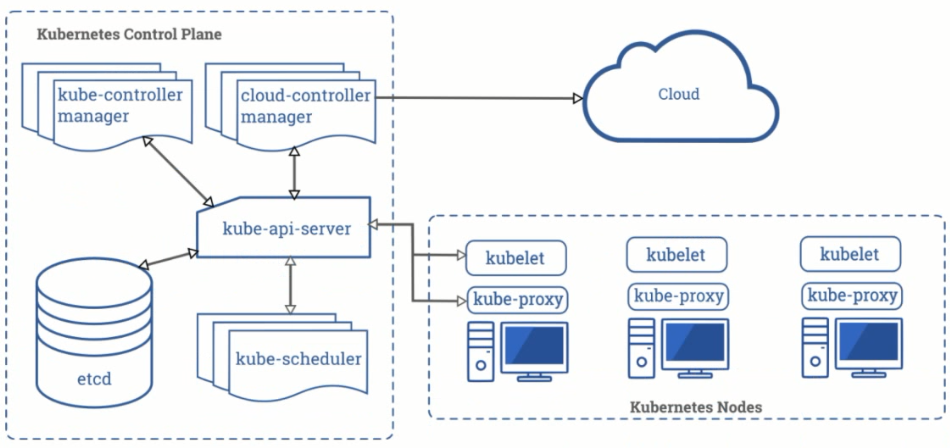
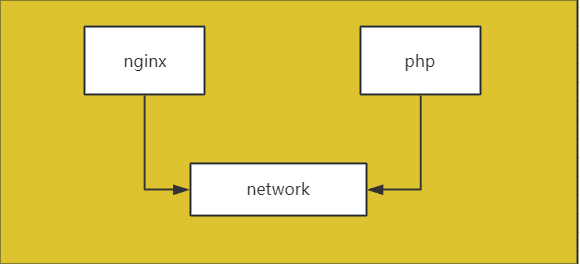
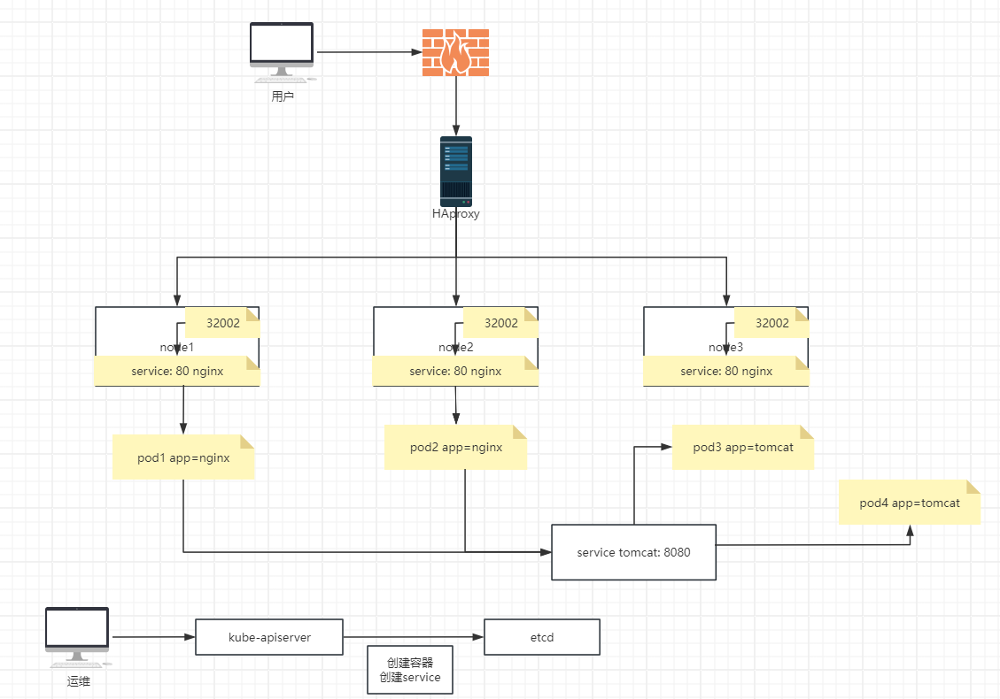

# Kubernetes简介

# 1. k8s学习内容

## 1.1 k8s安装

```bash
早期的k8s都是使用二进制安装包, 通过ansible或者Shell脚本去部署安装.

k8s(v1.11)左右开始, k8s的官方部署工具kubeadm逐渐开始稳定, 但是生产环境使用也非常少, 因为有些功能还是在测试阶段.

目前一般都是使用ansible去批量部署. 因为ansible部署的是二进制和service文件, 如果需要修改参数, 那么只需要修改service文件, 然后重启服务即可. 如果需要实现某些功能, 可以直接在宿主机配置好, 之后k8s就可以调用.

而kubeadmin会启动若干容器, 这些容器是从k8s官方镜像站点拉取的. 所以k8s的管理和计算终端是官方定制好的, 如果需要修改的话, 还要修改镜像, 然后上传, 并且进行持久化, 而且官方的镜像私人还无法进行修改.

所以, 使用ansible, 无论是部署, 维护, 还是升级都更优于使用kubeadm.
```

## 1.2 组件使用

```bash
管理端组件:

node节点组件:

网络组件(重点): 服务部署在k8s后, 性能会有下降, 因为k8s中有一层虚拟网络, 这个虚拟网络是通过一些依赖于宿主机内核的组件实现的. 这些组件会对接收到的请求的源地址和目的地址进行替换. 通过这样的方式, 把请求转发给k8s中的容器.

这样的替换是会带来性能损耗的, 而且损耗并不低. 各个网络组件的性能不同, 有些组件可以达到虚拟机性能的百分之60-70左右, 已经是属于非常高效的了. 假如Nginx在虚拟机环境可以达到10000的并发, 那么在k8s上基本只能达到6-7000的并发.

第三方网络组件如果想为k8s内的服务提供网络服务, 那么就需要遵循CNI, 网络接口标准, 比如Flannel, calico.

k8s的优势在于横向扩展和高可用, 如果一台计算节点无法超越虚拟机的性能, 那么就可以添加节点, 直到达到满意的性能.
```

## 1.3 容器监控

```bash
容器监控是区别于物理机和虚拟机的. 容器有自己的特征, 也就是任意扩容和任意缩容. 每次创建容器, 私有ip都是变化的, 甚至都不在一个同一个网段. k8s的网络组件会为k8s集群的每个宿主机分配一个网段. 而监控物理机和虚拟机是依靠ip地址的. 所以像Zabbix这种监控物理机和虚拟机的解决方案不适合监控容器环境.

在k8s环境中, 会给每个宿主机分配一个单独的网段, 无论是使用哪个网络组件, 每个宿主机上运行的容器都是处在同一个网段的, 不同宿主机上的容器处在不同的网段, 这就是跨主机通信, 需要借助宿主机的物理网络通信. 每次升级后, 新创建的容器的ip地址和旧的容器的ip地址都是不同的, 所以使用Zabbix是无法固定监控容器的.

此时, 就需要使用服务的动态发现, 让监控系统对新创建的容器进行自动发现并且监控. Prometheus即可使用该功能, 不过其图形功能较差, 还需要配合Grafana, 其图形界面很绚丽.
```

## 1.4 k8s简单案例

```bash
nginx
tomcat
mysql

动静分离: 静态页面通过nginx, 动态交给web服务器(tomcat).

存储: 静态文件, 前端文件. 静态文件比如前端代码, 图片等是不会放到镜像中的, 因为这样会造成镜像占据很大空间, 即使修改一小部分代码或者图片, 也要重新制作镜像并且上传. 所以, 静态文件都是存放到共享存储. 容器平时是不会去读取静态文件的, 只有当用户访问静态文件时, 容器才会去共享存储读取文件内容. 而存储内容的更新是不会影响到容器本身的.

存储可以使用类似NFS或者商业存储, 比如ceph. 每个容器都是从同一个共享存储上, 获取到相同的内容.

如果其他的商业存储想为k8s内的服务提供存储, 那么还需要符合CSI(Container Storage Interface)的标准.
```

## 1.5 企业案例

```bash
MySQL集群
Redis集群

以主从为例, 容器的重新创建会造成ip地址的变化, 所以当从节点发生变化时, 主节点如何能快速发现新创建的从节点, 而从节点如何找到主节点, 这是需要解决的问题. 早期的k8s还只能跑单机的数据库, 不过目前已经有了成熟的解决方案.
```

## 1.6 运行时

```bash
k8s从v1.20开始, 不再支持Docker运行时, 而是使用支持k8s开发的CRI(Container Runtime Interface)的Containerd(Docker公司开发)或者CRI-O(Redhat公司开发)作为运行时. Containerd其实也是一个从Docker Engine中分离出来的高级运行时. 而Docker因为并不符合k8s官方创建的CRI的要求, 所以还需要再额外加一层dockershim, 使得k8s官方还需要维护dockershim.

常用的符合CRI的运行时有CNCF开发的Containerd和CRI-O.

早期k8s为了使用docker运行时, 还需要额外维护一个dockershim. 2022年05月，Kubernetes 1.24正式发布，比较引人注目的就是在这个版本中正式将dockershim组件从kubelet中删除. 从这个版本开始, 用户使用Kubernetes时需要优先选择containerd或CRI-O作为容器运行时. 如果希望继续依赖Docker Engine作为容器运行时, 那么就需要cri-dockerd组件.

虽然k8s弃用了Docker, 但是因为Docker本身也是用的containerd, 所以制作镜像的方式都是不变的.
```

## 1.7 资源隔离

```bash
k8s中的资源隔离和docker不同, docker中的namespace命令空间实现的是容器的资源隔离
而k8s中的namespace命令空间实现的是pod的资源隔离
```

# 2. k8s核心优势

```bash
1. 基于yaml文件实现容器的自动创建和删除

2. 更快速的实现业务的弹性横向扩容: 对比在虚拟机上进行横向扩容效率更高. k8s基于镜像部署, 只需要确保镜像没问题, 那么后续所有的容器都是符合要求的, 我们只需要告诉k8s创建几个容器即可, 后续的所有工作都会由k8s完成, 比如添加到负载均衡, 提供服务等. 100个容器的横向扩容只需要不到1分钟就可以完成, 只要网络没问题

3. 动态发现新扩容的容器, 并自动对用户提供访问

4. 更简单, 更快速的实现业务代码的升级和回滚: 传统虚拟机或者物理机还需要停止服务, 更新代码, 再开启服务, 测试访问, 而k8s中只需要拉取最新的镜像即可, 镜像启动为容器后就可以对用户提供访问了
```

# 3. k8s组件介绍



1. kube-apiserver

https://kubernetes.io/docs/reference/command-line-tools-reference/kube-apiserver/

```bash
Kubernetes API Server为api对象验证并配置数据, 包括pods, services, replication controllers和其他api对象, API Server提供REST操作和到集群共享状态的前端, 所有其他组件通过它进行交互.
```

pod: k8s中, 容器是封装在pod中, 目的就是为了让多个容器能够共享相同的网络. 

**pod案例:**



2. kube-scheduler

https://kubernetes.io/docs/reference/command-line-tools-reference/kube-scheduler/

```bash
kube-scheduler是一个拥有丰富策略, 能够感知拓扑变化, 支持特定负载的功能组件, 他对集群的可用性, 性能表现以及容量都影响巨大. scheduler需要考虑独立的和集体的资源需求, 服务质量需求, 硬件/软件/策略限制, 亲和与反亲和规范, 数据位置, 内部负载接口, 截止时间等等. 如有必要, 特定的负载需求可以通过API暴露出来.

当某一个节点的资源利用率发生变化, 比如新创建了一个容器, 占用了4G空间, 那么这一行为会被立即汇报给kube-apiserver, 然后写入etcd. kube-scheduler再通过kube-apiserver读取到etcd中记录的节点状态, 感知到整个网络的资源拓扑以及资源利用率的变化.
```

资源分配案例: 默认情况, 容器可以占用宿主机的所有资源, 因此为了避免这种情况发生, 要对容器进行资源限制.

```bash
java服务: 一般给4G内存, 如ElasticSearch, Zookeeper, Kafka, jar包等, 如果4G不够, 就添加容器
nginx等静态服务: 一般也是4G, 有时2G即可
```

3. kube-controller-manager

https://kubernetes.io/docs/reference/command-line-tools-reference/kube-controller-manager/

Controller Manager作为集群内部的管理控制中心, 负责集群内的Node, Pod副本, 服务端口(Endpoint), 命名空间(Namespace), 服务账号(ServiceAccount), 资源定额(ResourceQuota)的管理. 当某个Node意外宕机时, Controller Manager会及时发现并执行自动化修复流程, 确保集群始终处于预期的工作状态.

4. kube-proxy

https://kubernetes.io/docs/reference/command-line-tools-reference/kube-proxy/

kube-proxy: Kubernetes网络代理运行在node上, 它反映了node上Kubernetes API中定义的服务, 并可以通过一组后端进行简单的TCP, UDP流转发或轮训模式(round-robin)的TCP, UDP转发, 用户必须使用apiserver API创建一个服务来配置代理, 其实就是kube-proxy通过在主机上维护网络规则(ipvs居多)并执行连接转发来实现Kubernetes服务访问.

传统的物理机或者虚拟机的网络架构中, 用户的访问会被解析到防火墙的公网ip, 然后进入到企业内部网络, 再通过负载均衡, 比如HAproxy调度给后端的服务器. 服务是直接运行在物理机或者虚拟机上的, 通过HAproxy, 可以直接把用户的请求转发到目标服务器.

而在k8s的网络中, 是无法直接通过负载均衡器把用户的请求转发给k8s节点中的pod的. 那么k8s是如何将不同的用户请求转发到后端的不同节点上运行的pod呢? 而又如何在自动扩容时识别到新建的pod的ip地址呢?

**service网络案例:**



首先, 想要运行k8s, 至少要有两个node节点来实现高可用. 当一个node节点宕机时, 其内部运行的服务可以迁移到另一个节点. 

为了解决k8s内部的网络转发问题, k8s在其内部封装了一个虚拟网络, 叫**service网络**, 其运行在k8s的node节点上. 这个service网络是虚拟机的, 通过节点的iptables或者ipvs规则生成. 早期都是使用iptables, 但是iptables有些性能问题, 在k8s的v1.11版本才开始支持ipvs. 

用户的请求, 会通过service网络, 转发到每个节点的pod上. 无论pod运行在哪个节点上, service都可以通过**label标签**进行筛选. 每个pod都会有一个label标签, 一般是基于服务自行定义, 比如app=nginx, app=tomcat等. **注意: 运行不同服务的pod, 要打上不同的标签.** 

同时, service网络会有一个独立的端口号, 和pod内的服务的端口号不冲突, 假如pod内的nginx使用80端口, 那么service也可以使用80端口. 一般建议service的端口号和pod端口号保持一致. 

假设用户的请求需要通过nginx转发给后端的tomcat服务, 那么service就会挑选集群中带有app=nginx的标签的pod. 由于每个node节点都会运行该service网络, 所以, 无论用户的请求被HAproxy转发到了那个节点上, 该请求可以抵达任意节点上的带有app=nginx标签的pod上. 

**而service网络本身是k8s内部的网络, 并不对外. 如果想要负载均衡访问到该网络, 那么还需要被该service网络暴露给负载均衡.** 

暴露service网络需要使用**nodePort**, 也就是在node节点上给service网络打开一个宿主机端口. 

运行service网络的k8s会有三层网络:

1. pod内部的网络 - 容器网络
2. 运行在node节点的虚拟service网络 - service
3. node节点宿主机的物理网络 - nodeport(32002)

这里假设nodePort是32002, 那么就会在宿主机上开启32002端口. 负载均衡器的后端服务列表中, 会写上32002端口. 当请求被转发到某个节点的32002端口时, 该请求就会被节点上的iptables或ipvs规则转发给service网络的80端口. service网络再根据label筛选器, 把请求转发给拥有对应label标签的pod. 

一旦声明了暴露宿主机的哪个nodePort, 那么在每个节点上都会暴露同一个nodeport. **这个规则就是由kube-proxy实现的.**

**而nginx的pod又是如何把请求转发给tomcat的pod的呢?** service的名称是固定的, 除非手动删除并且重新创建为其他的service, 而service的地址除非手动删除, 否则也是不会变的, 而删除后, 重新获得的ip地址时可能发生变化的, 因为该地址是由etcd分配的. 但是service的名称是不会变的, 因为都是人为指定的.  所以nginx在转发用户请求时, 不要写后端容器的ip地址, 而是通过service名称完成转发, 也就是service tomcat:8080. **所以, service是如何决定把请求转发给哪个pod是完全由label标签决定的.**

label是一个k:v格式的键值对, 一般定义为app=nginx或者project=myapp等.

**这些service名称又是如何解析的呢?**

默认情况下是无法解析的, 但是这些service名称会由kube-apiserver存放到etcd中. 在一个k8s集群中, 只有kube-apiserver有权限访问etcd, 这是为了保证数据的一致性, 不允许node节点或者其他组件访问到etcd. 当集群需要创建容器时, kube-apiserver会把容器创建指令写到etcd中, 而这个指令是由运维人员创建的. 运维人员可以通过kube-apiserver的dashboard下发指令, 也可以通过yaml文件下发指令. 这些指令会传给kube-apiserver的api接口, 然后写入etcd. 

域名解析目前使用的是**coredns**.

```bash
解决名称发现:

skydns: 已经被淘汰
kubedns: k8sv1.16开始逐渐被淘汰
coredns: 目前使用的dns组件, https://github.com/coredns/coredns
```

在每个pod中, 会配置一个dns地址, 每个pod都会向同一个coredns请求域名解析. 而coredns会到etcd中查询dns解析记录, 比如service对应的ip地址. 然后把ip地址返回给pod. 而每个service后端的pod都是该service的**endpoint**.

5. kubectl命令

kubectl命令: 服务的增删改查都是通过kubectl命令去实现的. 
	get pod

​	create

​	delete	

6. kubelet组件

```bash
kubelet: 是主要的节点代理, 它会监视以分配给节点的pod, 具体功能如下:

kubelet会通过kube-apiserver按到etcd中的数据, 

1. 向master汇报node节点的状态信息, 再由master节点汇报给kube-apiserver, 然后写入etcd, 这样kube-scheduler才会通过kube-apiserver进而通过etcd, 了解到每个节点的资源利用率和服务运行状态
2. 接收从kube-apiserver下发的指令并在pod中创建docker容器. 当集群需要新建容器时, kube-apiserver会把指令下发到选出来的某个节点的kubelet, 由kubelet调用docker去创建
3. 准备pod所需的数据卷, 如nfs等
4. 返回pod的运行状态, 比如镜像服务拉取等问题
5. 在node节点执行容器健康检查, 需要自行手动配置
	服务监控: 探针(kubelet), 通过kubelet, 每隔一段时间, 对pod内某个url进行探测, 探测通过, 容器才被认为是正常, 如果失败, 那么会让kubelet把该容器重启, 或者删除重建.
```

7. etcd

```bash
etcd是coredns公司开发的, 目前是k8s默认使用的key-value数据存储系统. 用于保存所有集群数据, 支持分布式集群功能, 生产环境使用时需要为etcd数据提供定期备份机制.

https://github.com/etcd-io/etcd
```

8. 组件总结

```bash
运维人员访问kube-apiserver, 由kube-apiserver把服务的增删改查请求传递给etcd. 

kube-scheduler负责pod的调度, 一般根据节点的资源利用率来决定在哪个节点上新建pod.

kube-controller-manager最重要的功能就是维护pod的副本数, 并且确保集群始终处于预期的工作状态. 这个预期的工作状态是定义在yaml文件中的. 创建一个服务时, 会通过yaml文件去创建, 而该yaml文件中描述了该服务创建后的状态, 其中就包括最重要的pod副本数(replicas). 

假设replicas是1, 那么一旦该pod所处的节点宕机, controller manager会执行修复, 首先会把该节点的pod删除, 然后调用kube-scheduler. kube-scheduler会检查集群的节点利用率, 找到一个正在运行的并且拥有足够资源的节点, 也就是说, 一旦在该节点创建了新的pod后, 该节点还有多余的资源运行正在运行的服务. pod在新的节点运行后, pod中运行的服务就会恢复, 服务恢复后, 业务也就自动恢复了.

因此, 可以通过副本数来实现业务故障的自动恢复.

kube-proxy: k8s的master节点会有三个组件, kube-apiserver, kube-scheduler和kube-controller-manager. 而node节点有两个组件, kubelet和kube-proxy. 所以, k8s的核心组件是这五个, 缺少任何一个都不行. 这五个组件必须同时且正常运行.

k8s新版本组件介绍: https://kubernetes.io/docs/concepts/overview/components/. k8s几乎每个季度都会更新一次, 平均每年更新4个大版本. 从15年到21年已经更新了20个大版本.
```


