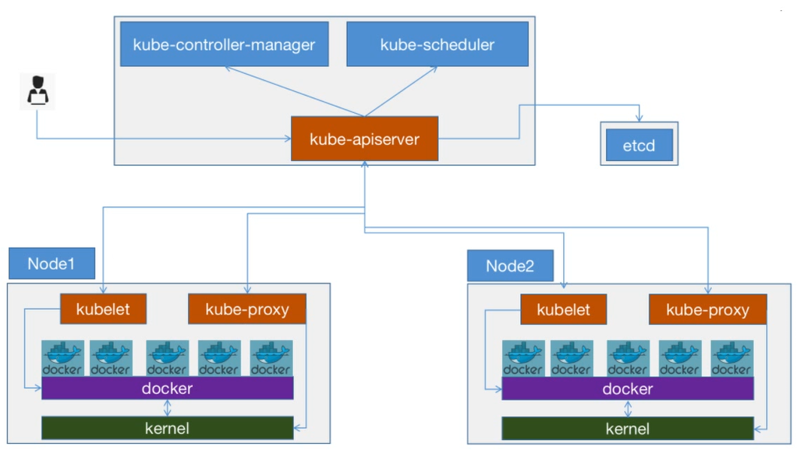
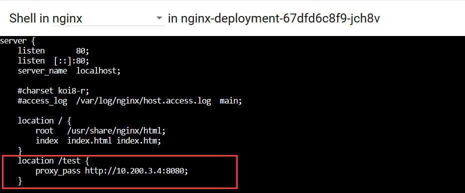

#  Kubeadm部署, 管理和升级k8s

# 1. k8s安装部署介绍

## 1.1 部署工具

- 使用批量部署工具, 如(ansible/saltstack)
- 手动二进制
- kubeadm官方提供工具
- apt/yum等方式安装, 以守护进程的方式在宿主机上, 类似于nginx一样, 使用service脚本启动

## 1.2 kubeadm部署方式

官方文档:  https://kubernetes.io/zh/docs/setup/independent/create-cluster-kubeadm/
```bash
1.11版本开始逐渐稳定, 可以在生产环境使用. 目前最新版为1.25

使⽤k8s官⽅提供的部署⼯具kubeadm⾃动安装，需要在master和node节点上安装docker等组件，然后初始化，把管理端的控制服务和node上的服务都以pod的⽅式运行
通过kubeadm部署的多master的k8s集群, 会把etcd做成一个集群, 此时master节点只能宕机一个,如果宕机两个,那么api-server就无法访问了

以kubeadm部署的k8s集群的5个组件会分别以pod和二进制方式运行:

以pod方式运行的服务:
  master节点: kube-controller-manager, kube-scheduler, kube-apiserver(apiserver一定要确保高可用)
  node节点: kube-proxy

以二进制方式直接运行:
  node节点: kubelet

k8s集群的master和node节点负责不同的功能:

master节点:
  不运行业务容器, 仅负责进群调度管理
node节点:
  运行业务容器
```
# 2. kubeadm介绍

官方文档: https://kubernetes.io/zh/docs/reference/setup-tools/kubeadm/kubeadm/

## 2.1 安装前注意事项

```bash
禁⽤swap，selinux(CentOS)，iptables，并优化内核参数及资源限制参数
```

## 2.2 部署过程

```bash
1. 基础环境准备: 禁⽤swap，selinux(CentOS)，iptables，并优化内核参数及资源限制参数
2. 部署harbor及haproxy+keepalived⾼可⽤反向代理
3. 在master节点和node节点安装docker
4. 在所有master安装指定版本的kubeadm 、kubelet、kubectl、docker
5. 在所有node节点安装指定版本的kubeadm 、kubelet、docker，在node节点kubectl为可选安装, 主要看是否需要在node执⾏kubectl命令进⾏集群管理及pod管理等操作
6. master节点运⾏kubeadm init初始化命令
7. 验证master节点状态
8. 在node节点使⽤kubeadm命令将⾃⼰加⼊k8s master(需要使⽤master⽣成的token和ca公钥进行认证) 
9. 验证node节点状态
10. 创建pod并测试⽹络通信
11. 部署web服务Dashboard
12. k8s集群升级案例
```
# 3. 基础环境准备

## 3.1 服务器环境

最⼩化安装基础系统:

```bash
CentOS 推荐使⽤CentOS 7.5及以上的系统
Ubuntu推荐18.04及以上稳定版

关闭防⽕墙, selinux和swap
更新软件源, 时间同步
安装常⽤命令
重启后验证基础配置
```

master节点: 提供api-server, 需要实现高可用, 通过负载均衡器调度, 一般使用3个节点即可. k8s的master不像redis等其他的集群服务的master节点有数量要求.

使用kubeadm部署k8s时, master节点最多只能down一个. 测试环境如果想节约资源, 可以使用一个master节点进行控制, 出现问题及时修复即可.

node节点: node节点包含两个组件, kube-proxy和kubelet, 这两个组件也是通过负载均衡器去访问master节点的api-server. 

LB: 负载均衡器可以搭建两个, 一个给管理员提供api-server访问, 一个给node节点提供api-server访问.

实际工作中:

  node节点: 负责运行业务镜像, 所以配置要求较高, 最好是物理机, 一般256G+2核以上配置.
  master节点, harbor和负载均衡: 可以是虚拟机, 也可以是物理机, 但最好还是物理机.

**本文实验环境:**

```bash
master节点: Ubuntu 18.04 4G2C
  master-19.k8s: 10.0.0.19
  master-29.k8s: 10.0.0.29
  master-39.k8s: 10.0.0.39
  
HAproxy:   Ubuntu 18.04 4G2C
  haproxy-49.k8s: 10.0.0.49
  haproxy-59.k8s: 10.0.0.59
  
Harbor:    Ubuntu 18.04 4G2C
  harbour-69.k8s: 10.0.0.69
  
node节点:   Ubuntu 18.04 4G2C
  node-79.k8s: 10.0.0.79
  node-89.k8s: 10.0.0.89
  node-99.k8s: 10.0.0.99

# ansible的主机文件中, 主机组名不要用'-', 可以使用下换线

ansible主机: CentOS7 4G2C

[master_k8s]
10.0.0.19
10.0.0.29
10.0.0.39
[node_k8s]
10.0.0.79
10.0.0.89
10.0.0.99
[haproxy_k8s]
10.0.0.49
10.0.0.59
[harbor_k8s]
10.0.0.69      
```
### 3.1.1 配置主机名

**修改各服务器的主机名:**

```bash
ansible

master-19.k8s
master-29.k8s
master-39.k8s

haproxy-49.k8s
haproxy-59.k8s

harbour-69.k8s

node-79.k8s
node-89.k8s
node-99.k8s
```

```bash
#ansible
[root@centos-7-1 ~]#hostnamectl set-hostname ansible
[root@centos-7-1 ~]#exit
[root@ansible ~]#hostname
ansible

#master集群
[root@ubuntu-1804-19 ~]#hostnamectl set-hostname master-19.k8s
[root@ubuntu-1804-19 ~]#exit
[root@master-19 ~]#hostname
master-19.k8s

[root@ubuntu-1804-29 ~]#hostnamectl set-hostname master-29.k8s
[root@ubuntu-1804-29 ~]#exit
[root@master-29 ~]#hostname
master-29.k8s

[root@ubuntu-1804-39 ~]#hostnamectl set-hostname master-39.k8s
[root@ubuntu-1804-39 ~]#exit
[root@master-39 ~]#hostname
master-39.k8s

#node集群
[root@ubuntu-1804-79 ~]#hostnamectl set-hostname node-79.k8s
[root@ubuntu-1804-79 ~]#exit
[root@node-79 ~]#hostname
node-79.k8s

[root@ubuntu-1804-89 ~]#hostnamectl set-hostname node-89.k8s
[root@ubuntu-1804-89 ~]#exit
[root@node-89 ~]#hostname
node-89.k8s

[root@ubuntu-1804-99 ~]#hostnamectl set-hostname node-99.k8s
[root@ubuntu-1804-99 ~]#exit
[root@node-99 ~]#hostname
node-99.k8s

#harbour
[root@ubuntu-1804-69 ~]#hostnamectl set-hostname harbour-69.k8s
[root@ubuntu-1804-69 ~]#exit
[root@harbour-69 ~]#hostname
harbour-69.k8s

#HAproxy+Keepalived

[root@ubuntu-1804-49 ~]#hostnamectl set-hostname haproxy-49.k8s
[root@ubuntu-1804-49 ~]#exit
[root@haproxy-49 ~]#hostname
haproxy-49.k8s

[root@ubuntu-1804-59 ~]#hostnamectl set-hostname haproxy-59.k8s
[root@ubuntu-1804-59 ~]#exit
[root@haproxy-59 ~]#hostname
haproxy-59.k8s
```

### **3.1.2 配置ansible主机**

```bash
#配置ansible所管理的主机清单文件

[root@ansible ~]#cd /data/scripts/
[root@ansible /data/scripts]#vim hosts_ansible.list

# or append this file to /etc/ansible/hosts  manually                
[master_k8s]
10.0.0.19
10.0.0.29
10.0.0.39
[node_k8s]
10.0.0.79
10.0.0.89
10.0.0.99
[haproxy_k8s]
10.0.0.49
10.0.0.59
[harbor_k8s]
10.0.0.69    
```

```bash
#编写被管理节点的ip地址

[root@ansible /data/scripts]#vim hosts_ssh.list
10.0.0.19
10.0.0.29
10.0.0.39
10.0.0.49
10.0.0.59
10.0.0.69
10.0.0.79
10.0.0.89
10.0.0.99
```

**ansible主机配置脚本**

```bash
[root@ansible /data/scripts]#vim ansible.sh

#!/bin/bash
#

#GREEN="echo -e \033[1;32m"
RED="echo -e \033[1;31m"
END="\033[0m"

#1. set hostname
hostnamectl set-hostname ansible
#2. install ansible
yum -y install ansible || { ${RED}ansible installation failed!${END}; exit 1; }
#3. enable ansible log
sed -r -i -e "s@#(log_path = /var/log/ansible.log)@\1@" -e "s@#(module_name = command)@\1@" /etc/ansible/ansible.cfg
#4. append hosts list to hosts.cfg
cat hosts_ansible.list >> /etc/ansible/hosts
#5. verify hosts list
ansible all --list-hosts
sleep 5
#6. continue with ssh authentication
while read -p "Do you want to continue? " REPLY; do
case $REPLY in
[Yy] | [Yy][Ee][Ss])
    ${RED}'ready for ssh authentication!'${END}
    sleep 5;
    break
    ;;
[Nn] | [Nn][Oo])
    ${RED}quit script!${END}
    exit 1
    ;;
*)
    ${RED}Wrong input!${END}
    ;;
    esac
done
#7. ssh authentication
rpm -q sshpass &> /dev/null || yum -y install sshpass  
[ -f /root/.ssh/id_rsa ] || ssh-keygen -f /root/.ssh/id_rsa  -P ''
export SSHPASS=000000
while read IP;do
   sshpass -e ssh-copy-id  -o StrictHostKeyChecking=no $IP
done < hosts_ssh.list
ansible all -m ping
```

```bash
[root@ansible /data/scripts]#bash ansible.sh
```

### 3.1.3 禁用交换分区

k8s不支持交换分区, 一旦不禁用, 那么k8s是无法部署的. 虽然可以跳过交换分区检测, 但是不推荐. **如果内存不够, 就加内存.**

如果大量使用交换分区, 那么数据会写到磁盘上, 这时服务器的性能就会降低.

**在master和node节点禁用swap分区**

```bash
#1. 禁用交换分区: 全部主机(这里直接也把HA和harbor的交换分区都禁用了)

[root@ansible /data/scripts]#ansible all -m shell -a "sed -r -i.bak '/swap/s@(.*)@#\1@' /etc/fstab"

[root@ansible /data/scripts]#ansible all -m shell -a "reboot"
#执行命令后, ansible会返回Unreachable, 因为此时主机已经被重启, 所以无法获取任何信息

[root@ansible /data/scripts]#ansible all -m shell -a "grep swap /etc/fstab"
10.0.0.39 | CHANGED | rc=0 >>
## swap was on /dev/sda5 during installation
#UUID=e021ee88-b42b-4ff9-ab23-fb9fda42efdd none            swap    sw              0       0
10.0.0.59 | CHANGED | rc=0 >>
## swap was on /dev/sda5 during installation
#UUID=e021ee88-b42b-4ff9-ab23-fb9fda42efdd none            swap    sw              0       0
10.0.0.29 | CHANGED | rc=0 >>
## swap was on /dev/sda5 during installation
#UUID=e021ee88-b42b-4ff9-ab23-fb9fda42efdd none            swap    sw              0       0
10.0.0.49 | CHANGED | rc=0 >>
## swap was on /dev/sda5 during installation
#UUID=e021ee88-b42b-4ff9-ab23-fb9fda42efdd none            swap    sw              0       0
10.0.0.19 | CHANGED | rc=0 >>
## swap was on /dev/sda5 during installation
#UUID=e021ee88-b42b-4ff9-ab23-fb9fda42efdd none            swap    sw              0       0
10.0.0.79 | CHANGED | rc=0 >>
## swap was on /dev/sda5 during installation
#UUID=e021ee88-b42b-4ff9-ab23-fb9fda42efdd none            swap    sw              0       0
10.0.0.69 | CHANGED | rc=0 >>
## swap was on /dev/sda5 during installation
#UUID=e021ee88-b42b-4ff9-ab23-fb9fda42efdd none            swap    sw              0       0
10.0.0.89 | CHANGED | rc=0 >>
## swap was on /dev/sda5 during installation
#UUID=e021ee88-b42b-4ff9-ab23-fb9fda42efdd none            swap    sw              0       0
10.0.0.99 | CHANGED | rc=0 >>
## swap was on /dev/sda5 during installation
#UUID=e021ee88-b42b-4ff9-ab23-fb9fda42efdd none            swap    sw              0       0
```
```bash
[root@master-19 ~]#vim /etc/fstab

## swap was on /dev/sda5 during installation
#UUID=e021ee88-b42b-4ff9-ab23-fb9fda42efdd none            swap    sw              0       0
```
### 3.1.4 内核参数调整

**master以及node节点都需要执行**

```bash
#1. 资源限制调整: 全部主机都要执行

[root@ansible /data/scripts]#vim limits.conf

*                soft    core            unlimited
*                hard    core            unlimited
*                soft    nproc           1000000
*                hard    nproc           1000000
*                soft    nofile          1000000
*                hard    nofile          1000000
*                soft    memlock         32000
*                hard    memlock         32000
*                soft    msgqueue        8192000
*                hard    msgqueue        8192000 

#2. 内核参数调整: 全部主机都要执行


# 开启宿主机的ipv4_forward, 让宿主机开启路由转发功能, 否则容器只能在宿主机内部通信. 这样宿主机内的容器在访问外网时, 宿主机会对容器的ip地址做源地址替换.

[root@ansible /data/scripts]#vim sysctl.conf

# Controls source route verification
net.ipv4.conf.default.rp_filter = 1
net.ipv4.ip_nonlocal_bind = 1
net.ipv4.ip_forward = 1

# Do not accept source routing
net.ipv4.conf.default.accept_source_route = 0

# Controls the System Request debugging functionality of the kernel
kernel.sysrq = 0

# Controls whether core dumps will append the PID to the core filename.
# Useful for debugging multi-threaded applications.
kernel.core_uses_pid = 1

# Controls the use of TCP syncookies
net.ipv4.tcp_syncookies = 1

# Disable netfilter on bridges.
net.bridge.bridge-nf-call-ip6tables = 0
net.bridge.bridge-nf-call-iptables = 0
net.bridge.bridge-nf-call-arptables = 0

# Controls the default maxmimum size of a mesage queue
kernel.msgmnb = 65536

# # Controls the maximum size of a message, in bytes
kernel.msgmax = 65536

# Controls the maximum shared segment size, in bytes
kernel.shmmax = 68719476736

# # Controls the maximum number of shared memory segments, in pages
kernel.shmall = 4294967296

# TCP kernel paramater
net.ipv4.tcp_mem = 786432 1048576 1572864
net.ipv4.tcp_rmem = 4096        87380   4194304
net.ipv4.tcp_wmem = 4096        16384   4194304
net.ipv4.tcp_window_scaling = 1
net.ipv4.tcp_sack = 1

# socket buffer
net.core.wmem_default = 8388608
net.core.rmem_default = 8388608
net.core.rmem_max = 16777216
net.core.wmem_max = 16777216
net.core.netdev_max_backlog = 262144
net.core.somaxconn = 20480
net.core.optmem_max = 81920

# TCP conn
net.ipv4.tcp_max_syn_backlog = 262144
net.ipv4.tcp_syn_retries = 3
net.ipv4.tcp_retries1 = 3
net.ipv4.tcp_retries2 = 15

# tcp conn reuse
net.ipv4.tcp_tw_reuse = 1
net.ipv4.tcp_tw_recycle = 1
net.ipv4.tcp_fin_timeout = 1


net.ipv4.tcp_max_tw_buckets = 20000
net.ipv4.tcp_max_orphans = 3276800
net.ipv4.tcp_timestamps = 1 #?
net.ipv4.tcp_synack_retries = 1
net.ipv4.tcp_syncookies = 1

# keepalive conn
net.ipv4.tcp_keepalive_time = 300
net.ipv4.tcp_keepalive_intvl = 30
net.ipv4.tcp_keepalive_probes = 3
net.ipv4.ip_local_port_range = 10001    65000

# swap
vm.overcommit_memory = 0
vm.swappiness = 10

#net.ipv4.conf.eth1.rp_filter = 0
#net.ipv4.conf.lo.arp_ignore = 1
#net.ipv4.conf.lo.arp_announce = 2
#net.ipv4.conf.all.arp_ignore = 1
#net.ipv4.conf.all.arp_announce = 2

[root@ansible /data/scripts]#ansible all -m copy -a "src=limits.conf dest=/etc/security/limits.conf backup=yes"
[root@ansible /data/scripts]#ansible all -m copy -a "src=sysctl.conf dest=/etc/sysctl.conf backup=yes"
```
禁⽤swap，selinux，iptables，并优化内核参数及资源限制参数, 全部修改完, 重启服务器生效
```bash
#3. 重启生效
[root@ansible /data/scripts]#ansible all -m shell -a "reboot"
# 执行命令后, ansible会返回Unreachable, 因为此时主机已经被重启, 所以无法获取任何信息
```
## 3.2 haproxy+keepalived部署

如果公司本身就有haproxy+keepalived, 不想再重新部署, 那么可以使用已有的. 但是, 建议最好配置单独的负载均衡, 不要多个业务共有一个负载均衡

**这里仅在ha1-49-10.0.0.49上部署**

```bash
[root@haproxy-49 ~]#apt -y install haproxy keepalived
```
```bash
vip: 10.0.0.188
node节点通过10.0.0.188访问master节点
haproxy监听在10.0.0.188的tcp端口
这里不能用http代理, 因为通信过程中会有很多证书验证
```


### 3.2.1 配置keepalived的vip

```bash
[root@haproxy-49 ~]#vim /etc/keepalived/keepalived.conf

! Configuration File for keepalived                                                                                                global_defs {
   notification_email {
     acassen
   }
   notification_email_from Alexandre.Cassen@firewall.loc
   smtp_server 192.168.200.1
   smtp_connect_timeout 30
   router_id LVS_DEVEL
}

vrrp_instance VI_1 {
    state MASTER
    interface eth0
    garp_master_delay 10
    smtp_alert
    virtual_router_id 51
    priority 100
    advert_int 1
    authentication {
        auth_type PASS
        auth_pass 1111
    }
    virtual_ipaddress {
        10.0.0.188 dev eth0 label eth0:0
    }
}
```
```bash
[root@haproxy-49 ~]#systemctl restart keepalived
[root@haproxy-49 ~]#ifconfig
eth0: flags=4163<UP,BROADCAST,RUNNING,MULTICAST>  mtu 1500
        inet 10.0.0.49  netmask 255.255.255.0  broadcast 10.0.0.255
        inet6 fe80::20c:29ff:fe49:4ce4  prefixlen 64  scopeid 0x20<link>
        ether 00:0c:29:49:4c:e4  txqueuelen 1000  (Ethernet)
        RX packets 4676  bytes 3176356 (3.1 MB)
        RX errors 0  dropped 0  overruns 0  frame 0
        TX packets 2672  bytes 552760 (552.7 KB)
        TX errors 0  dropped 0 overruns 0  carrier 0  collisions 0

eth0:0: flags=4163<UP,BROADCAST,RUNNING,MULTICAST>  mtu 1500
        inet 10.0.0.188  netmask 255.255.255.255  broadcast 0.0.0.0
        ether 00:0c:29:49:4c:e4  txqueuelen 1000  (Ethernet)

lo: flags=73<UP,LOOPBACK,RUNNING>  mtu 65536
        inet 127.0.0.1  netmask 255.0.0.0
        inet6 ::1  prefixlen 128  scopeid 0x10<host>
        loop  txqueuelen 1000  (Local Loopback)
        RX packets 203  bytes 16161 (16.1 KB)
        RX errors 0  dropped 0  overruns 0  frame 0
        TX packets 203  bytes 16161 (16.1 KB)
        TX errors 0  dropped 0 overruns 0  carrier 0  collisions 0
```
### 3.2.2 配置haproxy的监听

```bash
[root@haproxy-49 ~]#vim /etc/haproxy/haproxy.cfg

listen k8s-6443
    bind 10.0.0.188:6443
    mode tcp
    server 10.0.0.19 10.0.0.19:6443 check inter 3s fall 3 rise 5
    server 10.0.0.29 10.0.0.29:6443 check inter 3s fall 3 rise 5
    server 10.0.0.39 10.0.0.39:6443 check inter 3s fall 3 rise 5
    # 默认轮训即可. api请求都是http无状态的, 不需要源地址哈希, session共享或者session保持  
```
```bash
[root@haproxy-49 ~]#systemctl restart haproxy
[root@haproxy-49 ~]#ss -ntl
State            Recv-Q            Send-Q                        Local Address:Port                       Peer Address:Port           
LISTEN           0                 2000                             10.0.0.188:6443                            0.0.0.0:*              
LISTEN           0                 128                           127.0.0.53%lo:53                              0.0.0.0:*              
LISTEN           0                 128                                 0.0.0.0:22                              0.0.0.0:*              
LISTEN           0                 128                                    [::]:22                                 [::]:*   
```
**本文仅配置一组haproxy+keepalived, 正常情况还要进行haproxy的高可用**

## 3.3 docker安装

```bash
基于docker运行k8s时, 对docker版本有要求
官方会对k8s和docker的兼容版本进行测试验证, 并且在k8s各版本的CHANGELOG中发布
```
以`k8s-v1.17.16`为例


```bash
本文部署:
docker-v19.03.14: master节点和node节点
k8s-v1.19.1 后续会演示如果升级到1.19.6
kubeadm 1.19.1-00
kubectl 1.19.1-00: 用于系统管理的客户端命令行, 在需要执行k8s管理的节点安装即可
kubelet 1.19.1-00
kubeproxy: 是以容器方式, 自动运行, 无需手动安装
```
**在master节点, node节点和harbor节点安装docker**

```bash
[root@master-19 /data/scripts]#vim docker_install.sh

#!/bin/bash                                                                                                                                                  
apt update
apt -y install \
    ca-certificates \
    curl \
    gnupg \
    lsb-release

mkdir -p /etc/apt/keyrings
curl -fsSL https://download.docker.com/linux/ubuntu/gpg | sudo gpg --dearmor -o /etc/apt/keyrings/docker.gpg

echo \
  "deb [arch=$(dpkg --print-architecture) signed-by=/etc/apt/keyrings/docker.gpg] https://download.docker.com/linux/ubuntu \
    $(lsb_release -cs) stable" | sudo tee /etc/apt/sources.list.d/docker.list > /dev/null

apt update

VERSION_STRING=5:19.03.14~3-0~ubuntu-bionic
apt -y install docker-ce=$VERSION_STRING docker-ce-cli=$VERSION_STRING

[root@master-19 /data/scripts]#bash docker_install.sh
```
```bash
[root@master-19 /data/scripts]#systemctl status docker
● docker.service - Docker Application Container Engine
   Loaded: loaded (/lib/systemd/system/docker.service; enabled; vendor preset: enabled)
   Active: active (running) since Fri 2023-10-27 00:03:56 AEDT; 44s ago
     Docs: https://docs.docker.com
 Main PID: 19474 (dockerd)
    Tasks: 10
   CGroup: /system.slice/docker.service
           └─19474 /usr/bin/dockerd -H fd:// --containerd=/run/containerd/containerd.sock
...
...
...
```
## 3.4 harbor部署

基于kubeadmin部署k8s时, 会从docker hub下载很多镜像, 建议把这些镜像全部下载到本地, 修改tag后上传到本地的harbor. 这样后续部署k8s时, 就可以从本地的harbor拉取镜像加快速度, 同时也可以避免万一官方哪天不再提供该版本的镜像了, 就没法下载了

# 4. 部署kubeadm组件

```bash
kubeadm组件需要在master和node节点都安装. 其可用于在任意master节点初始化集群, 也用于把其余的master和所有node节点加入到k8s集群

master节点: 利用kubeadmin去初始化集群, 初始化集群在任意一个master执行即可
初始化完成后, 需要在其余的master节点执行kubeadm, 把自己加入到k8s集群

node节点: 把node节点加入到k8s集群, 也是用的kubeadm工具
```
```bash
kubelet是node节点必须安装的, master也需要安装, 因为master节点也需要启一些容器去运行
kubectl安装在管理节点上, 需要在哪个节点管理k8s, 就在哪个节点安装kubectl
```
## 4.1 master节点和node节点安装kubeadm

**kubeadm, kubelet, kubectl这三个组件的版本要和k8s一致, 也就是说, 需要装哪个版本的k8s, 就要安装对应版本的组件**

**master节点安装kubeadm, kubelet, kubectl**

```bash
[root@master-19 /data/scripts]#vim kubeadm_master_install.sh


#! /bin/bash

apt update
apt install -y apt-transport-https ca-certificates curl


curl -s https://packages.cloud.google.com/apt/doc/apt-key.gpg | apt-key add -

echo "deb https://apt.kubernetes.io/ kubernetes-xenial main" | tee /etc/apt/sources.list.d/kubernetes.list

apt update
apt install -y kubelet=1.19.1-00 kubeadm=1.19.1-00 kubectl=1.19.1-00

# 只需要在一个master管理节点安装kubectl即可

[root@master-29 /data/scripts]#vim kubeadm_master_install.sh


#! /bin/bash

apt update
apt install -y apt-transport-https ca-certificates curl


curl -s https://packages.cloud.google.com/apt/doc/apt-key.gpg | apt-key add -

echo "deb https://apt.kubernetes.io/ kubernetes-xenial main" | tee /etc/apt/sources.list.d/kubernetes.list

apt update
apt install -y kubelet=1.19.1-00 kubeadm=1.19.1-00 kubectl=1.19.1-00


[root@master-39 /data/scripts]#vim kubeadm_master_install.sh


#! /bin/bash

apt update
apt install -y apt-transport-https ca-certificates curl


curl -s https://packages.cloud.google.com/apt/doc/apt-key.gpg | apt-key add -

echo "deb https://apt.kubernetes.io/ kubernetes-xenial main" | tee /etc/apt/sources.list.d/kubernetes.list

apt update
apt install -y kubelet=1.19.1-00 kubeadm=1.19.1-00 kubectl=1.19.1-00

```
**node节点安装kubeadm, kubelet**
```bash
[root@node-79 /data/scripts]#vim kubeadm_node_install.sh

#! /bin/bash                                                                                                                    

apt update
apt install -y apt-transport-https ca-certificates curl

curl -s https://packages.cloud.google.com/apt/doc/apt-key.gpg | apt-key add -

echo "deb https://apt.kubernetes.io/ kubernetes-xenial main" | tee /etc/apt/sources.list.d/kubernetes.list

apt update
apt install -y kubelet=1.19.1-00 kubeadm=1.19.1-00


[root@node-89 /data/scripts]#vim kubeadm_node_install.sh

#! /bin/bash                                                                                                                    

apt update
apt install -y apt-transport-https ca-certificates curl

curl -s https://packages.cloud.google.com/apt/doc/apt-key.gpg | apt-key add -

echo "deb https://apt.kubernetes.io/ kubernetes-xenial main" | tee /etc/apt/sources.list.d/kubernetes.list

apt update
apt install -y kubelet=1.19.1-00 kubeadm=1.19.1-00


[root@node-99 /data/scripts]#vim kubeadm_node_install.sh

#! /bin/bash                                                                                                                    

apt update
apt install -y apt-transport-https ca-certificates curl

curl -s https://packages.cloud.google.com/apt/doc/apt-key.gpg | apt-key add -

echo "deb https://apt.kubernetes.io/ kubernetes-xenial main" | tee /etc/apt/sources.list.d/kubernetes.list

apt update
apt install -y kubelet=1.19.1-00 kubeadm=1.19.1-00
```
此时, 因为系统还没有生成一些认证文件, 所以`kubelet`会报错, 不过不影响, 之后创建了认证文件即可修复

这里的kubelet状态会显示**loaded**


## 4.2 kubeadm命令使用

kubeadm命令:
```bash
Usage:
  kubeadm [command]

Available Commands:
  alpha       Kubeadm experimental sub-commands # kubeadm处于测试阶段的命令
  completion  Output shell completion code for the specified shell (bash or zsh)
  config      Manage configuration for a kubeadm cluster persisted in a ConfigMap in the cluster
  help        Help about any command
  init        Run this command in order to set up the Kubernetes control plane
  join        Run this on any machine you wish to join an existing cluster
  reset       Performs a best effort revert of changes made to this host by 'kubeadm init' or 'kubeadm join'
  token       Manage bootstrap tokens
  upgrade     Upgrade your cluster smoothly to a newer version with this command
  version     Print the version of kubeadm

Flags:
      --add-dir-header           If true, adds the file directory to the header of the log messages
  -h, --help                     help for kubeadm
      --log-file string          If non-empty, use this log file
      --log-file-max-size uint   Defines the maximum size a log file can grow to. Unit is megabytes. If the value is 0, the maximum file size is unlimited. (default 1800)
      --rootfs string            [EXPERIMENTAL] The path to the 'real' host root filesystem.
      --skip-headers             If true, avoid header prefixes in the log messages
      --skip-log-headers         If true, avoid headers when opening log files
  -v, --v Level                  number for the log level verbosity

Use "kubeadm [command] --help" for more information about a command.

```
1.   alpha: kubeadm处于测试阶段的命令
```bash
在alpha命令集中, certs用于提供k8s证书管理命令
[root@master-19 /data/scripts]#kubeadm alpha 
certs        kubeconfig   selfhosting  
用kubeadm初始化的k8s, 内部默认的证书有效期为1年时间
一旦过了一年, 证书过期, k8s将无法再使用, 届时, 就要重新初始化证书, 就要利用到alpha命令集中的renew命令, renew会更新集群的所有证书
所以要定期检查证书有效期时间, 在一年到期前, 进行renew
check-expiration命令用来检查证书的有效时间
renew 为一个k8s集更新证书
```
2. completion: 用于kubeadm的bash命令补全, 需要安装bash-completion. 

**需要在所有master和node节点执行, 因为master和node节点都安装了kubeadm**

```bash
# kubeadm支持bash和zsh补全, 不过一般都是用bash
# 使用补全之前, 需要把补全的参和变量追加到一个脚本里
# 脚本名字可以自定义
# 开机自动生效
mkdir /data/scripts -p
kubeadm completion bash > /data/scripts/kubeadm.sh
chmod a+x /data/scripts/kubeadm.sh
source /data/scripts/kubeadm.sh
echo 'source /data/scripts/kubeadm.sh' >> /etc/profile
```
3. config: 管理kubeadm集群的配置，该配置保留在集群的ConfigMap中
```bash
执行命令 kubeadm config print init-defaults 会生成一个配置文件
该配置文件包含一系列的参数, 利用这个配置文件, 可以用来初始化k8s集群

# 查看默认的初始化参数

[root@master-19 /data/scripts]#kubeadm config print init-defaults
W1024 00:33:46.700446   38713 configset.go:348] WARNING: kubeadm cannot validate component configs for API groups [kubelet.config.k8s.io kubeproxy.config.k8s.io]
apiVersion: kubeadm.k8s.io/v1beta2
bootstrapTokens:
- groups:
  - system:bootstrappers:kubeadm:default-node-token
  token: abcdef.0123456789abcdef
  ttl: 24h0m0s
  usages:
  - signing
  - authentication
kind: InitConfiguration
localAPIEndpoint:
  advertiseAddress: 1.2.3.4
  bindPort: 6443
nodeRegistration:
  criSocket: /var/run/dockershim.sock
  name: ubuntu-1804-19.daveit.org
  taints:
  - effect: NoSchedule
    key: node-role.kubernetes.io/master
---
apiServer:
  timeoutForControlPlane: 4m0s
apiVersion: kubeadm.k8s.io/v1beta2
certificatesDir: /etc/kubernetes/pki
clusterName: kubernetes
controllerManager: {}
dns:
  type: CoreDNS
etcd:
  local:
    dataDir: /var/lib/etcd
imageRepository: k8s.gcr.io
kind: ClusterConfiguration
kubernetesVersion: v1.19.0
networking:
  dnsDomain: cluster.local
  serviceSubnet: 10.96.0.0/12 # service和pod地址的网段可以手动指定, 每个宿主机上必须是不同的网段, 这样访问时才不会有冲突
scheduler: {}
```

4.  help: Help about any command
```bash
kubeadm help
```
5. init: 初始化集群
```bash
在任意一台master节点执行即可, 本案例在master1-10.0.0.19执行
```
6. join: 将节点加⼊到已经存在的k8s master

7. reset: 还原使用, 撤销kubeadm init或者kubeadm join对系统产⽣的环境变化. 一般用于物理机, 把kubeadm所做的操作全部还原
```bash
kubeadm init初始化只需要在一个master节点执行一次即可
kubeadm join需要在其余所有的master节点和node节点都执行
```

8. token: 管理token
```bash
kubeadm init完成集群初始化后, 执行init的master节点, 会生成一个集群的token
后续将节点join到k8s集群时, 需要做一个认证, 该认证就是通过初始化集群阶段生成的token进行认证的
token默认的有效期是24小时, 所以join时必须确保token是有效的
集群中, 任意master节点生成的token都是有效的, 因为这个token会存放到etcd里. 如果失效了, 可以登录任意master节点重新生成
```

9. upgrade: 升级k8s版本
```bash
k8s更新速度非常快, 所以一点当前版本功能无法满足现有需求, 就需要升级k8s版本
```

10. version: 查看版本信息
```bash
[root@master-19 /data/scripts]#kubeadm version
kubeadm version: &version.Info{Major:"1", Minor:"19", GitVersion:"v1.19.1", GitCommit:"206bcadf021e76c27513500ca24182692aabd17e", GitTreeState:"clean", BuildDate:"2020-09-09T11:24:31Z", GoVersion:"go1.15", Compiler:"gc", Platform:"linux/amd64"}
```
## 4.3 kubeadm init集群初始化准备工作

在三台master中任意⼀台master 进⾏集群初始化，⽽且集群初始化只需要初始化⼀次. 这里在`master-19-10.0.0.19`进行初始化

### 4.3.1 kubeadm init命令

```bash
[root@master-19 /data/scripts]#kubeadm init --help

# ******为全局必须配置的选项

****** --apiserver-advertise-address string   The IP address the API Server will advertise it's listening on. If not set the default network interface will be used.
# apiserver监听的地址, 如果没有设置, 那么就用默认的地址. 该地址可以不设置, 那么就用本地的网络. 
# 一般建议设置一个专门的监听地址, "x.x.x.x" string类型, 在哪个master节点进行的初始化, 就写哪个节点的ip地址, 这里就是10.0.0.19

****** --apiserver-bind-port int32            Port for the API Server to bind to. (default 6443)
# apiserver监听的端口号, 默认6443

# 以下四项是k8s证书信息, kubeadm初始化时会自动完成证书的配置, 所以如果不用外部的证书的话, 就无须配置
#--apiserver-cert-extra-sans stringSlice # 可选的证书额外信息，⽤于指定API Server的服务器证书。可以是IP地址也可以是DNS名称。
--cert-dir string # 证书的存储路径，缺省路径为 /etc/kubernetes/pki
--certificate-key string # 定义⼀个⽤于加密kubeadm-certs Secret中的控制平台证书的密钥
--config string # kubeadm配置⽂件的路径

****** --control-plane-endpoint string # 为控制平台指定⼀个稳定的IP地址或DNS名称，即配置⼀个可以⻓期使⽤且是⾼可⽤的VIP或者域名，k8s多master⾼可⽤基于此参数实现. 这个vip就是负载均衡的vip地址. 如果使用单master集群, 那么就无需这项配置

--cri-socket string # 要连接的CRI(容器运⾏时接⼝，Container Runtime Interface, 简称CRI)套接字的路径，如果为空，则kubeadm将尝试⾃动检测此值(使用docker的socket)，"仅当安装了多个CRI或具有⾮标准CRI插槽时，才使⽤此选项". k8s-1.19.1还是使用的docker运行时, 所以此项无需配置, 会默认调用docker的socket, 而docker本身也是调用的containerd, 从v1.24开始, 使用container.d作为运行时, 此时就需要把containerd的socket文件路径传给--cri-socket, 本案例因为是用的是apt安装的docker, 所以containerd的socket路径为"/run/containerd/containerd.sock"

--dry-run # 不要应⽤任何更改，只是输出将要执⾏的操作，其实就是测试运⾏
--experimental-kustomize string # ⽤于存储kustomize为静态pod清单所提供的补丁的路径
--feature-gates string # ⼀组⽤来描述各种功能特性的键值（key=value）对，选项是：IPv6DualStack=true|false (ALPHA - default=false)

******  --ignore-preflight-errors strings # 可以忽略检查过程中出现的错误信息，⽐如忽略swap(--ignore-preflight-errors swap)，如果为all就忽略所有. 如果开启了swap, 那么这项一定要加上, 不过不建议开启swap分区. 这项尽量不要配置,而是让kubeadm自行进行环境检查, 如果遇到问题再手动修改.
******  --image-repository string # 设置⼀个镜像仓库，默认为k8s.gcr.io
****** --kubernetes-version string # 指定安装k8s版本，默认为stable-1
****** --node-name string # 指定node节点名称, 系统会自动使用node节点的主机名称, 所以无需执行, 但是要保证每个node节点的主机名不同, master节点主机名也要不同
****** --pod-network-cidr # 设置pod ip地址范围, pod网络需要大地址段, 在flannel网络中每个宿主机会被分配一个来自该地址段的小子网. 每个pod会从这个小网段中获取一个ip. 这个大的地址段一定要大(比如, 10.200.0.0/16), 确保未来能满足所有pod的需求. 注意不要和宿主机以及其他的内部网段冲突. 
****** --service-cidr # 设置service⽹络地址范围, service的网络地址不要和pod网络段相同(比如, 10.100.0.0/16)
****** --service-dns-domain string # 设置k8s内部域名，默认为cluster.local，会由相应的DNS服务(kube-dns/coredns)解析⽣成域名记录。k8s中, 每创建一个服务service, 都会给该服务起一个后缀名, 一般公司会用一个统计的后缀名, 比如project.online(生产环境), project.test(测试环境)

# ip地址, DNS, 域名一定要初始化阶段就规划好, 否则一旦集群运行起来, 再做修改很麻烦

--skip-certificate-key-print # 不打印⽤于加密的key信息. 这项不要加, 因为一定要打印加密key信息
--skip-phases strings # 要跳过哪些阶段. 这些不要加, 整个初始化过程都是必要的, 不要跳过
--skip-token-print # 跳过打印token信息. token不指定的话无法把节点加入集群, 所以不要指定
--token # 指定token, token可以单独执行. 如果不指定, 那么会根据默认的格式生成token. The format is [a-z0-9]{6}\.[a-z0-9]{16} - e.g. abcdef.0123456789abcdef
--token-ttl # 指定token过期时间，默认为24⼩时，0为永不过期. token一般24小时有效期就够了. 一旦token过期, 而又需要添加node节点, 那么就要重新生成token
--upload-certs #更新证书

#全局可选项：
--add-dir-header # 如果为true，在⽇志头部添加⽇志⽬录
--log-file string # 如果不为空，将使⽤此⽇志⽂件, 如果不指定, 那么使用系统默认的/var/log/syslog文件
--log-file-max-size uint # 设置⽇志⽂件的最⼤⼤⼩，单位为兆，默认为1800兆，0为没有限制
--rootfs # 宿主机的根路径，也就是绝对路径
--skip-headers # 如果为true，在log⽇志⾥⾯不示标题前缀
--skip-log-headers # 如果为true，在log⽇志⾥⾥不显示标题
```
### 4.3.2 准备镜像

kubeadm初始化k8s时, 会用到一些镜像, 可以通过`kubeadm config images list`命令查看
不同的k8s版本, 所需要的镜像是不同的

```bash
# 先通过kubeadm config images list获取镜像列表

[root@master-19 /data/scripts]#kubeadm config images list --kubernetes-version v1.19.1 # 指定k8s版本
W1031 22:45:06.928798   28927 configset.go:348] WARNING: kubeadm cannot validate component configs for API groups [kubelet.config.k8s.io kubeproxy.config.k8s.io]
k8s.gcr.io/kube-apiserver:v1.19.1 # 以容器运行
k8s.gcr.io/kube-controller-manager:v1.19.1 # 以容器运行
k8s.gcr.io/kube-scheduler:v1.19.1 # 以容器运行
k8s.gcr.io/kube-proxy:v1.19.1 # 以容器运行
k8s.gcr.io/pause:3.2 # 一个pod通常只启动一个容器, 但是也可以启动多个. 多个容器封装到一个pod中, 那么容器的网络也需要封装到pod中, 而pause容器就是实现网络封装的
k8s.gcr.io/etcd:3.4.13-0
k8s.gcr.io/coredns:1.7.0
```

运行在同一个pod中的不同的容器, 可以运行的是不同的rootfs, 比如一个是CentOS, 另一个是Ubuntu. 通过**namespace**, 将两个容器的rootfs进行隔离. 但是不同的容器使用的网络确是一样的, 不同的容器都是使用相同的socket, 每个容器都封装一个**pause**, 这样在不同的容器上, 都可以看到该网络内ip和端口使用情况. 比如, 在php这个容器内, 可以看到本网络的80端口被占用, 并且双方都可以通过127.0.0.1去相互访问. 这样就解决了同一个pod中, 不同容器的网络通信问题. 


### 4.3.3 master节点拉取镜像

建议提前在master和node节点下载镜像以减少安装等待时间，避免后期因镜像下载异常⽽导致k8s部署异常

master节点需要全部七个镜像, 而node节点只需要pause和kube-proxy即可

```bash
# 需要在全部master和node节点拉取
[root@master-19 /data/scripts]#vim images_pull.sh

#!/bin/bash                                                                                                                                                  
  
docker pull k8s.gcr.io/kube-apiserver:v1.19.1
docker pull k8s.gcr.io/kube-controller-manager:v1.19.1
docker pull k8s.gcr.io/kube-scheduler:v1.19.1
docker pull k8s.gcr.io/kube-proxy:v1.19.1
docker pull k8s.gcr.io/pause:3.2
docker pull k8s.gcr.io/etcd:3.4.13-0
docker pull k8s.gcr.io/coredns:1.7.0
```
```bash
root@master-19:/data/scripts# docker images
REPOSITORY                           TAG                 IMAGE ID            CREATED             SIZE
k8s.gcr.io/kube-proxy                v1.19.1             33c60812eab8        2 years ago         118MB
k8s.gcr.io/kube-apiserver            v1.19.1             ce0df89806bb        2 years ago         119MB
k8s.gcr.io/kube-controller-manager   v1.19.1             538929063f23        2 years ago         111MB
k8s.gcr.io/kube-scheduler            v1.19.1             49eb8a235d05        2 years ago         45.7MB
k8s.gcr.io/etcd                      3.4.13-0            0369cf4303ff        2 years ago         253MB
k8s.gcr.io/coredns                   1.7.0               bfe3a36ebd25        2 years ago         45.2MB
k8s.gcr.io/pause                     3.2                 80d28bedfe5d        2 years ago         683kB
```
# 5. 单master节点初始化


如果是测试环境、开发环境等⾮⽣产环境，可以使⽤单master节点，⽣产环境要使⽤多master节点，以保证k8s的⾼可⽤

## 5.1 在单master节点执行初始化命令

```bash
# apiserver监听地址: 10.0.0.19
# 监听端口: 6443
# k8s版本: v1.19.1
# service网段: 10.100.0.0/16
# pod网段: 10.200.0.0/16
[root@master-19 /data/scripts]#kubeadm init --apiserver-advertise-address=10.0.0.19 --apiserver-bind-port=6443 --kubernetes-version=v1.19.1 --pod-network-cidr=10.200.0.0/16 --service-cidr=10.100.0.0/16 --service-dns-domain=david.local --ignore-preflight-errors=swap
```
```bash
[root@master-19 /data/scripts]#kubeadm init --apiserver-advertise-address=10.0.0.19 --apiserver-bind-port=6443 --kubernetes-version=v1.19.1 --pod-network-cidr=10.200.0.0/16 --service-cidr=10.100.0.0/16 --service-dns-domain=david.local --ignore-preflight-errors=swap
W1029 03:36:05.397151   43573 configset.go:348] WARNING: kubeadm cannot validate component configs for API groups [kubelet.config.k8s.io kubeproxy.config.k8s.io]
[init] Using Kubernetes version: v1.19.1
[preflight] Running pre-flight checks
	[WARNING IsDockerSystemdCheck]: detected "cgroupfs" as the Docker cgroup driver. The recommended driver is "systemd". Please follow the guide at https://kubernetes.io/docs/setup/cri/
[preflight] Pulling images required for setting up a Kubernetes cluster
[preflight] This might take a minute or two, depending on the speed of your internet connection
[preflight] You can also perform this action in beforehand using 'kubeadm config images pull'
[certs] Using certificateDir folder "/etc/kubernetes/pki" # k8s自带证书的路径
[certs] Generating "ca" certificate and key
[certs] Generating "apiserver" certificate and key
[certs] apiserver serving cert is signed for DNS names [kubernetes kubernetes.default kubernetes.default.svc kubernetes.default.svc.david.local master-19.k8s] and IPs [10.100.0.1 10.0.0.19]
[certs] Generating "apiserver-kubelet-client" certificate and key
[certs] Generating "front-proxy-ca" certificate and key
[certs] Generating "front-proxy-client" certificate and key
[certs] Generating "etcd/ca" certificate and key
[certs] Generating "etcd/server" certificate and key
[certs] etcd/server serving cert is signed for DNS names [localhost master-19.k8s] and IPs [10.0.0.19 127.0.0.1 ::1]
[certs] Generating "etcd/peer" certificate and key
[certs] etcd/peer serving cert is signed for DNS names [localhost master-19.k8s] and IPs [10.0.0.19 127.0.0.1 ::1]
[certs] Generating "etcd/healthcheck-client" certificate and key
[certs] Generating "apiserver-etcd-client" certificate and key
[certs] Generating "sa" key and public key
[kubeconfig] Using kubeconfig folder "/etc/kubernetes"
[kubeconfig] Writing "admin.conf" kubeconfig file
[kubeconfig] Writing "kubelet.conf" kubeconfig file
[kubeconfig] Writing "controller-manager.conf" kubeconfig file
[kubeconfig] Writing "scheduler.conf" kubeconfig file
[kubelet-start] Writing kubelet environment file with flags to file "/var/lib/kubelet/kubeadm-flags.env"
[kubelet-start] Writing kubelet configuration to file "/var/lib/kubelet/config.yaml"
[kubelet-start] Starting the kubelet
[control-plane] Using manifest folder "/etc/kubernetes/manifests"
[control-plane] Creating static Pod manifest for "kube-apiserver"
[control-plane] Creating static Pod manifest for "kube-controller-manager"
[control-plane] Creating static Pod manifest for "kube-scheduler"
[etcd] Creating static Pod manifest for local etcd in "/etc/kubernetes/manifests"
[wait-control-plane] Waiting for the kubelet to boot up the control plane as static Pods from directory "/etc/kubernetes/manifests". This can take up to 4m0s
[apiclient] All control plane components are healthy after 10.502760 seconds
[upload-config] Storing the configuration used in ConfigMap "kubeadm-config" in the "kube-system" Namespace
[kubelet] Creating a ConfigMap "kubelet-config-1.19" in namespace kube-system with the configuration for the kubelets in the cluster
[upload-certs] Skipping phase. Please see --upload-certs
[mark-control-plane] Marking the node master-19.k8s as control-plane by adding the label "node-role.kubernetes.io/master=''"
[mark-control-plane] Marking the node master-19.k8s as control-plane by adding the taints [node-role.kubernetes.io/master:NoSchedule]
[bootstrap-token] Using token: 4goj6s.wtl8jihu5dyuyde9
[bootstrap-token] Configuring bootstrap tokens, cluster-info ConfigMap, RBAC Roles
[bootstrap-token] configured RBAC rules to allow Node Bootstrap tokens to get nodes
[bootstrap-token] configured RBAC rules to allow Node Bootstrap tokens to post CSRs in order for nodes to get long term certificate credentials
[bootstrap-token] configured RBAC rules to allow the csrapprover controller automatically approve CSRs from a Node Bootstrap Token
[bootstrap-token] configured RBAC rules to allow certificate rotation for all node client certificates in the cluster
[bootstrap-token] Creating the "cluster-info" ConfigMap in the "kube-public" namespace
[kubelet-finalize] Updating "/etc/kubernetes/kubelet.conf" to point to a rotatable kubelet client certificate and key
[addons] Applied essential addon: CoreDNS
[addons] Applied essential addon: kube-proxy

Your Kubernetes control-plane has initialized successfully! # 初始化成功

To start using your cluster, you need to run the following as a regular user: 

  mkdir -p $HOME/.kube
  sudo cp -i /etc/kubernetes/admin.conf $HOME/.kube/config
  sudo chown $(id -u):$(id -g) $HOME/.kube/config

You should now deploy a pod network to the cluster.
Run "kubectl apply -f [podnetwork].yaml" with one of the options listed at:
  https://kubernetes.io/docs/concepts/cluster-administration/addons/

Then you can join any number of worker nodes by running the following on each as root:

kubeadm join 10.0.0.19:6443 --token 4goj6s.wtl8jihu5dyuyde9 \
    --discovery-token-ca-cert-hash sha256:6b83e31c7a6521741d4b5941a4b85ed19893151cfbebd96f301d4f33349e029f 
```
## 5.2 配置kubectl命令认证

kubectl可以用来管理k8s, 但是必须要先配置认证才能进行后续管理

认证文件: `/etc/kubernetes/admin.conf`, 包括k8s服务器地址, 以及证书信息, 千万不要泄漏
```bash
    server: https://10.0.0.19:6443   -  kubectl在管理k8s时, 会向这个api地址发起请求, 同时会携带这个文件里的认证信息. 
            如果该文件泄漏, 那么其他人也可通过这个认证文件去管理k8s
```
需要在哪个节点管理k8s, 就在哪个节点安装kubectl, 并且配置认证. 这里在`master-19.k8s-10.0.0.19`配置
```bash
To start using your cluster, you need to run the following as a regular user:

[root@master-19 ~]#mkdir -p $HOME/.kube
[root@master-19 ~]#sudo cp -i /etc/kubernetes/admin.conf $HOME/.kube/config
[root@master-19 ~]#sudo chown $(id -u):$(id -g) $HOME/.kube/config
```
配置了kubectl认证后, 可以先通过`kubectl get node`验证认证成功
```bash
# 此时节点状态是NotReady, 是因为网络组件还没启动, 所以node节点是无法启动的
[root@master-19 ~]#kubectl get node
NAME            STATUS     ROLES    AGE    VERSION
master-19.k8s   NotReady   master   117s   v1.19.1
```
## 5.3 部署网络组件

```bash
You should now deploy a pod network to the cluster.
Run "kubectl apply -f [podnetwork].yaml" with one of the options listed at:
  https://kubernetes.io/docs/concepts/cluster-administration/addons/
```
- flannel: https://github.com/flannel-io/flannel/releases

官方提供了二进制包和yaml文件两种部署方式, 对于`Kubernetes v1.17+`以上版本, 可以使用yaml文件部署, 这里演示yaml文件部署, 在执行初始化的master节点部署flannel

1. 先获取到yml文件

```bash
[root@master-19 /data/scripts]#mkdir yaml
[root@master-19 /data/scripts]#cd yaml/
[root@master-19 /data/scripts/yaml]#wget https://raw.githubusercontent.com/flannel-io/flannel/master/Documentation/kube-flannel.yml
--2023-10-27 00:25:23--  https://raw.githubusercontent.com/flannel-io/flannel/master/Documentation/kube-flannel.yml
Resolving raw.githubusercontent.com (raw.githubusercontent.com)... 185.199.108.133, 185.199.109.133, 185.199.110.133, ...
Connecting to raw.githubusercontent.com (raw.githubusercontent.com)|185.199.108.133|:443... connected.
HTTP request sent, awaiting response... 200 OK
Length: 4398 (4.3K) [text/plain]
Saving to: 'kube-flannel.yml’

kube-flannel.yml                  100%[===========================================================>]   4.29K  --.-KB/s    in 0s      

2023-10-27 00:25:23 (98.6 MB/s) - 'kube-flannel.yml’ saved [4398/4398]
```
2. 修改kube-flannel.yml文件配置

```bash
[root@master-19 /data/scripts/yaml]#vim kube-flannel.yml

# 修改pod地址段

  net-conf.json: |  # net-conf.json指定pod地址段
    {
    # "Network": "10.244.0.0/16", # 244为官方默认生成的pod地址段地址. 必须改成初始化时指定的pod地址段, 这里为200
    # 这里只能保留需要使用的Network, 不能保留上面注释掉的一行, 否则flannel的pod和coredns的pod是无法启动的
      "Network": "10.200.0.0/16",
      "Backend": {
        "Type": "vxlan"
      }
      
# 这里只能保留需要使用的Network, 不能保留上面注释掉的一行, 否则flannel的pod和coredns的pod是无法启动的      
[root@master-19 /data/scripts/yaml]#kubectl get pod -A
NAMESPACE      NAME                                    READY   STATUS              RESTARTS   AGE
kube-flannel   kube-flannel-ds-wwfrj                   0/1     CrashLoopBackOff    2          50s
kube-system    coredns-f9fd979d6-42m48                 0/1     ContainerCreating   0          2m7s
kube-system    coredns-f9fd979d6-8h5ds                 0/1     ContainerCreating   0          2m7s
kube-system    etcd-master-19.k8s                      1/1     Running             0          2m22s
kube-system    kube-apiserver-master-19.k8s            1/1     Running             0          2m22s
kube-system    kube-controller-manager-master-19.k8s   1/1     Running             0          2m22s
kube-system    kube-proxy-p79wb                        1/1     Running             0          2m7s
kube-system    kube-scheduler-master-19.k8s            1/1     Running             0          2m22s

```
```bash
# 修改镜像下载地址: 不要用rc版本

      initContainers:
      - name: install-cni-plugin
       # image: flannelcni/flannel-cni-plugin:v1.1.0 for ppc64le and mips64le (dockerhub limitations may apply)
       # 必须实现确保该地址是本地可以访问的, 因为k8s会调用宿主机的docker到该地址拉取镜像, 可以先手动docker pull测试一下, 如果失败, 就要换到其他的地址
       # 换到其他地址后, 可以docker pull到本地, 然后重新打上tag号, 上传到本地harbor. 之后, 修改该镜像地址为本地harbor地址, 这样之后就从本地harbor拉取该镜像了
       # 注意不要使用rc版本
        image: docker.io/flannel/flannel-cni-plugin:v1.2.0

      containers:
      - name: kube-flannel
       #image: flannelcni/flannel:v0.20.0 for ppc64le and mips64le (dockerhub limitations may apply)
        image: docker.io/flannel/flannel:v0.22.3

```

```bash
[root@master-19 /data/scripts/yaml]#docker pull docker.io/flannel/flannel-cni-plugin:v1.2.0
v1.2.0: Pulling from flannel/flannel-cni-plugin
72cfd02ff4d0: Pull complete 
25e19981c69b: Pull complete 
Digest: sha256:ca6779c6ad63b77af8a00151cefc08578241197b9a6fe144b0e55484bc52b852
Status: Downloaded newer image for flannel/flannel-cni-plugin:v1.2.0
docker.io/flannel/flannel-cni-plugin:v1.2.0

[root@master-19 /data/scripts/yaml]#docker pull docker.io/flannel/flannel:v0.22.3
v0.22.3: Pulling from flannel/flannel
f56be85fc22e: Pull complete 
0ee31afc0b34: Pull complete 
f28b08ca6c00: Pull complete 
7519e18efb4e: Pull complete 
9a2969c0d503: Pull complete 
8892f64e5113: Pull complete 
4d4514c47e1c: Pull complete 
c5901b3df4fa: Pull complete 
Digest: sha256:34585231b69718efc4f926ebca734659f01221554f37a925d9a1190bb16e5b91
Status: Downloaded newer image for flannel/flannel:v0.22.3
docker.io/flannel/flannel:v0.22.3


[root@master-19 /data/scripts/yaml]#docker images
REPOSITORY                           TAG                 IMAGE ID            CREATED             SIZE
flannel/flannel                      v0.22.3             e23f7ca36333        5 weeks ago         70.2MB
flannel/flannel-cni-plugin           v1.2.0              a55d1bad692b        3 months ago        8.04MB
k8s.gcr.io/kube-proxy                v1.19.1             33c60812eab8        3 years ago         118MB
k8s.gcr.io/kube-apiserver            v1.19.1             ce0df89806bb        3 years ago         119MB
k8s.gcr.io/kube-controller-manager   v1.19.1             538929063f23        3 years ago         111MB
k8s.gcr.io/kube-scheduler            v1.19.1             49eb8a235d05        3 years ago         45.7MB
k8s.gcr.io/etcd                      3.4.13-0            0369cf4303ff        3 years ago         253MB
k8s.gcr.io/coredns                   1.7.0               bfe3a36ebd25        3 years ago         45.2MB
k8s.gcr.io/pause                     3.2                 80d28bedfe5d        3 years ago         683kB
```
3. 执行yml文件

```bash
[root@master-19 /data/scripts/yaml]#kubectl apply -f kube-flannel.yml
namespace/kube-flannel created
clusterrole.rbac.authorization.k8s.io/flannel created
clusterrolebinding.rbac.authorization.k8s.io/flannel created
serviceaccount/flannel created
configmap/kube-flannel-cfg created
daemonset.apps/kube-flannel-ds created
```
kubectl部署flannel时, 会先去`~/.kube/config`文件中, 查找apiserver的地址以及认证信息, 把yml文件上传到apiserver. 然后, apiserver再根据yml文件中的配置信息, 再去创建flannel的pod

4. 验证pod和node节点启动

```bash
[root@master-19 /data/scripts/yaml]#kubectl get node 
NAME            STATUS   ROLES    AGE     VERSION
master-19.k8s   Ready    master   5m50s   v1.19.1


[root@master-19 /data/scripts/yaml]#kubectl get pod -A
NAMESPACE      NAME                                    READY   STATUS    RESTARTS   AGE
kube-flannel   kube-flannel-ds-pw59g                   1/1     Running   0          20s
kube-system    coredns-f9fd979d6-5gst5                 1/1     Running   0          9m41s
kube-system    coredns-f9fd979d6-84qhz                 0/1     Running   0          9m40s
kube-system    etcd-master-19.k8s                      1/1     Running   0          9m56s
kube-system    kube-apiserver-master-19.k8s            1/1     Running   0          9m56s
kube-system    kube-controller-manager-master-19.k8s   1/1     Running   0          9m56s
kube-system    kube-proxy-6gkv8                        1/1     Running   0          9m41s
kube-system    kube-scheduler-master-19.k8s            1/1     Running   0          9m55s
```

到此, master单节点就初始化成功了

## 5.4 添加其余node节点

如果忘记了taken或者ca证书公钥的哈希值, 可以在管理节点通过以下命令获取
```bash
# 获取token, 注意, 必须是有效的token
[root@master-19 /data/scripts/yaml]#kubeadm token list
TOKEN                     TTL         EXPIRES                     USAGES                   DESCRIPTION                                                EXTRA GROUPS
    23h         2023-10-30T03:36:19+11:00   authentication,signing   The default bootstrap token generated by 'kubeadm init'.   system:bootstrappers:kubeadm:default-node-token
```
```bash
# 获取ca证书公钥的哈希值
[root@master-19 /data/scripts/yaml]#openssl x509 -pubkey -in /etc/kubernetes/pki/ca.crt | openssl rsa -pubin -outform der 2>/dev/null | openssl dgst -sha256 -hex | sed 's/^.* //'
6b83e31c7a6521741d4b5941a4b85ed19893151cfbebd96f301d4f33349e029f
```


```bash
# 在所有node节点执行

Then you can join any number of worker nodes by running the following on each as root:
# token默认24小时过期, 而证书的sha256哈希值是不会过期的
kubeadm join 10.0.0.19:6443 --token 4goj6s.wtl8jihu5dyuyde9 --discovery-token-ca-cert-hash sha256:6b83e31c7a6521741d4b5941a4b85ed19893151cfbebd96f301d4f33349e029f
```
```bash
[root@node-79 /data/scripts]#kubeadm join 10.0.0.19:6443 --token 4goj6s.wtl8jihu5dyuyde9 --discovery-token-ca-cert-hash sha256:6b83e31c7a6521741d4b5941a4b85ed19893151cfbebd96f301d4f33349e029f
[preflight] Running pre-flight checks
	[WARNING IsDockerSystemdCheck]: detected "cgroupfs" as the Docker cgroup driver. The recommended driver is "systemd". Please follow the guide at https://kubernetes.io/docs/setup/cri/
[preflight] Reading configuration from the cluster...
[preflight] FYI: You can look at this config file with 'kubectl -n kube-system get cm kubeadm-config -oyaml'
[kubelet-start] Writing kubelet configuration to file "/var/lib/kubelet/config.yaml"
[kubelet-start] Writing kubelet environment file with flags to file "/var/lib/kubelet/kubeadm-flags.env"
[kubelet-start] Starting the kubelet
[kubelet-start] Waiting for the kubelet to perform the TLS Bootstrap...

This node has joined the cluster:
* Certificate signing request was sent to apiserver and a response was received.
* The Kubelet was informed of the new secure connection details.

Run 'kubectl get nodes' on the control-plane to see this node join the cluster.

[root@node-89 /data/scripts]#kubeadm join 10.0.0.19:6443 --token 4goj6s.wtl8jihu5dyuyde9 --discovery-token-ca-cert-hash sha256:6b83e31c7a6521741d4b5941a4b85ed19893151cfbebd96f301d4f33349e029f
[preflight] Running pre-flight checks
	[WARNING IsDockerSystemdCheck]: detected "cgroupfs" as the Docker cgroup driver. The recommended driver is "systemd". Please follow the guide at https://kubernetes.io/docs/setup/cri/
[preflight] Reading configuration from the cluster...
[preflight] FYI: You can look at this config file with 'kubectl -n kube-system get cm kubeadm-config -oyaml'
[kubelet-start] Writing kubelet configuration to file "/var/lib/kubelet/config.yaml"
[kubelet-start] Writing kubelet environment file with flags to file "/var/lib/kubelet/kubeadm-flags.env"
[kubelet-start] Starting the kubelet
[kubelet-start] Waiting for the kubelet to perform the TLS Bootstrap...

This node has joined the cluster:
* Certificate signing request was sent to apiserver and a response was received.
* The Kubelet was informed of the new secure connection details.

Run 'kubectl get nodes' on the control-plane to see this node join the cluster.

[root@node-99 /data/scripts]#kubeadm join 10.0.0.19:6443 --token 4goj6s.wtl8jihu5dyuyde9 --discovery-token-ca-cert-hash sha256:6b83e31c7a6521741d4b5941a4b85ed19893151cfbebd96f301d4f33349e029f
[preflight] Running pre-flight checks
	[WARNING IsDockerSystemdCheck]: detected "cgroupfs" as the Docker cgroup driver. The recommended driver is "systemd". Please follow the guide at https://kubernetes.io/docs/setup/cri/
[preflight] Reading configuration from the cluster...
[preflight] FYI: You can look at this config file with 'kubectl -n kube-system get cm kubeadm-config -oyaml'
[kubelet-start] Writing kubelet configuration to file "/var/lib/kubelet/config.yaml"
[kubelet-start] Writing kubelet environment file with flags to file "/var/lib/kubelet/kubeadm-flags.env"
[kubelet-start] Starting the kubelet
[kubelet-start] Waiting for the kubelet to perform the TLS Bootstrap...

This node has joined the cluster:
* Certificate signing request was sent to apiserver and a response was received.
* The Kubelet was informed of the new secure connection details.

Run 'kubectl get nodes' on the control-plane to see this node join the cluster.
```
```bash
# node节点执行后, 也会进行初始化, 下载flannel, 等到全部初始化完毕, node节点状态也会变成ready, 可以在master节点查看

[root@node-79 /data/scripts]#docker images
REPOSITORY                           TAG                 IMAGE ID            CREATED             SIZE
flannel/flannel                      v0.22.3             e23f7ca36333        5 weeks ago         70.2MB
flannel/flannel-cni-plugin           v1.2.0              a55d1bad692b        3 months ago        8.04MB
k8s.gcr.io/kube-proxy                v1.19.1             33c60812eab8        3 years ago         118MB
k8s.gcr.io/kube-apiserver            v1.19.1             ce0df89806bb        3 years ago         119MB
k8s.gcr.io/kube-controller-manager   v1.19.1             538929063f23        3 years ago         111MB
k8s.gcr.io/kube-scheduler            v1.19.1             49eb8a235d05        3 years ago         45.7MB
k8s.gcr.io/etcd                      3.4.13-0            0369cf4303ff        3 years ago         253MB
k8s.gcr.io/coredns                   1.7.0               bfe3a36ebd25        3 years ago         45.2MB
k8s.gcr.io/pause                     3.2                 80d28bedfe5d        3 years ago         683kB


[root@node-89 /data/scripts]#docker images
REPOSITORY                           TAG                 IMAGE ID            CREATED             SIZE
flannel/flannel                      v0.22.3             e23f7ca36333        5 weeks ago         70.2MB
flannel/flannel-cni-plugin           v1.2.0              a55d1bad692b        3 months ago        8.04MB
k8s.gcr.io/kube-proxy                v1.19.1             33c60812eab8        3 years ago         118MB
k8s.gcr.io/kube-apiserver            v1.19.1             ce0df89806bb        3 years ago         119MB
k8s.gcr.io/kube-controller-manager   v1.19.1             538929063f23        3 years ago         111MB
k8s.gcr.io/kube-scheduler            v1.19.1             49eb8a235d05        3 years ago         45.7MB
k8s.gcr.io/etcd                      3.4.13-0            0369cf4303ff        3 years ago         253MB
k8s.gcr.io/coredns                   1.7.0               bfe3a36ebd25        3 years ago         45.2MB
k8s.gcr.io/pause                     3.2                 80d28bedfe5d        3 years ago         683kB


[root@node-99 /data/scripts]#docker images
REPOSITORY                           TAG                 IMAGE ID            CREATED             SIZE
flannel/flannel                      v0.22.3             e23f7ca36333        5 weeks ago         70.2MB
flannel/flannel-cni-plugin           v1.2.0              a55d1bad692b        3 months ago        8.04MB
k8s.gcr.io/kube-proxy                v1.19.1             33c60812eab8        3 years ago         118MB
k8s.gcr.io/kube-apiserver            v1.19.1             ce0df89806bb        3 years ago         119MB
k8s.gcr.io/kube-scheduler            v1.19.1             49eb8a235d05        3 years ago         45.7MB
k8s.gcr.io/kube-controller-manager   v1.19.1             538929063f23        3 years ago         111MB
k8s.gcr.io/etcd                      3.4.13-0            0369cf4303ff        3 years ago         253MB
k8s.gcr.io/coredns                   1.7.0               bfe3a36ebd25        3 years ago         45.2MB
k8s.gcr.io/pause                     3.2                 80d28bedfe5d        3 years ago         683kB
```
```bash
# 在master查看node节点状态

[root@master-19 /data/scripts/yaml]#kubectl get node
NAME            STATUS   ROLES    AGE     VERSION
master-19.k8s   Ready    master   16m     v1.19.1
node-79.k8s     Ready    <none>   2m23s   v1.19.1
node-89.k8s     Ready    <none>   98s     v1.19.1
node-99.k8s     Ready    <none>   95s     v1.19.1
```
到此, 一个单master节点, 3个node节点的集群就搭建完毕, 可以运行服务了

## 5.5 kubeadm reset还原

在master节点(10.0.0.19)和其余三个node节点执行reset, 恢复. 清空后, 进行多节点master的配置

```bash
root@master-19:~# kubeadm reset
root@master-19:~# rm -rf $HOME/.kube/config  # node节点如果没有配置认证, 那么可以不执行
```
```bash
root@node-79:~# kubeadm reset
root@node-79:~# rm -rf $HOME/.kube/config
root@node-89:~# kubeadm reset 
root@node-89:~# rm -rf $HOME/.kube/config
root@node-99:~# kubeadm reset     
root@node-99:~# rm -rf $HOME/.kube/config
```

## 5.6 允许master节点部署pod

```bash
master节点虽然可以运行业务pod, 但是一般从来不在master跑业务pod, 而是仅用来对集群进行管理
```

# 6. 多节点master初始化

单master节点缺点: 

1. master故障后, 集群就无法使用了, 没有提供高可用.
2. 如果想在master节点上运行业务服务pod时, 还需要额外配置`kubectl taint nodes --all node-role.kubernetes.io/master-`, 否则在master节点上是无法运行除了管理端以外的pod的. 不过一般都不会在master节点运行业务容器.

3. 如果单节点master宕机, 那么当前运行的pod不会受影响. 但是k8s的管理功能将无法使用, 比如创建新的pod, controller从api-server获取集群信息也无法执行, pod出现问题也无法进行自治愈等问题. 

多节点master:

​	基于keepalied实现高可用vip, 通过HAproxy实现kube-apiserver的反向代理, 然后将对kube-apiserver的管理请求转发至多台k8s master以实现管理端高可用.



**--control-plane-endpoint string** 

为控制平台指定⼀个稳定的IP地址或DNS名称，即配置⼀个可以⻓期使⽤且是⾼可⽤的VIP或者域名，k8s多master⾼可⽤基于此参数实现. 这个vip就是负载均衡的vip地址. 如果使用单master集群, 那么就无需这项配置. 这个参数如果要配置DNS域名的话, 那么所以k8s集群的服务器还要配置DNS解析.

集群管理员在访问api-server时, 会访问HAproxy+Keepalived高可用的vip, 而且这个请求是http协议无状态的, 一次请求会把请求的内容, 比如创建pod, 写入etcd.

每个api-server都会把数据写入etcd. etcd也要做成集群, 否则一旦etcd故障, 那么该集群内所有的pod信息都无法获取, 而且etcd的pod一旦故障, 那么数据是无法恢复的.

## 6.1 基于命令初始化高可用master方式


```bash
kubeadm init \
--apiserver-advertise-address=10.0.0.19 \ # 在哪台master上进行初始化, 那么这个监听地址就写哪台的ip地址.
--control-plane-endpoint 10.0.0.188 \     # 这个参数如果要配置DNS域名的话, 那么所以k8s集群的服务器还要配置DNS解析.
--apiserver-bind-port=6443 \
--kubernetes-version=v1.19.1 \
--pod-network-cidr=10.200.0.0/16 \
--service-cidr=10.100.0.0/16 \
--service-dns-domain=david.local \
--ignore-preflight-errors=swap
```

### 6.1.1 在master-19.k8s上执行初始化

```bash
[root@master-19 ~]#kubeadm init \
> --apiserver-advertise-address=10.0.0.19 \
> --control-plane-endpoint 10.0.0.188 \
> --apiserver-bind-port=6443 \
> --kubernetes-version=v1.19.1 \
> --pod-network-cidr=10.200.0.0/16 \
> --service-cidr=10.100.0.0/16 \
> --service-dns-domain=david.local \
> --ignore-preflight-errors=swap
W1029 20:59:18.587902   40842 configset.go:348] WARNING: kubeadm cannot validate component configs for API groups [kubelet.config.k8s.io kubeproxy.config.k8s.io]
[init] Using Kubernetes version: v1.19.1
[preflight] Running pre-flight checks
	[WARNING IsDockerSystemdCheck]: detected "cgroupfs" as the Docker cgroup driver. The recommended driver is "systemd". Please follow the guide at https://kubernetes.io/docs/setup/cri/
[preflight] Pulling images required for setting up a Kubernetes cluster
[preflight] This might take a minute or two, depending on the speed of your internet connection
[preflight] You can also perform this action in beforehand using 'kubeadm config images pull'
[certs] Using certificateDir folder "/etc/kubernetes/pki"
[certs] Generating "ca" certificate and key
[certs] Generating "apiserver" certificate and key
[certs] apiserver serving cert is signed for DNS names [kubernetes kubernetes.default kubernetes.default.svc kubernetes.default.svc.david.local master-19.k8s] and IPs [10.100.0.1 10.0.0.19 10.0.0.188]
[certs] Generating "apiserver-kubelet-client" certificate and key
[certs] Generating "front-proxy-ca" certificate and key
[certs] Generating "front-proxy-client" certificate and key
[certs] Generating "etcd/ca" certificate and key
[certs] Generating "etcd/server" certificate and key
[certs] etcd/server serving cert is signed for DNS names [localhost master-19.k8s] and IPs [10.0.0.19 127.0.0.1 ::1]
[certs] Generating "etcd/peer" certificate and key
[certs] etcd/peer serving cert is signed for DNS names [localhost master-19.k8s] and IPs [10.0.0.19 127.0.0.1 ::1]
[certs] Generating "etcd/healthcheck-client" certificate and key
[certs] Generating "apiserver-etcd-client" certificate and key
[certs] Generating "sa" key and public key
[kubeconfig] Using kubeconfig folder "/etc/kubernetes"
[kubeconfig] Writing "admin.conf" kubeconfig file
[kubeconfig] Writing "kubelet.conf" kubeconfig file
[kubeconfig] Writing "controller-manager.conf" kubeconfig file
[kubeconfig] Writing "scheduler.conf" kubeconfig file
[kubelet-start] Writing kubelet environment file with flags to file "/var/lib/kubelet/kubeadm-flags.env"
[kubelet-start] Writing kubelet configuration to file "/var/lib/kubelet/config.yaml"
[kubelet-start] Starting the kubelet
[control-plane] Using manifest folder "/etc/kubernetes/manifests"
[control-plane] Creating static Pod manifest for "kube-apiserver"
[control-plane] Creating static Pod manifest for "kube-controller-manager"
[control-plane] Creating static Pod manifest for "kube-scheduler"
[etcd] Creating static Pod manifest for local etcd in "/etc/kubernetes/manifests"
[wait-control-plane] Waiting for the kubelet to boot up the control plane as static Pods from directory "/etc/kubernetes/manifests". This can take up to 4m0s
[apiclient] All control plane components are healthy after 17.526830 seconds
[upload-config] Storing the configuration used in ConfigMap "kubeadm-config" in the "kube-system" Namespace
[kubelet] Creating a ConfigMap "kubelet-config-1.19" in namespace kube-system with the configuration for the kubelets in the cluster
[upload-certs] Skipping phase. Please see --upload-certs
[mark-control-plane] Marking the node master-19.k8s as control-plane by adding the label "node-role.kubernetes.io/master=''"
[mark-control-plane] Marking the node master-19.k8s as control-plane by adding the taints [node-role.kubernetes.io/master:NoSchedule]
[bootstrap-token] Using token: e46jch.vgmiacakis2fcicu
[bootstrap-token] Configuring bootstrap tokens, cluster-info ConfigMap, RBAC Roles
[bootstrap-token] configured RBAC rules to allow Node Bootstrap tokens to get nodes
[bootstrap-token] configured RBAC rules to allow Node Bootstrap tokens to post CSRs in order for nodes to get long term certificate credentials
[bootstrap-token] configured RBAC rules to allow the csrapprover controller automatically approve CSRs from a Node Bootstrap Token
[bootstrap-token] configured RBAC rules to allow certificate rotation for all node client certificates in the cluster
[bootstrap-token] Creating the "cluster-info" ConfigMap in the "kube-public" namespace
[kubelet-finalize] Updating "/etc/kubernetes/kubelet.conf" to point to a rotatable kubelet client certificate and key
[addons] Applied essential addon: CoreDNS
[addons] Applied essential addon: kube-proxy

Your Kubernetes control-plane has initialized successfully!

To start using your cluster, you need to run the following as a regular user:

  mkdir -p $HOME/.kube
  sudo cp -i /etc/kubernetes/admin.conf $HOME/.kube/config
  sudo chown $(id -u):$(id -g) $HOME/.kube/config

You should now deploy a pod network to the cluster.
Run "kubectl apply -f [podnetwork].yaml" with one of the options listed at:
  https://kubernetes.io/docs/concepts/cluster-administration/addons/

You can now join any number of control-plane nodes by copying certificate authorities
and service account keys on each node and then running the following as root:

  kubeadm join 10.0.0.188:6443 --token e46jch.vgmiacakis2fcicu \
    --discovery-token-ca-cert-hash sha256:f5a93e76ce74e329fbded90d70bf2238075fe41bf4f3680385a88f3698ed8e24 \
    --control-plane 

Then you can join any number of worker nodes by running the following on each as root:

kubeadm join 10.0.0.188:6443 --token e46jch.vgmiacakis2fcicu \
    --discovery-token-ca-cert-hash sha256:f5a93e76ce74e329fbded90d70bf2238075fe41bf4f3680385a88f3698ed8e24 
```

### 6.1.2 创建kubectl所需的认证文件

```bash
mkdir -p $HOME/.kube
sudo cp -i /etc/kubernetes/admin.conf $HOME/.kube/config
sudo chown $(id -u):$(id -g) $HOME/.kube/config

[root@master-19 ~]#mkdir -p $HOME/.kube
[root@master-19 ~]#sudo cp -i /etc/kubernetes/admin.conf $HOME/.kube/config
[root@master-19 ~]#sudo chown $(id -u):$(id -g) $HOME/.kube/config
```

```bash
# 测试kubectl

[root@master-19 ~]#kubectl get node
NAME            STATUS   ROLES    AGE     VERSION
master-19.k8s   Ready    master   5m30s   v1.19.1
```

### 6.1.3 部署网络组件-flannel

```bash
# 部署单节点master时, 以及配置好了flannel. 可以接着用.

[root@master-19 ~]#kubectl apply -f /data/scripts/yaml/kube-flannel.yml 
namespace/kube-flannel created
clusterrole.rbac.authorization.k8s.io/flannel created
clusterrolebinding.rbac.authorization.k8s.io/flannel created
serviceaccount/flannel created
configmap/kube-flannel-cfg created
daemonset.apps/kube-flannel-ds created

[root@master-19 ~]#kubectl get pod -A
NAMESPACE      NAME                                    READY   STATUS    RESTARTS   AGE
kube-flannel   kube-flannel-ds-f78jw                   1/1     Running   0          7s
kube-system    coredns-f9fd979d6-k2z79                 1/1     Running   0          9m39s
kube-system    coredns-f9fd979d6-swbzc                 1/1     Running   0          9m39s
kube-system    etcd-master-19.k8s    # 一个master只会启动一个etcd                  1/1     Running   0          9m42s
kube-system    kube-apiserver-master-19.k8s            1/1     Running   0          9m42s
kube-system    kube-controller-manager-master-19.k8s   1/1     Running   0          9m42s
kube-system    kube-proxy-f6c99                        1/1     Running   0          9m39s
kube-system    kube-scheduler-master-19.k8s            1/1     Running   0          9m41s
```

###  6.1.4 添加node节点

```bash
# master初始化后, 会在标准输出提供添加其他master和node的命令

Then you can join any number of worker nodes by running the following on each as root:

kubeadm join 10.0.0.188:6443 --token e46jch.vgmiacakis2fcicu \
    --discovery-token-ca-cert-hash sha256:f5a93e76ce74e329fbded90d70bf2238075fe41bf4f3680385a88f3698ed8e24
```

```bash
[root@node-79 ~]#kubeadm join 10.0.0.188:6443 --token e46jch.vgmiacakis2fcicu \
>     --discovery-token-ca-cert-hash sha256:f5a93e76ce74e329fbded90d70bf2238075fe41bf4f3680385a88f3698ed8e24 
[preflight] Running pre-flight checks
	[WARNING IsDockerSystemdCheck]: detected "cgroupfs" as the Docker cgroup driver. The recommended driver is "systemd". Please follow the guide at https://kubernetes.io/docs/setup/cri/
[preflight] Reading configuration from the cluster...
[preflight] FYI: You can look at this config file with 'kubectl -n kube-system get cm kubeadm-config -oyaml'
[kubelet-start] Writing kubelet configuration to file "/var/lib/kubelet/config.yaml"
[kubelet-start] Writing kubelet environment file with flags to file "/var/lib/kubelet/kubeadm-flags.env"
[kubelet-start] Starting the kubelet
[kubelet-start] Waiting for the kubelet to perform the TLS Bootstrap...

This node has joined the cluster:
* Certificate signing request was sent to apiserver and a response was received.
* The Kubelet was informed of the new secure connection details.

Run 'kubectl get nodes' on the control-plane to see this node join the cluster.


[root@node-89 ~]#kubeadm join 10.0.0.188:6443 --token e46jch.vgmiacakis2fcicu \
>     --discovery-token-ca-cert-hash sha256:f5a93e76ce74e329fbded90d70bf2238075fe41bf4f3680385a88f3698ed8e24 
[preflight] Running pre-flight checks
	[WARNING IsDockerSystemdCheck]: detected "cgroupfs" as the Docker cgroup driver. The recommended driver is "systemd". Please follow the guide at https://kubernetes.io/docs/setup/cri/
[preflight] Reading configuration from the cluster...
[preflight] FYI: You can look at this config file with 'kubectl -n kube-system get cm kubeadm-config -oyaml'
[kubelet-start] Writing kubelet configuration to file "/var/lib/kubelet/config.yaml"
[kubelet-start] Writing kubelet environment file with flags to file "/var/lib/kubelet/kubeadm-flags.env"
[kubelet-start] Starting the kubelet
[kubelet-start] Waiting for the kubelet to perform the TLS Bootstrap...

This node has joined the cluster:
* Certificate signing request was sent to apiserver and a response was received.
* The Kubelet was informed of the new secure connection details.

Run 'kubectl get nodes' on the control-plane to see this node join the cluster.


[root@node-99 ~]#kubeadm join 10.0.0.188:6443 --token e46jch.vgmiacakis2fcicu \
>     --discovery-token-ca-cert-hash sha256:f5a93e76ce74e329fbded90d70bf2238075fe41bf4f3680385a88f3698ed8e24 
[preflight] Running pre-flight checks
	[WARNING IsDockerSystemdCheck]: detected "cgroupfs" as the Docker cgroup driver. The recommended driver is "systemd". Please follow the guide at https://kubernetes.io/docs/setup/cri/
[preflight] Reading configuration from the cluster...
[preflight] FYI: You can look at this config file with 'kubectl -n kube-system get cm kubeadm-config -oyaml'
[kubelet-start] Writing kubelet configuration to file "/var/lib/kubelet/config.yaml"
[kubelet-start] Writing kubelet environment file with flags to file "/var/lib/kubelet/kubeadm-flags.env"
[kubelet-start] Starting the kubelet
[kubelet-start] Waiting for the kubelet to perform the TLS Bootstrap...

This node has joined the cluster:
* Certificate signing request was sent to apiserver and a response was received.
* The Kubelet was informed of the new secure connection details.

Run 'kubectl get nodes' on the control-plane to see this node join the cluster.


[root@node-79 ~]#docker images
REPOSITORY                           TAG                 IMAGE ID            CREATED             SIZE
flannel/flannel                      v0.22.3             e23f7ca36333        5 weeks ago         70.2MB
flannel/flannel-cni-plugin           v1.2.0              a55d1bad692b        3 months ago        8.04MB
k8s.gcr.io/kube-proxy                v1.19.1             33c60812eab8        3 years ago         118MB
k8s.gcr.io/kube-apiserver            v1.19.1             ce0df89806bb        3 years ago         119MB
k8s.gcr.io/kube-controller-manager   v1.19.1             538929063f23        3 years ago         111MB
k8s.gcr.io/kube-scheduler            v1.19.1             49eb8a235d05        3 years ago         45.7MB
k8s.gcr.io/etcd                      3.4.13-0            0369cf4303ff        3 years ago         253MB
k8s.gcr.io/coredns                   1.7.0               bfe3a36ebd25        3 years ago         45.2MB
k8s.gcr.io/pause                     3.2                 80d28bedfe5d        3 years ago         683kB

[root@node-89 ~]#docker images
REPOSITORY                           TAG                 IMAGE ID            CREATED             SIZE
flannel/flannel                      v0.22.3             e23f7ca36333        5 weeks ago         70.2MB
flannel/flannel-cni-plugin           v1.2.0              a55d1bad692b        3 months ago        8.04MB
k8s.gcr.io/kube-proxy                v1.19.1             33c60812eab8        3 years ago         118MB
k8s.gcr.io/kube-apiserver            v1.19.1             ce0df89806bb        3 years ago         119MB
k8s.gcr.io/kube-controller-manager   v1.19.1             538929063f23        3 years ago         111MB
k8s.gcr.io/kube-scheduler            v1.19.1             49eb8a235d05        3 years ago         45.7MB
k8s.gcr.io/etcd                      3.4.13-0            0369cf4303ff        3 years ago         253MB
k8s.gcr.io/coredns                   1.7.0               bfe3a36ebd25        3 years ago         45.2MB
k8s.gcr.io/pause                     3.2                 80d28bedfe5d        3 years ago         683kB

[root@node-99 ~]#docker images
REPOSITORY                           TAG                 IMAGE ID            CREATED             SIZE
flannel/flannel                      v0.22.3             e23f7ca36333        5 weeks ago         70.2MB
flannel/flannel-cni-plugin           v1.2.0              a55d1bad692b        3 months ago        8.04MB
k8s.gcr.io/kube-proxy                v1.19.1             33c60812eab8        3 years ago         118MB
k8s.gcr.io/kube-apiserver            v1.19.1             ce0df89806bb        3 years ago         119MB
k8s.gcr.io/kube-scheduler            v1.19.1             49eb8a235d05        3 years ago         45.7MB
k8s.gcr.io/kube-controller-manager   v1.19.1             538929063f23        3 years ago         111MB
k8s.gcr.io/etcd                      3.4.13-0            0369cf4303ff        3 years ago         253MB
k8s.gcr.io/coredns                   1.7.0               bfe3a36ebd25        3 years ago         45.2MB
k8s.gcr.io/pause                     3.2                 80d28bedfe5d        3 years ago         683kB

[root@master-19 ~]#kubectl get node
NAME            STATUS   ROLES    AGE     VERSION
master-19.k8s   Ready    master   27m     v1.19.1
node-79.k8s     Ready    <none>   9m38s   v1.19.1 # 当node节点处于Ready时, 就可以运行pod了
node-89.k8s     Ready    <none>   9m35s   v1.19.1
node-99.k8s     Ready    <none>   9m34s   v1.19.1
```

### 6.1.5 添加master节点

```bash
# master初始化后, 会在标准输出提供添加其他master和node的命令

You can now join any number of control-plane nodes by copying certificate authorities
and service account keys on each node and then running the following as root:

  kubeadm join 10.0.0.188:6443 --token e46jch.vgmiacakis2fcicu \
    --discovery-token-ca-cert-hash sha256:f5a93e76ce74e329fbded90d70bf2238075fe41bf4f3680385a88f3698ed8e24 \
    --control-plane
```

1. 先在当前master也就是执行了初始化的master节点生成用于添加新控制节点的证书

```bash
[root@master-19 ~]#kubeadm init phase upload-certs --upload-certs 
I1029 22:01:50.338574   74986 version.go:252] remote version is much newer: v1.28.3; falling back to: stable-1.19
W1029 22:01:50.979778   74986 configset.go:348] WARNING: kubeadm cannot validate component configs for API groups [kubelet.config.k8s.io kubeproxy.config.k8s.io]
[upload-certs] Storing the certificates in Secret "kubeadm-certs" in the "kube-system" Namespace
[upload-certs] Using certificate key:
6aa44c89f91282d4199ab756a6bcfde79c36c877b6f764e274bee3c892f5ab68 # 这个就是证书的key
```

2. 添加其余master节点到集群

```bash
kubeadm join 10.0.0.188:6443 --token e46jch.vgmiacakis2fcicu \
    --discovery-token-ca-cert-hash sha256:f5a93e76ce74e329fbded90d70bf2238075fe41bf4f3680385a88f3698ed8e24 \
    --control-plane --certificate-key 6aa44c89f91282d4199ab756a6bcfde79c36c877b6f764e274bee3c892f5ab68
```

```bash
# master-29.k8s

[root@master-29 ~]#kubeadm join 10.0.0.188:6443 \
> --token e46jch.vgmiacakis2fcicu \
> --discovery-token-ca-cert-hash sha256:f5a93e76ce74e329fbded90d70bf2238075fe41bf4f3680385a88f3698ed8e24 \
> --control-plane \
> --certificate-key 6aa44c89f91282d4199ab756a6bcfde79c36c877b6f764e274bee3c892f5ab68
[preflight] Running pre-flight checks
	[WARNING IsDockerSystemdCheck]: detected "cgroupfs" as the Docker cgroup driver. The recommended driver is "systemd". Please follow the guide at https://kubernetes.io/docs/setup/cri/
[preflight] Reading configuration from the cluster...
[preflight] FYI: You can look at this config file with 'kubectl -n kube-system get cm kubeadm-config -oyaml'
[preflight] Running pre-flight checks before initializing the new control plane instance
[preflight] Pulling images required for setting up a Kubernetes cluster
[preflight] This might take a minute or two, depending on the speed of your internet connection
[preflight] You can also perform this action in beforehand using 'kubeadm config images pull'
[download-certs] Downloading the certificates in Secret "kubeadm-certs" in the "kube-system" Namespace
[certs] Using certificateDir folder "/etc/kubernetes/pki"
[certs] Generating "front-proxy-client" certificate and key
[certs] Generating "etcd/server" certificate and key
[certs] etcd/server serving cert is signed for DNS names [localhost master-29.k8s] and IPs [10.0.0.29 127.0.0.1 ::1]
[certs] Generating "etcd/peer" certificate and key
[certs] etcd/peer serving cert is signed for DNS names [localhost master-29.k8s] and IPs [10.0.0.29 127.0.0.1 ::1]
[certs] Generating "apiserver-etcd-client" certificate and key
[certs] Generating "etcd/healthcheck-client" certificate and key
[certs] Generating "apiserver-kubelet-client" certificate and key
[certs] Generating "apiserver" certificate and key
[certs] apiserver serving cert is signed for DNS names [kubernetes kubernetes.default kubernetes.default.svc kubernetes.default.svc.david.local master-29.k8s] and IPs [10.100.0.1 10.0.0.29 10.0.0.188]
[certs] Valid certificates and keys now exist in "/etc/kubernetes/pki"
[certs] Using the existing "sa" key
[kubeconfig] Generating kubeconfig files
[kubeconfig] Using kubeconfig folder "/etc/kubernetes"
[kubeconfig] Writing "admin.conf" kubeconfig file
[kubeconfig] Writing "controller-manager.conf" kubeconfig file
[kubeconfig] Writing "scheduler.conf" kubeconfig file
[control-plane] Using manifest folder "/etc/kubernetes/manifests"
[control-plane] Creating static Pod manifest for "kube-apiserver"
[control-plane] Creating static Pod manifest for "kube-controller-manager"
[control-plane] Creating static Pod manifest for "kube-scheduler"
[check-etcd] Checking that the etcd cluster is healthy
[kubelet-start] Writing kubelet configuration to file "/var/lib/kubelet/config.yaml"
[kubelet-start] Writing kubelet environment file with flags to file "/var/lib/kubelet/kubeadm-flags.env"
[kubelet-start] Starting the kubelet
[kubelet-start] Waiting for the kubelet to perform the TLS Bootstrap...
[etcd] Announced new etcd member joining to the existing etcd cluster
[etcd] Creating static Pod manifest for "etcd"
[etcd] Waiting for the new etcd member to join the cluster. This can take up to 40s
[upload-config] Storing the configuration used in ConfigMap "kubeadm-config" in the "kube-system" Namespace
[mark-control-plane] Marking the node master-29.k8s as control-plane by adding the label "node-role.kubernetes.io/master=''"
[mark-control-plane] Marking the node master-29.k8s as control-plane by adding the taints [node-role.kubernetes.io/master:NoSchedule]

This node has joined the cluster and a new control plane instance was created:

* Certificate signing request was sent to apiserver and approval was received.
* The Kubelet was informed of the new secure connection details.
* Control plane (master) label and taint were applied to the new node.
* The Kubernetes control plane instances scaled up.
* A new etcd member was added to the local/stacked etcd cluster.

To start administering your cluster from this node, you need to run the following as a regular user:

	mkdir -p $HOME/.kube
	sudo cp -i /etc/kubernetes/admin.conf $HOME/.kube/config
	sudo chown $(id -u):$(id -g) $HOME/.kube/config

Run 'kubectl get nodes' to see this node join the cluster.
```

```bash
# master-39.k8s

[root@master-39 ~]#kubeadm join 10.0.0.188:6443 \
> --token e46jch.vgmiacakis2fcicu \
> --discovery-token-ca-cert-hash sha256:f5a93e76ce74e329fbded90d70bf2238075fe41bf4f3680385a88f3698ed8e24 \
> --control-plane \
> --certificate-key 6aa44c89f91282d4199ab756a6bcfde79c36c877b6f764e274bee3c892f5ab68
[preflight] Running pre-flight checks
	[WARNING IsDockerSystemdCheck]: detected "cgroupfs" as the Docker cgroup driver. The recommended driver is "systemd". Please follow the guide at https://kubernetes.io/docs/setup/cri/
[preflight] Reading configuration from the cluster...
[preflight] FYI: You can look at this config file with 'kubectl -n kube-system get cm kubeadm-config -oyaml'
[preflight] Running pre-flight checks before initializing the new control plane instance
[preflight] Pulling images required for setting up a Kubernetes cluster
[preflight] This might take a minute or two, depending on the speed of your internet connection
[preflight] You can also perform this action in beforehand using 'kubeadm config images pull'
[download-certs] Downloading the certificates in Secret "kubeadm-certs" in the "kube-system" Namespace
[certs] Using certificateDir folder "/etc/kubernetes/pki"
[certs] Generating "apiserver" certificate and key
[certs] apiserver serving cert is signed for DNS names [kubernetes kubernetes.default kubernetes.default.svc kubernetes.default.svc.david.local master-39.k8s] and IPs [10.100.0.1 10.0.0.39 10.0.0.188]
[certs] Generating "apiserver-kubelet-client" certificate and key
[certs] Generating "front-proxy-client" certificate and key
[certs] Generating "etcd/server" certificate and key
[certs] etcd/server serving cert is signed for DNS names [localhost master-39.k8s] and IPs [10.0.0.39 127.0.0.1 ::1]
[certs] Generating "etcd/peer" certificate and key
[certs] etcd/peer serving cert is signed for DNS names [localhost master-39.k8s] and IPs [10.0.0.39 127.0.0.1 ::1]
[certs] Generating "etcd/healthcheck-client" certificate and key
[certs] Generating "apiserver-etcd-client" certificate and key
[certs] Valid certificates and keys now exist in "/etc/kubernetes/pki"
[certs] Using the existing "sa" key
[kubeconfig] Generating kubeconfig files
[kubeconfig] Using kubeconfig folder "/etc/kubernetes"
[kubeconfig] Writing "admin.conf" kubeconfig file
[kubeconfig] Writing "controller-manager.conf" kubeconfig file
[kubeconfig] Writing "scheduler.conf" kubeconfig file
[control-plane] Using manifest folder "/etc/kubernetes/manifests"
[control-plane] Creating static Pod manifest for "kube-apiserver"
[control-plane] Creating static Pod manifest for "kube-controller-manager"
[control-plane] Creating static Pod manifest for "kube-scheduler"
[check-etcd] Checking that the etcd cluster is healthy
[kubelet-start] Writing kubelet configuration to file "/var/lib/kubelet/config.yaml"
[kubelet-start] Writing kubelet environment file with flags to file "/var/lib/kubelet/kubeadm-flags.env"
[kubelet-start] Starting the kubelet
[kubelet-start] Waiting for the kubelet to perform the TLS Bootstrap...
[etcd] Announced new etcd member joining to the existing etcd cluster
[etcd] Creating static Pod manifest for "etcd"
[etcd] Waiting for the new etcd member to join the cluster. This can take up to 40s  # etcd会随着master的扩容而自动扩容
[kubelet-check] Initial timeout of 40s passed.
[upload-config] Storing the configuration used in ConfigMap "kubeadm-config" in the "kube-system" Namespace
[mark-control-plane] Marking the node master-39.k8s as control-plane by adding the label "node-role.kubernetes.io/master=''"
[mark-control-plane] Marking the node master-39.k8s as control-plane by adding the taints [node-role.kubernetes.io/master:NoSchedule]

This node has joined the cluster and a new control plane instance was created:

* Certificate signing request was sent to apiserver and approval was received.
* The Kubelet was informed of the new secure connection details.
* Control plane (master) label and taint were applied to the new node.
* The Kubernetes control plane instances scaled up.
* A new etcd member was added to the local/stacked etcd cluster.

To start administering your cluster from this node, you need to run the following as a regular user:

	mkdir -p $HOME/.kube
	sudo cp -i /etc/kubernetes/admin.conf $HOME/.kube/config
	sudo chown $(id -u):$(id -g) $HOME/.kube/config

Run 'kubectl get nodes' to see this node join the cluster.
```

3. 在管理端验证所有节点添加完毕, 并且是Ready状态

```bash
[root@master-19 ~]#kubectl get node
NAME            STATUS   ROLES    AGE     VERSION
master-19.k8s   Ready    master   67m     v1.19.1
master-29.k8s   Ready    master   2m10s   v1.19.1
master-39.k8s   Ready    master   72s     v1.19.1
node-79.k8s     Ready    <none>   49m     v1.19.1
node-89.k8s     Ready    <none>   49m     v1.19.1
node-99.k8s     Ready    <none>   49m     v1.19.1
```

```bash
[root@master-19 ~]#kubectl get pod -A
# NAMESPACE表示该pod处于哪个命名空间
# NAME表示该pod的名字
# READY表示该pod的状态, 1(这个pod的所有容器中, 有几个是准备好了的/正在运行的)/1(该pod中有几个容器, 这里就是1个, 但一个pod中可以运行多个容器)

# 添加节点后, pod需要等一段时间才能启动
# 如果pod中的容器一直无法启动, 要检查镜像, 代码, 以及服务器环境


NAMESPACE      NAME                                    READY   STATUS    RESTARTS   AGE
kube-flannel   kube-flannel-ds-6ldm4                   1/1     Running   0          4m2s
kube-flannel   kube-flannel-ds-dzc9q                   1/1     Running   0          52m
kube-flannel   kube-flannel-ds-f78jw                   1/1     Running   0          60m
kube-flannel   kube-flannel-ds-p8rkg                   1/1     Running   0          4m59s
kube-flannel   kube-flannel-ds-pg2m5                   1/1     Running   0          52m
kube-flannel   kube-flannel-ds-r789h                   1/1     Running   0          52m
kube-system    coredns-f9fd979d6-k2z79                 1/1     Running   0          70m
kube-system    coredns-f9fd979d6-swbzc                 1/1     Running   0          70m
kube-system    etcd-master-19.k8s     # etcd的数量会随着master扩容而自动扩容                  1/1     Running   0          70m
kube-system    etcd-master-29.k8s                      1/1     Running   0          4m55s
kube-system    etcd-master-39.k8s                      1/1     Running   0          4m2s
kube-system    kube-apiserver-master-19.k8s            1/1     Running   0          70m
kube-system    kube-apiserver-master-29.k8s            1/1     Running   0          4m58s
kube-system    kube-apiserver-master-39.k8s            1/1     Running   1          3m
kube-system    kube-controller-manager-master-19.k8s   1/1     Running   1          70m
kube-system    kube-controller-manager-master-29.k8s   1/1     Running   0          4m59s
kube-system    kube-controller-manager-master-39.k8s   1/1     Running   0          3m24s
kube-system    kube-proxy-57j4p                        1/1     Running   0          4m2s
kube-system    kube-proxy-8nsp7                        1/1     Running   0          52m
kube-system    kube-proxy-f6c99                        1/1     Running   0          70m
kube-system    kube-proxy-fk4qt                        1/1     Running   0          52m
kube-system    kube-proxy-qf5j6                        1/1     Running   0          52m
kube-system    kube-proxy-s6jxq                        1/1     Running   0          4m59s
kube-system    kube-scheduler-master-19.k8s            1/1     Running   1          70m
kube-system    kube-scheduler-master-29.k8s            1/1     Running   0          4m58s
kube-system    kube-scheduler-master-39.k8s            1/1     Running   0          3m24s
```

### 6.1.6 添加node节点可能遇到的问题

问题1: 一直卡在以下步骤

```bash
kubeadm join 172.31.9.188:6443 --token
abcdef.0123456789abcdef \
> --discovery-token-ca-cert-hash
sha256:9c3bbf0723bbd2f1a4ebe7ba770241f00fadb242b3f0ff9ec162843d99bf1d06 \
> --control-plane --certificate-key
e69f037bd10b7fefe9c1b0acaaef4120c1312145f92fb8287934ee91e8115033
[preflight] Running pre-flight checks
 [WARNING IsDockerSystemdCheck]: detected "cgroupfs" as the Docker
cgroup driver. The recommended driver is "systemd". Please follow the guide at
https://kubernetes.io/docs/setup/cri/
```

问题2: 下载证书失败

```bash
[preflight] You can also perform this action in beforehand using 'kubeadm
config images pull'
[download-certs] Downloading the certificates in Secret "kubeadm-certs" in the
"kube-system" Namespace
error execution phase control-plane-prepare/download-certs: error downloading
certs: error downloading the secret: Secret "kubeadm-certs" was not found in
the "kube-system" Namespace. This Secret might have expired. Please, run
`kubeadm init phase upload-certs --upload-certs` on a control plane to
generate a new one
To see the stack trace of this error execute with --v=5 or higher
```

### 6.1.7 验证当前证书状态

```bash
# 将node节点添加到master节点时, 需要master节点进行认证. master会生成一个csr的key, 8qgvn为随机字符串
# 这个证书签发过程在使用kubeadm部署k8s时是自动进行的

[root@master-19 ~]#kubectl get csr
NAME        AGE   SIGNERNAME                                    REQUESTOR                 CONDITION
csr-8qgvn   74m   kubernetes.io/kube-apiserver-client-kubelet   system:bootstrap:e46jch   Approved,Issued
csr-bp2zz   27m   kubernetes.io/kube-apiserver-client-kubelet   system:bootstrap:e46jch   Approved,Issued
csr-cwr6f   74m   kubernetes.io/kube-apiserver-client-kubelet   system:bootstrap:e46jch   Approved,Issued
csr-gldgq   74m   kubernetes.io/kube-apiserver-client-kubelet   system:bootstrap:e46jch   Approved,Issued
csr-k58ff   26m   kubernetes.io/kube-apiserver-client-kubelet   system:bootstrap:e46jch   Approved,Issued
```

## 6.2 基于文件初始化高可用master方式

```bash
# 输出默认初始化配置
kubeadm config print init-defaults

# 将默认配置输出至文件
kubeadm config print init-defaults > kubeadm-init.yaml

apiVersion: kubeadm.k8s.io/v1beta2
bootstrapTokens:
- groups:
  - system:bootstrappers:kubeadm:default-node-token
  token: abcdef.0123456789abcdef
  ttl: 24h0m0s
  usages:
  - signing
  - authentication
kind: InitConfiguration
localAPIEndpoint:
  advertiseAddress: 1.2.3.4 3 # 修改监听地址, 10.0.0.19, --apiserver-advertise-address=10.0.0.19 
  bindPort: 6443           
nodeRegistration:
  criSocket: /var/run/dockershim.sock
  name: master-19.k8s
  taints:
  - effect: NoSchedule
    key: node-role.kubernetes.io/master
---
apiServer:
  timeoutForControlPlane: 4m0s
apiVersion: kubeadm.k8s.io/v1beta2
certificatesDir: /etc/kubernetes/pki
clusterName: kubernetes
controlPlaneEndpoint: 10.0.0.188 # vip地址, --control-plane-endpoint 10.0.0.188 
controllerManager: {}
dns:
  type: CoreDNS
etcd:
  local:
    dataDir: /var/lib/etcd
imageRepository: k8s.gcr.io
kind: ClusterConfiguration
kubernetesVersion: v1.19.0
networking:
  dnsDomain: david.local    # 修改DNS, --service-dns-domain=david.local 
  podSubnet: 10.200.0.0/16 # 添加pod地址, --pod-network-cidr=10.200.0.0/16
  serviceSubnet: 10.96.0.0/12  # 修改service网段, 10.100.0.0/16 --service-cidr=10.100.0.0/16 
scheduler: {}


# 按照需求修改kubeadm-init.yaml文件内容

# 基于文件执行k8s的master节点初始化

kubeadm init --config kubeadm-init.yaml
```

## 6.3 k8s创建容器, 并测试网络

创建测试容器, 验证网络连接是否可以通信

注意: 单master节点要允许pod运行在master节点

**kubectl taint nodes --all node-role.kubernetes.io/master-**

`kubectl run`可以用来临时启动一个测试pod, 用于测试k8s是否运行正常

```bash
Usage:
  kubectl run NAME --image=image [--env="key=value"] [--port=port] [--dry-run=server|client] [--overrides=inline-json]
[--command] -- [COMMAND] [args...] [options]
```

```bash
# 验证k8s服务时, 要创建两个pod, 并且两个pod要运行在不同的宿主机. 这样才能测试, 不同宿主机上的pod能否互相通信

[root@master-19 ~]#kubectl run net-test1 --image=alpine sleep 360000
pod/net-test1 created
[root@master-19 ~]#kubectl run net-test2 --image=alpine sleep 360000
pod/net-test2 created
```

```bash
# kubectl get pod -o json 获取当前集群的pod信息, 以json格式返回

[root@master-19 ~]#kubectl get pod -o json
{
    "apiVersion": "v1",
    "items": [
        {
            "apiVersion": "v1",
            "kind": "Pod",
            "metadata": {
                "creationTimestamp": "2023-10-29T11:40:01Z",
                "labels": {
                    "run": "net-test1"
                },
                "managedFields": [
                    {
                        "apiVersion": "v1",
                        "fieldsType": "FieldsV1",
                        "fieldsV1": {
                            "f:metadata": {
                                "f:labels": {
                                    ".": {},
                                    "f:run": {}
                                }
                            },
                            "f:spec": {
                                "f:containers": {
                                    "k:{\"name\":\"net-test1\"}": {
                                        ".": {},
                                        "f:args": {},
                                        "f:image": {},
                                        "f:imagePullPolicy": {},
                                        "f:name": {},
                                        "f:resources": {},
                                        "f:terminationMessagePath": {},
                                        "f:terminationMessagePolicy": {}
                                    }
                                },
                                "f:dnsPolicy": {},
                                "f:enableServiceLinks": {},
                                "f:restartPolicy": {},
                                "f:schedulerName": {},
                                "f:securityContext": {},
                                "f:terminationGracePeriodSeconds": {}
                            }
                        },
                        "manager": "kubectl-run",
                        "operation": "Update",
                        "time": "2023-10-29T11:40:01Z"
                    },
                    {
                        "apiVersion": "v1",
                        "fieldsType": "FieldsV1",
                        "fieldsV1": {
                            "f:status": {
                                "f:conditions": {
                                    "k:{\"type\":\"ContainersReady\"}": {
                                        ".": {},
                                        "f:lastProbeTime": {},
                                        "f:lastTransitionTime": {},
                                        "f:status": {},
                                        "f:type": {}
                                    },
                                    "k:{\"type\":\"Initialized\"}": {
                                        ".": {},
                                        "f:lastProbeTime": {},
                                        "f:lastTransitionTime": {},
                                        "f:status": {},
                                        "f:type": {}
                                    },
                                    "k:{\"type\":\"Ready\"}": {
                                        ".": {},
                                        "f:lastProbeTime": {},
                                        "f:lastTransitionTime": {},
                                        "f:status": {},
                                        "f:type": {}
                                    }
                                },
                                "f:containerStatuses": {},
                                "f:hostIP": {},
                                "f:phase": {},
                                "f:podIP": {},
                                "f:podIPs": {
                                    ".": {},
                                    "k:{\"ip\":\"10.200.3.2\"}": {
                                        ".": {},
                                        "f:ip": {}
                                    }
                                },
                                "f:startTime": {}
                            }
                        },
                        "manager": "kubelet",
                        "operation": "Update",
                        "time": "2023-10-29T11:40:09Z"
                    }
                ],
                "name": "net-test1",
                "namespace": "default",
                "resourceVersion": "16364",
                "selfLink": "/api/v1/namespaces/default/pods/net-test1",
                "uid": "c721c53f-2eb2-4d15-8feb-ed1a3d170784"
            },
            "spec": {
                "containers": [
                    {
                        "args": [
                            "sleep",
                            "360000"
                        ],
                        "image": "alpine",
                        "imagePullPolicy": "Always",
                        "name": "net-test1",
                        "resources": {},
                        "terminationMessagePath": "/dev/termination-log",
                        "terminationMessagePolicy": "File",
                        "volumeMounts": [
                            {
                                "mountPath": "/var/run/secrets/kubernetes.io/serviceaccount",
                                "name": "default-token-76qtk",
                                "readOnly": true
                            }
                        ]
                    }
                ],
                "dnsPolicy": "ClusterFirst",
                "enableServiceLinks": true,
                "nodeName": "node-99.k8s",
                "preemptionPolicy": "PreemptLowerPriority",
                "priority": 0,
                "restartPolicy": "Always",
                "schedulerName": "default-scheduler",
                "securityContext": {},
                "serviceAccount": "default",
                "serviceAccountName": "default",
                "terminationGracePeriodSeconds": 30,
                "tolerations": [
                    {
                        "effect": "NoExecute",
                        "key": "node.kubernetes.io/not-ready",
                        "operator": "Exists",
                        "tolerationSeconds": 300
                    },
                    {
                        "effect": "NoExecute",
                        "key": "node.kubernetes.io/unreachable",
                        "operator": "Exists",
                        "tolerationSeconds": 300
                    }
                ],
                "volumes": [
                    {
                        "name": "default-token-76qtk",
                        "secret": {
                            "defaultMode": 420,
                            "secretName": "default-token-76qtk"
                        }
                    }
                ]
            },
            "status": {
                "conditions": [
                    {
                        "lastProbeTime": null,
                        "lastTransitionTime": "2023-10-29T11:40:01Z",
                        "status": "True",
                        "type": "Initialized"
                    },
                    {
                        "lastProbeTime": null,
                        "lastTransitionTime": "2023-10-29T11:40:09Z",
                        "status": "True",
                        "type": "Ready"
                    },
                    {
                        "lastProbeTime": null,
                        "lastTransitionTime": "2023-10-29T11:40:09Z",
                        "status": "True",
                        "type": "ContainersReady"
                    },
                    {
                        "lastProbeTime": null,
                        "lastTransitionTime": "2023-10-29T11:40:01Z",
                        "status": "True",
                        "type": "PodScheduled"
                    }
                ],
                "containerStatuses": [
                    {
                        "containerID": "docker://a6320b656b9057f7f6c4220c5244d443695cdec61ee76cecba10c8d24f7d10f5",
                        "image": "alpine:latest",
                        "imageID": "docker-pullable://alpine@sha256:eece025e432126ce23f223450a0326fbebde39cdf496a85d8c016293fc851978",
                        "lastState": {},
                        "name": "net-test1",
                        "ready": true,
                        "restartCount": 0,
                        "started": true,
                        "state": {
                            "running": {
                                "startedAt": "2023-10-29T11:40:08Z"
                            }
                        }
                    }
                ],
                "hostIP": "10.0.0.99",
                "phase": "Running",
                "podIP": "10.200.3.2",
                "podIPs": [
                    {
                        "ip": "10.200.3.2"
                    }
                ],
                "qosClass": "BestEffort",
                "startTime": "2023-10-29T11:40:01Z"
            }
        },
        {
            "apiVersion": "v1",
            "kind": "Pod",
            "metadata": {
                "creationTimestamp": "2023-10-29T11:40:13Z",
                "labels": {
                    "run": "net-test2"
                },
                "managedFields": [
                    {
                        "apiVersion": "v1",
                        "fieldsType": "FieldsV1",
                        "fieldsV1": {
                            "f:metadata": {
                                "f:labels": {
                                    ".": {},
                                    "f:run": {}
                                }
                            },
                            "f:spec": {
                                "f:containers": {
                                    "k:{\"name\":\"net-test2\"}": {
                                        ".": {},
                                        "f:args": {},
                                        "f:image": {},
                                        "f:imagePullPolicy": {},
                                        "f:name": {},
                                        "f:resources": {},
                                        "f:terminationMessagePath": {},
                                        "f:terminationMessagePolicy": {}
                                    }
                                },
                                "f:dnsPolicy": {},
                                "f:enableServiceLinks": {},
                                "f:restartPolicy": {},
                                "f:schedulerName": {},
                                "f:securityContext": {},
                                "f:terminationGracePeriodSeconds": {}
                            }
                        },
                        "manager": "kubectl-run",
                        "operation": "Update",
                        "time": "2023-10-29T11:40:13Z"
                    },
                    {
                        "apiVersion": "v1",
                        "fieldsType": "FieldsV1",
                        "fieldsV1": {
                            "f:status": {
                                "f:conditions": {
                                    "k:{\"type\":\"ContainersReady\"}": {
                                        ".": {},
                                        "f:lastProbeTime": {},
                                        "f:lastTransitionTime": {},
                                        "f:status": {},
                                        "f:type": {}
                                    },
                                    "k:{\"type\":\"Initialized\"}": {
                                        ".": {},
                                        "f:lastProbeTime": {},
                                        "f:lastTransitionTime": {},
                                        "f:status": {},
                                        "f:type": {}
                                    },
                                    "k:{\"type\":\"Ready\"}": {
                                        ".": {},
                                        "f:lastProbeTime": {},
                                        "f:lastTransitionTime": {},
                                        "f:status": {},
                                        "f:type": {}
                                    }
                                },
                                "f:containerStatuses": {},
                                "f:hostIP": {},
                                "f:phase": {},
                                "f:podIP": {},
                                "f:podIPs": {
                                    ".": {},
                                    "k:{\"ip\":\"10.200.1.2\"}": {
                                        ".": {},
                                        "f:ip": {}
                                    }
                                },
                                "f:startTime": {}
                            }
                        },
                        "manager": "kubelet",
                        "operation": "Update",
                        "time": "2023-10-29T11:40:21Z"
                    }
                ],
                "name": "net-test2",
                "namespace": "default",
                "resourceVersion": "16409",
                "selfLink": "/api/v1/namespaces/default/pods/net-test2",
                "uid": "f5ff4884-4853-4809-9779-668059062be7"
            },
            "spec": {
                "containers": [
                    {
                        "args": [
                            "sleep",
                            "360000"
                        ],
                        "image": "alpine",
                        "imagePullPolicy": "Always",
                        "name": "net-test2",
                        "resources": {},
                        "terminationMessagePath": "/dev/termination-log",
                        "terminationMessagePolicy": "File",
                        "volumeMounts": [
                            {
                                "mountPath": "/var/run/secrets/kubernetes.io/serviceaccount",
                                "name": "default-token-76qtk",
                                "readOnly": true
                            }
                        ]
                    }
                ],
                "dnsPolicy": "ClusterFirst",
                "enableServiceLinks": true,
                "nodeName": "node-79.k8s",
                "preemptionPolicy": "PreemptLowerPriority",
                "priority": 0,
                "restartPolicy": "Always",
                "schedulerName": "default-scheduler",
                "securityContext": {},
                "serviceAccount": "default",
                "serviceAccountName": "default",
                "terminationGracePeriodSeconds": 30,
                "tolerations": [
                    {
                        "effect": "NoExecute",
                        "key": "node.kubernetes.io/not-ready",
                        "operator": "Exists",
                        "tolerationSeconds": 300
                    },
                    {
                        "effect": "NoExecute",
                        "key": "node.kubernetes.io/unreachable",
                        "operator": "Exists",
                        "tolerationSeconds": 300
                    }
                ],
                "volumes": [
                    {
                        "name": "default-token-76qtk",
                        "secret": {
                            "defaultMode": 420,
                            "secretName": "default-token-76qtk"
                        }
                    }
                ]
            },
            "status": {
                "conditions": [
                    {
                        "lastProbeTime": null,
                        "lastTransitionTime": "2023-10-29T11:40:13Z",
                        "status": "True",
                        "type": "Initialized"
                    },
                    {
                        "lastProbeTime": null,
                        "lastTransitionTime": "2023-10-29T11:40:21Z",
                        "status": "True",
                        "type": "Ready"
                    },
                    {
                        "lastProbeTime": null,
                        "lastTransitionTime": "2023-10-29T11:40:21Z",
                        "status": "True",
                        "type": "ContainersReady"
                    },
                    {
                        "lastProbeTime": null,
                        "lastTransitionTime": "2023-10-29T11:40:13Z",
                        "status": "True",
                        "type": "PodScheduled"
                    }
                ],
                "containerStatuses": [
                    {
                        "containerID": "docker://0181ddce412ad1f873bd1833c43f8137c643d46a92b982342cef451a3525d7c3",
                        "image": "alpine:latest",
                        "imageID": "docker-pullable://alpine@sha256:eece025e432126ce23f223450a0326fbebde39cdf496a85d8c016293fc851978",
                        "lastState": {},
                        "name": "net-test2",
                        "ready": true,
                        "restartCount": 0,
                        "started": true,
                        "state": {
                            "running": {
                                "startedAt": "2023-10-29T11:40:20Z"
                            }
                        }
                    }
                ],
                "hostIP": "10.0.0.79",
                "phase": "Running",
                "podIP": "10.200.1.2",
                "podIPs": [
                    {
                        "ip": "10.200.1.2"
                    }
                ],
                "qosClass": "BestEffort",
                "startTime": "2023-10-29T11:40:13Z"
            }
        }
    ],
    "kind": "List",
    "metadata": {
        "resourceVersion": "",
        "selfLink": ""
    }
}
```

```bash
# kubectl get pod -o wide

[root@master-19 ~]#kubectl get pod -o wide
NAME        READY   STATUS    RESTARTS   AGE     IP           NODE          NOMINATED NODE   READINESS GATES
net-test1   1/1     Running   0          6m46s   10.200.3.2   node-99.k8s   <none>           <none>
net-test2   1/1     Running   0          6m34s   10.200.1.2   node-79.k8s   <none>           <none>
```

flannel网络组件:

​	使用flannel网络组件, 会给每个宿主机分配一个单独的24/位子网掩码的网络. 在每个宿主机上运行的pod, 会使用该网络内的一个ip地址

​	以node-79.k8s为例, flannel为期分配的网段是10.200.1.0/24, 所以再其上运行的pod(net-test2)的ip地址就是10.200.1.2

```bash
[root@node-79 ~]#ifconfig
cni0: flags=4163<UP,BROADCAST,RUNNING,MULTICAST>  mtu 1450 # 这个cni0就是该宿主机上, 所有pod指向的网关
        inet 10.200.1.1  netmask 255.255.255.0  broadcast 10.200.1.255
        inet6 fe80::c86d:d2ff:fe43:2332  prefixlen 64  scopeid 0x20<link>
        ether ca:6d:d2:43:23:32  txqueuelen 1000  (Ethernet)
        RX packets 0  bytes 0 (0.0 B)
        RX errors 0  dropped 0  overruns 0  frame 0
        TX packets 7  bytes 626 (626.0 B)
        TX errors 0  dropped 0 overruns 0  carrier 0  collisions 0

docker0: flags=4099<UP,BROADCAST,MULTICAST>  mtu 1500
        inet 172.17.0.1  netmask 255.255.0.0  broadcast 172.17.255.255
        ether 02:42:d6:fa:15:4d  txqueuelen 0  (Ethernet)
        RX packets 0  bytes 0 (0.0 B)
        RX errors 0  dropped 0  overruns 0  frame 0
        TX packets 0  bytes 0 (0.0 B)
        TX errors 0  dropped 0 overruns 0  carrier 0  collisions 0

eth0: flags=4163<UP,BROADCAST,RUNNING,MULTICAST>  mtu 1500
        inet 10.0.0.79  netmask 255.255.255.0  broadcast 10.0.0.255
        inet6 fe80::250:56ff:fe34:ab07  prefixlen 64  scopeid 0x20<link>
        ether 00:50:56:34:ab:07  txqueuelen 1000  (Ethernet)
        RX packets 324184  bytes 459992629 (459.9 MB)
        RX errors 0  dropped 0  overruns 0  frame 0
        TX packets 62233  bytes 5094326 (5.0 MB)
        TX errors 0  dropped 0 overruns 0  carrier 0  collisions 0

flannel.1: flags=4163<UP,BROADCAST,RUNNING,MULTICAST>  mtu 1450
        inet 10.200.1.0  netmask 255.255.255.255  broadcast 0.0.0.0 # flanneld的inet就是该宿主机被分配到的小的24位掩码的网段
        inet6 fe80::2cbb:37ff:fea1:f26d  prefixlen 64  scopeid 0x20<link>
        ether 2e:bb:37:a1:f2:6d  txqueuelen 0  (Ethernet)
        RX packets 0  bytes 0 (0.0 B)
        RX errors 0  dropped 0  overruns 0  frame 0
        TX packets 0  bytes 0 (0.0 B)
        TX errors 0  dropped 22 overruns 0  carrier 0  collisions 0

lo: flags=73<UP,LOOPBACK,RUNNING>  mtu 65536
        inet 127.0.0.1  netmask 255.0.0.0
        inet6 ::1  prefixlen 128  scopeid 0x10<host>
        loop  txqueuelen 1000  (Local Loopback)
        RX packets 3084  bytes 301240 (301.2 KB)
        RX errors 0  dropped 0  overruns 0  frame 0
        TX packets 3084  bytes 301240 (301.2 KB)
        TX errors 0  dropped 0 overruns 0  carrier 0  collisions 0

veth5b79298e: flags=4163<UP,BROADCAST,RUNNING,MULTICAST>  mtu 1450
        inet6 fe80::1c9c:ffff:fe6d:68c5  prefixlen 64  scopeid 0x20<link>
        ether 1e:9c:ff:6d:68:c5  txqueuelen 0  (Ethernet)
        RX packets 1  bytes 42 (42.0 B)
        RX errors 0  dropped 0  overruns 0  frame 0
        TX packets 11  bytes 982 (982.0 B)
        TX errors 0  dropped 0 overruns 0  carrier 0  collisions 0
```

```bash
# node-89.k8s上由于当前没有pod运行, 所以是没有cni0的

[root@node-89 ~]#ifconfig
docker0: flags=4099<UP,BROADCAST,MULTICAST>  mtu 1500
        inet 172.17.0.1  netmask 255.255.0.0  broadcast 172.17.255.255
        ether 02:42:60:ce:fa:22  txqueuelen 0  (Ethernet)
        RX packets 0  bytes 0 (0.0 B)
        RX errors 0  dropped 0  overruns 0  frame 0
        TX packets 0  bytes 0 (0.0 B)
        TX errors 0  dropped 0 overruns 0  carrier 0  collisions 0

eth0: flags=4163<UP,BROADCAST,RUNNING,MULTICAST>  mtu 1500
        inet 10.0.0.89  netmask 255.255.255.0  broadcast 10.0.0.255
        inet6 fe80::250:56ff:fe34:ab08  prefixlen 64  scopeid 0x20<link>
        ether 00:50:56:34:ab:08  txqueuelen 1000  (Ethernet)
        RX packets 322200  bytes 456593498 (456.5 MB)
        RX errors 0  dropped 0  overruns 0  frame 0
        TX packets 56695  bytes 4785530 (4.7 MB)
        TX errors 0  dropped 0 overruns 0  carrier 0  collisions 0

flannel.1: flags=4163<UP,BROADCAST,RUNNING,MULTICAST>  mtu 1450
        inet 10.200.2.0  netmask 255.255.255.255  broadcast 0.0.0.0
        inet6 fe80::c8b:c7ff:fec1:b4cf  prefixlen 64  scopeid 0x20<link>
        ether 0e:8b:c7:c1:b4:cf  txqueuelen 0  (Ethernet)
        RX packets 0  bytes 0 (0.0 B)
        RX errors 0  dropped 0  overruns 0  frame 0
        TX packets 0  bytes 0 (0.0 B)
        TX errors 0  dropped 23 overruns 0  carrier 0  collisions 0

lo: flags=73<UP,LOOPBACK,RUNNING>  mtu 65536
        inet 127.0.0.1  netmask 255.0.0.0
        inet6 ::1  prefixlen 128  scopeid 0x10<host>
        loop  txqueuelen 1000  (Local Loopback)
        RX packets 3196  bytes 307632 (307.6 KB)
        RX errors 0  dropped 0  overruns 0  frame 0
        TX packets 3196  bytes 307632 (307.6 KB)
        TX errors 0  dropped 0 overruns 0  carrier 0  collisions 0
```

```bash
# node-99.k8s

[root@node-99 ~]#ifconfig
cni0: flags=4163<UP,BROADCAST,RUNNING,MULTICAST>  mtu 1450
        inet 10.200.3.1  netmask 255.255.255.0  broadcast 10.200.3.255
        inet6 fe80::7093:93ff:febd:77d7  prefixlen 64  scopeid 0x20<link>
        ether 72:93:93:bd:77:d7  txqueuelen 1000  (Ethernet)
        RX packets 0  bytes 0 (0.0 B)
        RX errors 0  dropped 0  overruns 0  frame 0
        TX packets 7  bytes 626 (626.0 B)
        TX errors 0  dropped 0 overruns 0  carrier 0  collisions 0

docker0: flags=4099<UP,BROADCAST,MULTICAST>  mtu 1500
        inet 172.17.0.1  netmask 255.255.0.0  broadcast 172.17.255.255
        ether 02:42:2d:99:f8:fb  txqueuelen 0  (Ethernet)
        RX packets 0  bytes 0 (0.0 B)
        RX errors 0  dropped 0  overruns 0  frame 0
        TX packets 0  bytes 0 (0.0 B)
        TX errors 0  dropped 0 overruns 0  carrier 0  collisions 0

eth0: flags=4163<UP,BROADCAST,RUNNING,MULTICAST>  mtu 1500
        inet 10.0.0.99  netmask 255.255.255.0  broadcast 10.0.0.255
        inet6 fe80::250:56ff:fe34:ab09  prefixlen 64  scopeid 0x20<link>
        ether 00:50:56:34:ab:09  txqueuelen 1000  (Ethernet)
        RX packets 324789  bytes 460219159 (460.2 MB)
        RX errors 0  dropped 0  overruns 0  frame 0
        TX packets 58458  bytes 4896482 (4.8 MB)
        TX errors 0  dropped 0 overruns 0  carrier 0  collisions 0

flannel.1: flags=4163<UP,BROADCAST,RUNNING,MULTICAST>  mtu 1450
        inet 10.200.3.0  netmask 255.255.255.255  broadcast 0.0.0.0
        inet6 fe80::4872:56ff:fe6b:6257  prefixlen 64  scopeid 0x20<link>
        ether 4a:72:56:6b:62:57  txqueuelen 0  (Ethernet)
        RX packets 0  bytes 0 (0.0 B)
        RX errors 0  dropped 0  overruns 0  frame 0
        TX packets 0  bytes 0 (0.0 B)
        TX errors 0  dropped 22 overruns 0  carrier 0  collisions 0

lo: flags=73<UP,LOOPBACK,RUNNING>  mtu 65536
        inet 127.0.0.1  netmask 255.0.0.0
        inet6 ::1  prefixlen 128  scopeid 0x10<host>
        loop  txqueuelen 1000  (Local Loopback)
        RX packets 3240  bytes 318040 (318.0 KB)
        RX errors 0  dropped 0  overruns 0  frame 0
        TX packets 3240  bytes 318040 (318.0 KB)
        TX errors 0  dropped 0 overruns 0  carrier 0  collisions 0

veth7f68aea3: flags=4163<UP,BROADCAST,RUNNING,MULTICAST>  mtu 1450
        inet6 fe80::2812:baff:fe52:bbd2  prefixlen 64  scopeid 0x20<link>
        ether 2a:12:ba:52:bb:d2  txqueuelen 0  (Ethernet)
        RX packets 1  bytes 42 (42.0 B)
        RX errors 0  dropped 0  overruns 0  frame 0
        TX packets 11  bytes 982 (982.0 B)
        TX errors 0  dropped 0 overruns 0  carrier 0  collisions 0
```

此时, 再创建一个pod, 这里直接被分配到了node-89.k8s

pod在哪个节点创建, 是由**scheduler**经过资源计算后决定的

```bash
[root@master-19 ~]#kubectl run net-test3 --image=alpine sleep 360000
NAME        READY   STATUS    RESTARTS   AGE   IP           NODE          NOMINATED NODE   READINESS GATES
net-test1   1/1     Running   0          16m   10.200.3.2   node-99.k8s   <none>           <none>
net-test2   1/1     Running   0          16m   10.200.1.2   node-79.k8s   <none>           <none>
net-test3   1/1     Running   0          9s    10.200.2.2   node-89.k8s   <none>           <none> # 新创建的pod

[root@node-89 ~]#ifconfig
cni0: flags=4163<UP,BROADCAST,RUNNING,MULTICAST>  mtu 1450 # 新创建的网关
        inet 10.200.2.1  netmask 255.255.255.0  broadcast 10.200.2.255 
        inet6 fe80::201e:d4ff:fec9:c34  prefixlen 64  scopeid 0x20<link>
        ether 22:1e:d4:c9:0c:34  txqueuelen 1000  (Ethernet)
        RX packets 0  bytes 0 (0.0 B)
        RX errors 0  dropped 0  overruns 0  frame 0
        TX packets 7  bytes 626 (626.0 B)
        TX errors 0  dropped 0 overruns 0  carrier 0  collisions 0

docker0: flags=4099<UP,BROADCAST,MULTICAST>  mtu 1500
        inet 172.17.0.1  netmask 255.255.0.0  broadcast 172.17.255.255
        ether 02:42:60:ce:fa:22  txqueuelen 0  (Ethernet)
        RX packets 0  bytes 0 (0.0 B)
        RX errors 0  dropped 0  overruns 0  frame 0
        TX packets 0  bytes 0 (0.0 B)
        TX errors 0  dropped 0 overruns 0  carrier 0  collisions 0

eth0: flags=4163<UP,BROADCAST,RUNNING,MULTICAST>  mtu 1500
        inet 10.0.0.89  netmask 255.255.255.0  broadcast 10.0.0.255
        inet6 fe80::250:56ff:fe34:ab08  prefixlen 64  scopeid 0x20<link>
        ether 00:50:56:34:ab:08  txqueuelen 1000  (Ethernet)
        RX packets 324946  bytes 460347326 (460.3 MB)
        RX errors 0  dropped 0  overruns 0  frame 0
        TX packets 57226  bytes 4853529 (4.8 MB)
        TX errors 0  dropped 0 overruns 0  carrier 0  collisions 0

flannel.1: flags=4163<UP,BROADCAST,RUNNING,MULTICAST>  mtu 1450
        inet 10.200.2.0  netmask 255.255.255.255  broadcast 0.0.0.0
        inet6 fe80::c8b:c7ff:fec1:b4cf  prefixlen 64  scopeid 0x20<link>
        ether 0e:8b:c7:c1:b4:cf  txqueuelen 0  (Ethernet)
        RX packets 0  bytes 0 (0.0 B)
        RX errors 0  dropped 0  overruns 0  frame 0
        TX packets 0  bytes 0 (0.0 B)
        TX errors 0  dropped 23 overruns 0  carrier 0  collisions 0

lo: flags=73<UP,LOOPBACK,RUNNING>  mtu 65536
        inet 127.0.0.1  netmask 255.0.0.0
        inet6 ::1  prefixlen 128  scopeid 0x10<host>
        loop  txqueuelen 1000  (Local Loopback)
        RX packets 3268  bytes 315112 (315.1 KB)
        RX errors 0  dropped 0  overruns 0  frame 0
        TX packets 3268  bytes 315112 (315.1 KB)
        TX errors 0  dropped 0 overruns 0  carrier 0  collisions 0

vethd8c360b6: flags=4163<UP,BROADCAST,RUNNING,MULTICAST>  mtu 1450
        inet6 fe80::a4f9:c6ff:fe17:a716  prefixlen 64  scopeid 0x20<link>
        ether a6:f9:c6:17:a7:16  txqueuelen 0  (Ethernet)
        RX packets 1  bytes 42 (42.0 B)
        RX errors 0  dropped 0  overruns 0  frame 0
        TX packets 11  bytes 982 (982.0 B)
        TX errors 0  dropped 0 overruns 0  carrier 0  collisions 0
```

进入pod, 验证网络连通性

```bash
[root@master-19 ~]#kubectl exec -it net-test1 sh
kubectl exec [POD] [COMMAND] is DEPRECATED and will be removed in a future version. Use kubectl exec [POD] -- [COMMAND] instead.
/ # route -n
Kernel IP routing table
Destination     Gateway         Genmask         Flags Metric Ref    Use Iface
0.0.0.0         10.200.3.1      0.0.0.0         UG    0      0        0 eth0
10.200.0.0      10.200.3.1      255.255.0.0     UG    0      0        0 eth0
10.200.3.0      0.0.0.0         255.255.255.0   U     0      0        0 eth0

/ # ping 10.200.3.1
PING 10.200.3.1 (10.200.3.1): 56 data bytes
64 bytes from 10.200.3.1: seq=0 ttl=64 time=0.150 ms
64 bytes from 10.200.3.1: seq=1 ttl=64 time=0.195 ms
64 bytes from 10.200.3.1: seq=2 ttl=64 time=0.075 ms
64 bytes from 10.200.3.1: seq=3 ttl=64 time=0.069 ms

/ # ping 10.200.1.2
PING 10.200.1.2 (10.200.1.2): 56 data bytes
64 bytes from 10.200.1.2: seq=0 ttl=62 time=0.510 ms
64 bytes from 10.200.1.2: seq=1 ttl=62 time=1.418 ms
64 bytes from 10.200.1.2: seq=2 ttl=62 time=0.369 ms
64 bytes from 10.200.1.2: seq=3 ttl=62 time=0.393 ms

/ # ping 10.200.2.2
PING 10.200.2.2 (10.200.2.2): 56 data bytes
64 bytes from 10.200.2.2: seq=0 ttl=62 time=2.422 ms
64 bytes from 10.200.2.2: seq=1 ttl=62 time=2.167 ms
64 bytes from 10.200.2.2: seq=2 ttl=62 time=0.407 ms
64 bytes from 10.200.2.2: seq=3 ttl=62 time=0.806 ms

/ # ping 8.8.8.8  # 通过ping通外网的ip, 说明集群内部和外网在网络层是连通的. 但这不意味着在pod内部ping外部的域名就可以成功
PING 8.8.8.8 (8.8.8.8): 56 data bytes
64 bytes from 8.8.8.8: seq=0 ttl=127 time=23.204 ms
64 bytes from 8.8.8.8: seq=1 ttl=127 time=4.739 ms
64 bytes from 8.8.8.8: seq=2 ttl=127 time=6.331 ms
64 bytes from 8.8.8.8: seq=3 ttl=127 time=9.527 ms

# 如果coredns这个pod没有启动成功, 那么集群内的pod是无法通过DNS域名访问外网的. 这时就要去检查flannel配置时设置的DNS信息.

# 如果coredns没有正常启动, 最可能的原因就是flannel配置中的pod地址段, 和初始化k8s集群时指定的pod地址段参数不同.

/ # ping www.baidu.com 
PING www.baidu.com (119.63.197.139): 56 data bytes
64 bytes from 119.63.197.139: seq=0 ttl=127 time=210.938 ms
64 bytes from 119.63.197.139: seq=1 ttl=127 time=212.854 ms
64 bytes from 119.63.197.139: seq=2 ttl=127 time=209.660 ms
64 bytes from 119.63.197.139: seq=3 ttl=127 time=207.752 ms
64 bytes from 119.63.197.139: seq=4 ttl=127 time=208.341 ms
64 bytes from 119.63.197.139: seq=5 ttl=127 time=209.702 ms
64 bytes from 119.63.197.139: seq=6 ttl=127 time=211.180 ms

# coredns是k8s集群中, 非常重要的一个服务. 一旦coredns完全宕机, 那么集群中, 所有通过域名去互相访问的服务都会无法连通
# service的域名记录的创建, 删除和维护, 是由api-server和etcd维护的, coredns是只读的, 它仅负责到etcd中进行域名的查询

[root@master-19 ~]#kubectl get pod -A

kube-system    coredns-f9fd979d6-k2z79                 1/1     Running   0          130m
kube-system    coredns-f9fd979d6-swbzc                 1/1     Running   0          130m
```

## 6.4 kubeadm init创建k8s集群流程

初始化流程: https://kubernetes.io/zh-cn/docs/reference/setup-tools/kubeadm/kubeadm-init/

# 7. 部署Dashboard

## 7.1 Dashboard介绍

https://github.com/kubernetes/dashboard

DNS和网络组件是必须的, 而Dashboard组件不是必须的. 其仅仅提供了一个web的管理界面.

Dashboard的版本更新也很快, 所以在部署Dashboard时, 要注意和k8s版本的兼容性. 因为在部署Dashboard时, 它会到k8s的api-server利用某些api查询某些数据, 而某些版本的k8s又不支持特定的api, 所以会无法兼容. 


Dashboard组件需要两个镜像:

```bash
1. Kubernetes Dashboard: 提供一个web前端管理界面, 通过调取k8s的api去获取数据, 并且执行增删改查等操作.
		kubernetesui/dashboard:v2.0.5
2. Metrics Scraper: 用于获取指标数据, 比如pod状态等.
		kubernetesui/metrics-scraper:v1.0.6
```

Dashboard通过yaml文件安装, 并且不同版本的Dashboard的yaml文件是不同的. 因此, 部署Dashboard时, 一定要注意Dashboard和k8s的版本兼容性, 以及Dashboard的yaml文件版本.

```bash
kubectl apply -f https://raw.githubusercontent.com/kubernetes/dashboard/v2.0.5/aio/deploy/recommended.yaml
```

## 7.2 Dashboard安装

1. 测试yaml文件可访问

```bash
[root@master-19 /data/scripts]#cd yaml
[root@master-19 /data/scripts/yaml]#ls
kube-flannel.yml
[root@master-19 /data/scripts/yaml]#wget https://raw.githubusercontent.com/kubernetes/dashboard/v2.0.5/aio/deploy/recommended.yaml
--2023-10-30 22:29:54--  https://raw.githubusercontent.com/kubernetes/dashboard/v2.0.5/aio/deploy/recommended.yaml
Resolving raw.githubusercontent.com (raw.githubusercontent.com)... 185.199.109.133, 185.199.108.133, 185.199.111.133, ...
Connecting to raw.githubusercontent.com (raw.githubusercontent.com)|185.199.109.133|:443... connected.
HTTP request sent, awaiting response... 200 OK
Length: 7552 (7.4K) [text/plain]
Saving to: 'recommended.yaml’

recommended.yaml                  100%[===========================================================>]   7.38K  --.-KB/s    in 0s      

2023-10-30 22:29:54 (62.8 MB/s) - 'recommended.yaml’ saved [7552/7552]

[root@master-19 /data/scripts/yaml]#ll
total 24
drwxr-xr-x 2 root root 4096 Oct 30 22:29 ./
drwxr-xr-x 3 root root 4096 Oct 30 20:15 ../
-rw-r--r-- 1 root root 4398 Oct 30 20:15 kube-flannel.yml
-rw-r--r-- 1 root root 7552 Oct 30 22:29 recommended.yaml
```

```bash
[root@master-19 /data/scripts/yaml]#cat recommended.yaml 
# Copyright 2017 The Kubernetes Authors.
#
# Licensed under the Apache License, Version 2.0 (the "License");
# you may not use this file except in compliance with the License.
# You may obtain a copy of the License at
#
#     http://www.apache.org/licenses/LICENSE-2.0
#
# Unless required by applicable law or agreed to in writing, software
# distributed under the License is distributed on an "AS IS" BASIS,
# WITHOUT WARRANTIES OR CONDITIONS OF ANY KIND, either express or implied.
# See the License for the specific language governing permissions and
# limitations under the License.

apiVersion: v1
kind: Namespace
metadata:
  name: kubernetes-dashboard

---

apiVersion: v1
kind: ServiceAccount
metadata:
  labels:
    k8s-app: kubernetes-dashboard
  name: kubernetes-dashboard
  namespace: kubernetes-dashboard

---

kind: Service
apiVersion: v1
metadata:
  labels:
    k8s-app: kubernetes-dashboard
  name: kubernetes-dashboard
  namespace: kubernetes-dashboard
spec:
  ports:
    - port: 443
      targetPort: 8443
  selector:
    k8s-app: kubernetes-dashboard

---

apiVersion: v1
kind: Secret
metadata:
  labels:
    k8s-app: kubernetes-dashboard
  name: kubernetes-dashboard-certs
  namespace: kubernetes-dashboard
type: Opaque

---

apiVersion: v1
kind: Secret
metadata:
  labels:
    k8s-app: kubernetes-dashboard
  name: kubernetes-dashboard-csrf
  namespace: kubernetes-dashboard
type: Opaque
data:
  csrf: ""

---

apiVersion: v1
kind: Secret
metadata:
  labels:
    k8s-app: kubernetes-dashboard
  name: kubernetes-dashboard-key-holder
  namespace: kubernetes-dashboard
type: Opaque

---

kind: ConfigMap
apiVersion: v1
metadata:
  labels:
    k8s-app: kubernetes-dashboard
  name: kubernetes-dashboard-settings
  namespace: kubernetes-dashboard

---

kind: Role
apiVersion: rbac.authorization.k8s.io/v1
metadata:
  labels:
    k8s-app: kubernetes-dashboard
  name: kubernetes-dashboard
  namespace: kubernetes-dashboard
rules:
  # Allow Dashboard to get, update and delete Dashboard exclusive secrets.
  - apiGroups: [""]
    resources: ["secrets"]
    resourceNames: ["kubernetes-dashboard-key-holder", "kubernetes-dashboard-certs", "kubernetes-dashboard-csrf"]
    verbs: ["get", "update", "delete"]
    # Allow Dashboard to get and update 'kubernetes-dashboard-settings' config map.
  - apiGroups: [""]
    resources: ["configmaps"]
    resourceNames: ["kubernetes-dashboard-settings"]
    verbs: ["get", "update"]
    # Allow Dashboard to get metrics.
  - apiGroups: [""]
    resources: ["services"]
    resourceNames: ["heapster", "dashboard-metrics-scraper"]
    verbs: ["proxy"]
  - apiGroups: [""]
    resources: ["services/proxy"]
    resourceNames: ["heapster", "http:heapster:", "https:heapster:", "dashboard-metrics-scraper", "http:dashboard-metrics-scraper"]
    verbs: ["get"]

---

kind: ClusterRole
apiVersion: rbac.authorization.k8s.io/v1
metadata:
  labels:
    k8s-app: kubernetes-dashboard
  name: kubernetes-dashboard
rules:
  # Allow Metrics Scraper to get metrics from the Metrics server
  - apiGroups: ["metrics.k8s.io"]
    resources: ["pods", "nodes"]
    verbs: ["get", "list", "watch"]

---

apiVersion: rbac.authorization.k8s.io/v1
kind: RoleBinding
metadata:
  labels:
    k8s-app: kubernetes-dashboard
  name: kubernetes-dashboard
  namespace: kubernetes-dashboard
roleRef:
  apiGroup: rbac.authorization.k8s.io
  kind: Role
  name: kubernetes-dashboard
subjects:
  - kind: ServiceAccount
    name: kubernetes-dashboard
    namespace: kubernetes-dashboard

---

apiVersion: rbac.authorization.k8s.io/v1
kind: ClusterRoleBinding
metadata:
  name: kubernetes-dashboard
roleRef:
  apiGroup: rbac.authorization.k8s.io
  kind: ClusterRole
  name: kubernetes-dashboard
subjects:
  - kind: ServiceAccount
    name: kubernetes-dashboard
    namespace: kubernetes-dashboard

---

kind: Deployment
apiVersion: apps/v1
metadata:
  labels:
    k8s-app: kubernetes-dashboard
  name: kubernetes-dashboard
  namespace: kubernetes-dashboard
spec:
  replicas: 1
  revisionHistoryLimit: 10
  selector:
    matchLabels:
      k8s-app: kubernetes-dashboard
  template:
    metadata:
      labels:
        k8s-app: kubernetes-dashboard
    spec:
      containers:
        - name: kubernetes-dashboard
          image: kubernetesui/dashboard:v2.0.5
          imagePullPolicy: Always
          ports:
            - containerPort: 8443
              protocol: TCP
          args:
            - --auto-generate-certificates
            - --namespace=kubernetes-dashboard
            # Uncomment the following line to manually specify Kubernetes API server Host
            # If not specified, Dashboard will attempt to auto discover the API server and connect
            # to it. Uncomment only if the default does not work.
            # - --apiserver-host=http://my-address:port
          volumeMounts:
            - name: kubernetes-dashboard-certs
              mountPath: /certs
              # Create on-disk volume to store exec logs
            - mountPath: /tmp
              name: tmp-volume
          livenessProbe:
            httpGet:
              scheme: HTTPS
              path: /
              port: 8443
            initialDelaySeconds: 30
            timeoutSeconds: 30
          securityContext:
            allowPrivilegeEscalation: false
            readOnlyRootFilesystem: true
            runAsUser: 1001
            runAsGroup: 2001
      volumes:
        - name: kubernetes-dashboard-certs
          secret:
            secretName: kubernetes-dashboard-certs
        - name: tmp-volume
          emptyDir: {}
      serviceAccountName: kubernetes-dashboard
      nodeSelector:
        "kubernetes.io/os": linux
      # Comment the following tolerations if Dashboard must not be deployed on master
      tolerations:
        - key: node-role.kubernetes.io/master
          effect: NoSchedule

---

kind: Service
apiVersion: v1
metadata:
  labels:
    k8s-app: dashboard-metrics-scraper
  name: dashboard-metrics-scraper
  namespace: kubernetes-dashboard
spec:
  ports:
    - port: 8000
      targetPort: 8000
  selector:
    k8s-app: dashboard-metrics-scraper

---

kind: Deployment
apiVersion: apps/v1
metadata:
  labels:
    k8s-app: dashboard-metrics-scraper
  name: dashboard-metrics-scraper
  namespace: kubernetes-dashboard
spec:
  replicas: 1
  revisionHistoryLimit: 10
  selector:
    matchLabels:
      k8s-app: dashboard-metrics-scraper
  template:
    metadata:
      labels:
        k8s-app: dashboard-metrics-scraper
      annotations:
        seccomp.security.alpha.kubernetes.io/pod: 'runtime/default'
    spec:
      containers:
        - name: dashboard-metrics-scraper
          image: kubernetesui/metrics-scraper:v1.0.6
          ports:
            - containerPort: 8000
              protocol: TCP
          livenessProbe:
            httpGet:
              scheme: HTTP
              path: /
              port: 8000
            initialDelaySeconds: 30
            timeoutSeconds: 30
          volumeMounts:
          - mountPath: /tmp
            name: tmp-volume
          securityContext:
            allowPrivilegeEscalation: false
            readOnlyRootFilesystem: true
            runAsUser: 1001
            runAsGroup: 2001
      serviceAccountName: kubernetes-dashboard
      nodeSelector:
        "kubernetes.io/os": linux
      # Comment the following tolerations if Dashboard must not be deployed on master
      tolerations:
        - key: node-role.kubernetes.io/master
          effect: NoSchedule
      volumes:
        - name: tmp-volume
          emptyDir: {}
```

2. 测试yaml文件中指定的镜像可下载

```bash
[root@master-19 /data/scripts/yaml]#grep image recommended.yaml 
          image: kubernetesui/dashboard:v2.0.5
          imagePullPolicy: Always
          image: kubernetesui/metrics-scraper:v1.0.6

[root@master-19 /data/scripts/yaml]#docker pull kubernetesui/dashboard:v2.0.5
v2.0.5: Pulling from kubernetesui/dashboard
5da45e5ee0be: Pull complete 
fff6c6440978: Pull complete 
Digest: sha256:5e23ccf274c48147af8b6fb7269c50129687be3db9d351630ca9a7eb8ab0aed7
Status: Downloaded newer image for kubernetesui/dashboard:v2.0.5
docker.io/kubernetesui/dashboard:v2.0.5

[root@master-19 /data/scripts/yaml]#docker pull kubernetesui/metrics-scraper:v1.0.6
v1.0.6: Pulling from kubernetesui/metrics-scraper
47a33a630fb7: Pull complete 
62498b3018cb: Pull complete 
Digest: sha256:1f977343873ed0e2efd4916a6b2f3075f310ff6fe42ee098f54fc58aa7a28ab7
Status: Downloaded newer image for kubernetesui/metrics-scraper:v1.0.6
docker.io/kubernetesui/metrics-scraper:v1.0.6
```

3. 修改yaml文件

```yaml
kind: Service
apiVersion: v1
metadata:
  labels:
    k8s-app: kubernetes-dashboard
  name: kubernetes-dashboard
  namespace: kubernetes-dashboard
spec:
  ports:
    - port: 443
      targetPort: 8443 # 这个targetPort是Dashboard容器的端口号. 需要通过service把该端口号暴露给宿主机外部网络
  selector: 
    k8s-app: kubernetes-dashboard
    

template:
   metadata:
     labels: # 这个label就是给镜像定义的标签, service会通过该标签找到对应的pod
       k8s-app: kubernetes-dashboard

```

```yaml
# 因为service在创建好后默认是无法被外部访问到的, 因此要定义一个nodePort, 这个nodePort就是宿主机上的一个端口

kind: Service
apiVersion: v1
metadata:
  labels:
    k8s-app: kubernetes-dashboard
  name: kubernetes-dashboard
  namespace: kubernetes-dashboard
spec:
  type: NodePort # 添加字段类型
  ports:
    - port: 443
      targetPort: 8443 
      nodePort: 30003  # 添加端口号, 这个端口号是有范围的, 由kubeproxy管理.                                                                                                                
  selector:
    k8s-app: kubernetes-dashboard
```

4. 执行yaml文件

```bash
[root@master-19 /data/scripts/yaml]#kubectl apply -f recommended.yaml 
namespace/kubernetes-dashboard created
serviceaccount/kubernetes-dashboard created
service/kubernetes-dashboard created
secret/kubernetes-dashboard-certs created
secret/kubernetes-dashboard-csrf created
secret/kubernetes-dashboard-key-holder created
configmap/kubernetes-dashboard-settings created
role.rbac.authorization.k8s.io/kubernetes-dashboard created
clusterrole.rbac.authorization.k8s.io/kubernetes-dashboard created
rolebinding.rbac.authorization.k8s.io/kubernetes-dashboard created
clusterrolebinding.rbac.authorization.k8s.io/kubernetes-dashboard created
deployment.apps/kubernetes-dashboard created
service/dashboard-metrics-scraper created
deployment.apps/dashboard-metrics-scraper created
```

5. 验证宿主机是否监听了30003端口


一旦某个service被暴露到了宿主机的某个端口, 那么集群中所有master和node节点都会监听该端口.

而且, 这个Dashboard是可以在任何master和node节点访问的, 不过一般不要访问master节点, 必须负载过高, 尽量准备一个单独的或者负载较低的服务器作为Dashboard的节点.


6. 此时就可以访问Dashboard了


不过, 此时访问Dashboard会提示客户端使用HTTP请求去访问HTTPS服务器. 这是因为Dashboard本身没有做请求URL的判断, 而访问Dashboard是要通过HTTPS访问的. 所以, 要在访问时手动加上HTTPS.


使用Google浏览器还是无法访问, 因为Chrome安全级别比较高.


可以换成Firefox.


7. 创建ServiceAccount

访问Dashboard需要提供一个ServiceAccount的Token, 而官方提供的部署Dashboard的yaml文件是没有创建ServiceAccount的. 所以, 我们还要手动通过yaml文件去创建一个ServiceAccount.

```bash
[root@master-19 /data/scripts/yaml]#vim admin-user.yaml

apiVersion: v1
kind: ServiceAccount
metadata:
  name: admin-user
  namespace: kubernetes-dashboard

---
apiVersion: rbac.authorization.k8s.io/v1
kind: ClusterRoleBinding
metadata:
  name: admin-user
roleRef:
  apiGroup: rbac.authorization.k8s.io
  kind: ClusterRole
  name: cluster-admin
subjects:
- kind: ServiceAccount
  name: admin-user
  namespace: kubernetes-dashboard    
```

```bash
[root@master-19 /data/scripts/yaml]#kubectl apply -f admin-user.yaml 
serviceaccount/admin-user created
clusterrolebinding.rbac.authorization.k8s.io/admin-user created
```

8. 查看token

```bash
# 先获取到admin用户的secret key

[root@master-19 /data/scripts/yaml]#kubectl get secret -A | grep admin
kubernetes-dashboard   admin-user-token-f98zc                           kubernetes.io/service-account-token   3      35s


# 这里要用到-n选项来制定namespace, 因为默认是在k8s的默认namespace查看, 而我们创建的用户是处于kubernetes-dashboard这个namespace

[root@master-19 /data/scripts/yaml]#kubectl describe secret admin-user-token-f98z -n kubernetes-dashboard
Name:         admin-user-token-f98zc
Namespace:    kubernetes-dashboard
Labels:       <none>
Annotations:  kubernetes.io/service-account.name: admin-user
              kubernetes.io/service-account.uid: d0eee402-a832-4785-a56e-fd8b8f10e9be

Type:  kubernetes.io/service-account-token

Data
====
token:      eyJhbGciOiJSUzI1NiIsImtpZCI6IkN3SzFIclB1R3JMcjE1aTE4SlFudjQ1U1pESmlKdlU3MUgzWnotMFFES2sifQ.eyJpc3MiOiJrdWJlcm5ldGVzL3NlcnZpY2VhY2NvdW50Iiwia3ViZXJuZXRlcy5pby9zZXJ2aWNlYWNjb3VudC9uYW1lc3BhY2UiOiJrdWJlcm5ldGVzLWRhc2hib2FyZCIsImt1YmVybmV0ZXMuaW8vc2VydmljZWFjY291bnQvc2VjcmV0Lm5hbWUiOiJhZG1pbi11c2VyLXRva2VuLWY5OHpjIiwia3ViZXJuZXRlcy5pby9zZXJ2aWNlYWNjb3VudC9zZXJ2aWNlLWFjY291bnQubmFtZSI6ImFkbWluLXVzZXIiLCJrdWJlcm5ldGVzLmlvL3NlcnZpY2VhY2NvdW50L3NlcnZpY2UtYWNjb3VudC51aWQiOiJkMGVlZTQwMi1hODMyLTQ3ODUtYTU2ZS1mZDhiOGYxMGU5YmUiLCJzdWIiOiJzeXN0ZW06c2VydmljZWFjY291bnQ6a3ViZXJuZXRlcy1kYXNoYm9hcmQ6YWRtaW4tdXNlciJ9.p_8RFhoItT76Bv0KhH8aGSUV5cdqGdJ1LUyrZV3S8Dovi1K27zTDQvXbrpig07ToCTzv6ExtD7Ju8ZIXJi16pAevQqLavs7Y9YgDkc8VHgqHlj-nJ75X5X6Ce6Ln3z-7z_uPyAuqxKw8Qt29QVvkM0CcK_evDeak8fcMuNkNROOw_OSsS8W7LD85l981uALgyCsBpcabnDk3fqJtkjGDA-N8Ci2IbiUdx6ApQCEqOIzkqJN-gcOwkdDAZ2epO-BwON_TeuDZheXx5G5nWqh9tZc2ZQ1m5_j5hrxyGs5Mg4BvbIygeWU0UuTVitXkDIdYgAX08dsqFrVfAauTLqyDRw
ca.crt:     1066 bytes
namespace:  20 bytes
```

9. 把Token完整的复制下来输入对话框即可登录


**注意: **

​	**使用Token登录, 如果没有设置保存Token, 那么下次登录还要再次输入Token.** 

​	**这个Token是登录Dashboard的ServiceAccount的Token. 和初始化集群时的Token不一样.**

# 8. k8s集群管理

## 8.1 Token管理

token默认24小时失效, 所以一旦token失效, 后续再添加master或node节点时, 就要在master管理节点重新创建token.

```bash
# kubeadm token --help
 create #创建token，默认有效期24⼩时
 delete #删除token
 generate #⽣成并打印token，但不在服务器上创建，即将token⽤于其他操作
 list #列出服务器所有的token
```

```bash
[root@master-19 ~]#kubectl token create
```

## 8.2 查看证书有效期

证书默认有效期是一年, 不包括当天

```bash
[root@master-19 ~]#kubeadm alpha certs check-expiration
[check-expiration] Reading configuration from the cluster...
[check-expiration] FYI: You can look at this config file with 'kubectl -n kube-system get cm kubeadm-config -oyaml'

CERTIFICATE                EXPIRES                  RESIDUAL TIME   CERTIFICATE AUTHORITY   EXTERNALLY MANAGED # 证书有效期是1年
admin.conf                 Oct 29, 2024 09:19 UTC   364d                                    no      
apiserver                  Oct 29, 2024 09:19 UTC   364d            ca                      no      
apiserver-etcd-client      Oct 29, 2024 09:19 UTC   364d            etcd-ca                 no      
apiserver-kubelet-client   Oct 29, 2024 09:19 UTC   364d            ca                      no      
controller-manager.conf    Oct 29, 2024 09:19 UTC   364d                                    no      
etcd-healthcheck-client    Oct 29, 2024 09:19 UTC   364d            etcd-ca                 no      
etcd-peer                  Oct 29, 2024 09:19 UTC   364d            etcd-ca                 no      
etcd-server                Oct 29, 2024 09:19 UTC   364d            etcd-ca                 no      
front-proxy-client         Oct 29, 2024 09:19 UTC   364d            front-proxy-ca          no      
scheduler.conf             Oct 29, 2024 09:19 UTC   364d                                    no      

CERTIFICATE AUTHORITY   EXPIRES                  RESIDUAL TIME   EXTERNALLY MANAGED # k8s自建的ca的有效期是10年
ca                      Oct 27, 2033 09:19 UTC   9y              no      
etcd-ca                 Oct 27, 2033 09:19 UTC   9y              no      
front-proxy-ca          Oct 27, 2033 09:19 UTC   9y              no   
```

## 8.3 更新证书有效期

```bash
# 重新签发证书是不影响k8s服务的

[root@master-19 ~]#kubeadm alpha certs renew all # 把所有的证书重新签发
```

# 9. k8s升级

升级k8s集群, 必须先升级kubeadm版本到目标k8s版本. 比如, 如果要把k8s升级到v1.19.6, 那么就要先把kubeadm升级到v1.19.6.

升级一定要在晚上升级.

升级时, 如果是在当前集群升级, 那么要先在负载均衡上把一个master下线, 然后进行升级, 升级后再把master添加到负载均衡, 之后再下线下一个master.

## 9.1 升级准备

在k8s的所有master节点进行组件升级, 将管理端服务kube-controller-manager, kube-apiserver, kube-scheduler, kube-proxy进行版本升级.

### 9.1.1 验证当前k8s master版本

```bash
[root@master-19 ~]#kubeadm version
kubeadm version: &version.Info{Major:"1", Minor:"19", GitVersion:"v1.19.1", GitCommit:"206bcadf021e76c27513500ca24182692aabd17e", GitTreeState:"clean", BuildDate:"2020-09-09T11:24:31Z", GoVersion:"go1.15", Compiler:"gc", Platform:"linux/amd64"}
```

### 9.1.2 验证当前k8s node版本

```bash
[root@master-19 ~]#kubectl get node
NAME            STATUS   ROLES    AGE     VERSION
master-19.k8s   Ready    master   3h38m   v1.19.1
master-29.k8s   Ready    master   3h31m   v1.19.1
master-39.k8s   Ready    master   3h31m   v1.19.1
node-79.k8s     Ready    <none>   3h34m   v1.19.1
node-89.k8s     Ready    <none>   3h34m   v1.19.1
node-99.k8s     Ready    <none>   3h34m   v1.19.1
```

## 9.2 升级k8s master节点版本

升级k8s master所有节点版本

### 9.2.1 各master节点安装指定新版本kubeadm

```bash
# 查看当前仓库版本列表

[root@master-19 ~]#apt-cache madison kubeadm
...
kubeadm |   1.9.6-00 | https://apt.kubernetes.io kubernetes-xenial/main amd64 Packages
...
```

```bash
# 直接apt安装kubedmin即可

[root@master-19 ~]#apt -y install kubeadm=1.19.6-00

# master-19.k8s

[root@master-19 ~]#apt -y install kubeadm=1.19.6-00
Reading package lists... Done
Building dependency tree       
Reading state information... Done
The following packages will be upgraded:
  kubeadm
1 to upgrade, 0 to newly install, 0 to remove and 246 not to upgrade.
Need to get 7,760 kB of archives.
After this operation, 49.2 kB disk space will be freed.
Get:1 https://packages.cloud.google.com/apt kubernetes-xenial/main amd64 kubeadm amd64 1.19.6-00 [7,760 kB]
Fetched 7,760 kB in 4s (1,861 kB/s)  
(Reading database ... 67428 files and directories currently installed.)
Preparing to unpack .../kubeadm_1.19.6-00_amd64.deb ...
Unpacking kubeadm (1.19.6-00) over (1.19.1-00) ...
Setting up kubeadm (1.19.6-00) ...
[root@master-19 ~]#kubeadm version
kubeadm version: &version.Info{Major:"1", Minor:"19", GitVersion:"v1.19.6", GitCommit:"fbf646b339dc52336b55d8ec85c181981b86331a", GitTreeState:"clean", BuildDate:"2020-12-18T12:07:25Z", GoVersion:"go1.15.5", Compiler:"gc", Platform:"linux/amd64"}

# master-29.k8s

[root@master-29 ~]#apt -y install kubeadm=1.19.6-00
Reading package lists... Done
Building dependency tree       
Reading state information... Done
The following packages will be upgraded:
  kubeadm
1 to upgrade, 0 to newly install, 0 to remove and 246 not to upgrade.
Need to get 7,760 kB of archives.
After this operation, 49.2 kB disk space will be freed.
Get:1 https://packages.cloud.google.com/apt kubernetes-xenial/main amd64 kubeadm amd64 1.19.6-00 [7,760 kB]
Fetched 7,760 kB in 2s (4,017 kB/s)                         
(Reading database ... 67428 files and directories currently installed.)
Preparing to unpack .../kubeadm_1.19.6-00_amd64.deb ...
Unpacking kubeadm (1.19.6-00) over (1.19.1-00) ...
Setting up kubeadm (1.19.6-00) ...

# master-39.k8s

[root@master-39 ~]#apt -y install kubeadm=1.19.6-00
Reading package lists... Done
Building dependency tree       
Reading state information... Done
The following packages will be upgraded:
  kubeadm
1 to upgrade, 0 to newly install, 0 to remove and 246 not to upgrade.
Need to get 7,760 kB of archives.
After this operation, 49.2 kB disk space will be freed.
Get:1 https://packages.cloud.google.com/apt kubernetes-xenial/main amd64 kubeadm amd64 1.19.6-00 [7,760 kB]
Fetched 7,760 kB in 2s (4,047 kB/s)  
(Reading database ... 67428 files and directories currently installed.)
Preparing to unpack .../kubeadm_1.19.6-00_amd64.deb ...
Unpacking kubeadm (1.19.6-00) over (1.19.1-00) ...
Setting up kubeadm (1.19.6-00) ...
```

### 9.2.2 kubeadm升级命令使用帮助

```bash
[root@master-19 ~]#kubeadm upgrade --help
Upgrade your cluster smoothly to a newer version with this command

Usage:
  kubeadm upgrade [flags]
  kubeadm upgrade [command]

Available Commands:
  apply       Upgrade your Kubernetes cluster to the specified version
  diff        Show what differences would be applied to existing static pod manifests. See also: kubeadm upgrade apply --dry-run
  node        Upgrade commands for a node in the cluster
  plan        Check which versions are available to upgrade to and validate whether your current cluster is upgradeable. To skip the internet check, pass in the optional [version] parameter

Flags:
  -h, --help   help for upgrade

Global Flags:
      --add-dir-header           If true, adds the file directory to the header of the log messages
      --log-file string          If non-empty, use this log file
      --log-file-max-size uint   Defines the maximum size a log file can grow to. Unit is megabytes. If the value is 0, the maximum file size is unlimited. (default 1800)
      --rootfs string            [EXPERIMENTAL] The path to the 'real' host root filesystem.
      --skip-headers             If true, avoid header prefixes in the log messages
      --skip-log-headers         If true, avoid headers when opening log files
  -v, --v Level                  number for the log level verbosity

Use "kubeadm upgrade [command] --help" for more information about a command.
```

### 9.2.3 查看升级计划

```bash
[root@master-19 ~]#kubeadm upgrade plan
[upgrade/config] Making sure the configuration is correct:
[upgrade/config] Reading configuration from the cluster...
[upgrade/config] FYI: You can look at this config file with 'kubectl -n kube-system get cm kubeadm-config -oyaml'
[preflight] Running pre-flight checks.
[upgrade] Running cluster health checks
[upgrade] Fetching available versions to upgrade to
[upgrade/versions] Cluster version: v1.19.1
[upgrade/versions] kubeadm version: v1.19.6
I1031 00:09:03.056899   26523 version.go:252] remote version is much newer: v1.28.3; falling back to: stable-1.19
[upgrade/versions] Latest stable version: v1.19.16
[upgrade/versions] Latest stable version: v1.19.16
[upgrade/versions] Latest version in the v1.19 series: v1.19.16 # 当前最新的v1.19的版本是v1.19.16
[upgrade/versions] Latest version in the v1.19 series: v1.19.16

Components that must be upgraded manually after you have upgraded the control plane with 'kubeadm upgrade apply':
COMPONENT   CURRENT       AVAILABLE
kubelet     6 x v1.19.1   v1.19.16

Upgrade to the latest version in the v1.19 series:  # 查看升级计划, 会显示需要升级哪些组件

COMPONENT                 CURRENT    AVAILABLE    # 这里的Available指的是镜像仓库里可用的, 我们的目标是要升级到v1.19.6, 所以要手动指定
kube-apiserver            v1.19.1    v1.19.16     
kube-controller-manager   v1.19.1    v1.19.16
kube-scheduler            v1.19.1    v1.19.16
kube-proxy                v1.19.1    v1.19.16
CoreDNS                   1.7.0      1.7.0         # CoreDNS版本不变, 不需要升级
etcd                      3.4.13-0   3.4.13-0      # etcd版本不变, 不需要升级

You can now apply the upgrade by executing the following command: # 升级命令

	kubeadm upgrade apply v1.19.16    # 手动改为v1.19.6

Note: Before you can perform this upgrade, you have to update kubeadm to v1.19.16.

_____________________________________________________________________


The table below shows the current state of component configs as understood by this version of kubeadm.
Configs that have a "yes" mark in the "MANUAL UPGRADE REQUIRED" column require manual config upgrade or
resetting to kubeadm defaults before a successful upgrade can be performed. The version to manually
upgrade to is denoted in the "PREFERRED VERSION" column.

API GROUP                 CURRENT VERSION   PREFERRED VERSION   MANUAL UPGRADE REQUIRED # API版本没有编号, 一般小版本的升级API版本是不变的, 大版本升级时, API的版本有可能发生变化. 所以升级前, 一定要确保API版本是否变化, 一旦API版本编号, 那么旧版本的yaml文件就不一定能在新版本使用了. 所以在部署新版本时, 不要直接在旧版本上升级, 而且应该单独部署一个新版本得k8s集群, 确保服务可用后, 在负载均衡上把流量切换到新的版本集群上.
kubeproxy.config.k8s.io   v1alpha1          v1alpha1            no
kubelet.config.k8s.io     v1beta1           v1beta1             no
_____________________________________________________________________
```

### 9.2.4 执行版本升级

升级过程, 会把升级计划中需要升级的组件的进行重新下载, 创建pod, 启动pod, 这样就完成了升级

```bash
# 在三个master节点都要执行

# master-19.k8s

[root@master-19 ~]#kubeadm upgrade apply v1.19.6
[upgrade/config] Making sure the configuration is correct:
[upgrade/config] Reading configuration from the cluster...
[upgrade/config] FYI: You can look at this config file with 'kubectl -n kube-system get cm kubeadm-config -oyaml'
[preflight] Running pre-flight checks.
[upgrade] Running cluster health checks
[upgrade/version] You have chosen to change the cluster version to "v1.19.6"
[upgrade/versions] Cluster version: v1.19.1
[upgrade/versions] kubeadm version: v1.19.6
[upgrade/confirm] Are you sure you want to proceed with the upgrade? [y/N]: Y         
[upgrade/prepull] Pulling images required for setting up a Kubernetes cluster
[upgrade/prepull] This might take a minute or two, depending on the speed of your internet connection
[upgrade/prepull] You can also perform this action in beforehand using 'kubeadm config images pull'
[upgrade/apply] Upgrading your Static Pod-hosted control plane to version "v1.19.6"...
Static pod: kube-apiserver-master-19.k8s hash: 68a265ff3de9bf3e376b79af4bd248fd
Static pod: kube-controller-manager-master-19.k8s hash: 74b6ace2b995e032d5c0b7280cf5004e
Static pod: kube-scheduler-master-19.k8s hash: d8964234650b330c55fcf8fb2f5295dd
[upgrade/etcd] Upgrading to TLS for etcd
[upgrade/etcd] Non fatal issue encountered during upgrade: the desired etcd version "3.4.13-0" is not newer than the currently installed "3.4.13-0". Skipping etcd upgrade
[upgrade/staticpods] Writing new Static Pod manifests to "/etc/kubernetes/tmp/kubeadm-upgraded-manifests642343718"
[upgrade/staticpods] Preparing for "kube-apiserver" upgrade
[upgrade/staticpods] Renewing apiserver certificate
[upgrade/staticpods] Renewing apiserver-kubelet-client certificate
[upgrade/staticpods] Renewing front-proxy-client certificate
[upgrade/staticpods] Renewing apiserver-etcd-client certificate
[upgrade/staticpods] Moved new manifest to "/etc/kubernetes/manifests/kube-apiserver.yaml" and backed up old manifest to "/etc/kubernetes/tmp/kubeadm-backup-manifests-2023-10-31-00-18-37/kube-apiserver.yaml"
[upgrade/staticpods] Waiting for the kubelet to restart the component
[upgrade/staticpods] This might take a minute or longer depending on the component/version gap (timeout 5m0s)
Static pod: kube-apiserver-master-19.k8s hash: 68a265ff3de9bf3e376b79af4bd248fd
Static pod: kube-apiserver-master-19.k8s hash: 77b98784d65a54abca5d5fa4debabd44
[apiclient] Found 3 Pods for label selector component=kube-apiserver
[upgrade/staticpods] Component "kube-apiserver" upgraded successfully!
[upgrade/staticpods] Preparing for "kube-controller-manager" upgrade
[upgrade/staticpods] Renewing controller-manager.conf certificate
[upgrade/staticpods] Moved new manifest to "/etc/kubernetes/manifests/kube-controller-manager.yaml" and backed up old manifest to "/etc/kubernetes/tmp/kubeadm-backup-manifests-2023-10-31-00-18-37/kube-controller-manager.yaml"
[upgrade/staticpods] Waiting for the kubelet to restart the component
[upgrade/staticpods] This might take a minute or longer depending on the component/version gap (timeout 5m0s)
Static pod: kube-controller-manager-master-19.k8s hash: 74b6ace2b995e032d5c0b7280cf5004e
Static pod: kube-controller-manager-master-19.k8s hash: 0a08aa663c126f49aed298995940ac71
[apiclient] Found 3 Pods for label selector component=kube-controller-manager
[upgrade/staticpods] Component "kube-controller-manager" upgraded successfully!
[upgrade/staticpods] Preparing for "kube-scheduler" upgrade
[upgrade/staticpods] Renewing scheduler.conf certificate
[upgrade/staticpods] Moved new manifest to "/etc/kubernetes/manifests/kube-scheduler.yaml" and backed up old manifest to "/etc/kubernetes/tmp/kubeadm-backup-manifests-2023-10-31-00-18-37/kube-scheduler.yaml"
[upgrade/staticpods] Waiting for the kubelet to restart the component
[upgrade/staticpods] This might take a minute or longer depending on the component/version gap (timeout 5m0s)
Static pod: kube-scheduler-master-19.k8s hash: d8964234650b330c55fcf8fb2f5295dd
Static pod: kube-scheduler-master-19.k8s hash: 092bf93ace9b8cbbba45a9126334ea19
[apiclient] Found 3 Pods for label selector component=kube-scheduler
[upgrade/staticpods] Component "kube-scheduler" upgraded successfully!
[upload-config] Storing the configuration used in ConfigMap "kubeadm-config" in the "kube-system" Namespace
[kubelet] Creating a ConfigMap "kubelet-config-1.19" in namespace kube-system with the configuration for the kubelets in the cluster
[kubelet-start] Writing kubelet configuration to file "/var/lib/kubelet/config.yaml"
[bootstrap-token] configured RBAC rules to allow Node Bootstrap tokens to get nodes
[bootstrap-token] configured RBAC rules to allow Node Bootstrap tokens to post CSRs in order for nodes to get long term certificate credentials
[bootstrap-token] configured RBAC rules to allow the csrapprover controller automatically approve CSRs from a Node Bootstrap Token
[bootstrap-token] configured RBAC rules to allow certificate rotation for all node client certificates in the cluster
[addons] Applied essential addon: CoreDNS
[addons] Applied essential addon: kube-proxy

[upgrade/successful] SUCCESS! Your cluster was upgraded to "v1.19.6". Enjoy!  # 升级完成

[upgrade/kubelet] Now that your control plane is upgraded, please proceed with upgrading your kubelets if you haven't already done so.

# master-29.k8s

[root@master-29 ~]#kubeadm upgrade apply v1.19.6
[upgrade/config] Making sure the configuration is correct:
[upgrade/config] Reading configuration from the cluster...
[upgrade/config] FYI: You can look at this config file with 'kubectl -n kube-system get cm kubeadm-config -oyaml'
[preflight] Running pre-flight checks.
[upgrade] Running cluster health checks
[upgrade/version] You have chosen to change the cluster version to "v1.19.6"
[upgrade/versions] Cluster version: v1.19.1
[upgrade/versions] kubeadm version: v1.19.6
[upgrade/confirm] Are you sure you want to proceed with the upgrade? [y/N]: Y
[upgrade/prepull] Pulling images required for setting up a Kubernetes cluster
[upgrade/prepull] This might take a minute or two, depending on the speed of your internet connection
[upgrade/prepull] You can also perform this action in beforehand using 'kubeadm config images pull'
[upgrade/apply] Upgrading your Static Pod-hosted control plane to version "v1.19.6"...
Static pod: kube-apiserver-master-29.k8s hash: 587ca19e0f39e2e774f54cb9ead18d2c
Static pod: kube-controller-manager-master-29.k8s hash: 74b6ace2b995e032d5c0b7280cf5004e
Static pod: kube-scheduler-master-29.k8s hash: d8964234650b330c55fcf8fb2f5295dd
[upgrade/etcd] Upgrading to TLS for etcd
[upgrade/etcd] Non fatal issue encountered during upgrade: the desired etcd version "3.4.13-0" is not newer than the currently installed "3.4.13-0". Skipping etcd upgrade
[upgrade/staticpods] Writing new Static Pod manifests to "/etc/kubernetes/tmp/kubeadm-upgraded-manifests141686033"
[upgrade/staticpods] Preparing for "kube-apiserver" upgrade
[upgrade/staticpods] Renewing apiserver certificate
[upgrade/staticpods] Renewing apiserver-kubelet-client certificate
[upgrade/staticpods] Renewing front-proxy-client certificate
[upgrade/staticpods] Renewing apiserver-etcd-client certificate
[upgrade/staticpods] Moved new manifest to "/etc/kubernetes/manifests/kube-apiserver.yaml" and backed up old manifest to "/etc/kubernetes/tmp/kubeadm-backup-manifests-2023-10-31-00-20-14/kube-apiserver.yaml"
[upgrade/staticpods] Waiting for the kubelet to restart the component
[upgrade/staticpods] This might take a minute or longer depending on the component/version gap (timeout 5m0s)
Static pod: kube-apiserver-master-29.k8s hash: 587ca19e0f39e2e774f54cb9ead18d2c
Static pod: kube-apiserver-master-29.k8s hash: f3b0467405f2f8cec83e3f111892e860
[apiclient] Found 3 Pods for label selector component=kube-apiserver
[upgrade/staticpods] Component "kube-apiserver" upgraded successfully!
[upgrade/staticpods] Preparing for "kube-controller-manager" upgrade
[upgrade/staticpods] Renewing controller-manager.conf certificate
[upgrade/staticpods] Moved new manifest to "/etc/kubernetes/manifests/kube-controller-manager.yaml" and backed up old manifest to "/etc/kubernetes/tmp/kubeadm-backup-manifests-2023-10-31-00-20-14/kube-controller-manager.yaml"
[upgrade/staticpods] Waiting for the kubelet to restart the component
[upgrade/staticpods] This might take a minute or longer depending on the component/version gap (timeout 5m0s)
Static pod: kube-controller-manager-master-29.k8s hash: 74b6ace2b995e032d5c0b7280cf5004e
Static pod: kube-controller-manager-master-29.k8s hash: 0a08aa663c126f49aed298995940ac71
[apiclient] Found 3 Pods for label selector component=kube-controller-manager
[upgrade/staticpods] Component "kube-controller-manager" upgraded successfully!
[upgrade/staticpods] Preparing for "kube-scheduler" upgrade
[upgrade/staticpods] Renewing scheduler.conf certificate
[upgrade/staticpods] Moved new manifest to "/etc/kubernetes/manifests/kube-scheduler.yaml" and backed up old manifest to "/etc/kubernetes/tmp/kubeadm-backup-manifests-2023-10-31-00-20-14/kube-scheduler.yaml"
[upgrade/staticpods] Waiting for the kubelet to restart the component
[upgrade/staticpods] This might take a minute or longer depending on the component/version gap (timeout 5m0s)
Static pod: kube-scheduler-master-29.k8s hash: d8964234650b330c55fcf8fb2f5295dd
Static pod: kube-scheduler-master-29.k8s hash: 092bf93ace9b8cbbba45a9126334ea19
[apiclient] Found 3 Pods for label selector component=kube-scheduler
[upgrade/staticpods] Component "kube-scheduler" upgraded successfully!
[upload-config] Storing the configuration used in ConfigMap "kubeadm-config" in the "kube-system" Namespace
[kubelet] Creating a ConfigMap "kubelet-config-1.19" in namespace kube-system with the configuration for the kubelets in the cluster
[kubelet-start] Writing kubelet configuration to file "/var/lib/kubelet/config.yaml"
[bootstrap-token] configured RBAC rules to allow Node Bootstrap tokens to get nodes
[bootstrap-token] configured RBAC rules to allow Node Bootstrap tokens to post CSRs in order for nodes to get long term certificate credentials
[bootstrap-token] configured RBAC rules to allow the csrapprover controller automatically approve CSRs from a Node Bootstrap Token
[bootstrap-token] configured RBAC rules to allow certificate rotation for all node client certificates in the cluster
[addons] Applied essential addon: CoreDNS
[addons] Applied essential addon: kube-proxy

[upgrade/successful] SUCCESS! Your cluster was upgraded to "v1.19.6". Enjoy!  # 升级完成

[upgrade/kubelet] Now that your control plane is upgraded, please proceed with upgrading your kubelets if you haven't already done so.

# master-39.k8s

[root@master-39 ~]#kubeadm upgrade apply v1.19.6
[upgrade/config] Making sure the configuration is correct:
[upgrade/config] Reading configuration from the cluster...
[upgrade/config] FYI: You can look at this config file with 'kubectl -n kube-system get cm kubeadm-config -oyaml'
[preflight] Running pre-flight checks.
[upgrade] Running cluster health checks
[upgrade/version] You have chosen to change the cluster version to "v1.19.6"
[upgrade/versions] Cluster version: v1.19.6
[upgrade/versions] kubeadm version: v1.19.6
[upgrade/confirm] Are you sure you want to proceed with the upgrade? [y/N]: Y
[upgrade/prepull] Pulling images required for setting up a Kubernetes cluster
[upgrade/prepull] This might take a minute or two, depending on the speed of your internet connection
[upgrade/prepull] You can also perform this action in beforehand using 'kubeadm config images pull'
[upgrade/apply] Upgrading your Static Pod-hosted control plane to version "v1.19.6"...
Static pod: kube-apiserver-master-39.k8s hash: 4211852394bcc2ae7698cf3ccde2fd34
Static pod: kube-controller-manager-master-39.k8s hash: 74b6ace2b995e032d5c0b7280cf5004e
Static pod: kube-scheduler-master-39.k8s hash: d8964234650b330c55fcf8fb2f5295dd
[upgrade/etcd] Upgrading to TLS for etcd
[upgrade/etcd] Non fatal issue encountered during upgrade: the desired etcd version "3.4.13-0" is not newer than the currently installed "3.4.13-0". Skipping etcd upgrade
[upgrade/staticpods] Writing new Static Pod manifests to "/etc/kubernetes/tmp/kubeadm-upgraded-manifests208729717"
[upgrade/staticpods] Preparing for "kube-apiserver" upgrade
[upgrade/staticpods] Renewing apiserver certificate
[upgrade/staticpods] Renewing apiserver-kubelet-client certificate
[upgrade/staticpods] Renewing front-proxy-client certificate
[upgrade/staticpods] Renewing apiserver-etcd-client certificate
[upgrade/staticpods] Moved new manifest to "/etc/kubernetes/manifests/kube-apiserver.yaml" and backed up old manifest to "/etc/kubernetes/tmp/kubeadm-backup-manifests-2023-10-31-00-20-17/kube-apiserver.yaml"
[upgrade/staticpods] Waiting for the kubelet to restart the component
[upgrade/staticpods] This might take a minute or longer depending on the component/version gap (timeout 5m0s)
Static pod: kube-apiserver-master-39.k8s hash: 4211852394bcc2ae7698cf3ccde2fd34
Static pod: kube-apiserver-master-39.k8s hash: e5df77df336f5c89907f9a5df291fce9
[apiclient] Found 3 Pods for label selector component=kube-apiserver
[upgrade/staticpods] Component "kube-apiserver" upgraded successfully!
[upgrade/staticpods] Preparing for "kube-controller-manager" upgrade
[upgrade/staticpods] Renewing controller-manager.conf certificate
[upgrade/staticpods] Moved new manifest to "/etc/kubernetes/manifests/kube-controller-manager.yaml" and backed up old manifest to "/etc/kubernetes/tmp/kubeadm-backup-manifests-2023-10-31-00-20-17/kube-controller-manager.yaml"
[upgrade/staticpods] Waiting for the kubelet to restart the component
[upgrade/staticpods] This might take a minute or longer depending on the component/version gap (timeout 5m0s)
Static pod: kube-controller-manager-master-39.k8s hash: 74b6ace2b995e032d5c0b7280cf5004e
Static pod: kube-controller-manager-master-39.k8s hash: 0a08aa663c126f49aed298995940ac71
[apiclient] Found 3 Pods for label selector component=kube-controller-manager
[upgrade/staticpods] Component "kube-controller-manager" upgraded successfully!
[upgrade/staticpods] Preparing for "kube-scheduler" upgrade
[upgrade/staticpods] Renewing scheduler.conf certificate
[upgrade/staticpods] Moved new manifest to "/etc/kubernetes/manifests/kube-scheduler.yaml" and backed up old manifest to "/etc/kubernetes/tmp/kubeadm-backup-manifests-2023-10-31-00-20-17/kube-scheduler.yaml"
[upgrade/staticpods] Waiting for the kubelet to restart the component
[upgrade/staticpods] This might take a minute or longer depending on the component/version gap (timeout 5m0s)
Static pod: kube-scheduler-master-39.k8s hash: d8964234650b330c55fcf8fb2f5295dd
Static pod: kube-scheduler-master-39.k8s hash: 092bf93ace9b8cbbba45a9126334ea19
[apiclient] Found 3 Pods for label selector component=kube-scheduler
[upgrade/staticpods] Component "kube-scheduler" upgraded successfully!
[upload-config] Storing the configuration used in ConfigMap "kubeadm-config" in the "kube-system" Namespace
[kubelet] Creating a ConfigMap "kubelet-config-1.19" in namespace kube-system with the configuration for the kubelets in the cluster
[kubelet-start] Writing kubelet configuration to file "/var/lib/kubelet/config.yaml"
[bootstrap-token] configured RBAC rules to allow Node Bootstrap tokens to get nodes
[bootstrap-token] configured RBAC rules to allow Node Bootstrap tokens to post CSRs in order for nodes to get long term certificate credentials
[bootstrap-token] configured RBAC rules to allow the csrapprover controller automatically approve CSRs from a Node Bootstrap Token
[bootstrap-token] configured RBAC rules to allow certificate rotation for all node client certificates in the cluster
[addons] Applied essential addon: CoreDNS
[addons] Applied essential addon: kube-proxy

[upgrade/successful] SUCCESS! Your cluster was upgraded to "v1.19.6". Enjoy!  # 升级完成

[upgrade/kubelet] Now that your control plane is upgraded, please proceed with upgrading your kubelets if you haven't already done so.
```

### 9.2.5 验证镜像

```bash
# 查看新版本的镜像

[root@master-19 ~]#docker images
REPOSITORY                           TAG                 IMAGE ID            CREATED             SIZE
flannel/flannel                      v0.22.3             e23f7ca36333        5 weeks ago         70.2MB
flannel/flannel-cni-plugin           v1.2.0              a55d1bad692b        3 months ago        8.04MB
k8s.gcr.io/kube-proxy                v1.19.6             dbcc366449b0        2 years ago         118MB
k8s.gcr.io/kube-controller-manager   v1.19.6             9dc349037b41        2 years ago         111MB
k8s.gcr.io/kube-apiserver            v1.19.6             5522f5e5fd7d        2 years ago         119MB
k8s.gcr.io/kube-scheduler            v1.19.6             bf39b6341770        2 years ago         45.6MB
kubernetesui/dashboard               v2.0.5              fd110d63b15b        2 years ago         225MB
kubernetesui/metrics-scraper         v1.0.6              48d79e554db6        3 years ago         34.5MB
k8s.gcr.io/kube-proxy                v1.19.1             33c60812eab8        3 years ago         118MB
k8s.gcr.io/kube-apiserver            v1.19.1             ce0df89806bb        3 years ago         119MB
k8s.gcr.io/kube-scheduler            v1.19.1             49eb8a235d05        3 years ago         45.7MB
k8s.gcr.io/kube-controller-manager   v1.19.1             538929063f23        3 years ago         111MB
k8s.gcr.io/etcd                      3.4.13-0            0369cf4303ff        3 years ago         253MB
k8s.gcr.io/coredns                   1.7.0               bfe3a36ebd25        3 years ago         45.2MB
k8s.gcr.io/pause                     3.2                 80d28bedfe5d        3 years ago         683kB

[root@master-29 ~]#docker images
REPOSITORY                           TAG                 IMAGE ID            CREATED             SIZE
flannel/flannel                      v0.22.3             e23f7ca36333        5 weeks ago         70.2MB
flannel/flannel-cni-plugin           v1.2.0              a55d1bad692b        3 months ago        8.04MB
k8s.gcr.io/kube-proxy                v1.19.6             dbcc366449b0        2 years ago         118MB
k8s.gcr.io/kube-controller-manager   v1.19.6             9dc349037b41        2 years ago         111MB
k8s.gcr.io/kube-scheduler            v1.19.6             bf39b6341770        2 years ago         45.6MB
k8s.gcr.io/kube-apiserver            v1.19.6             5522f5e5fd7d        2 years ago         119MB
k8s.gcr.io/kube-proxy                v1.19.1             33c60812eab8        3 years ago         118MB
k8s.gcr.io/kube-apiserver            v1.19.1             ce0df89806bb        3 years ago         119MB
k8s.gcr.io/kube-scheduler            v1.19.1             49eb8a235d05        3 years ago         45.7MB
k8s.gcr.io/kube-controller-manager   v1.19.1             538929063f23        3 years ago         111MB
k8s.gcr.io/etcd                      3.4.13-0            0369cf4303ff        3 years ago         253MB
k8s.gcr.io/coredns                   1.7.0               bfe3a36ebd25        3 years ago         45.2MB
k8s.gcr.io/pause                     3.2                 80d28bedfe5d        3 years ago         683kB

[root@master-39 ~]#docker images
REPOSITORY                           TAG                 IMAGE ID            CREATED             SIZE
flannel/flannel                      v0.22.3             e23f7ca36333        5 weeks ago         70.2MB
flannel/flannel-cni-plugin           v1.2.0              a55d1bad692b        3 months ago        8.04MB
k8s.gcr.io/kube-proxy                v1.19.6             dbcc366449b0        2 years ago         118MB
k8s.gcr.io/kube-scheduler            v1.19.6             bf39b6341770        2 years ago         45.6MB
k8s.gcr.io/kube-apiserver            v1.19.6             5522f5e5fd7d        2 years ago         119MB
k8s.gcr.io/kube-controller-manager   v1.19.6             9dc349037b41        2 years ago         111MB
k8s.gcr.io/kube-proxy                v1.19.1             33c60812eab8        3 years ago         118MB
k8s.gcr.io/kube-apiserver            v1.19.1             ce0df89806bb        3 years ago         119MB
k8s.gcr.io/kube-scheduler            v1.19.1             49eb8a235d05        3 years ago         45.7MB
k8s.gcr.io/kube-controller-manager   v1.19.1             538929063f23        3 years ago         111MB
k8s.gcr.io/etcd                      3.4.13-0            0369cf4303ff        3 years ago         253MB
k8s.gcr.io/coredns                   1.7.0               bfe3a36ebd25        3 years ago         45.2MB
k8s.gcr.io/pause                     3.2                 80d28bedfe5d        3 years ago         683kB
```

此时, 使用`kubectl get node`还会显示旧版本

```bash
[root@master-19 ~]#kubectl get node
NAME            STATUS   ROLES    AGE    VERSION
master-19.k8s   Ready    master   4h7m   v1.19.1  # 这个版本显示的是kubelet的版本, 也就是agent版本
master-29.k8s   Ready    master   4h     v1.19.1
master-39.k8s   Ready    master   4h     v1.19.1
node-79.k8s     Ready    <none>   4h3m   v1.19.1
node-89.k8s     Ready    <none>   4h3m   v1.19.1
node-99.k8s     Ready    <none>   4h3m   v1.19.1
```

所以还需要在每个master节点升级kubelet

```bash
# master-19.k8s

[root@master-19 ~]#apt install kubelet=1.19.6-00 -y
Reading package lists... Done
Building dependency tree       
Reading state information... Done
The following packages will be upgraded:
  kubelet
1 to upgrade, 0 to newly install, 0 to remove and 246 not to upgrade.
Need to get 18.2 MB of archives.
After this operation, 64.5 kB disk space will be freed.
Get:1 https://packages.cloud.google.com/apt kubernetes-xenial/main amd64 kubelet amd64 1.19.6-00 [18.2 MB]
Fetched 18.2 MB in 3s (5,690 kB/s)  
(Reading database ... 67428 files and directories currently installed.)
Preparing to unpack .../kubelet_1.19.6-00_amd64.deb ...
Unpacking kubelet (1.19.6-00) over (1.19.1-00) ...
Setting up kubelet (1.19.6-00) ...


# master-29.k8s

[root@master-29 ~]#apt install kubelet=1.19.6-00 -y
Reading package lists... Done
Building dependency tree       
Reading state information... Done
The following packages will be upgraded:
  kubelet
1 to upgrade, 0 to newly install, 0 to remove and 246 not to upgrade.
Need to get 18.2 MB of archives.
After this operation, 64.5 kB disk space will be freed.
Get:1 https://packages.cloud.google.com/apt kubernetes-xenial/main amd64 kubelet amd64 1.19.6-00 [18.2 MB]
Fetched 18.2 MB in 3s (6,390 kB/s)  
(Reading database ... 67428 files and directories currently installed.)
Preparing to unpack .../kubelet_1.19.6-00_amd64.deb ...
Unpacking kubelet (1.19.6-00) over (1.19.1-00) ...
Setting up kubelet (1.19.6-00) ...


# master-39.k8s

[root@master-39 ~]#apt install kubelet=1.19.6-00 -y
Reading package lists... Done
Building dependency tree       
Reading state information... Done
The following packages will be upgraded:
  kubelet
1 to upgrade, 0 to newly install, 0 to remove and 246 not to upgrade.
Need to get 18.2 MB of archives.
After this operation, 64.5 kB disk space will be freed.
Get:1 https://packages.cloud.google.com/apt kubernetes-xenial/main amd64 kubelet amd64 1.19.6-00 [18.2 MB]
Fetched 18.2 MB in 3s (6,054 kB/s)  
(Reading database ... 67428 files and directories currently installed.)
Preparing to unpack .../kubelet_1.19.6-00_amd64.deb ...
Unpacking kubelet (1.19.6-00) over (1.19.1-00) ...
Setting up kubelet (1.19.6-00) ...
```

```bash
[root@master-19 ~]#kubectl get node
NAME            STATUS   ROLES    AGE     VERSION
master-19.k8s   Ready    master   4h20m   v1.19.6
master-29.k8s   Ready    master   4h13m   v1.19.6
master-39.k8s   Ready    master   4h13m   v1.19.6
node-79.k8s     Ready    <none>   4h17m   v1.19.1
node-89.k8s     Ready    <none>   4h17m   v1.19.1
node-99.k8s     Ready    <none>   4h17m   v1.19.1
```

## 9.3 升级k8s node节点版本

升级客户端服务kubectl和kubelet

### 9.3.1 验证当前node版本信息

```bash
[root@master-19 ~]#kubectl get node
NAME            STATUS   ROLES    AGE    VERSION
master-19.k8s   Ready    master   4h7m   v1.19.1
master-29.k8s   Ready    master   4h     v1.19.1
master-39.k8s   Ready    master   4h     v1.19.1
node-79.k8s     Ready    <none>   4h3m   v1.19.1
node-89.k8s     Ready    <none>   4h3m   v1.19.1
node-99.k8s     Ready    <none>   4h3m   v1.19.1
```

### 9.3.2 升级各node节点配置文件

master节点更新后, 其配置也会更新, 因此node节点的配置文件也要相应的更新.

这个操作只需要在一个master管理节点执行即可.

```bash
[root@master-19 ~]#kubeadm upgrade node --kubelet-version 1.19.2
Flag --kubelet-version has been deprecated, This flag is deprecated and will be removed in a future version.
[upgrade] Reading configuration from the cluster...
[upgrade] FYI: You can look at this config file with 'kubectl -n kube-system get cm kubeadm-config -oyaml'
[preflight] Running pre-flight checks
[preflight] Pulling images required for setting up a Kubernetes cluster
[preflight] This might take a minute or two, depending on the speed of your internet connection
[preflight] You can also perform this action in beforehand using 'kubeadm config images pull'
[upgrade] Upgrading your Static Pod-hosted control plane instance to version "v1.19.6"...
Static pod: kube-apiserver-master-19.k8s hash: 77b98784d65a54abca5d5fa4debabd44
Static pod: kube-controller-manager-master-19.k8s hash: 0a08aa663c126f49aed298995940ac71
Static pod: kube-scheduler-master-19.k8s hash: 092bf93ace9b8cbbba45a9126334ea19
[upgrade/etcd] Upgrading to TLS for etcd
[upgrade/etcd] Non fatal issue encountered during upgrade: the desired etcd version "3.4.13-0" is not newer than the currently installed "3.4.13-0". Skipping etcd upgrade
[upgrade/staticpods] Writing new Static Pod manifests to "/etc/kubernetes/tmp/kubeadm-upgraded-manifests000134777"
[upgrade/staticpods] Preparing for "kube-apiserver" upgrade
[upgrade/staticpods] Current and new manifests of kube-apiserver are equal, skipping upgrade
[upgrade/staticpods] Preparing for "kube-controller-manager" upgrade
[upgrade/staticpods] Current and new manifests of kube-controller-manager are equal, skipping upgrade
[upgrade/staticpods] Preparing for "kube-scheduler" upgrade
[upgrade/staticpods] Current and new manifests of kube-scheduler are equal, skipping upgrade
[upgrade] The control plane instance for this node was successfully updated!
[upgrade] Using kubelet config version 1.19.2, while kubernetes-version is v1.19.6
[kubelet-start] Downloading configuration for the kubelet from the "kubelet-config-1.19" ConfigMap in the kube-system namespace
[kubelet-start] Writing kubelet configuration to file "/var/lib/kubelet/config.yaml"
[upgrade] The configuration for this node was successfully updated!
[upgrade] Now you should go ahead and upgrade the kubelet package using your package manager.
```

### 9.3.3 各node节点升级kubelet二进制包

```bash
# node-79.k8s

[root@node-79 ~]#apt install kubelet=1.19.6-00 kubeadm=1.19.6-00 -y 
Reading package lists... Done
Building dependency tree       
Reading state information... Done
The following packages will be upgraded:
  kubeadm kubelet
2 to upgrade, 0 to newly install, 0 to remove and 244 not to upgrade.
Need to get 26.0 MB of archives.
After this operation, 114 kB disk space will be freed.
Get:1 https://packages.cloud.google.com/apt kubernetes-xenial/main amd64 kubelet amd64 1.19.6-00 [18.2 MB]
Get:2 https://packages.cloud.google.com/apt kubernetes-xenial/main amd64 kubeadm amd64 1.19.6-00 [7,760 kB]                          
Fetched 26.0 MB in 8s (3,324 kB/s)                                                                                                   
(Reading database ... 67428 files and directories currently installed.)
Preparing to unpack .../kubelet_1.19.6-00_amd64.deb ...
Unpacking kubelet (1.19.6-00) over (1.19.1-00) ...
Preparing to unpack .../kubeadm_1.19.6-00_amd64.deb ...
Unpacking kubeadm (1.19.6-00) over (1.19.1-00) ...
Setting up kubelet (1.19.6-00) ...
Setting up kubeadm (1.19.6-00) ...


# node-89.k8s

[root@node-89 ~]#apt install kubelet=1.19.6-00 kubeadm=1.19.6-00 -y 
Reading package lists... Done
Building dependency tree       
Reading state information... Done
The following packages will be upgraded:
  kubeadm kubelet
2 to upgrade, 0 to newly install, 0 to remove and 244 not to upgrade.
Need to get 26.0 MB of archives.
After this operation, 114 kB disk space will be freed.
Get:1 https://packages.cloud.google.com/apt kubernetes-xenial/main amd64 kubelet amd64 1.19.6-00 [18.2 MB]
Get:2 https://packages.cloud.google.com/apt kubernetes-xenial/main amd64 kubeadm amd64 1.19.6-00 [7,760 kB]
Fetched 26.0 MB in 4s (6,711 kB/s)   
(Reading database ... 67428 files and directories currently installed.)
Preparing to unpack .../kubelet_1.19.6-00_amd64.deb ...
Unpacking kubelet (1.19.6-00) over (1.19.1-00) ...
Preparing to unpack .../kubeadm_1.19.6-00_amd64.deb ...
Unpacking kubeadm (1.19.6-00) over (1.19.1-00) ...
Setting up kubelet (1.19.6-00) ...
Setting up kubeadm (1.19.6-00) ...


# node-99.k8s

LISTEN    0          20480                       *:10256                    *:*         users:(("kube-proxy",pid=27617,fd=18))        
[root@node-99 ~]#apt install kubelet=1.19.6-00 kubeadm=1.19.6-00 -y 
Reading package lists... Done
Building dependency tree       
Reading state information... Done
The following packages will be upgraded:
  kubeadm kubelet
2 to upgrade, 0 to newly install, 0 to remove and 244 not to upgrade.
Need to get 26.0 MB of archives.
After this operation, 114 kB disk space will be freed.
Get:1 https://packages.cloud.google.com/apt kubernetes-xenial/main amd64 kubelet amd64 1.19.6-00 [18.2 MB]
Get:2 https://packages.cloud.google.com/apt kubernetes-xenial/main amd64 kubeadm amd64 1.19.6-00 [7,760 kB]
Fetched 26.0 MB in 4s (6,797 kB/s)   
(Reading database ... 67428 files and directories currently installed.)
Preparing to unpack .../kubelet_1.19.6-00_amd64.deb ...
Unpacking kubelet (1.19.6-00) over (1.19.1-00) ...
Preparing to unpack .../kubeadm_1.19.6-00_amd64.deb ...
Unpacking kubeadm (1.19.6-00) over (1.19.1-00) ...
Setting up kubelet (1.19.6-00) ...
Setting up kubeadm (1.19.6-00) ...
```

```bash
[root@master-19 ~]#kubectl get node
NAME            STATUS   ROLES    AGE     VERSION
master-19.k8s   Ready    master   4h20m   v1.19.6
master-29.k8s   Ready    master   4h13m   v1.19.6
master-39.k8s   Ready    master   4h13m   v1.19.6
node-79.k8s     Ready    <none>   4h17m   v1.19.6 # node节点的kubelet也完成升级
node-89.k8s     Ready    <none>   4h17m   v1.19.6
node-99.k8s     Ready    <none>   4h17m   v1.19.6
```

### 9.3.4 验证当前k8s版本

```bash
[root@master-19 ~]#kubectl get node
NAME            STATUS   ROLES    AGE     VERSION
master-19.k8s   Ready    master   4h20m   v1.19.6
master-29.k8s   Ready    master   4h13m   v1.19.6
master-39.k8s   Ready    master   4h13m   v1.19.6
node-79.k8s     Ready    <none>   4h17m   v1.19.6
node-89.k8s     Ready    <none>   4h17m   v1.19.6
node-99.k8s     Ready    <none>   4h17m   v1.19.6
```

```bash
[root@master-19 ~]#kubeadm version
kubeadm version: &version.Info{Major:"1", Minor:"19", GitVersion:"v1.19.6", GitCommit:"fbf646b339dc52336b55d8ec85c181981b86331a", GitTreeState:"clean", BuildDate:"2020-12-18T12:07:25Z", GoVersion:"go1.15.5", Compiler:"gc", Platform:"linux/amd64"}
```

```bash
# Cient对应kubectl，Server对应Master上的k8s版本。
[root@master-19 ~]#kubectl version
Client Version: version.Info{Major:"1", Minor:"19", GitVersion:"v1.19.1", GitCommit:"206bcadf021e76c27513500ca24182692aabd17e", GitTreeState:"clean", BuildDate:"2020-09-09T11:26:42Z", GoVersion:"go1.15", Compiler:"gc", Platform:"linux/amd64"}
Server Version: version.Info{Major:"1", Minor:"19", GitVersion:"v1.19.6", GitCommit:"fbf646b339dc52336b55d8ec85c181981b86331a", GitTreeState:"clean", BuildDate:"2020-12-18T12:01:36Z", GoVersion:"go1.15.5", Compiler:"gc", Platform:"linux/amd64"}
```

# 10. 测试运行Nginx+Tomcat

## 10.1 测试Nginx访问

```bash
[root@master-19 ~]#cd /data/scripts/yaml/

# 这个yaml文件需要创建在管理节点, 因为管理节点才有kubectl命令和认证文件

[root@master-19 /data/scripts/yaml]#cat nginx.yaml
apiVersion: apps/v1
kind: Deployment
metadata:
  namespace: default
  name: nginx-deployment
  labels:
    app: nginx

spec:
  replicas: 1
  selector:
    matchLabels:
      app: nginx
  template:
    metadata:
      labels:
        app: nginx
    spec:
      containers:
      - name: nginx
        image: nginx:1.18.0
        ports:
        - containerPort: 80
        
--- # 不同的资源对象之间要用---分隔

kind: Service
apiVersion: v1
metadata:
  labels:
    app: test-nginx-service-label
  name: test-nginx-service
  namespace: default
spec:
 type: NodePort
 ports:
 - name: http
   port: 80
   protocol: TCP
   targetPort: 80
   nodePort: 30004
 selector:
   app: nginx
```

```bash
[root@master-19 /data/scripts/yaml]#kubectl apply -f nginx.yaml 
deployment.apps/nginx-deployment created
service/test-nginx-service created
```


一旦pod创建后, 所有的master和node节点都会监听30004端口, 也就可以通过任何节点的30004端口访问nginx.

```bash
[root@ansible ~]#curl http://10.0.0.19:30004
<!DOCTYPE html>
<html>
<head>
<title>Welcome to nginx!</title>
<style>
    body {
        width: 35em;
        margin: 0 auto;
        font-family: Tahoma, Verdana, Arial, sans-serif;
    }
</style>
</head>
<body>
<h1>Welcome to nginx!</h1>
<p>If you see this page, the nginx web server is successfully installed and
working. Further configuration is required.</p>

<p>For online documentation and support please refer to
<a href="http://nginx.org/">nginx.org</a>.<br/>
Commercial support is available at
<a href="http://nginx.com/">nginx.com</a>.</p>

<p><em>Thank you for using nginx.</em></p>
</body>
</html>
[root@ansible ~]#curl http://10.0.0.29:30004
<!DOCTYPE html>
<html>
<head>
<title>Welcome to nginx!</title>
<style>
    body {
        width: 35em;
        margin: 0 auto;
        font-family: Tahoma, Verdana, Arial, sans-serif;
    }
</style>
</head>
<body>
<h1>Welcome to nginx!</h1>
<p>If you see this page, the nginx web server is successfully installed and
working. Further configuration is required.</p>

<p>For online documentation and support please refer to
<a href="http://nginx.org/">nginx.org</a>.<br/>
Commercial support is available at
<a href="http://nginx.com/">nginx.com</a>.</p>

<p><em>Thank you for using nginx.</em></p>
</body>
</html>
[root@ansible ~]#curl http://10.0.0.39:30004
<!DOCTYPE html>
<html>
<head>
<title>Welcome to nginx!</title>
<style>
    body {
        width: 35em;
        margin: 0 auto;
        font-family: Tahoma, Verdana, Arial, sans-serif;
    }
</style>
</head>
<body>
<h1>Welcome to nginx!</h1>
<p>If you see this page, the nginx web server is successfully installed and
working. Further configuration is required.</p>

<p>For online documentation and support please refer to
<a href="http://nginx.org/">nginx.org</a>.<br/>
Commercial support is available at
<a href="http://nginx.com/">nginx.com</a>.</p>

<p><em>Thank you for using nginx.</em></p>
</body>
</html>
[root@ansible ~]#curl http://10.0.0.79:30004
<!DOCTYPE html>
<html>
<head>
<title>Welcome to nginx!</title>
<style>
    body {
        width: 35em;
        margin: 0 auto;
        font-family: Tahoma, Verdana, Arial, sans-serif;
    }
</style>
</head>
<body>
<h1>Welcome to nginx!</h1>
<p>If you see this page, the nginx web server is successfully installed and
working. Further configuration is required.</p>

<p>For online documentation and support please refer to
<a href="http://nginx.org/">nginx.org</a>.<br/>
Commercial support is available at
<a href="http://nginx.com/">nginx.com</a>.</p>

<p><em>Thank you for using nginx.</em></p>
</body>
</html>
[root@ansible ~]#curl http://10.0.0.89:30004
<!DOCTYPE html>
<html>
<head>
<title>Welcome to nginx!</title>
<style>
    body {
        width: 35em;
        margin: 0 auto;
        font-family: Tahoma, Verdana, Arial, sans-serif;
    }
</style>
</head>
<body>
<h1>Welcome to nginx!</h1>
<p>If you see this page, the nginx web server is successfully installed and
working. Further configuration is required.</p>

<p>For online documentation and support please refer to
<a href="http://nginx.org/">nginx.org</a>.<br/>
Commercial support is available at
<a href="http://nginx.com/">nginx.com</a>.</p>

<p><em>Thank you for using nginx.</em></p>
</body>
</html>
[root@ansible ~]#curl http://10.0.0.99:30004
<!DOCTYPE html>
<html>
<head>
<title>Welcome to nginx!</title>
<style>
    body {
        width: 35em;
        margin: 0 auto;
        font-family: Tahoma, Verdana, Arial, sans-serif;
    }
</style>
</head>
<body>
<h1>Welcome to nginx!</h1>
<p>If you see this page, the nginx web server is successfully installed and
working. Further configuration is required.</p>

<p>For online documentation and support please refer to
<a href="http://nginx.org/">nginx.org</a>.<br/>
Commercial support is available at
<a href="http://nginx.com/">nginx.com</a>.</p>

<p><em>Thank you for using nginx.</em></p>
</body>
</html
```

## 10.2 测试tomcat访问

```bash
[root@master-19 /data/scripts/yaml]#cat tomcat.yaml
apiVersion: apps/v1
kind: Deployment
metadata:
 namespace: default
 name: tomcat-deployment
 labels:
   app: tomcat
spec:
 replicas: 1
 selector:
   matchLabels:
     app: tomcat
 template:
   metadata:
     labels:
       app: tomcat
   spec:
     containers:
     - name: tomcat
       image: tomcat
       ports:
       - containerPort: 8080
---
kind: Service
apiVersion: v1
metadata:
 labels:
   app: test-tomcat-service-label
 name: test-tomcat-service
 namespace: default
spec:
 type: NodePort
 ports:
 - name: http
   port: 80
   protocol: TCP
   targetPort: 8080
   nodePort: 30005
 selector:
   app: tomcat
[root@master-19 /data/scripts/yaml]#cat tomcat.yaml
apiVersion: apps/v1
kind: Deployment
metadata:
 namespace: default
 name: tomcat-deployment
 labels:
   app: tomcat
spec:
 replicas: 1
 selector:
   matchLabels:
     app: tomcat
 template:
   metadata:
     labels:
       app: tomcat
   spec:
     containers:
     - name: tomcat
       image: tomcat
       ports:
       - containerPort: 8080
---
kind: Service
apiVersion: v1
metadata:
 labels:
   app: test-tomcat-service-label
 name: test-tomcat-service
 namespace: default
spec:
 type: NodePort
 ports:
 - name: http
   port: 80
   protocol: TCP
   targetPort: 8080
   nodePort: 30005
 selector:
   app: tomcat
```

```bash
[root@master-19 /data/scripts/yaml]#kubectl apply -f tomcat.yaml 
deployment.apps/tomcat-deployment created
service/test-tomcat-service created
```


```bash
[root@master-19 /data/scripts/yaml]#kubectl get pod -o wide
NAME                                 READY   STATUS    RESTARTS   AGE     IP            NODE          NOMINATED NODE   READINESS GATES
net-test1                            1/1     Running   0          4h48m   10.200.2.2    node-89.k8s   <none>           <none>
net-test2                            1/1     Running   0          4h48m   10.200.3.2    node-99.k8s   <none>           <none>
net-test3                            1/1     Running   0          4h46m   10.200.1.2    node-79.k8s   <none>           <none>
nginx-deployment-67dfd6c8f9-jch8v    1/1     Running   0          22m     10.200.1.10   node-79.k8s   <none>           <none>
tomcat-deployment-6c44f58b47-flfjj   1/1     Running   0          3m13s   10.200.3.4    node-99.k8s   <none>           <none>
```

此时, 因为还没有创建app, 所以访问会显示404

```bash
[root@ansible ~]#curl http://10.0.0.19:30005
<!doctype html><html lang="en"><head><title>HTTP Status 404 – Not Found</title><style type="text/css">body {font-family:Tahoma,Arial,sans-serif;} h1, h2, h3, b {color:white;background-color:#525D76;} h1 {font-size:22px;} h2 {font-size:16px;} h3 {font-size:14px;} p {font-size:12px;} a {color:black;} .line {height:1px;background-color:#525D76;border:none;}</style></head><body><h1>HTTP Status 404 – Not Found</h1><hr class="line" /><p><b>Type</b> Status Report</p><p><b>Description</b> The origin server did not find a current representation for the target resource or is not willing to disclose that one exists.</p><hr class="line" /><h3>Apache Tomcat/10.1.15</h3></body></html>[root@ansible ~]#
```

通过Dashboard进入tomcat容器, 然后创建一个app

注意: 登录Dashboard后, 如果15分钟内没有做任何操作, 就会被踢出


```bash
root@tomcat-deployment-6c44f58b47-flfjj:/usr/local/tomcat# ls
bin  BUILDING.txt  conf  CONTRIBUTING.md  lib  LICENSE  logs  native-jni-lib  NOTICE  README.md  RELEASE-NOTES  RUNNING.txt  temp  webapps  webapps.dist  work
root@tomcat-deployment-6c44f58b47-flfjj:/usr/local/tomcat# cd webapps
root@tomcat-deployment-6c44f58b47-flfjj:/usr/local/tomcat/webapps# ls
root@tomcat-deployment-6c44f58b47-flfjj:/usr/local/tomcat/webapps# mkdir test
root@tomcat-deployment-6c44f58b47-flfjj:/usr/local/tomcat/webapps# echo "test webpage" > test/index.html
```

再次访问tomat

```bash
[root@ansible ~]#curl http://10.0.0.19:30005/test -L
test webpage
[root@ansible ~]#curl http://10.0.0.29:30005/test -L
test webpage
[root@ansible ~]#curl http://10.0.0.39:30005/test -L
test webpage
[root@ansible ~]#curl http://10.0.0.79:30005/test -L
test webpage
[root@ansible ~]#curl http://10.0.0.89:30005/test -L
test webpage
[root@ansible ~]#curl http://10.0.0.99:30005/test -L
test webpage
```

## 10.3 测试Nginx反向代理Tomcat

```bash
# 官方nginx镜像是Debian系统, 要先安装vim
root@nginx-deployment-67dfd6c8f9-jch8v:/# cd /etc/nginx/
root@nginx-deployment-67dfd6c8f9-jch8v:/etc/nginx# apt update 
root@nginx-deployment-67dfd6c8f9-jch8v:/etc/nginx# apt -y install vim
root@nginx-deployment-67dfd6c8f9-jch8v:/etc/nginx# ls
conf.d  fastcgi_params  koi-utf  koi-win  mime.types  modules  nginx.conf  scgi_params  uwsgi_params  win-utf
root@nginx-deployment-67dfd6c8f9-jch8v:/etc/nginx# vim nginx.conf 
```

```bash
# 添加nginx的location
# 这里可以暂时使用tomcat pod的ip地址作为测试, 实际生产环境千万不要写ip, 因为一旦pod重建, ip就变了
```



```bash
root@nginx-deployment-67dfd6c8f9-jch8v:/# nginx -t       
nginx: the configuration file /etc/nginx/nginx.conf syntax is ok
nginx: configuration file /etc/nginx/nginx.conf test is successful
root@nginx-deployment-67dfd6c8f9-jch8v:/# nginx -s reload
2023/10/30 15:07:04 [notice] 434#434: signal process started
```

```bash
[root@ansible ~]#curl http://10.0.0.19:30004/test/
test webpage
[root@ansible ~]#curl http://10.0.0.29:30004/test/
test webpage
[root@ansible ~]#curl http://10.0.0.39:30004/test/
test webpage
[root@ansible ~]#curl http://10.0.0.79:30004/test/
test webpage
[root@ansible ~]#curl http://10.0.0.89:30004/test/
test webpage
[root@ansible ~]#curl http://10.0.0.99:30004/test/
test webpage
```

通过响应报文可以看到请求是经过nginx直接通过ip地址转发的


## 10.4 验证pod重启, ip发生变化

这里用的tomcat的yaml文件中指定了replicas为1, 所以如果此时把tomcat的pod删除, k8s的Controller会自动创建一个新的pod, 而这个新的pod会和旧的pod的ip地址不同. 那么location中指定的ip地址也就作废了, 会造成后端tomcat无法访问的现象.

1. 删除pod


可以看到Controller会马上创建一个新的pod


```bash
# 新的pod的ip地址是10.200.2.4, 而旧的pod的ip是10.200.3.4
# 新的pod被调度到了node-89.k8s, 而旧的pod是在node-99.k8s运行
[root@master-19 /data/scripts/yaml]#kubectl get pod -o wide
NAME                                 READY   STATUS    RESTARTS   AGE     IP            NODE          NOMINATED NODE   READINESS GATES
net-test1                            1/1     Running   0          5h56m   10.200.2.2    node-89.k8s   <none>           <none>
net-test2                            1/1     Running   0          5h56m   10.200.3.2    node-99.k8s   <none>           <none>
net-test3                            1/1     Running   0          5h54m   10.200.1.2    node-79.k8s   <none>           <none>
nginx-deployment-67dfd6c8f9-jch8v    1/1     Running   0          90m     10.200.1.10   node-79.k8s   <none>           <none>
tomcat-deployment-6c44f58b47-4snkw   1/1     Running   0          55s     10.200.2.4    node-89.k8s   <none>           <none>
```

2. 此时, 再次访问相同的URL会失败


## 10.5 通过service指定

因为此前的tomcat的pod已经删除了, 所以要重新配置tomcat的app

```bash
root@tomcat-deployment-6c44f58b47-4snkw:/usr/local/tomcat# cd webapps
root@tomcat-deployment-6c44f58b47-4snkw:/usr/local/tomcat/webapps# mkdir test
root@tomcat-deployment-6c44f58b47-4snkw:/usr/local/tomcat/webapps# echo "test webpage" >> test/index.html
```

这里要用到yaml文件中定义的service名称

```bash
kind: Service
apiVersion: v1
metadata:
 labels:
   app: test-tomcat-service-label
 name: test-tomcat-service # 使用这个名称
 namespace: default
spec:
 type: NodePort
 ports:
 - name: http
   port: 80              # 而且tomcat的端口号也不能写8080, 而是写service的端口号. 这里就是80, 而80端口是默认的, 所以在nginx的location中可以省略
   protocol: TCP
   targetPort: 8080
   nodePort: 30005
 selector:
   app: tomcat
```

先在nginx的pod中测试该service名称可以通过DNS访问

```bash
root@nginx-deployment-67dfd6c8f9-jch8v:/etc/nginx/conf.d# curl http://test-tomcat-service:80/test/index.html
test webpage
```

修改nginx的配置文件


```bash
root@nginx-deployment-67dfd6c8f9-jch8v:/etc/nginx/conf.d# nginx -t
nginx: the configuration file /etc/nginx/nginx.conf syntax is ok
nginx: configuration file /etc/nginx/nginx.conf test is successful
root@nginx-deployment-67dfd6c8f9-jch8v:/etc/nginx/conf.d# nginx -s reload
2023/10/30 15:45:52 [notice] 480#480: signal process started
```

测试访问

```bash
[root@ansible ~]#curl http://10.0.0.19:30004/test/
test webpage
[root@ansible ~]#curl http://10.0.0.29:30004/test/
test webpage
[root@ansible ~]#curl http://10.0.0.39:30004/test/
test webpage
[root@ansible ~]#curl http://10.0.0.79:30004/test/
test webpage
[root@ansible ~]#curl http://10.0.0.89:30004/test/
test webpage
[root@ansible ~]#curl http://10.0.0.99:30004/test/
test webpage
```

容器重建后, service会自动发现新的pod, 然后自动把pod加入到service的Endpoint. 

当 service收到请求后, 会自动把请求转发给自己管理的Endpoint.

此时, 无论pod重启几次, 都不会影响tomcat的访问, 因为nginx的location写的是service名称和端口号, 而tomcat的容器又是从同一个镜像启动的.

```bash
[root@master-19 ~]#kubectl get ep
NAME                  ENDPOINTS                                      AGE
kubernetes            10.0.0.19:6443,10.0.0.29:6443,10.0.0.39:6443   6h31m 
test-nginx-service    10.200.1.10:80                                 115m # nginx service对应的ip
test-tomcat-service   10.200.2.4:8080                                     # tomcat service对应的ip
```

## 10.6 实现用户通过负载均衡访问

1. 在HAproxy中再添加一个listen

```bash
listen k8s-nginx-80                                                                                                                     
    bind 10.0.0.188:80  # 这个10.0.0.188:80就相当于nginx服务的入口
    mode tcp
    server 10.0.0.19 10.0.0.19:30004 check inter 3s fall 3 rise 5
    server 10.0.0.29 10.0.0.29:30004 check inter 3s fall 3 rise 5
    server 10.0.0.39 10.0.0.39:30004 check inter 3s fall 3 rise 5 
```

```bash
[root@haproxy-49 ~]#systemctl restart haproxy
```

2. 测试访问

```bash
# 此时, 该请求会被负载均衡器转发给k8s中, nginx的service的nodePort, 然后再由service转发给nginx
[root@ansible ~]#curl 10.0.0.188
<!DOCTYPE html>
<html>
<head>
<title>Welcome to nginx!</title>
<style>
    body {
        width: 35em;
        margin: 0 auto;
        font-family: Tahoma, Verdana, Arial, sans-serif;
    }
</style>
</head>
<body>
<h1>Welcome to nginx!</h1>
<p>If you see this page, the nginx web server is successfully installed and
working. Further configuration is required.</p>

<p>For online documentation and support please refer to
<a href="http://nginx.org/">nginx.org</a>.<br/>
Commercial support is available at
<a href="http://nginx.com/">nginx.com</a>.</p>

<p><em>Thank you for using nginx.</em></p>
</body>
</html>

[root@ansible ~]#curl 10.0.0.188/test/
test webpage
```

此时, 只需要网络工程师把网站的公网域名解析到防火墙的公网地址, 然后把该vip配置到防火墙, 这样用户就可以访问网站了.

**service总结:**

```bash
1. 使用service便于管理, 只需在yaml文件中定义即可, 之后会有kubeproxy自动维护. 小环境一般可以满足需求
2. 大公司一般会使用Zookeeper, 因为service会遇到瓶颈问题, 毕竟service使用的是iptables或者ipvs规则, 它会在宿主机上开启很多iptables或者ipvs记录

[root@node-79 ~]#iptables -t nat -vnL
Chain PREROUTING (policy ACCEPT 987 packets, 85131 bytes)
 pkts bytes target     prot opt in     out     source               destination         
 1251  114K KUBE-SERVICES  all  --  *      *       0.0.0.0/0            0.0.0.0/0            /* kubernetes service portals */
  612 69343 DOCKER     all  --  *      *       0.0.0.0/0            0.0.0.0/0            ADDRTYPE match dst-type LOCAL

Chain INPUT (policy ACCEPT 501 packets, 56011 bytes)
 pkts bytes target     prot opt in     out     source               destination         

Chain OUTPUT (policy ACCEPT 791 packets, 75089 bytes)
 pkts bytes target     prot opt in     out     source               destination         
 3955  290K KUBE-SERVICES  all  --  *      *       0.0.0.0/0            0.0.0.0/0            /* kubernetes service portals */
    0     0 DOCKER     all  --  *      *       0.0.0.0/0           !127.0.0.0/8          ADDRTYPE match dst-type LOCAL

Chain POSTROUTING (policy ACCEPT 1290 packets, 105K bytes)
 pkts bytes target     prot opt in     out     source               destination         
 4572  328K KUBE-POSTROUTING  all  --  *      *       0.0.0.0/0            0.0.0.0/0            /* kubernetes postrouting rules */
    0     0 MASQUERADE  all  --  *      !docker0  172.17.0.0/16        0.0.0.0/0           
 4436  319K FLANNEL-POSTRTG  all  --  *      *       0.0.0.0/0            0.0.0.0/0            /* flanneld masq */

Chain DOCKER (2 references)
 pkts bytes target     prot opt in     out     source               destination         
    0     0 RETURN     all  --  docker0 *       0.0.0.0/0            0.0.0.0/0           

Chain FLANNEL-POSTRTG (1 references)
 pkts bytes target     prot opt in     out     source               destination         
    0     0 RETURN     all  --  *      *       0.0.0.0/0            0.0.0.0/0            mark match 0x4000/0x4000 /* flanneld masq */
   72  4825 RETURN     all  --  *      *       10.200.1.0/24        10.200.0.0/16        /* flanneld masq */
  522 31168 RETURN     all  --  *      *       10.200.0.0/16        10.200.1.0/24        /* flanneld masq */
    0     0 RETURN     all  --  *      *      !10.200.0.0/16        10.200.1.0/24        /* flanneld masq */
    6   360 MASQUERADE  all  --  *      *       10.200.0.0/16       !224.0.0.0/4          /* flanneld masq */
    0     0 MASQUERADE  all  --  *      *      !10.200.0.0/16        10.200.0.0/16        /* flanneld masq */

Chain KUBE-KUBELET-CANARY (0 references)
 pkts bytes target     prot opt in     out     source               destination         

Chain KUBE-MARK-DROP (0 references)
 pkts bytes target     prot opt in     out     source               destination         
    0     0 MARK       all  --  *      *       0.0.0.0/0            0.0.0.0/0            MARK or 0x8000

Chain KUBE-MARK-MASQ (24 references)
 pkts bytes target     prot opt in     out     source               destination         
    1    60 MARK       all  --  *      *       0.0.0.0/0            0.0.0.0/0            MARK or 0x4000

Chain KUBE-NODEPORTS (1 references)
 pkts bytes target     prot opt in     out     source               destination         
    0     0 KUBE-MARK-MASQ  tcp  --  *      *       0.0.0.0/0            0.0.0.0/0            /* kubernetes-dashboard/kubernetes-dashboard */ tcp dpt:30003
    0     0 KUBE-SVC-CEZPIJSAUFW5MYPQ  tcp  --  *      *       0.0.0.0/0            0.0.0.0/0            /* kubernetes-dashboard/kubernetes-dashboard */ tcp dpt:30003
    1    60 KUBE-MARK-MASQ  tcp  --  *      *       0.0.0.0/0            0.0.0.0/0            /* default/test-nginx-service:http */ tcp dpt:30004
    1    60 KUBE-SVC-PY6HG44ZHZADONAN  tcp  --  *      *       0.0.0.0/0            0.0.0.0/0            /* default/test-nginx-service:http */ tcp dpt:30004
    0     0 KUBE-MARK-MASQ  tcp  --  *      *       0.0.0.0/0            0.0.0.0/0            /* default/test-tomcat-service:http */ tcp dpt:30005
    0     0 KUBE-SVC-VX2Q2OITM4W5PIDQ  tcp  --  *      *       0.0.0.0/0            0.0.0.0/0            /* default/test-tomcat-service:http */ tcp dpt:30005

Chain KUBE-POSTROUTING (1 references)
 pkts bytes target     prot opt in     out     source               destination         
 1292  105K RETURN     all  --  *      *       0.0.0.0/0            0.0.0.0/0            mark match ! 0x4000/0x4000
    1    60 MARK       all  --  *      *       0.0.0.0/0            0.0.0.0/0            MARK xor 0x4000
    1    60 MASQUERADE  all  --  *      *       0.0.0.0/0            0.0.0.0/0            /* kubernetes service traffic requiring SNAT */

Chain KUBE-PROXY-CANARY (0 references)
 pkts bytes target     prot opt in     out     source               destination         

Chain KUBE-SEP-2XPMJNB3Z4XXY5J4 (1 references)
 pkts bytes target     prot opt in     out     source               destination         
    0     0 KUBE-MARK-MASQ  all  --  *      *       10.200.0.2           0.0.0.0/0            /* kube-system/kube-dns:dns */
    4   356 DNAT       udp  --  *      *       0.0.0.0/0            0.0.0.0/0            /* kube-system/kube-dns:dns */ udp to:10.200.0.2:53

Chain KUBE-SEP-5BWD2WC3A5NKGMBM (1 references)
 pkts bytes target     prot opt in     out     source               destination         
    0     0 KUBE-MARK-MASQ  all  --  *      *       10.200.0.3           0.0.0.0/0            /* kube-system/kube-dns:dns-tcp */
    0     0 DNAT       tcp  --  *      *       0.0.0.0/0            0.0.0.0/0            /* kube-system/kube-dns:dns-tcp */ tcp to:10.200.0.3:53

Chain KUBE-SEP-BOIWGWBWRY7C4DAV (1 references)
 pkts bytes target     prot opt in     out     source               destination         
    0     0 KUBE-MARK-MASQ  all  --  *      *       10.0.0.19            0.0.0.0/0            /* default/kubernetes:https */
    0     0 DNAT       tcp  --  *      *       0.0.0.0/0            0.0.0.0/0            /* default/kubernetes:https */ tcp to:10.0.0.19:6443

Chain KUBE-SEP-FQWNS3EDLSLBS4RP (1 references)
 pkts bytes target     prot opt in     out     source               destination         
    0     0 KUBE-MARK-MASQ  all  --  *      *       10.200.0.3           0.0.0.0/0            /* kube-system/kube-dns:dns */
    3   267 DNAT       udp  --  *      *       0.0.0.0/0            0.0.0.0/0            /* kube-system/kube-dns:dns */ udp to:10.200.0.3:53

Chain KUBE-SEP-IEJ7FC2IGYRNJKVY (1 references)
 pkts bytes target     prot opt in     out     source               destination         
    0     0 KUBE-MARK-MASQ  all  --  *      *       10.200.1.10          0.0.0.0/0            /* default/test-nginx-service:http */
    1    60 DNAT       tcp  --  *      *       0.0.0.0/0            0.0.0.0/0            /* default/test-nginx-service:http */ tcp to:10.200.1.10:80

Chain KUBE-SEP-IM5I3EDD6DAMXLKJ (1 references)
 pkts bytes target     prot opt in     out     source               destination         
    0     0 KUBE-MARK-MASQ  all  --  *      *       10.0.0.29            0.0.0.0/0            /* default/kubernetes:https */
    0     0 DNAT       tcp  --  *      *       0.0.0.0/0            0.0.0.0/0            /* default/kubernetes:https */ tcp to:10.0.0.29:6443

Chain KUBE-SEP-M4NARTLUTG426ZNS (1 references)
 pkts bytes target     prot opt in     out     source               destination         
    0     0 KUBE-MARK-MASQ  all  --  *      *       10.200.0.2           0.0.0.0/0            /* kube-system/kube-dns:dns-tcp */
    0     0 DNAT       tcp  --  *      *       0.0.0.0/0            0.0.0.0/0            /* kube-system/kube-dns:dns-tcp */ tcp to:10.200.0.2:53

Chain KUBE-SEP-RQRWVBNFRXY4HTXG (1 references)
 pkts bytes target     prot opt in     out     source               destination         
    0     0 KUBE-MARK-MASQ  all  --  *      *       10.200.2.3           0.0.0.0/0            /* kubernetes-dashboard/kubernetes-dashboard */
    0     0 DNAT       tcp  --  *      *       0.0.0.0/0            0.0.0.0/0            /* kubernetes-dashboard/kubernetes-dashboard */ tcp to:10.200.2.3:8443

Chain KUBE-SEP-SPQCOBIWD5KEMK22 (1 references)
 pkts bytes target     prot opt in     out     source               destination         
    0     0 KUBE-MARK-MASQ  all  --  *      *       10.0.0.39            0.0.0.0/0            /* default/kubernetes:https */
    0     0 DNAT       tcp  --  *      *       0.0.0.0/0            0.0.0.0/0            /* default/kubernetes:https */ tcp to:10.0.0.39:6443

Chain KUBE-SEP-UJD5TDLNR7ABBGZB (1 references)
 pkts bytes target     prot opt in     out     source               destination         
    0     0 KUBE-MARK-MASQ  all  --  *      *       10.200.2.4           0.0.0.0/0            /* default/test-tomcat-service:http */
    8   480 DNAT       tcp  --  *      *       0.0.0.0/0            0.0.0.0/0            /* default/test-tomcat-service:http */ tcp to:10.200.2.4:8080

Chain KUBE-SEP-VEJJNLNKBX77N7SW (1 references)
 pkts bytes target     prot opt in     out     source               destination         
    0     0 KUBE-MARK-MASQ  all  --  *      *       10.200.3.3           0.0.0.0/0            /* kubernetes-dashboard/dashboard-metrics-scraper */
    0     0 DNAT       tcp  --  *      *       0.0.0.0/0            0.0.0.0/0            /* kubernetes-dashboard/dashboard-metrics-scraper */ tcp to:10.200.3.3:8000

Chain KUBE-SEP-VOKMWLAVNHZBHJXU (1 references)
 pkts bytes target     prot opt in     out     source               destination         
    0     0 KUBE-MARK-MASQ  all  --  *      *       10.200.0.3           0.0.0.0/0            /* kube-system/kube-dns:metrics */
    0     0 DNAT       tcp  --  *      *       0.0.0.0/0            0.0.0.0/0            /* kube-system/kube-dns:metrics */ tcp to:10.200.0.3:9153

Chain KUBE-SEP-VV7ONPE3A6UJ5X2J (1 references)
 pkts bytes target     prot opt in     out     source               destination         
    0     0 KUBE-MARK-MASQ  all  --  *      *       10.200.0.2           0.0.0.0/0            /* kube-system/kube-dns:metrics */
    0     0 DNAT       tcp  --  *      *       0.0.0.0/0            0.0.0.0/0            /* kube-system/kube-dns:metrics */ tcp to:10.200.0.2:9153

Chain KUBE-SERVICES (2 references)
 pkts bytes target     prot opt in     out     source               destination         
    0     0 KUBE-MARK-MASQ  tcp  --  *      *      !10.200.0.0/16        10.100.0.10          /* kube-system/kube-dns:dns-tcp cluster IP */ tcp dpt:53
    0     0 KUBE-SVC-ERIFXISQEP7F7OF4  tcp  --  *      *       0.0.0.0/0            10.100.0.10          /* kube-system/kube-dns:dns-tcp cluster IP */ tcp dpt:53
    0     0 KUBE-MARK-MASQ  tcp  --  *      *      !10.200.0.0/16        10.100.0.10          /* kube-system/kube-dns:metrics cluster IP */ tcp dpt:9153
    0     0 KUBE-SVC-JD5MR3NA4I4DYORP  tcp  --  *      *       0.0.0.0/0            10.100.0.10          /* kube-system/kube-dns:metrics cluster IP */ tcp dpt:9153
    0     0 KUBE-MARK-MASQ  tcp  --  *      *      !10.200.0.0/16        10.100.222.190       /* kubernetes-dashboard/kubernetes-dashboard cluster IP */ tcp dpt:443
    0     0 KUBE-SVC-CEZPIJSAUFW5MYPQ  tcp  --  *      *       0.0.0.0/0            10.100.222.190       /* kubernetes-dashboard/kubernetes-dashboard cluster IP */ tcp dpt:443
    0     0 KUBE-MARK-MASQ  tcp  --  *      *      !10.200.0.0/16        10.100.236.212       /* kubernetes-dashboard/dashboard-metrics-scraper cluster IP */ tcp dpt:8000
    0     0 KUBE-SVC-Z6GDYMWE5TV2NNJN  tcp  --  *      *       0.0.0.0/0            10.100.236.212       /* kubernetes-dashboard/dashboard-metrics-scraper cluster IP */ tcp dpt:8000
    0     0 KUBE-MARK-MASQ  tcp  --  *      *      !10.200.0.0/16        10.100.68.8          /* default/test-nginx-service:http cluster IP */ tcp dpt:80
    0     0 KUBE-SVC-PY6HG44ZHZADONAN  tcp  --  *      *       0.0.0.0/0            10.100.68.8          /* default/test-nginx-service:http cluster IP */ tcp dpt:80
    0     0 KUBE-MARK-MASQ  tcp  --  *      *      !10.200.0.0/16        10.100.230.159       /* default/test-tomcat-service:http cluster IP */ tcp dpt:80
    8   480 KUBE-SVC-VX2Q2OITM4W5PIDQ  tcp  --  *      *       0.0.0.0/0            10.100.230.159       /* default/test-tomcat-service:http cluster IP */ tcp dpt:80
    0     0 KUBE-MARK-MASQ  tcp  --  *      *      !10.200.0.0/16        10.100.0.1           /* default/kubernetes:https cluster IP */ tcp dpt:443
    0     0 KUBE-SVC-NPX46M4PTMTKRN6Y  tcp  --  *      *       0.0.0.0/0            10.100.0.1           /* default/kubernetes:https cluster IP */ tcp dpt:443
    0     0 KUBE-MARK-MASQ  udp  --  *      *      !10.200.0.0/16        10.100.0.10          /* kube-system/kube-dns:dns cluster IP */ udp dpt:53
    7   623 KUBE-SVC-TCOU7JCQXEZGVUNU  udp  --  *      *       0.0.0.0/0            10.100.0.10          /* kube-system/kube-dns:dns cluster IP */ udp dpt:53
  757 72920 KUBE-NODEPORTS  all  --  *      *       0.0.0.0/0            0.0.0.0/0            /* kubernetes service nodeports; NOTE: this must be the last rule in this chain */ ADDRTYPE match dst-type LOCAL

Chain KUBE-SVC-CEZPIJSAUFW5MYPQ (2 references)
 pkts bytes target     prot opt in     out     source               destination         
    0     0 KUBE-SEP-RQRWVBNFRXY4HTXG  all  --  *      *       0.0.0.0/0            0.0.0.0/0            /* kubernetes-dashboard/kubernetes-dashboard */

Chain KUBE-SVC-ERIFXISQEP7F7OF4 (1 references)
 pkts bytes target     prot opt in     out     source               destination         
    0     0 KUBE-SEP-M4NARTLUTG426ZNS  all  --  *      *       0.0.0.0/0            0.0.0.0/0            /* kube-system/kube-dns:dns-tcp */ statistic mode random probability 0.50000000000
    0     0 KUBE-SEP-5BWD2WC3A5NKGMBM  all  --  *      *       0.0.0.0/0            0.0.0.0/0            /* kube-system/kube-dns:dns-tcp */

Chain KUBE-SVC-JD5MR3NA4I4DYORP (1 references)
 pkts bytes target     prot opt in     out     source               destination         
    0     0 KUBE-SEP-VV7ONPE3A6UJ5X2J  all  --  *      *       0.0.0.0/0            0.0.0.0/0            /* kube-system/kube-dns:metrics */ statistic mode random probability 0.50000000000
    0     0 KUBE-SEP-VOKMWLAVNHZBHJXU  all  --  *      *       0.0.0.0/0            0.0.0.0/0            /* kube-system/kube-dns:metrics */

Chain KUBE-SVC-NPX46M4PTMTKRN6Y (1 references)
 pkts bytes target     prot opt in     out     source               destination         
    0     0 KUBE-SEP-BOIWGWBWRY7C4DAV  all  --  *      *       0.0.0.0/0            0.0.0.0/0            /* default/kubernetes:https */ statistic mode random probability 0.33333333349
    0     0 KUBE-SEP-IM5I3EDD6DAMXLKJ  all  --  *      *       0.0.0.0/0            0.0.0.0/0            /* default/kubernetes:https */ statistic mode random probability 0.50000000000
    0     0 KUBE-SEP-SPQCOBIWD5KEMK22  all  --  *      *       0.0.0.0/0            0.0.0.0/0            /* default/kubernetes:https */

Chain KUBE-SVC-PY6HG44ZHZADONAN (2 references)
 pkts bytes target     prot opt in     out     source               destination         
    1    60 KUBE-SEP-IEJ7FC2IGYRNJKVY  all  --  *      *       0.0.0.0/0            0.0.0.0/0            /* default/test-nginx-service:http */

Chain KUBE-SVC-TCOU7JCQXEZGVUNU (1 references)
 pkts bytes target     prot opt in     out     source               destination         
    4   356 KUBE-SEP-2XPMJNB3Z4XXY5J4  all  --  *      *       0.0.0.0/0            0.0.0.0/0            /* kube-system/kube-dns:dns */ statistic mode random probability 0.50000000000
    3   267 KUBE-SEP-FQWNS3EDLSLBS4RP  all  --  *      *       0.0.0.0/0            0.0.0.0/0            /* kube-system/kube-dns:dns */

Chain KUBE-SVC-VX2Q2OITM4W5PIDQ (2 references)
 pkts bytes target     prot opt in     out     source               destination         
    8   480 KUBE-SEP-UJD5TDLNR7ABBGZB  all  --  *      *       0.0.0.0/0            0.0.0.0/0            /* default/test-tomcat-service:http */

Chain KUBE-SVC-Z6GDYMWE5TV2NNJN (1 references)
 pkts bytes target     prot opt in     out     source               destination         
    0     0 KUBE-SEP-VEJJNLNKBX77N7SW  all  --  *      *       0.0.0.0/0            0.0.0.0/0            /* kubernetes-dashboard/dashboard-metrics-scraper */
```

```bash
[root@node-79 ~]#iptables -t nat -vnL | grep 30004
    1    60 KUBE-MARK-MASQ  tcp  --  *      *       0.0.0.0/0            0.0.0.0/0            /* default/test-nginx-service:http */ tcp dpt:30004
    1    60 KUBE-SVC-PY6HG44ZHZADONAN  tcp  --  *      *       0.0.0.0/0            0.0.0.0/0            /* default/test-nginx-service:http */ tcp dpt:30004
```

# 11. 查看pod创建过程

```bash
[root@master-19 /data/scripts/yaml]#kubectl describe pod tomcat-deployment-6c44f58b47-flfjj -n default
Name:         tomcat-deployment-6c44f58b47-flfjj
Namespace:    default
Priority:     0
Node:         node-99.k8s/10.0.0.99
Start Time:   Tue, 31 Oct 2023 01:14:55 +1100
Labels:       app=tomcat
              pod-template-hash=6c44f58b47
Annotations:  <none>
Status:       Running
IP:           10.200.3.4
IPs:
  IP:           10.200.3.4
Controlled By:  ReplicaSet/tomcat-deployment-6c44f58b47
Containers:
  tomcat:
    Container ID:   docker://02faceb6bff59333a290a7e5fb8802d2b8a61fae45c98207478b4ba2f88a9972
    Image:          tomcat
    Image ID:       docker-pullable://tomcat@sha256:b965bdc7b2b9b0b127c75059ec69c25fda35211474894746628666e573288c67
    Port:           8080/TCP
    Host Port:      0/TCP
    State:          Running
      Started:      Tue, 31 Oct 2023 01:15:35 +1100
    Ready:          True
    Restart Count:  0
    Environment:    <none>
    Mounts:
      /var/run/secrets/kubernetes.io/serviceaccount from default-token-vqmnq (ro)
Conditions:
  Type              Status
  Initialized       True 
  Ready             True 
  ContainersReady   True 
  PodScheduled      True 
Volumes:
  default-token-vqmnq:
    Type:        Secret (a volume populated by a Secret)
    SecretName:  default-token-vqmnq
    Optional:    false
QoS Class:       BestEffort
Node-Selectors:  <none>
Tolerations:     node.kubernetes.io/not-ready:NoExecute op=Exists for 300s
                 node.kubernetes.io/unreachable:NoExecute op=Exists for 300s

# Events会显示pod的创建过程, 从Scheduler开始, 确定在哪个节点创建pod. 然后拉取镜像. 创建容器. 启动容器.
Events:
  Type    Reason     Age    From                  Message
  ----    ------     ----   ----                  -------
  Normal  Scheduled  5m59s                        Successfully assigned default/tomcat-deployment-6c44f58b47-flfjj to node-99.k8s
  Normal  Pulling    5m58s  kubelet, node-99.k8s  Pulling image "tomcat"
  Normal  Pulled     5m21s  kubelet, node-99.k8s  Successfully pulled image "tomcat" in 37.57946526s
  Normal  Created    5m20s  kubelet, node-99.k8s  Created container tomcat
  Normal  Started    5m20s  kubelet, node-99.k8s  Started container tomcat
  
  
# 这里分配到了node-99.k8s, 所以会在该节点上拉取tomcat镜像

[root@node-99 ~]#docker images
REPOSITORY                           TAG                 IMAGE ID            CREATED             SIZE
tomcat                               latest              43d370fcdfcf        12 days ago         453MB
alpine                               latest              8ca4688f4f35        4 weeks ago         7.34MB
flannel/flannel                      v0.22.3             e23f7ca36333        5 weeks ago         70.2MB
flannel/flannel-cni-plugin           v1.2.0              a55d1bad692b        3 months ago        8.04MB
k8s.gcr.io/kube-proxy                v1.19.6             dbcc366449b0        2 years ago         118MB
kubernetesui/metrics-scraper         v1.0.6              48d79e554db6        3 years ago         34.5MB
k8s.gcr.io/kube-proxy                v1.19.1             33c60812eab8        3 years ago         118MB
k8s.gcr.io/kube-apiserver            v1.19.1             ce0df89806bb        3 years ago         119MB
k8s.gcr.io/kube-controller-manager   v1.19.1             538929063f23        3 years ago         111MB
k8s.gcr.io/kube-scheduler            v1.19.1             49eb8a235d05        3 years ago         45.7MB
k8s.gcr.io/etcd                      3.4.13-0            0369cf4303ff        3 years ago         253MB
k8s.gcr.io/coredns                   1.7.0               bfe3a36ebd25        3 years ago         45.2MB
k8s.gcr.io/pause                     3.2                 80d28bedfe5d        3 years ago         683kB

# 镜像拉取成功与否, 会有该节点上的kubelet返回给api-server
```


