# 二进制部署kubernetes

**Kubeadm vs 二进制部署**

```bash
1. Kubeadm部署的集群, 如果是3个master节点, 那么master节点只能down一个. 如果2个master都宕机, 那么集群就无法使用了. 这是因为kubeadm部署的集群, etcd和master节点会被部署在同一个宿主机上, 一旦master宕机, 那么etcd也会宕机, 而etcd一旦宕机2台, 那么整个集群就无法使用.

2. 二进制部署, etcd可以部署在单独的宿主机上. 所以即使master宕机, 也不会影响etcd, 只要etcd不同时宕机两台即可.

3. k8s集群对于master没有数量要求, 一般3台即可够用, 或者5台, 7台. etcd也是奇数台服务器要求, 一般也是3台. worker节点没有要求, 一般10台, 20台, 具体根据实际情况.

4. 二进制部署k8s时, 可以利用github上的项目kubeasz. kubeasz是利用ansible部署的已经成熟的项目.
```

# 1. 基础环境准备

## 1.1 服务器信息

- Ubuntu-1804, 1G1C
- 2个ansible节点

```bash
ansible 10.0.0.239     # 该节点会用来管理k8s集群, 所有二进制文件以及集群需要的镜像都会下载到这个服务器上. 当然也可以找一个master主机作为管理节点, 把kubeasz下载到这个master节点, 然后在这个master节点对集群进行管理.
ansible-bak 10.0.0.249 # 生产环境要备份ansible管理节点, 管理节点会保存主机列表, 也会保存很多镜像以及kubeasz项目的部署文件.
```

- 3个master节点

二进制部署的k8s, master可以只有两个, 一个down了以后集群还能继续使用, 因为etcd是单独部署的. 一般业务3个master即可. 如果需要更多, 那么就是1,3,5,7奇数台部署.

```bash
master-19.k8s 10.0.0.19
master-29.k8s 10.0.0.29
master-39.k8s 10.0.0.39
```

- 2个HAproxy

```bash
haproxy-49.k8s 10.0.0.49
haproxy-59.k8s 10.0.0.59

vip:10.0.0.188
```

- 2个Harbor

```bash
harbor-69.k8s 10.0.0.69
harbor-79.k8s 10.0.0.79
```

- 3个worker-node节点

实际生产环境越多越好, 10个或者20个, 一般起码128G48C.

```bash
node-89.k8s   10.0.0.89
node-99.k8s   10.0.0.99
node-109.k8s  10.0.0.109
```

- 3个etcd节点

etcd至少3个节点, 且3个etcd只能down一个. etcd对服务器配置要求不高, 虚拟机也可以.

```bash
etcd-119.k8s 10.0.0.119    
etcd-129.k8s 10.0.0.129
etcd-139.k8s 10.0.0.139
```

## 1.2 基础配置

### 1.2.1 修改主机名称

```bash
# 基础配置主机
[root@centos-7-1 ~]#hostnamectl set-hostname ansible

# docker测试主机
[root@ubuntu-1804-209 ~]#hostnamectl set-hostname docker

# 集群管理节点
[root@ubuntu-1804-239 ~]#hostnamectl set-hostname ansible.k8s

[root@ubuntu-1804-19 ~]#hostnamectl set-hostname master-19.k8s
[root@ubuntu-1804-29 ~]#hostnamectl set-hostname master-29.k8s
[root@ubuntu-1804-39 ~]#hostnamectl set-hostname master-39.k8s
[root@ubuntu-1804-49 ~]#hostnamectl set-hostname haproxy-49.k8s
[root@ubuntu-1804-59 ~]#hostnamectl set-hostname haproxy-59.k8s
[root@ubuntu-1804-69 ~]#hostnamectl set-hostname harbor-69.k8s
[root@ubuntu-1804-79 ~]#hostnamectl set-hostname harbor-79.k8s
[root@ubuntu-1804-89 ~]#hostnamectl set-hostname node-89.k8s
[root@ubuntu-1804-99 ~]#hostnamectl set-hostname node-99.k8s
[root@ubutnu-1804-109 ~]#hostnamectl set-hostname node-109.k8s
[root@ubuntu-1804-119 ~]#hostnamectl set-hostname etcd-119.k8s
[root@ubuntu-1804-129 ~]#hostnamectl set-hostname etcd-129.k8s
[root@ubuntu-1804-139 ~]#hostnamectl set-hostname etcd-139.k8s
```

### 1.2.2 配置ansible主机

先找一个CentOS7主机作为ansible主机, 完成服务器的基础配置, 之后配置k8s时, 再切换到Ubuntu-1804-239, 10.0.0.239.

```bash
[root@ansible ~]#cd /data/scripts/
[root@ansible /data/scripts]#vim hosts_ansible.list
[master_k8s]
10.0.0.19
10.0.0.29
10.0.0.39
[node_k8s]
10.0.0.89
10.0.0.99
10.0.0.109
[haproxy_k8s]
10.0.0.49
10.0.0.59
[harbor_k8s]
10.0.0.69
10.0.0.79
[etcd]
10.0.0.119
10.0.0.129
10.0.0.139
```

```bash
[root@ansible /data/scripts]#vim hosts_ssh.list
10.0.0.19
10.0.0.29
10.0.0.39
10.0.0.49
10.0.0.59
10.0.0.69
10.0.0.79
10.0.0.89
10.0.0.99
10.0.0.109
10.0.0.119
10.0.0.129
10.0.0.139
```

```bash
[root@ansible /data/scripts]#vim ansible.sh
#!/bin/bash

#GREEN="echo -e \033[1;32m"
RED="echo -e \033[1;31m"
END="\033[0m"

#1. set hostname
hostnamectl set-hostname ansible
#2. install ansible
yum -y install ansible || { ${RED}ansible installation failed!${END}; exit 1; }
#3. enable ansible log
sed -r -i -e "s@#(log_path = /var/log/ansible.log)@\1@" -e "s@#(module_name = command)@\1@" /etc/ansible/ansible.cfg
#4. append hosts list to hosts.cfg
cat hosts_ansible.list >> /etc/ansible/hosts
#5. verify hosts list
ansible all --list-hosts
sleep 5
#6. continue with ssh authentication
while read -p "Do you want to continue? " REPLY; do
case $REPLY in
[Yy] | [Yy][Ee][Ss])
    ${RED}'ready for ssh authentication!'${END}
    sleep 5;
    break
    ;;
[Nn] | [Nn][Oo])
    ${RED}quit script!${END}
    exit 1
    ;;
*)
    ${RED}Wrong input!${END}
    ;;
    esac
done
#7. ssh authentication
rpm -q sshpass &> /dev/null || yum -y install sshpass  
[ -f /root/.ssh/id_rsa ] || ssh-keygen -f /root/.ssh/id_rsa  -P ''
export SSHPASS=000000
while read IP;do
   sshpass -e ssh-copy-id  -o StrictHostKeyChecking=no $IP
done < hosts_ssh.list
ansible all -m ping
```

```bash
[root@ansible /data/scripts]#bash ansible.sh
```

### 1.2.3 禁用交换分区

```bash
[root@ansible /data/scripts]#ansible all -m shell -a "sed -r -i.bak '/swap/s@(.*)@#\1@' /etc/fstab"
[root@ansible /data/scripts]#ansible all -m shell -a "reboot"
[root@ansible /data/scripts]#ansible all -m shell -a "grep swap /etc/fstab"
```

### 1.2.4 内核参数以及资源限制调整

```bash
[root@ansible /data/scripts]#vim limits.conf

*                soft    core            unlimited
*                hard    core            unlimited
*                soft    nproc           1000000
*                hard    nproc           1000000
*                soft    nofile          1000000
*                hard    nofile          1000000
*                soft    memlock         32000
*                hard    memlock         32000
*                soft    msgqueue        8192000
*                hard    msgqueue        8192000 

[root@ansible /data/scripts]#vim sysctl.conf

# Controls source route verification
net.ipv4.conf.default.rp_filter = 1
net.ipv4.ip_nonlocal_bind = 1
net.ipv4.ip_forward = 1

# Do not accept source routing
net.ipv4.conf.default.accept_source_route = 0

# Controls the System Request debugging functionality of the kernel
kernel.sysrq = 0

# Controls whether core dumps will append the PID to the core filename.
# Useful for debugging multi-threaded applications.
kernel.core_uses_pid = 1

# Controls the use of TCP syncookies
net.ipv4.tcp_syncookies = 1

# Disable netfilter on bridges.
net.bridge.bridge-nf-call-ip6tables = 1
net.bridge.bridge-nf-call-iptables = 1
net.bridge.bridge-nf-call-arptables = 0

# Controls the default maxmimum size of a mesage queue
kernel.msgmnb = 65536

# Controls the maximum size of a message, in bytes
kernel.msgmax = 65536

# Controls the maximum shared segment size, in bytes
kernel.shmmax = 68719476736

# Controls the maximum number of shared memory segments, in pages
kernel.shmall = 4294967296

# TCP kernel paramater
net.ipv4.tcp_mem = 786432 1048576 1572864
net.ipv4.tcp_rmem = 4096        87380   4194304
net.ipv4.tcp_wmem = 4096        16384   4194304
net.ipv4.tcp_window_scaling = 1
net.ipv4.tcp_sack = 1

# socket buffer
net.core.wmem_default = 8388608
net.core.rmem_default = 8388608
net.core.rmem_max = 16777216
net.core.wmem_max = 16777216
net.core.netdev_max_backlog = 262144
net.core.somaxconn = 20480
net.core.optmem_max = 81920

# TCP conn
net.ipv4.tcp_max_syn_backlog = 262144
net.ipv4.tcp_syn_retries = 3
net.ipv4.tcp_retries1 = 3
net.ipv4.tcp_retries2 = 15

# tcp conn reuse
net.ipv4.tcp_tw_reuse = 1
net.ipv4.tcp_tw_recycle = 1
net.ipv4.tcp_fin_timeout = 1


net.ipv4.tcp_max_tw_buckets = 20000
net.ipv4.tcp_max_orphans = 3276800
net.ipv4.tcp_timestamps = 1 #?
net.ipv4.tcp_synack_retries = 1
net.ipv4.tcp_syncookies = 1

# keepalive conn
net.ipv4.tcp_keepalive_time = 300
net.ipv4.tcp_keepalive_intvl = 30
net.ipv4.tcp_keepalive_probes = 3
net.ipv4.ip_local_port_range = 10001    65000

# swap
vm.overcommit_memory = 0
vm.swappiness = 10

#net.ipv4.conf.eth1.rp_filter = 0
#net.ipv4.conf.lo.arp_ignore = 1
#net.ipv4.conf.lo.arp_announce = 2
#net.ipv4.conf.all.arp_ignore = 1
#net.ipv4.conf.all.arp_announce = 2

***************************************************************************************
# 后续在执行docker info时, 有可能出现警告
WARNING: No swap limit support # 这个警告是因为宿主机的内核参数不支持交换分区的资源限制, 但是本身我们也没开启交换分区, 所以可以忽略.
# 如果想解决这个警告, 需要在grub文件中添加一个内核参数. 
# 这里可以先把Ubuntu中的grub文件拷贝到CentOS的ansible主机, 修改后分发给个主机.

[root@docker ~]#scp /etc/default/grub 10.0.0.71:/data/scripts
The authenticity of host '10.0.0.71 (10.0.0.71)' can't be established.
ECDSA key fingerprint is SHA256:CoHZirMxtRAM3Ok6uIT1LZ/7jgF9nlehReAnumNluDQ.
Are you sure you want to continue connecting (yes/no)? yes
Warning: Permanently added '10.0.0.71' (ECDSA) to the list of known hosts.
root@10.0.0.71's password: 
grub 

[root@ansible /data/scripts]#vim grub

# If you change this file, run 'update-grub' afterwards to update
# /boot/grub/grub.cfg.
# For full documentation of the options in this file, see:
#   info -f grub -n 'Simple configuration'

GRUB_DEFAULT=0
GRUB_TIMEOUT_STYLE=hidden
GRUB_TIMEOUT=2
GRUB_DISTRIBUTOR=`lsb_release -i -s 2> /dev/null || echo Debian`
GRUB_CMDLINE_LINUX_DEFAULT=""
GRUB_CMDLINE_LINUX="net.ifnames=0 cgroup_enable=memory swapaccount=1"   

# Uncomment to enable BadRAM filtering, modify to suit your needs
# This works with Linux (no patch required) and with any kernel that obtains
# the memory map information from GRUB (GNU Mach, kernel of FreeBSD ...)
#GRUB_BADRAM="0x01234567,0xfefefefe,0x89abcdef,0xefefefef"

# Uncomment to disable graphical terminal (grub-pc only)
#GRUB_TERMINAL=console

# The resolution used on graphical terminal
# note that you can use only modes which your graphic card supports via VBE
# you can see them in real GRUB with the command `vbeinfo'
#GRUB_GFXMODE=640x480

# Uncomment if you don't want GRUB to pass "root=UUID=xxx" parameter to Linux
#GRUB_DISABLE_LINUX_UUID=true

# Uncomment to disable generation of recovery mode menu entries
#GRUB_DISABLE_RECOVERY="true"

# Uncomment to get a beep at grub start
#GRUB_INIT_TUNE="480 440 1"  
***************************************************************************************

[root@ansible /data/scripts]#ansible all -m copy -a "src=limits.conf dest=/etc/security/limits.conf backup=yes"
[root@ansible /data/scripts]#ansible all -m copy -a "src=sysctl.conf dest=/etc/sysctl.conf backup=yes"
[root@ansible /data/scripts]#ansible all -m copy -a "src=grub dest=/etc/default/grub backup=yes"
[root@ansible /data/scripts]#ansible all -m shell -a "update-grub"
[root@ansible /data/scripts]#ansible all -m shell -a "reboot"
```

## 1.3 配置负载均衡器

```bash
[root@haproxy-49 ~]#apt -y install haproxy keepalived
[root@haproxy-49 ~]#vim /etc/keepalived/keepalived.conf
! Configuration File for keepalived                                                                                                global_defs {
   notification_email {
     acassen
   }
   notification_email_from Alexandre.Cassen@firewall.loc
   smtp_server 192.168.200.1
   smtp_connect_timeout 30
   router_id LVS_DEVEL
}

vrrp_instance VI_1 {
    state MASTER
    interface eth0
    garp_master_delay 10
    smtp_alert
    virtual_router_id 51
    priority 100
    advert_int 1
    authentication {
        auth_type PASS
        auth_pass 1111
    }
    virtual_ipaddress {
        10.0.0.188 dev eth0 label eth0:0
    }
}

[root@haproxy-49 ~]#systemctl restart keepalived
[root@haproxy-49 ~]#ifconfig
eth0: flags=4163<UP,BROADCAST,RUNNING,MULTICAST>  mtu 1500
        inet 10.0.0.49  netmask 255.255.255.0  broadcast 10.0.0.255
        inet6 fe80::250:56ff:fe34:ab49  prefixlen 64  scopeid 0x20<link>
        ether 00:50:56:34:ab:49  txqueuelen 1000  (Ethernet)
        RX packets 2327  bytes 2972731 (2.9 MB)
        RX errors 0  dropped 0  overruns 0  frame 0
        TX packets 682  bytes 85096 (85.0 KB)
        TX errors 0  dropped 0 overruns 0  carrier 0  collisions 0

eth0:0: flags=4163<UP,BROADCAST,RUNNING,MULTICAST>  mtu 1500
        inet 10.0.0.188  netmask 255.255.255.255  broadcast 0.0.0.0
        ether 00:50:56:34:ab:49  txqueuelen 1000  (Ethernet)

lo: flags=73<UP,LOOPBACK,RUNNING>  mtu 65536
        inet 127.0.0.1  netmask 255.0.0.0
        inet6 ::1  prefixlen 128  scopeid 0x10<host>
        loop  txqueuelen 1000  (Local Loopback)
        RX packets 178  bytes 13850 (13.8 KB)
        RX errors 0  dropped 0  overruns 0  frame 0
        TX packets 178  bytes 13850 (13.8 KB)
        TX errors 0  dropped 0 overruns 0  carrier 0  collisions 0
```

```bash
[root@haproxy-49 ~]#vim /etc/haproxy/haproxy.cfg
listen k8s-6443
    bind 10.0.0.188:6443
    mode tcp
    server 10.0.0.19 10.0.0.19:6443 check inter 3s fall 3 rise 5
    server 10.0.0.29 10.0.0.29:6443 check inter 3s fall 3 rise 5
    server 10.0.0.39 10.0.0.39:6443 check inter 3s fall 3 rise 5
    
[root@haproxy-49 ~]#systemctl restart haproxy
[root@haproxy-49 ~]#ss -ntl
State            Recv-Q            Send-Q                        Local Address:Port                       Peer Address:Port           
LISTEN           0                 2000                             10.0.0.188:6443                            0.0.0.0:*              
LISTEN           0                 128                           127.0.0.53%lo:53                              0.0.0.0:*              
LISTEN           0                 128                                 0.0.0.0:22                              0.0.0.0:*              
LISTEN           0                 128                                    [::]:22                                 [::]:* 
```

## 1.4 配置Harbor

### 1.4.1 安装Harbor

```bash
# 直接解压缩, 执行安装脚本即可 harbor_install.zip 

#####
Ubuntu-1804
Docker:5:19.03.12~3-0~ubuntu-bionic
Harbor:1.7.6
Docker-Compose:1.26.2
#####

[root@harbor-69 ~]#cd /data/scripts/
[root@harbor-69 /data/scripts]#apt -y install zip
[root@harbor-69 /data/scripts]#unzip harbor_install.zip 
Archive:  harbor_install.zip
  inflating: harbor_install/docker-compose-Linux-x86_64  
  inflating: harbor_install/harbor_install.sh  
  inflating: harbor_install/harbor-offline-installer-v1.7.6.tgz  
[root@harbor-69 /data/scripts]#ll
total 593348
drwxr-xr-x 3 root root      4096 Nov  2 00:40 ./
drwxr-xr-x 4 root root      4096 May 14 11:42 ../
drwxr-xr-x 2 root root      4096 Nov  2 00:40 harbor_install/
-rw-r--r-- 1 root root 607571576 Nov  2 00:36 harbor_install.zip
[root@harbor-69 /data/scripts]#cd harbor_install/
[root@harbor-69 /data/scripts/harbor_install]#ll
total 593320
drwxr-xr-x 2 root root      4096 Nov  2 00:40 ./
drwxr-xr-x 3 root root      4096 Nov  2 00:40 ../
-rw-r--r-- 1 root root  12254160 Oct 26  2022 docker-compose-Linux-x86_64
-rw-r--r-- 1 root root      2472 Nov  2 00:34 harbor_install.sh
-rw-r--r-- 1 root root 595286214 Oct 26  2022 harbor-offline-installer-v1.7.6.tgz

# 要进入harbor_install这个目录执行, 因为harbor_install.sh脚本没有指定绝对路径
[root@harbor-69 /data/scripts/harbor_install]#bash harbor_install.sh 
...
✔ ----Harbor has been installed and started successfully.----

Now you should be able to visit the admin portal at http://10.0.0.69. 
...
```

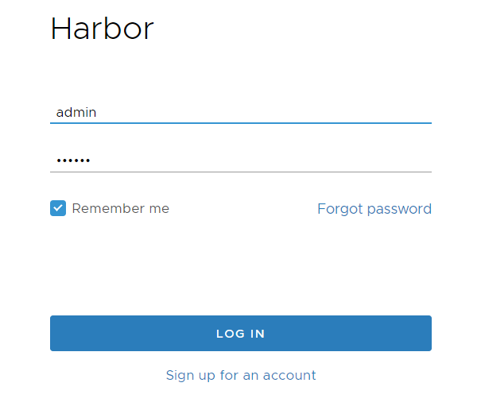

### 1.4.2 创建项目

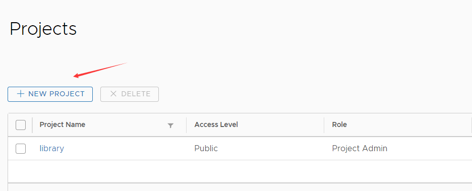

**pub-images**存放基础镜像, 比如CentOS, Ubuntu等

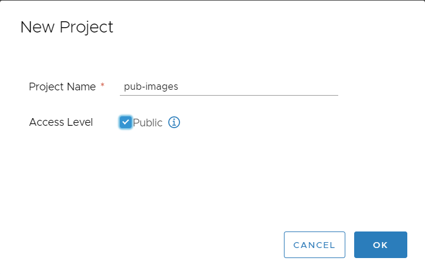

**web-blog**存放本案例的业务镜像

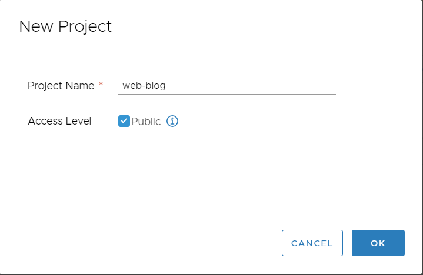

### 1.4.3 测试在客户端通过docker login登录Harbor

在Ubuntu-1804-209, 10.0.0.209上部署Docker, 然后测试Harbor登录

```bash
# Ubuntu-1804-209配置DNS, 生产环境中, 通过域名登录Harbor
[root@docker ~]#vim /etc/hosts
10.0.0.69 harbor.daveit.org
[root@docker ~]#ping harbor.daveit.org
PING harbor.daveit.org (10.0.0.69) 56(84) bytes of data.
64 bytes from harbor.daveit.org (10.0.0.69): icmp_seq=1 ttl=64 time=0.501 ms
64 bytes from harbor.daveit.org (10.0.0.69): icmp_seq=2 ttl=64 time=0.263 ms
64 bytes from harbor.daveit.org (10.0.0.69): icmp_seq=3 ttl=64 time=0.745 ms
64 bytes from harbor.daveit.org (10.0.0.69): icmp_seq=4 ttl=64 time=0.330 ms

# 修改Harbor配置文件
[root@harbor-69 /data/scripts/harbor_install]#cd
[root@harbor-69 ~]#vim /apps/harbor/harbor.cfg
hostname = harbor.daveit.org
[root@harbor-69 ~]#systemctl restart harbor

# Windows本地配置DNS
10.0.0.69 harbor.daveit.org
```

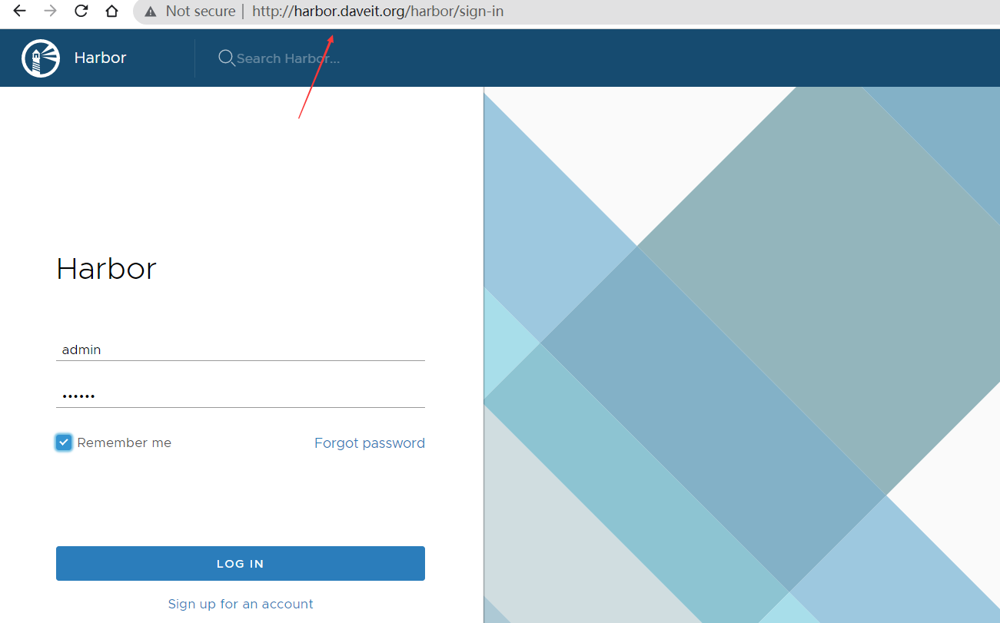

在Ubuntu-1804-209上安装Docker, 测试能在该主机上登录Harbor.

```bash
[root@docker ~]#cd /data/scripts/
[root@docker /data/scripts]#vim docker_install.sh

#!/bin/bash                                                                                                                                                  
apt update
apt -y install \
    ca-certificates \
    curl \
    gnupg \
    lsb-release

mkdir -p /etc/apt/keyrings
curl -fsSL https://download.docker.com/linux/ubuntu/gpg | sudo gpg --dearmor -o /etc/apt/keyrings/docker.gpg

echo \
  "deb [arch=$(dpkg --print-architecture) signed-by=/etc/apt/keyrings/docker.gpg] https://download.docker.com/linux/ubuntu \
    $(lsb_release -cs) stable" | sudo tee /etc/apt/sources.list.d/docker.list > /dev/null

apt update

VERSION_STRING=5:19.03.14~3-0~ubuntu-bionic
apt -y install docker-ce=$VERSION_STRING docker-ce-cli=$VERSION_STRING


[root@docker /data/scripts]#bash docker_install.sh 
```

实际工作中, 要在Harbor上实现HTTPS认证, 测试环境可以在需要登录Harbor的节点上的service文件上添加`--insecure-registry`参数, 跳过安全认证, 这样该节点就可以直接登录Harbor了, 否则直接登录会被拒绝.

```bash
[root@docker /data/scripts]#docker login harbor.daveit.org
Username: admin
Password: 
Error response from daemon: Get https://harbor.daveit.org/v2/: dial tcp 10.0.0.69:443: connect: connection refused

# 在Ubuntu-1804-209上添加insecure参数
[root@docker /data/scripts]#vim /lib/systemd/system/docker.service
ExecStart=/usr/bin/dockerd -H fd:// --containerd=/run/containerd/containerd.sock --insecure-registry harbor.daveit.org
[root@docker /data/scripts]#systemctl daemon-reload
[root@docker /data/scripts]#systemctl restart docker
[root@docker /data/scripts]#docker login harbor.daveit.org
Username: admin
Password: 
WARNING! Your password will be stored unencrypted in /root/.docker/config.json.
Configure a credential helper to remove this warning. See
https://docs.docker.com/engine/reference/commandline/login/#credentials-store

Login Succeeded # Docker登录成功
[root@docker /data/scripts]#
```

## 1.5 其他配置

### 1.5.1 master和node的本地DNS解析

在所有master和node节点都要配置Harbor域名解析. 因为这些节点都需要登录到Harbor去拉取镜像. 而etcd不会访问Harbor.

```bash
# 先在CentOS7的ansible上同步/etc/hosts文件, 添加10.0.0.69 harbor.daveit.org条目

[root@ansible /data/scripts]#ansible master_k8s:node_k8s -m shell -a "echo '10.0.0.69 harbor.daveit.org' >> /etc/hosts"

[root@master-39 ~]#cat /etc/hosts
127.0.0.1	localhost
127.0.1.1	ubuntu-1804-39

# The following lines are desirable for IPv6 capable hosts
::1     localhost ip6-localhost ip6-loopback
ff02::1 ip6-allnodes
ff02::2 ip6-allrouters
10.0.0.69 harbor.daveit.org
```

# 2. 二进制部署高可用k8s集群

部署集群时, 需要提前准备部署规划清单, 把需要部署的服务, 宿主机选型, 需要的软件版本, 以及每个宿主机的作用等信息都写到一个Excel表格中. 

部署期间可以进行参照. 部署完成后进行完善, 用作日后维护参考.

**宿主机和软件相关**

| 软件类型             | 系统及软件版本 | 版本备注 | 相关URL | 配置       |
| -------------------- | -------------- | -------- | ------- | ---------- |
| Kubernetes Server    |                |          |         |            |
| 宿主机操作系统       |                |          |         | 4C-8G-150G |
| Flannel              |                |          |         |            |
| Service 负载类型     |                |          |         |            |
| Docker               |                |          |         |            |
| etcd                 |                |          |         |            |
| Kubernetes Dashboard |                |          |         |            |
| CoreDNS              |                |          |         |            |
| Grafana              |                |          |         |            |
| Prometheus           |                |          |         |            |
| Harbor               |                |          |         |            |
| HAproxy              |                |          |         |            |
| Keepalived           |                |          |         |            |
| Dashboard访问地址    |                |          |         |            |
|                      |                |          |         |            |

**网络规划**

一套k8s集群可以运行多个业务. 把每个业务的Pod和Service地址, 以及namespace区分开. 

每个业务分配一个16位子网掩码的Pod地址, 一套业务就可以运行`2^16-2`个Pod.

| 地址范围        |               |               |               |               |
| --------------- | ------------- | ------------- | ------------- | ------------- |
| Service地址范围 | 10.0.0.0/16   | 10.1.0.0/16   | 10.2.0.0/16   | 10.3.0.0/16   |
| Pod地址范围     | 10.100.0.0/16 | 10.101.0.0/16 | 10.102.0.0/16 | 10.103.0.0/16 |

**哪些Pod被映射到了宿主机**

| 业务Pod | 端口号 |
| ------- | ------ |
|         |        |

## 2.1 kubeasz部署工具介绍

**kubeasz** 致力于提供快速部署高可用`k8s`集群的工具, 同时也努力成为`k8s`实践、使用的参考书；基于二进制方式部署和利用`ansible-playbook`实现自动化；既提供一键安装脚本, 也可以根据`安装指南`分步执行安装各个组件。

https://github.com/easzlab/kubeasz

本案例使用kubeasz **v2.2.3**部署k8s **v1.19.2**

v2.2.3版本项目连接: https://github.com/easzlab/kubeasz/tree/2.2.3


这里面的步骤, 如果能手动安装, 比如宿主机上的Docker就可以手动部署, 那么就可以把安装指南里的Docker安装部署省略.

## 2.2 集群规划和基础参数设定

1. kubeasz v2.2.3使用python2开发的, 所以要在每个被管理节点安装python2.7, 包括master, node和etcd. 被管理节点指的就是用ansible管理的服务器. 

```bash
[root@master-19 ~]#apt update && apt -y install python2.7
[root@master-29 ~]#apt update && apt -y install python2.7
[root@master-39 ~]#apt update && apt -y install python2.7

[root@node-89 ~]#apt update && apt -y install python2.7
[root@node-99 ~]#apt update && apt -y install python2.7
[root@node-109 ~]#apt update && apt -y install python2.7

[root@etcd-119 ~]#apt update && apt -y install python2.7
[root@etcd-129 ~]#apt update && apt -y install python2.7
[root@etcd-139 ~]#apt update && apt -y install python2.7
```

2. 安装python后, 设置软连接.

因为部署脚本中直接调用的是`/usr/bin/python`, 而apt安装的python2.7会被安装到`/usr/bin/python2.7`.

```bash
[root@master-19 ~]#ln -s /usr/bin/python2.7 /usr/bin/python
[root@master-29 ~]#ln -s /usr/bin/python2.7 /usr/bin/python
[root@master-39 ~]#ln -s /usr/bin/python2.7 /usr/bin/python

[root@node-89 ~]#ln -s /usr/bin/python2.7 /usr/bin/python
[root@node-99 ~]#ln -s /usr/bin/python2.7 /usr/bin/python
[root@node-109 ~]#ln -s /usr/bin/python2.7 /usr/bin/python

[root@etcd-119 ~]#ln -s /usr/bin/python2.7 /usr/bin/python
[root@etcd-129 ~]#ln -s /usr/bin/python2.7 /usr/bin/python
[root@etcd-139 ~]#ln -s /usr/bin/python2.7 /usr/bin/python
```

3. 在ansible节点安装ansible和netaddr模块, netaddr模块用来匹配yaml文件中指定的地址. 这个模块安装在集群的ansible管理节点即可.

netaddr版本:

- Ubuntu1804:  netaddr-0.7.19

k8s集群的ansible管理节点为Ubuntu-1804-239, 10.0.0.239.

```bash
[root@ansible ~]#apt-get install git python-pip -y
[root@ansible ~]#pip install ansible==2.6.18 netaddr==0.7.19
...
Successfully built ansible
Installing collected packages: PyYAML, MarkupSafe, jinja2, pycparser, cffi, pynacl, bcrypt, paramiko, ansible, netaddr
Successfully installed MarkupSafe-1.1.1 PyYAML-5.4.1 ansible-2.6.18 bcrypt-3.1.7 cffi-1.15.1 jinja2-2.11.3 netaddr-0.7.19 paramiko-2.12.0 pycparser-2.21 pynacl-1.4.0
```

4. 在ansible管理节点配置免密码登录, 包括master, node和etcd节点.

```bash
[root@ansible ~]#cd /data/scripts/
[root@ansible /data/scripts]#vim hosts_ssh.list

10.0.0.19
10.0.0.29
10.0.0.39
10.0.0.89
10.0.0.99
10.0.0.109
10.0.0.119
10.0.0.129
10.0.0.139

[root@ansible /data/scripts]#vim ssh_hosts.sh

#!/bin/bash
rpm -q sshpass &> /dev/null || apt -y install sshpass
[ -f /root/.ssh/id_rsa ] || ssh-keygen -f /root/.ssh/id_rsa  -P ''
export SSHPASS=000000
while read IP;do
   sshpass -e ssh-copy-id  -o StrictHostKeyChecking=no $IP
done < hosts_ssh.list

[root@ansible /data/scripts]#bash ssh_hosts.sh 
```

## 2.3 在ansible控制节点准备k8s安装需要的文件

### 2.3.1 下载项目源码, 二进制及离线镜像

推荐使用 easzup 脚本下载所需文件；运行成功后，所有文件（kubeasz代码、二进制、离线镜像）均已整理好放入目录`/etc/ansible`.

```bash
[root@ansible /data/scripts]#export release=2.2.3
[root@ansible /data/scripts]#curl -C- -fLO --retry 3 https://github.com/easzlab/kubeasz/releases/download/${release}/easzup
  % Total    % Received % Xferd  Average Speed   Time    Time     Time  Current
                                 Dload  Upload   Total   Spent    Left  Speed
  0     0    0     0    0     0      0      0 --:--:-- --:--:-- --:--:--     0
100 13194  100 13194    0     0  11473      0  0:00:01  0:00:01 --:--:-- 30683
[root@ansible /data/scripts]#chmod +x ./easzup
[root@ansible /data/scripts]#ll
total 32
drwxr-xr-x 2 root root  4096 Nov  4 03:44 ./
drwxr-xr-x 4 root root  4096 May 14 11:42 ../
-rwxr-xr-x 1 root root 13194 Nov  4 03:44 easzup*
-rw-r--r-- 1 root root    94 Nov  4 03:33 hosts_ssh.list
-rw-r--r-- 1 root root   532 Nov  4 03:37 ssh_hosts.sh

# easzup就是一个shell脚本, 用来下载安装k8s需要的各种工具, 包括docker镜像, 安装k8s的ansible的playbook文件等. 
# 执行easzup后, 会把下载的镜像启动为容器, 然后把容器内的内容拷贝到本地, 然后停止并删除容器. 
# 这些下载的内容都会存放在ansible集群管理节点, 在安装集群时, 会推送给master, node和etcd节点.

# 修改脚本的变量
[root@ansible /data/scripts]#vim easzup

K8S_BIN_VER=v1.20.1 → K8S_BIN_VER=v1.19.2 # kubeasz的镜像仓库只提供v1.19.2的镜像, 没有v1.19.1
calicoVer=v3.15.3 # 后续安装calico的版本可以在这里修改


# 这里可以找一台安装了Docker的服务器测试一下
# 这里就在之前安装了Docker的Ubuntu-1804-209上测试即可

[root@docker /data/scripts]#cd
[root@docker ~]#docker pull easzlab/kubeasz-k8s-bin:v1.19.1
Error response from daemon: manifest for easzlab/kubeasz-k8s-bin:v1.19.1 not found: manifest unknown: manifest unknown
[root@docker ~]#docker pull easzlab/kubeasz-k8s-bin:v1.19.2
v1.19.2: Pulling from easzlab/kubeasz-k8s-bin
31603596830f: Pull complete 
ffbcab0d6f47: Pull complete 
Digest: sha256:5cbf6c495111b231b0eaa191417b9188ae76b3ca526cc9afb680abc2188e8ad4
Status: Downloaded newer image for easzlab/kubeasz-k8s-bin:v1.19.2
docker.io/easzlab/kubeasz-k8s-bin:v1.19.2

# 使用工具脚本下载
[root@ansible /data/scripts]#./easzup --help
./easzup: illegal option -- -
Usage: easzup [options] [args]
  option: -{DdekSz}
    -C         stop&clean all local containers
    -D         download all into /etc/ansible # 把所有内容下载到/etc/ansible
    -P         download system packages for offline installing
    -S         start kubeasz in a container
    -d <ver>   set docker-ce version, default "19.03.14"
    -e <ver>   set kubeasz-ext-bin version, default "0.8.1"
    -k <ver>   set kubeasz-k8s-bin version, default "v1.20.1"
    -m <str>   set docker registry mirrors, default "CN"(used in Mainland,China)
    -p <ver>   set kubeasz-sys-pkg version, default "0.3.3"
    -z <ver>   set kubeasz version, default "2.2.3"
  
see more at https://github.com/kubeasz/dockerfiles

# 脚本中默认指定的是清华大学源(DOCKER_URL="https://mirrors.tuna.tsinghua.edu.cn), 所以下载会有些慢. 可以把REGISTRY_MIRROR改为非CN, 这样就会去Docker官网下载镜像.

[root@ansible /data/scripts]#vim easzup
# line 323
REGISTRY_MIRROR="AU"  

[root@ansible /data/scripts]#./easzup -D
...
[INFO] Action successed : download_all
[root@ansible /data/scripts]
```

### 2.3.2 检查下载内容

执行脚本后, 会在ansible主机启动一些容器, 然后把容器内的数据拷贝到`/etc/ansible`后关闭容器, 并且保留镜像. 

所有文件（kubeasz代码、二进制、离线镜像）均已整理好放入目录`/etc/ansible`.

```bash
[root@ansible /data/scripts]#cd /etc/ansible/
[root@ansible /etc/ansible]#ll
total 132
drwxrwxr-x 11 root root  4096 Nov  4 04:05 ./
drwxr-xr-x 92 root root  4096 Nov  4 04:01 ../
-rw-rw-r--  1 root root   395 Dec 20  2020 01.prepare.yml
-rw-rw-r--  1 root root    58 Dec 20  2020 02.etcd.yml
-rw-rw-r--  1 root root   149 Dec 20  2020 03.containerd.yml
-rw-rw-r--  1 root root   137 Dec 20  2020 03.docker.yml
-rw-rw-r--  1 root root   470 Dec 20  2020 04.kube-master.yml
-rw-rw-r--  1 root root   140 Dec 20  2020 05.kube-node.yml
-rw-rw-r--  1 root root   408 Dec 20  2020 06.network.yml
-rw-rw-r--  1 root root    77 Dec 20  2020 07.cluster-addon.yml
-rw-rw-r--  1 root root  3686 Dec 20  2020 11.harbor.yml
-rw-rw-r--  1 root root   431 Dec 20  2020 22.upgrade.yml
-rw-rw-r--  1 root root  2119 Dec 20  2020 23.backup.yml
-rw-rw-r--  1 root root   113 Dec 20  2020 24.restore.yml
-rw-rw-r--  1 root root  1752 Dec 20  2020 90.setup.yml
-rw-rw-r--  1 root root  1127 Dec 20  2020 91.start.yml
-rw-rw-r--  1 root root  1120 Dec 20  2020 92.stop.yml
-rw-rw-r--  1 root root   337 Dec 20  2020 99.clean.yml
-rw-rw-r--  1 root root 10283 Dec 20  2020 ansible.cfg
drwxr-xr-x  3 root root  4096 Nov  4 04:05 bin/
drwxrwxr-x  2 root root  4096 Dec 20  2020 dockerfiles/
drwxrwxr-x  8 root root  4096 Dec 20  2020 docs/
drwxrwxr-x  2 root root  4096 Nov  4 04:13 down/
drwxrwxr-x  2 root root  4096 Dec 20  2020 example/
-rw-rw-r--  1 root root   414 Dec 20  2020 .gitignore
drwxrwxr-x 14 root root  4096 Dec 20  2020 manifests/
drwxrwxr-x  2 root root  4096 Dec 20  2020 pics/
-rw-rw-r--  1 root root  5654 Dec 20  2020 README.md
drwxrwxr-x 23 root root  4096 Dec 20  2020 roles/
drwxrwxr-x  2 root root  4096 Dec 20  2020 tools/

[root@ansible /etc/ansible]#docker ps
CONTAINER ID        IMAGE               COMMAND             CREATED             STATUS              PORTS               NAMES

[root@ansible /etc/ansible]#docker ps -a
CONTAINER ID        IMAGE               COMMAND             CREATED             STATUS              PORTS               NAMES

[root@ansible /etc/ansible]#docker images
REPOSITORY                                    TAG                 IMAGE ID            CREATED             SIZE
easzlab/kubeasz                               2.2.3               bce9ffbb0e27        2 years ago         142MB
easzlab/kubeasz-k8s-bin                       v1.20.1             c08413b2d550        2 years ago         473MB
easzlab/kubeasz-ext-bin                       0.8.1               e5471f766400        2 years ago         373MB
kubernetesui/dashboard                        v2.1.0              9a07b5b4bfac        2 years ago         226MB
kubernetesui/metrics-scraper                  v1.0.6              48d79e554db6        3 years ago         34.5MB
easzlab/flannel                               v0.13.0-amd64       e708f4bb69e3        3 years ago         57.2MB
coredns/coredns                               1.7.1               0a6cfbf7b0b6        3 years ago         42.4MB
calico/node                                   v3.15.3             d45bf977dfbf        3 years ago         262MB
calico/pod2daemon-flexvol                     v3.15.3             963564fb95ed        3 years ago         22.8MB
calico/cni                                    v3.15.3             ca5564c06ea0        3 years ago         110MB
calico/kube-controllers                       v3.15.3             0cb2976cbb7d        3 years ago         52.9MB
easzlab/pause-amd64                           3.2                 80d28bedfe5d        3 years ago         683kB
mirrorgooglecontainers/metrics-server-amd64   v0.3.6              9dd718864ce6        4 years ago         39.9MB
```

### 2.3.3 配置集群参数

```bash
# 查看配置文件内容

[root@ansible /etc/ansible]#cd example/
[root@ansible /etc/ansible/example]#vim hosts.multi-node 
# 'etcd' cluster should have odd member(s) (1,3,5,...) 
# variable 'NODE_NAME' is the distinct name of a member in 'etcd' cluster
#### 二进制部署k8s, etcd会被单独安装在不同宿主机, 做成一个集群, 要求NODE_NAME的值不能一样.
#### etcd的数量需要是奇数.

[etcd]
192.168.1.1 NODE_NAME=etcd1 # 这个node节点的NODE_NAME可以和etcd节点的主机名不同
192.168.1.2 NODE_NAME=etcd2
192.168.1.3 NODE_NAME=etcd3

# master node(s) #### 这个kubeasz项目部署的k8s可以动态添加master和node节点, 任意扩容任意缩容, 而且不影响当前业务, 这里可以先只写一个10.0.0.19

[kube-master]
192.168.1.1
192.168.1.2

# work node(s) #### node节点也可以后续添加
[kube-node]
192.168.1.3
192.168.1.4

# [optional] harbor server, a private docker registry
# 'NEW_INSTALL': 'yes' to install a harbor server; 'no' to integrate with existed one
# 'SELF_SIGNED_CERT': 'no' you need put files of certificates named harbor.pem and harbor-key.pem in directory 'down'
[harbor]  #### Harbor已经搭建了, 所以无需添加
#192.168.1.8 HARBOR_DOMAIN="harbor.yourdomain.com" NEW_INSTALL=no SELF_SIGNED_CERT=yes

# [optional] loadbalance for accessing k8s from outside
[ex-lb] #### 负载均衡必须配置, 即使用的是已经存在的负载均衡, 也要在这里写上负载均衡的ip以及vip. 因为这些变量后续在部署时会用到.
		#### 这个负载均衡指的是从集群外部访问k8s时使用的负载均衡, 比如管理员访问Dashboard, 或者接收用户的请求.
		#### 集群内的负载均衡会配置在每个worker-node节点, 在每个node节点上都会安装haproxy, 然后把集群所有的master都添加到haproxy的后端服务器列表.
#192.168.1.6 LB_ROLE=backup EX_APISERVER_VIP=192.168.1.250 EX_APISERVER_PORT=8443
#192.168.1.7 LB_ROLE=master EX_APISERVER_VIP=192.168.1.250 EX_APISERVER_PORT=8443

# [optional] ntp server for the cluster
[chrony] #### ntp服务器这里可以省略, 实际工作中, 所有的服务器都要配置时间同步.
#192.168.1.1

[all:vars]
# --------- Main Variables ---------------
# Cluster container-runtime supported: docker, containerd
CONTAINER_RUNTIME="docker"  #### k8s v1.19.2还是使用Docker引擎 

# Network plugins supported: calico, flannel, kube-router, cilium, kube-ovn
CLUSTER_NETWORK="flannel"    #### 指定使用的网络组件, 这里会修改为calico

# Service proxy mode of kube-proxy: 'iptables' or 'ipvs'
PROXY_MODE="ipvs"            #### 指定service网络使用ipvs还是iptables

# K8S Service CIDR, not overlap with node(host) networking
SERVICE_CIDR="10.68.0.0/16"   #### 这个是service地址段

# Cluster CIDR (Pod CIDR), not overlap with node(host) networking 
CLUSTER_CIDR="172.20.0.0/16"  #### 这个是pod地址段

# NodePort Range
NODE_PORT_RANGE="20000-40000"  #### 分配给kube-proxy暴露service时使用, 一般建议30000以后的大端口号, 不要和宿主机其他端口号相冲突, 这里改为30000-60000

# Cluster DNS Domain
CLUSTER_DNS_DOMAIN="cluster.local." #### 改为david.local

# -------- Additional Variables (don't change the default value right now) ---
# Binaries Directory
bin_dir="/opt/kube/bin"  # 保存管理k8s集群以及组件的二进制的目录, 比如calicoctl和docker命令等. 执行easzup脚本时会执行  ln -sf /opt/kube/bin/docker /bin/docker 命令, 把docker二进制程序添加到环境变量, 而其他的管理命令比如calicoctl等是不会自动添加到环境变量的. 

###########################
***ansible管理节点***
[root@ansible /data/scripts]#ls /opt/kube/bin/
containerd  containerd-shim  ctr  docker  dockerd  docker-init  docker-proxy  runc

***master***
[root@master-19 ~]#ls /opt/kube/bin/
bandwidth  calico-ipam     containerd       dockerd       flannel                  kubectl         loopback
bridge     cfssl           containerd-shim  docker-init   host-local               kubelet         portmap
calico     cfssl-certinfo  ctr              docker-proxy  kube-apiserver           kube-proxy      runc
calicoctl  cfssljson       docker           docker-tag    kube-controller-manager  kube-scheduler  tuning

***node***
[root@node-89 ~]#ls /opt/kube/bin/
bandwidth  calicoctl    cfssl-certinfo  containerd-shim  dockerd       docker-tag  kubectl     loopback  tuning
bridge     calico-ipam  cfssljson       ctr              docker-init   flannel     kubelet     portmap
calico     cfssl        containerd      docker           docker-proxy  host-local  kube-proxy  runc
##########################

# CA and other components cert/key Directory
ca_dir="/etc/kubernetes/ssl"

# Deploy Directory (kubeasz workspace)
base_dir="/etc/ansible"

*************************************************************

# 修改前, 先把文件拷贝到/etc/ansible目录, 然后重命名为hosts, 因为执行01.prepare.yml时会在/etc/ansible目录下找该hosts文件
[root@ansible /etc/ansible/example]#cp hosts.multi-node ../hosts

# 修改后文件内容
[root@ansible /etc/ansible/example]#cd ..
[root@ansible /etc/ansible]#vim hosts

# 'etcd' cluster should have odd member(s) (1,3,5,...)
# variable 'NODE_NAME' is the distinct name of a member in 'etcd' cluster
[etcd]
10.0.0.119 NODE_NAME=etcd1
10.0.0.129 NODE_NAME=etcd2
10.0.0.139 NODE_NAME=etcd3

# master node(s)
[kube-master]
10.0.0.19

# work node(s)
[kube-node]
10.0.0.89

# [optional] harbor server, a private docker registry
# 'NEW_INSTALL': 'yes' to install a harbor server; 'no' to integrate with existed one
# 'SELF_SIGNED_CERT': 'no' you need put files of certificates named harbor.pem and harbor-key.pem in directory 'down'
[harbor]
#192.168.1.8 HARBOR_DOMAIN="harbor.yourdomain.com" NEW_INSTALL=no SELF_SIGNED_CERT=yes

# [optional] loadbalance for accessing k8s from outside
[ex-lb]
# 49为master, 59为backup

10.0.0.59 LB_ROLE=backup EX_APISERVER_VIP=10.0.0.188 EX_APISERVER_PORT=6443
10.0.0.49 LB_ROLE=master EX_APISERVER_VIP=10.0.0.188 EX_APISERVER_PORT=6443

# [optional] ntp server for the cluster
[chrony]
#192.168.1.1

[all:vars]
# --------- Main Variables ---------------
# Cluster container-runtime supported: docker, containerd
CONTAINER_RUNTIME="docker"

# Network plugins supported: calico, flannel, kube-router, cilium, kube-ovn
CLUSTER_NETWORK="calico"

# Service proxy mode of kube-proxy: 'iptables' or 'ipvs'
PROXY_MODE="ipvs"

# K8S Service CIDR, not overlap with node(host) networking
SERVICE_CIDR="10.100.0.0/16"  # service地址段位100

# Cluster CIDR (Pod CIDR), not overlap with node(host) networking
CLUSTER_CIDR="10.200.0.0/16"  # pod地址段为200

# NodePort Range
NODE_PORT_RANGE="30000-60000"

# Cluster DNS Domain
CLUSTER_DNS_DOMAIN="david.local."

# -------- Additional Variables (don't change the default value right now) ---
# Binaries Directory
bin_dir="/opt/kube/bin"

# CA and other components cert/key Directory
ca_dir="/etc/kubernetes/ssl"

# Deploy Directory (kubeasz workspace)
base_dir="/etc/ansible"
```

## 2.4 部署k8s

```bash
[root@ansible /etc/ansible]#ll
total 132
drwxrwxr-x 11 root root  4096 Nov  4 04:05 ./
drwxr-xr-x 92 root root  4096 Nov  4 04:01 ../
-rw-rw-r--  1 root root   395 Dec 20  2020 01.prepare.yml
-rw-rw-r--  1 root root    58 Dec 20  2020 02.etcd.yml
-rw-rw-r--  1 root root   149 Dec 20  2020 03.containerd.yml
-rw-rw-r--  1 root root   137 Dec 20  2020 03.docker.yml
-rw-rw-r--  1 root root   470 Dec 20  2020 04.kube-master.yml
-rw-rw-r--  1 root root   140 Dec 20  2020 05.kube-node.yml
-rw-rw-r--  1 root root   408 Dec 20  2020 06.network.yml
-rw-rw-r--  1 root root    77 Dec 20  2020 07.cluster-addon.yml
-rw-rw-r--  1 root root  3686 Dec 20  2020 11.harbor.yml
-rw-rw-r--  1 root root   431 Dec 20  2020 22.upgrade.yml
-rw-rw-r--  1 root root  2119 Dec 20  2020 23.backup.yml
-rw-rw-r--  1 root root   113 Dec 20  2020 24.restore.yml
-rw-rw-r--  1 root root  1752 Dec 20  2020 90.setup.yml
-rw-rw-r--  1 root root  1127 Dec 20  2020 91.start.yml
-rw-rw-r--  1 root root  1120 Dec 20  2020 92.stop.yml
-rw-rw-r--  1 root root   337 Dec 20  2020 99.clean.yml
-rw-rw-r--  1 root root 10283 Dec 20  2020 ansible.cfg
drwxr-xr-x  3 root root  4096 Nov  4 04:05 bin/
drwxrwxr-x  2 root root  4096 Dec 20  2020 dockerfiles/
drwxrwxr-x  8 root root  4096 Dec 20  2020 docs/
drwxrwxr-x  2 root root  4096 Nov  4 04:13 down/
drwxrwxr-x  2 root root  4096 Nov  4 04:31 example/
-rw-rw-r--  1 root root   414 Dec 20  2020 .gitignore
-rw-r--r--  1 root root  1826 Nov  4 04:43 hosts # hosts文件要放到/etc/ansible下
drwxrwxr-x 14 root root  4096 Dec 20  2020 manifests/ 
drwxrwxr-x  2 root root  4096 Dec 20  2020 pics/
-rw-rw-r--  1 root root  5654 Dec 20  2020 README.md
drwxrwxr-x 23 root root  4096 Dec 20  2020 roles/
drwxrwxr-x  2 root root  4096 Dec 20  2020 tools/
```

### 2.4.1 初始化环境准备

初始化时会在一些节点上做环境初始化, 进行证书同步等操作.

```bash
# 修改前的01.prepare.yml
[root@ansible /etc/ansible]#vim 01.prepare.yml 

# [optional] to synchronize system time of nodes with 'chrony' 
- hosts:
  - kube-master
  - kube-node
  - etcd
  - ex-lb  # 本案例的ansible不需要管理负载均衡和时间同步, 可以删除
  - chrony # 可以删除
  roles:
  - { role: chrony, when: "groups['chrony']|length > 0" }

# to create CA, kubeconfig, kube-proxy.kubeconfig etc.
- hosts: localhost # 在ansible管理节点本地创建CA, 执行deploy这个role
  roles:
  - deploy
  
****************************************************************************
# deploy角色文件
[root@ansible /etc/ansible]#vim roles/deploy/defaults/main.yml 

# CA 证书相关参数                                                                                                                     
CA_EXPIRY: "876000h"   # CA默认100年有效, 可以自定义
CERT_EXPIRY: "438000h" # CA签发的证书默认50年有效, 可以自定义

# apiserver 默认第一个master节点
KUBE_APISERVER: "https://{{ groups['kube-master'][0] }}:6443"

# kubeconfig 配置参数，注意权限根据‘USER_NAME’设置：
# 'admin' 表示创建集群管理员（所有）权限的 kubeconfig 
# 'read' 表示创建只读权限的 kubeconfig
CLUSTER_NAME: "cluster1"  # 集群名称, 如果有多个集群, CLUSTER_NAME可以区分开
USER_NAME: "admin" # USER_NAME为当前集群中所有namespace的管理员, 权限最高
CONTEXT_NAME: "context-{{ CLUSTER_NAME }}-{{ USER_NAME }}"
****************************************************************************

# prepare tasks for all nodes
- hosts:
  - kube-master
  - kube-node
  - etcd
  roles:
  - prepare 

  
# 修改后的01.prepare.yml 
[root@ansible /etc/ansible]#vim 01.prepare.yml 
# [optional] to synchronize system time of nodes with 'chrony' 
- hosts:
  - kube-master
  - kube-node
  - etcd
  roles:
  - { role: chrony, when: "groups['chrony']|length > 0" }

# to create CA, kubeconfig, kube-proxy.kubeconfig etc.
- hosts: localhost
  roles:
  - deploy

# prepare tasks for all nodes
- hosts:
  - kube-master
  - kube-node
  - etcd
  roles:
  - prepare  
  
  
# 执行01.prepare.yml
[root@ansible /etc/ansible]#ansible-playbook 01.prepare.yml
...
PLAY RECAP ***************************************************************************************************************************
10.0.0.119                 : ok=22   changed=17   unreachable=0    failed=0   
10.0.0.129                 : ok=22   changed=17   unreachable=0    failed=0   
10.0.0.139                 : ok=22   changed=17   unreachable=0    failed=0   
10.0.0.19                  : ok=28   changed=23   unreachable=0    failed=0   
10.0.0.89                  : ok=26   changed=21   unreachable=0    failed=0   
localhost                  : ok=37   changed=33   unreachable=0    failed=0   # 这个localhost是01.prepare.yml中定义的hosts: localhost
```

### 2.4.2 创建证书和安装准备

证书文件一般使用默认的配置即可, 当然也可以手动修改.

https://github.com/easzlab/kubeasz/blob/2.2.3/docs/setup/01-CA_and_prerequisite.md

证书是通过写好的j2模板提供的变量签发的, 如果想修改证书内容, 那么就修改这些模板即可.

```bash
[root@ansible /etc/ansible]#ll roles/deploy/templates/
total 36
drwxrwxr-x 2 root root 4096 Dec 20  2020 ./
drwxrwxr-x 6 root root 4096 Dec 20  2020 ../
-rw-rw-r-- 1 root root  225 Dec 20  2020 admin-csr.json.j2
-rw-rw-r-- 1 root root  314 Dec 20  2020 ca-config.json.j2
-rw-rw-r-- 1 root root  251 Dec 20  2020 ca-csr.json.j2
-rw-rw-r-- 1 root root  266 Dec 20  2020 kube-controller-manager-csr.json.j2
-rw-rw-r-- 1 root root  226 Dec 20  2020 kube-proxy-csr.json.j2
-rw-rw-r-- 1 root root  248 Dec 20  2020 kube-scheduler-csr.json.j2
-rw-rw-r-- 1 root root  220 Dec 20  2020 read-csr.json.j2
```

以admin账号的证书为例.

```bash
[root@ansible /etc/ansible]#vim roles/deploy/templates/admin-csr.json.j2

{
  "CN": "admin",                                                                                                                      
  "hosts": [],
  "key": {
    "algo": "rsa",
    "size": 2048
  },
  "names": [
    {
      "C": "CN",
      "ST": "HangZhou",
      "L": "XS",
      "O": "system:masters",
      "OU": "System"
    }
  ]
}
```

### 2.4.3 部署etcd

#### 2.4.3.1 02.etcd.yaml 文件说明

```bash
[root@ansible /etc/ansible]#vim 02.etcd.yml 

# to install etcd cluster                                                                                                             
- hosts: etcd
  roles:
  - etcd

[root@ansible /etc/ansible]#vim roles/etcd/defaults/main.yml 

# etcd 集群间通信的IP和端口, 根据etcd组成员自动生成                                                                                   
TMP_NODES: "{{ hostvars[h]['NODE_NAME'] }}=https://{{ h }}:2380,"
ETCD_NODES: "{{ TMP_NODES.rstrip(',') }}"

# etcd 集群初始状态 new/existing
CLUSTER_STATE: "new"

[root@ansible /etc/ansible]#vim roles/etcd/tasks/main.yml 

- name: prepare some dirs
  file: name={{ item }} state=directory
  with_items:
  - "{{ bin_dir }}"
  - "{{ ca_dir }}"
  - "/etc/etcd/ssl"    # etcd 证书目录
  - "/var/lib/etcd"    # etcd 工作目录

- name: 下载etcd二进制文件
  copy: src={{ base_dir }}/bin/{{ item }} dest={{ bin_dir }}/{{ item }} mode=0755
  with_items:
  - etcd
  - etcdctl
  tags: upgrade_etcd

*****************************************************************************************
# base_dir在/etc/ansible/hosts文件指定, base_dir/bin下存放了集群的二进制文件, 比如etcd, etcdctl等.
[root@ansible /etc/ansible]#grep base_dir hosts 
base_dir="/etc/ansible"
# 如果想修改各程序的版本, 除了在下载之前修改easzup脚本中的变量, 还可以直接替换这个bin目录内的二进制程序.
# 比如, 修改etcd版本可以直接在github下载对应版本的.tar.gz文件, 然后把二进制解压出来, 替换当前的二进制程序. 
*****************************************************************************************

- name: 分发证书相关
  copy: src={{ base_dir }}/.cluster/ssl/{{ item }} dest={{ ca_dir }}/{{ item }}
  with_items:
  - ca.pem
  - ca-key.pem
  - ca-config.json

- name: 创建etcd证书请求
  template: src=etcd-csr.json.j2 dest=/etc/etcd/ssl/etcd-csr.json

- name: 创建 etcd证书和私钥
  shell: "cd /etc/etcd/ssl && {{ bin_dir }}/cfssl gencert \
        -ca={{ ca_dir }}/ca.pem \
        -ca-key={{ ca_dir }}/ca-key.pem \
        -config={{ ca_dir }}/ca-config.json \
        -profile=kubernetes etcd-csr.json | {{ bin_dir }}/cfssljson -bare etcd"

- name: 创建etcd的systemd unit文件
  template: src=etcd.service.j2 dest=/etc/systemd/system/etcd.service
  tags: upgrade_etcd

- name: 开机启用etcd服务
  shell: systemctl enable etcd
  ignore_errors: true

- name: 开启etcd服务
  shell: systemctl daemon-reload && systemctl restart etcd
  ignore_errors: true
  tags: upgrade_etcd

- name: 以轮询的方式等待服务同步完成
  shell: "systemctl status etcd.service|grep Active"
  register: etcd_status
  until: '"running" in etcd_status.stdout'
  retries: 8
  delay: 8
  tags: upgrade_etcd
```

#### 2.4.3.2 执行`02.etcd.yml`

```bash
[root@ansible /etc/ansible]#ansible-playbook 02.etcd.yml
```

#### 2.4.3.3 在etcd服务器上验证部署成功

````bash
# etcd会监听两个端口
# 2379: 给api-server使用
# 2380: k8s集群内部通信的端口

[root@etcd-119 ~]#ss -ntl
State            Recv-Q            Send-Q                        Local Address:Port                       Peer Address:Port           
LISTEN           0                 128                           127.0.0.53%lo:53                              0.0.0.0:*              
LISTEN           0                 128                                 0.0.0.0:22                              0.0.0.0:*              
LISTEN           0                 32768                            10.0.0.119:2379                            0.0.0.0:*              
LISTEN           0                 32768                             127.0.0.1:2379                            0.0.0.0:*              
LISTEN           0                 32768                            10.0.0.119:2380                            0.0.0.0:*              
LISTEN           0                 128                                 0.0.0.0:111                             0.0.0.0:*              
LISTEN           0                 128                                    [::]:22                                 [::]:*              
LISTEN           0                 128                                    [::]:111                                [::]:* 

[root@etcd-129 ~]#ss -ntl
State            Recv-Q            Send-Q                        Local Address:Port                       Peer Address:Port           
LISTEN           0                 32768                            10.0.0.129:2379                            0.0.0.0:*              
LISTEN           0                 32768                             127.0.0.1:2379                            0.0.0.0:*              
LISTEN           0                 32768                            10.0.0.129:2380                            0.0.0.0:*              
LISTEN           0                 128                                 0.0.0.0:111                             0.0.0.0:*              
LISTEN           0                 128                           127.0.0.53%lo:53                              0.0.0.0:*              
LISTEN           0                 128                                 0.0.0.0:22                              0.0.0.0:*              
LISTEN           0                 128                                    [::]:111                                [::]:*              
LISTEN           0                 128                                    [::]:22                                 [::]:*  

[root@etcd-139 ~]#ss -ntl
State            Recv-Q            Send-Q                        Local Address:Port                       Peer Address:Port           
LISTEN           0                 128                                 0.0.0.0:111                             0.0.0.0:*              
LISTEN           0                 128                           127.0.0.53%lo:53                              0.0.0.0:*              
LISTEN           0                 128                                 0.0.0.0:22                              0.0.0.0:*              
LISTEN           0                 32768                            10.0.0.139:2379                            0.0.0.0:*              
LISTEN           0                 32768                             127.0.0.1:2379                            0.0.0.0:*              
LISTEN           0                 32768                            10.0.0.139:2380                            0.0.0.0:*              
LISTEN           0                 128                                    [::]:111                                [::]:*              
LISTEN           0                 128                                    [::]:22                                 [::]:*  
````

``` bash
# 验证etcd集群是否可用
# 在任何一个etcd节点执行都行

[root@etcd-139 ~]#ll /opt/kube/bin/
total 59316
drwxr-xr-x 2 root root     4096 Nov  5 13:02 ./
drwxr-xr-x 3 root root     4096 Nov  5 12:58 ../
-rwxr-xr-x 1 root root 10376657 Nov  5 12:58 cfssl*
-rwxr-xr-x 1 root root  6595195 Nov  5 12:58 cfssl-certinfo*
-rwxr-xr-x 1 root root  2277873 Nov  5 12:58 cfssljson*
-rwxr-xr-x 1 root root 23847904 Nov  5 13:02 etcd*
-rwxr-xr-x 1 root root 17620576 Nov  5 13:02 etcdctl*

[root@etcd-119 ~]#ll /etc/kubernetes/ssl/
total 20
drwxr-xr-x 2 root root 4096 Nov  4 05:05 ./
drwxr-xr-x 3 root root 4096 Nov  4 04:50 ../
-rw-r--r-- 1 root root  294 Nov  4 05:05 ca-config.json
-rw-r--r-- 1 root root 1675 Nov  4 05:05 ca-key.pem
-rw-r--r-- 1 root root 1350 Nov  4 05:05 ca.pem

[root@etcd-139 ~]#export NODE_IPS="10.0.0.119 10.0.0.129 10.0.0.139"
[root@etcd-139 ~]#for ip in ${NODE_IPS}; do ETCDCTL_API=3 /opt/kube/bin/etcdctl --endpoints=https://${ip}:2379 --cacert=/etc/kubernetes/ssl/ca.pem --cert=/etc/etcd/ssl/etcd.pem --key=/etc/etcd/ssl/etcd-key.pem  endpoint health;done
https://10.0.0.119:2379 is healthy: successfully committed proposal: took = 7.841009ms
https://10.0.0.129:2379 is healthy: successfully committed proposal: took = 7.987337ms
https://10.0.0.139:2379 is healthy: successfully committed proposal: took = 11.13144ms

# successfully说明etcd集群正常
```

### 2.4.4 部署Docker

#### 2.4.4.1 修改配置文件

```bash
# 03.docker.yml会在master和node节点安装Docker

*********************************************************************************
##### 注意: 先把main.yml中的daemon.json注释掉, 然后修改模板service文件, 添加insecure参数
*********************************************************************************

[root@ansible /etc/ansible]#vim 03.docker.yml 

# to install docker service     
- hosts:
  - kube-master
  - kube-node
  roles:
  - { role: docker, when: "CONTAINER_RUNTIME == 'docker'" }
  
# 部署的版本是v19.03.14. 因为在执行easzup时已经定义了Docker的版本

[root@ansible /etc/ansible]#ll bin/docker
-rwxr-xr-x 1 root root 61125298 Nov  4 23:33 bin/docker*
[root@ansible /etc/ansible]#./bin/docker --version
Docker version 19.03.14, build 5eb3275


*********************************************************

# 如果在国内, 可以保留镜像加速, 否则可以在main.yml中注释掉. 如果在国外的话那么就不需要镜像加速, 也就不需要daemon.json这个文件. 本案例就配置在service文件中. 

[root@ansible /etc/ansible]#vim roles/docker/tasks/main.yml
   # - name: docker国内镜像加速
   #   template: src=daemon.json.j2 dest=/etc/docker/daemon.json
      
# 镜像加速模板文件

[root@ansible /etc/ansible/roles/docker/templates]#vim daemon.json.j2 

{                                                                                                                                     
  "data-root": "{{ STORAGE_DIR }}",
  "exec-opts": ["native.cgroupdriver=cgroupfs"],
 
  "registry-mirrors": {{ REG_MIRRORS }}, #### 定义镜像加速用的镜像地址.


  "hosts": ["tcp://0.0.0.0:2376", "unix:///var/run/docker.sock"],

  "insecure-registries": {{ INSECURE_REG }}, #### insecure如果在模板文件里配置了, 就不用在service文件里写了. 这里我们会配置在service文件.
  "max-concurrent-downloads": 10,
  "live-restore": true,
  "log-driver": "json-file",
  "log-level": "warn",
  "log-opts": {
    "max-size": "15m",
    "max-file": "3"
    },
  "storage-driver": "overlay2"
}

# INSECURE_REG和REG_MIRRORS是在roles/docker/defaults/main.yml中定义的

[root@ansible /etc/ansible]#vim roles/docker/defaults/main.yml 

# docker容器存储目录
STORAGE_DIR: "/var/lib/docker"

# 开启Restful API
ENABLE_REMOTE_API: false

# 启用 docker 仓库镜像
ENABLE_MIRROR_REGISTRY: true

# 设置 docker 仓库镜像
REG_MIRRORS: '["https://docker.mirrors.ustc.edu.cn", "http://hub-mirror.c.163.com"]' # 如果需要修改Docker的镜像仓库, 那么就在这里修改.

# 信任的HTTP仓库
INSECURE_REG: '["127.0.0.1/8"]'
#INSECURE_REG: '["harbor.daveit.org"]' # 如果insecure要配在daemon.json, 那么就这样配置.

*********************************************************

# insecure 这里配置在service文件中

[root@ansible /etc/ansible]#vim roles/docker/templates/docker.service.j2 

[Unit]
Description=Docker Application Container Engine
Documentation=http://docs.docker.io

[Service]
Environment="PATH={{ bin_dir }}:/bin:/sbin:/usr/bin:/usr/sbin"
ExecStart={{ bin_dir }}/dockerd  --insecure-registry harbor.daveit.org                                                             
ExecStartPost=/sbin/iptables -I FORWARD -s 0.0.0.0/0 -j ACCEPT
ExecReload=/bin/kill -s HUP $MAINPID
Restart=always
RestartSec=5
LimitNOFILE=infinity
LimitNPROC=infinity
LimitCORE=infinity
Delegate=yes
KillMode=process

[Install]
WantedBy=multi-user.target

```

#### 2.4.4.2 执行`03.docker.yml`

```bash
[root@ansible /etc/ansible]#ansible-playbook 03.docker.yml
```

#### 2.4.4.3 验证insecure登录成功

```bash
# service文件会被放到/etc下

[root@master-19 ~]#cat /etc/systemd/system/docker.service 
[Unit]
Description=Docker Application Container Engine
Documentation=http://docs.docker.io

[Service]
Environment="PATH=/opt/kube/bin:/bin:/sbin:/usr/bin:/usr/sbin"
ExecStart=/opt/kube/bin/dockerd --insecure-registry harbor.daveit.org   
ExecStartPost=/sbin/iptables -I FORWARD -s 0.0.0.0/0 -j ACCEPT
ExecReload=/bin/kill -s HUP $MAINPID
Restart=always
RestartSec=5
LimitNOFILE=infinity
LimitNPROC=infinity
LimitCORE=infinity
Delegate=yes
KillMode=process

[Install]
WantedBy=multi-user.target

[root@master-19 ~]#docker login harbor.daveit.org
Username: admin
Password: 
WARNING! Your password will be stored unencrypted in /root/.docker/config.json.
Configure a credential helper to remove this warning. See
https://docs.docker.com/engine/reference/commandline/login/#credentials-store

Login Succeeded

[root@node-89 ~]#docker login harbor.daveit.org
Username: admin     
Password: 
WARNING! Your password will be stored unencrypted in /root/.docker/config.json.
Configure a credential helper to remove this warning. See
https://docs.docker.com/engine/reference/commandline/login/#credentials-store

Login Succeeded
```

### 2.4.5 部署master节点

```bash
[root@ansible /etc/ansible]#vim 04.kube-master.yml 

# to set up 'kube-master' nodes      
- hosts: kube-master
  roles:
  - kube-master
  - kube-node  # 这里装masters时也需要使用node角色, 是因为master上也需要安装node节点需要安装的kubelet和kubeproxy. 所以master也是node, 只是master不会运行业务镜像, 只会运行api-server, controller和scheduler.
  tasks:
  - name: Making master nodes SchedulingDisabled # 这个任务是把master从业务镜像调度中踢出, 不让master参与业务镜像的调度.
    shell: "{{ bin_dir }}/kubectl cordon {{ inventory_hostname }} "
    when: "inventory_hostname not in groups['kube-node']"
    ignore_errors: true

  - name: Setting master role name # 给master主机添加label, 这样使用kubectl get node时就会显示master.
    shell: "{{ bin_dir }}/kubectl label node {{ inventory_hostname }} kubernetes.io/role=master --overwrite"
    ignore_errors: true
```

```bash
# 部署master节点需要的模板文件

[root@ansible /etc/ansible]#vim roles/kube-master/templates/
aggregator-proxy-csr.json.j2        kube-apiserver.service.j2           kube-scheduler.service.j2
basic-auth.csv.j2                   kube-controller-manager.service.j2  
basic-auth-rbac.yaml.j2             kubernetes-csr.json.j2   
```

修改**SANDBOX_IMAGE**变量值, 这个变量值指定了封装pod用的pause镜像的下载地址. 如果master或者node节点无法连网, 那么要在其他主机把镜像拉取下来, 然后上传到本地Harbor.

```bash
[root@ansible /etc/ansible]#vim roles/kube-node/defaults/main.yml 

# 设置 dns svc ip (这里选用 SERVICE_CIDR 中第2个IP)                                                                                   
CLUSTER_DNS_SVC_IP: "{{ SERVICE_CIDR | ipaddr('net') | ipaddr(2) | ipaddr('address') }}"

# 基础容器镜像
SANDBOX_IMAGE: "easzlab/pause-amd64:3.2"

...
```

```bash
[root@ansible /etc/ansible]#docker pull easzlab/pause-amd64:3.2
3.2: Pulling from easzlab/pause-amd64
Digest: sha256:4a1c4b21597c1b4415bdbecb28a3296c6b5e23ca4f9feeb599860a1dac6a0108
Status: Image is up to date for easzlab/pause-amd64:3.2
docker.io/easzlab/pause-amd64:3.2
```

这里把这个下载好的镜像, 重新tag, 然后上传到本地Harbor的`pub-images`

```bash
[root@ansible /etc/ansible]#docker tag easzlab/pause-amd64:3.2 harbor.daveit.org/pub-images/pause-amd64:3.2
[root@ansible /etc/ansible]#docker images | grep pause
easzlab/pause-amd64                           3.2                 80d28bedfe5d        3 years ago         683kB
harbor.daveit.org/pub-images/pause-amd64      3.2                 80d28bedfe5d        3 years ago         683kB
```

```bash
# 这里可以直接在ansible节点上传, 因为部署k8s时, 已经在该节点下载了docker, 所以只需要在service文件中添加insecure仓库即可.

[root@ansible /etc/ansible]#vim /etc/systemd/system/docker.service 

[Unit]
Description=Docker Application Container Engine
Documentation=http://docs.docker.io
[Service]
Environment="PATH=/opt/kube/bin:/bin:/sbin:/usr/bin:/usr/sbin"
ExecStart=/opt/kube/bin/dockerd --insecure-registry harbor.daveit.org                                                                 
ExecStartPost=/sbin/iptables -I FORWARD -s 0.0.0.0/0 -j ACCEPT
ExecReload=/bin/kill -s HUP $MAINPID
Restart=on-failure
RestartSec=5
LimitNOFILE=infinity
LimitNPROC=infinity
LimitCORE=infinity
Delegate=yes
KillMode=process
[Install]
WantedBy=multi-user.target

[root@ansible /etc/ansible]#systemctl daemon-reload 
[root@ansible /etc/ansible]#systemctl restart docker


# 配置DNS

[root@ansible /etc/ansible]#vim /etc/hosts

127.0.0.1   localhost
127.0.1.1   ubuntu-1804-239

# The following lines are desirable for IPv6 capable hosts
::1     localhost ip6-localhost ip6-loopback
ff02::1 ip6-allnodes
ff02::2 ip6-allrouters
10.0.0.69 harbor.daveit.org   

# 登录Harbor
[root@ansible /etc/ansible]#docker login harbor.daveit.org
Username: admin
Password: 
WARNING! Your password will be stored unencrypted in /root/.docker/config.json.
Configure a credential helper to remove this warning. See
https://docs.docker.com/engine/reference/commandline/login/#credentials-store

Login Succeeded

# 上传镜像
[root@ansible /etc/ansible]#docker push harbor.daveit.org/pub-images/pause-amd64:3.2 # 推送时要带镜像版本
The push refers to repository [harbor.daveit.org/pub-images/pause-amd64]
ba0dae6243cc: Pushed 
3.2: digest: sha256:4a1c4b21597c1b4415bdbecb28a3296c6b5e23ca4f9feeb599860a1dac6a0108 size: 526
```

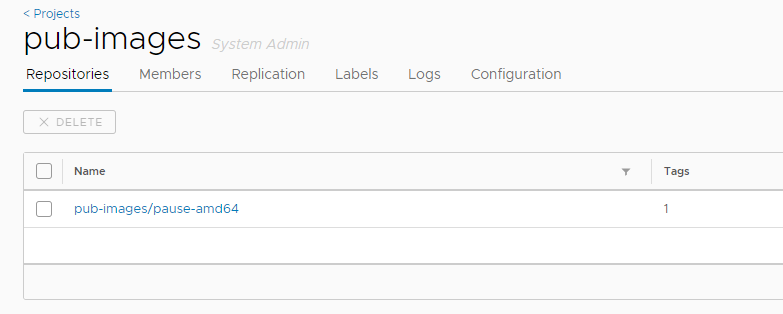

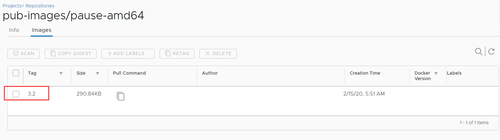

```bash
# 修改SANDBOX_IMAGE变量值

[root@ansible /etc/ansible]#vim roles/kube-node/defaults/main.yml 

# 设置 dns svc ip (这里选用 SERVICE_CIDR 中第2个IP)
CLUSTER_DNS_SVC_IP: "{{ SERVICE_CIDR | ipaddr('net') | ipaddr(2) | ipaddr('address') }}"

# 基础容器镜像
SANDBOX_IMAGE: "harbor.daveit.org/pub-images/pause-amd64:3.2"
...

# 这个pause镜像会被下载到master和node节点, 因为部署master节点的yaml文件中, 指定了也要执行node, 而这个变量是定义在node节点的部署过程中的, 所以执行master, 也就是执行了node, 也就会把这个镜像下载到master和node上.
# 集群所有需要用到的镜像, 最好都要上传到本地Harbor
```

通过kubeasz部署的k8s, 并不是靠同一个haproxy实现master高可用的. 它是在每个work-nodes节点都安装一个haproxy, 然后把集群的master节点的ip地址添加到haproxy的后端服务器中. 

这个node节点上的haproxy会监听在本地127.0.0.1:6443端口, 当node节点上的kubelet和kubeproxy需要访问master节点的api-server时, 会请求本地的127.0.0.1:6443, 然后通过haproxy转发给master节点. 之后master再去访问etcd.

这种方式会降低统一使用haproxy时的性能问题, 也不需要使用Keepalived. 后续添加了master后, 会在node节点的haproxy中自动修改后端master的地址. 

```bash
[root@ansible /etc/ansible]#ansible-playbook 04.kube-master.yml
...
TASK [kube-node : 轮询等待node达到Ready状态] *************************************************************************************************
FAILED - RETRYING: 轮询等待node达到Ready状态 (8 retries left). # 这里等待node启动即可
changed: [10.0.0.19]

TASK [kube-node : 设置node节点role] ******************************************************************************************************
changed: [10.0.0.19]

TASK [Making master nodes SchedulingDisabled] ****************************************************************************************
changed: [10.0.0.19]

TASK [Setting master role name] ******************************************************************************************************
changed: [10.0.0.19]

PLAY RECAP ***************************************************************************************************************************
10.0.0.19                  : ok=40   changed=34   unreachable=0    failed=0   
```

```bash
[root@ansible /etc/ansible]#kubectl get node
NAME        STATUS                     ROLES    AGE     VERSION
10.0.0.19   Ready,SchedulingDisabled   master   2m11s   v1.19.2
```

### 2.4.6 部署node节点

```bash
[root@ansible /etc/ansible]#ansible-playbook 05.kube-node.yml
[root@ansible /etc/ansible]#kubectl get node
NAME        STATUS                     ROLES    AGE     VERSION
10.0.0.19   Ready,SchedulingDisabled   master   3m33s   v1.19.2
10.0.0.89   Ready                      node     21s     v1.19.2

# 之后创建容器时, 会在node节点下载pause镜像

[root@node-89 ~]#docker info

 Insecure Registries:
  harbor.daveit.org
  127.0.0.0/8
WARNING: No swap limit support # 这个警告是因为宿主机的内核参数不支持交换分区的资源限制, 但是本身我们也没开启交换分区, 所以可以忽略

# 如果想解决这个警告, 需要在grub文件中添加一个内核参数

[root@node-89 ~]#vim /etc/default/grub 
...
GRUB_CMDLINE_LINUX="net.ifnames=0 cgroup_enable=memory swapaccount=1"   
[root@node-89 ~]#update-grub
Sourcing file `/etc/default/grub'
Generating grub configuration file ...
Found linux image: /boot/vmlinuz-4.15.0-76-generic
Found initrd image: /boot/initrd.img-4.15.0-76-generic
done
[root@node-89 ~]#reboot

[root@node-89 ~]#docker info

 Insecure Registries:
  harbor.daveit.org
  127.0.0.0/8
 Live Restore Enabled: false
 Product License: Community Engine

WARNING: bridge-nf-call-iptables is disabled # 这两个参数需要在sysctl.conf中修改. 启用后会允许流量都经过宿主机网卡.
WARNING: bridge-nf-call-ip6tables is disabled

[root@node-89 ~]#vim /etc/sysctl.conf

# Disable netfilter on bridges.
net.bridge.bridge-nf-call-ip6tables = 1
net.bridge.bridge-nf-call-iptables = 1

[root@node-89 ~]#sysctl -p
[root@node-89 ~]#docker info
...
 Experimental: false
 Insecure Registries:
  harbor.daveit.org
  127.0.0.0/8
 Live Restore Enabled: false
 Product License: Community Engine
```

### 2.4.7 部署网络组件

部署calico, v3.15.3

如果需要修改版本, 那么就去github把对应版本的realise包下载到本地, 然后替换二进制即可.

https://github.com/projectcalico/calico/releases/tag/v3.15.3

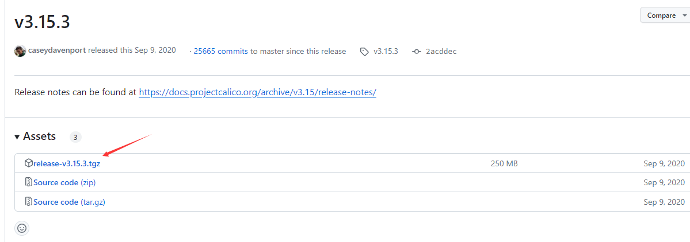

```bash
# 网络组件的tar包会在初始化执行01.prepare.yml时就都下载到down目录

[root@ansible /etc/ansible]#ll down/
total 1048776
drwxrwxr-x  2 root root      4096 Nov  4 23:36 ./
drwxrwxr-x 12 root root      4096 Nov  5 01:47 ../
-rw-------  1 root root 451969024 Nov  4 23:35 calico_v3.15.3.tar
-rw-------  1 root root  42514944 Nov  4 23:35 coredns_1.7.1.tar
-rw-------  1 root root 228536832 Nov  4 23:35 dashboard_v2.1.0.tar
-rw-r--r--  1 root root  62435231 Nov  4 23:33 docker-19.03.14.tgz
-rw-rw-r--  1 root root      1752 Dec 20  2020 download.sh
-rw-------  1 root root  58150912 Nov  4 23:36 flannel_v0.13.0-amd64.tar
-rw-------  1 root root 153153536 Nov  4 23:36 kubeasz_2.2.3.tar
-rw-------  1 root root  34566656 Nov  4 23:36 metrics-scraper_v1.0.6.tar
-rw-------  1 root root  41199616 Nov  4 23:36 metrics-server_v0.3.6.tar
-rw-------  1 root root    692736 Nov  4 23:36 pause_3.2.tar
-rw-------  1 root root    692736 Nov  4 23:36 pause.tar
```

```bash
# calico客户端二进制

[root@ansible /etc/ansible]#ll bin/calicoctl 
-rwxr-xr-x 1 root root 40783872 Dec 17  2020 bin/calicoctl
```

部署calico 时, 需要下载一些镜像, 这些镜像最好也都下载到本地, 默认都会去docker官网下载.

```bash
[root@ansible /etc/ansible]#vim roles/calico/templates/calico-v3.15.yaml.j2
...
image: calico/cni:v3.15.3
image: calico/pod2daemon-flexvol:v3.15.3
image: calico/node:v3.15.3
image: calico/kube-controllers:v3.15.3

[root@ansible /etc/ansible]#grep -R "image: calico" roles/calico/templates/calico-v3.15.yaml.j2
          image: calico/cni:v3.15.3
          image: calico/pod2daemon-flexvol:v3.15.3
          image: calico/node:v3.15.3
          image: calico/kube-controllers:v3.15.3
```

```bash
[root@ansible /etc/ansible]#docker pull calico/cni:v3.15.3
[root@ansible /etc/ansible]#docker pull calico/pod2daemon-flexvol:v3.15.3
[root@ansible /etc/ansible]#docker pull calico/node:v3.15.3
[root@ansible /etc/ansible]#docker pull calico/kube-controllers:v3.15.3


[root@ansible /etc/ansible]#docker tag calico/node:v3.15.3 harbor.daveit.org/pub-images/calico/node:v3.15.3
[root@ansible /etc/ansible]#docker tag calico/cni:v3.15.3 harbor.daveit.org/pub-images/calico/cni:v3.15.3
[root@ansible /etc/ansible]#docker tag calico/pod2daemon-flexvol:v3.15.3 harbor.daveit.org/pub-images/calico/pod2daemon-flexvol:v3.15.3
[root@ansible /etc/ansible]#docker tag calico/kube-controllers:v3.15.3 harbor.daveit.org/pub-images/calico/kube-controllers:v3.15.3

[root@ansible /etc/ansible]#docker images | grep harbor.daveit.org
harbor.daveit.org/pub-images/calico/node                 v3.15.3             d45bf977dfbf        3 years ago         262MB
harbor.daveit.org/pub-images/calico/pod2daemon-flexvol   v3.15.3             963564fb95ed        3 years ago         22.8MB
harbor.daveit.org/pub-images/calico/cni                  v3.15.3             ca5564c06ea0        3 years ago         110MB
harbor.daveit.org/pub-images/calico/kube-controllers     v3.15.3             0cb2976cbb7d        3 years ago         52.9MB
harbor.daveit.org/pub-images/pause-amd64                 3.2                 80d28bedfe5d        3 years ago         683kB

[root@ansible /etc/ansible]#docker push harbor.daveit.org/pub-images/calico/node:v3.15.3
[root@ansible /etc/ansible]#docker push harbor.daveit.org/pub-images/calico/cni:v3.15.3
[root@ansible /etc/ansible]#docker push harbor.daveit.org/pub-images/calico/pod2daemon-flexvol:v3.15.3
[root@ansible /etc/ansible]#docker push harbor.daveit.org/pub-images/calico/kube-controllers:v3.15.3
```

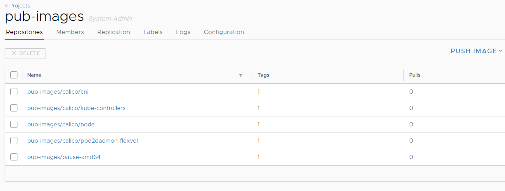

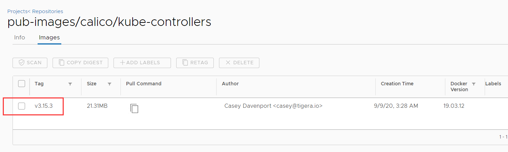

修改模板文件中的镜像地址

```bash
[root@ansible /etc/ansible]#vim roles/calico/templates/calico-v3.15.yaml.j2
[root@ansible /etc/ansible]#grep "harbor" -B 2 roles/calico/templates/calico-v3.15.yaml.j2
        - name: install-cni
          #image: calico/cni:v3.15.3
          image: harbor.daveit.org/pub-images/calico/cni:v3.15.3
--
        - name: flexvol-driver
          #image: calico/pod2daemon-flexvol:v3.15.3
          image: harbor.daveit.org/pub-images/calico/pod2daemon-flexvol:v3.15.3
--
        - name: calico-node
          #image: calico/node:v3.15.3
          image: harbor.daveit.org/pub-images/calico/node:v3.15.3
--
        - name: calico-kube-controllers
          #image: calico/kube-controllers:v3.15.3
          image: harbor.daveit.org/pub-images/calico/kube-controllers:v3.15.3
```

安装

```bash
[root@ansible /etc/ansible]#ansible-playbook 06.network.yml

...
TASK [calico : 轮询等待calico-node 运行，视下载镜像速度而定] *****************************************************************************************
FAILED - RETRYING: 轮询等待calico-node 运行，视下载镜像速度而定 (15 retries left).
FAILED - RETRYING: 轮询等待calico-node 运行，视下载镜像速度而定 (15 retries left).
changed: [10.0.0.19]
changed: [10.0.0.89]
...

PLAY RECAP ***************************************************************************************************************************
10.0.0.19                  : ok=16   changed=15   unreachable=0    failed=0   
10.0.0.89                  : ok=12   changed=11   unreachable=0    failed=0
```

```bash
# 查看node节点下载镜像
[root@node-89 ~]#docker images
REPOSITORY                                               TAG                 IMAGE ID            CREATED             SIZE
calico/node                                              v3.15.3             d45bf977dfbf        3 years ago         262MB
harbor.daveit.org/pub-images/calico/node                 v3.15.3             d45bf977dfbf        3 years ago         262MB
calico/pod2daemon-flexvol                                v3.15.3             963564fb95ed        3 years ago         22.8MB
harbor.daveit.org/pub-images/calico/pod2daemon-flexvol   v3.15.3             963564fb95ed        3 years ago         22.8MB
harbor.daveit.org/pub-images/calico/cni                  v3.15.3             ca5564c06ea0        3 years ago         110MB
calico/cni                                               v3.15.3             ca5564c06ea0        3 years ago         110MB
calico/kube-controllers                                  v3.15.3             0cb2976cbb7d        3 years ago         52.9MB
harbor.daveit.org/pub-images/calico/kube-controllers     v3.15.3             0cb2976cbb7d        3 years ago         52.9MB
easzlab/pause-amd64                                      3.2                 80d28bedfe5d        3 years ago         683kB
harbor.daveit.org/pub-images/pause-amd64                 3.2                 80d28bedfe5d        3 years ago         683kB

# 查看master节点下载镜像
[root@master-19 ~]#docker images
REPOSITORY                                               TAG                 IMAGE ID            CREATED             SIZE
calico/node                                              v3.15.3             d45bf977dfbf        3 years ago         262MB
harbor.daveit.org/pub-images/calico/node                 v3.15.3             d45bf977dfbf        3 years ago         262MB
calico/pod2daemon-flexvol                                v3.15.3             963564fb95ed        3 years ago         22.8MB
harbor.daveit.org/pub-images/calico/pod2daemon-flexvol   v3.15.3             963564fb95ed        3 years ago         22.8MB
calico/cni                                               v3.15.3             ca5564c06ea0        3 years ago         110MB
harbor.daveit.org/pub-images/calico/cni                  v3.15.3             ca5564c06ea0        3 years ago         110MB
calico/kube-controllers                                  v3.15.3             0cb2976cbb7d        3 years ago         52.9MB
easzlab/pause-amd64                                      3.2                 80d28bedfe5d        3 years ago         683kB
harbor.daveit.org/pub-images/pause-amd64                 3.2                 80d28bedfe5d        3 years ago         683kB
```

```bash
# 如果calico安装部署成功, 那么会在master和node节点开启路由条目

[root@master-19 ~]#route -n
Kernel IP routing table
Destination     Gateway         Genmask         Flags Metric Ref    Use Iface
0.0.0.0         10.0.0.2        0.0.0.0         UG    0      0        0 eth0
10.0.0.0        0.0.0.0         255.255.255.0   U     0      0        0 eth0
10.200.175.64   0.0.0.0         255.255.255.192 U     0      0        0 *
10.200.187.0    10.0.0.89       255.255.255.192 UG    0      0        0 tunl0
172.17.0.0      0.0.0.0         255.255.0.0     U     0      0        0 docker0

[root@master-19 ~]#docker ps
CONTAINER ID        IMAGE                                          COMMAND             CREATED             STATUS              PORTS               NAMES
ec5f306ce662        harbor.daveit.org/pub-images/calico/node       "start_runit"       21 minutes ago      Up 21 minutes                           k8s_calico-node_calico-node-qfkk9_kube-system_70ba6ad4-d13f-4f57-af9e-f31d9327043d_0
04d985f219b6        harbor.daveit.org/pub-images/pause-amd64:3.2   "/pause"            21 minutes ago      Up 21 minutes                           k8s_POD_calico-node-qfkk9_kube-system_70ba6ad4-d13f-4f57-af9e-f31d9327043d_0


[root@node-89 ~]#route -n
Kernel IP routing table
Destination     Gateway         Genmask         Flags Metric Ref    Use Iface
0.0.0.0         10.0.0.2        0.0.0.0         UG    0      0        0 eth0
10.0.0.0        0.0.0.0         255.255.255.0   U     0      0        0 eth0
10.200.175.64   10.0.0.19       255.255.255.192 UG    0      0        0 tunl0
10.200.187.0    0.0.0.0         255.255.255.192 U     0      0        0 *
172.17.0.0      0.0.0.0         255.255.0.0     U     0      0        0 docker0

[root@node-89 ~]#docker ps
CONTAINER ID        IMAGE                                                  COMMAND                  CREATED             STATUS              PORTS               NAMES
f65baa23f8e2        harbor.daveit.org/pub-images/calico/node               "start_runit"            21 minutes ago      Up 21 minutes                           k8s_calico-node_calico-node-q86n4_kube-system_d0320ff4-8510-4554-85f0-4aa017b0cb41_0
9b999c797d83        harbor.daveit.org/pub-images/calico/kube-controllers   "/usr/bin/kube-contr…"   21 minutes ago      Up 21 minutes                           k8s_calico-kube-controllers_calico-kube-controllers-845ff68654-cnbkd_kube-system_14989c4e-8168-4a32-88c1-068a1195b84e_0
f6e351cdb29f        harbor.daveit.org/pub-images/pause-amd64:3.2           "/pause"                 21 minutes ago      Up 21 minutes                           k8s_POD_calico-node-q86n4_kube-system_d0320ff4-8510-4554-85f0-4aa017b0cb41_0
7b8b413a774c        harbor.daveit.org/pub-images/pause-amd64:3.2           "/pause"                 21 minutes ago      Up 21 minutes                           k8s_POD_calico-kube-controllers-845ff68654-cnbkd_kube-system_14989c4e-8168-4a32-88c1-068a1195b84e_0
```

```bash
# 验证node节点上的kube-proxy的service文件是否正确

[root@node-89 ~]#vim /etc/systemd/system/kube-proxy.service 

[Unit]                                                                                                                                
Description=Kubernetes Kube-Proxy Server
Documentation=https://github.com/GoogleCloudPlatform/kubernetes
After=network.target

[Service]
# kube-proxy 根据 --cluster-cidr 判断集群内部和外部流量，指定 --cluster-cidr 或 --masquerade-all 选项后，kube-proxy 会对访问 Service IP 的请求做 SNAT
WorkingDirectory=/var/lib/kube-proxy
ExecStart=/opt/kube/bin/kube-proxy \
  --bind-address=10.0.0.89 \
  --cluster-cidr=10.200.0.0/16 \
  --hostname-override=10.0.0.89 \
  --kubeconfig=/etc/kubernetes/kube-proxy.kubeconfig \
  --logtostderr=true \
  --proxy-mode=ipvs
Restart=always
RestartSec=5
LimitNOFILE=65536

[Install]
WantedBy=multi-user.target

[root@node-89 ~]#vim /etc/systemd/system/kubelet.service

[Unit]
Description=Kubernetes Kubelet
Documentation=https://github.com/GoogleCloudPlatform/kubernetes

[Service]
WorkingDirectory=/var/lib/kubelet
ExecStartPre=/bin/mkdir -p /sys/fs/cgroup/cpu/podruntime.slice
ExecStartPre=/bin/mkdir -p /sys/fs/cgroup/cpuacct/podruntime.slice
ExecStartPre=/bin/mkdir -p /sys/fs/cgroup/cpuset/podruntime.slice
ExecStartPre=/bin/mkdir -p /sys/fs/cgroup/memory/podruntime.slice
ExecStartPre=/bin/mkdir -p /sys/fs/cgroup/pids/podruntime.slice
ExecStartPre=/bin/mkdir -p /sys/fs/cgroup/systemd/podruntime.slice

ExecStartPre=/bin/mkdir -p /sys/fs/cgroup/cpu/system.slice
ExecStartPre=/bin/mkdir -p /sys/fs/cgroup/cpuacct/system.slice
ExecStartPre=/bin/mkdir -p /sys/fs/cgroup/cpuset/system.slice
ExecStartPre=/bin/mkdir -p /sys/fs/cgroup/memory/system.slice
ExecStartPre=/bin/mkdir -p /sys/fs/cgroup/pids/system.slice
ExecStartPre=/bin/mkdir -p /sys/fs/cgroup/systemd/system.slice

ExecStartPre=/bin/mkdir -p /sys/fs/cgroup/hugetlb/podruntime.slice
ExecStartPre=/bin/mkdir -p /sys/fs/cgroup/hugetlb/system.slice
ExecStart=/opt/kube/bin/kubelet \
  --config=/var/lib/kubelet/config.yaml \
  --cni-bin-dir=/opt/kube/bin \
  --cni-conf-dir=/etc/cni/net.d \
  --hostname-override=10.0.0.89 \
  --kubeconfig=/etc/kubernetes/kubelet.kubeconfig \
  --network-plugin=cni \
  --pod-infra-container-image=harbor.daveit.org/pub-images/pause-amd64:3.2 \  # 确认这个地址是否正确
  --root-dir=/var/lib/kubelet \
  --v=2
Restart=always
RestartSec=5

[Install]
WantedBy=multi-user.target   
```

```bash
# 验证node节点上安装了haproxy, 并且master-19被添加到了后端服务器

[root@node-89 ~]#vim /etc/haproxy/haproxy.cfg 

global                                                                                                                                
        log /dev/log    local1 warning
        chroot /var/lib/haproxy
        user haproxy
        group haproxy
        daemon
        nbproc 1

defaults
        log     global
        timeout connect 5s
        timeout client  10m
        timeout server  10m

listen kube-master
        bind 127.0.0.1:6443 # 每个node节点都会请求本地的6443端口来连接集群中的master节点, 通过本地的haproxy, 转发给master
        mode tcp
        option tcplog
        option dontlognull
        option dontlog-normal
        balance roundrobin
        server 10.0.0.19 10.0.0.19:6443 check inter 10s fall 2 rise 2 weight 1
```

```bash
[root@ansible /etc/ansible]#kubectl get pod -A
NAMESPACE     NAME                                       READY   STATUS    RESTARTS   AGE
kube-system   calico-kube-controllers-845ff68654-spbvj   1/1     Running   0          3m17s
kube-system   calico-node-8vhvc                          1/1     Running   0          3m17s
kube-system   calico-node-p7mv5                          1/1     Running   0          3m17s
```

### 2.4.8 添加其余的master和node节点

利用`easzctl`脚本

```bash
[root@ansible /etc/ansible]#ll tools/easzctl 
-rwxrwxr-x 1 root root 19271 Dec 20  2020 tools/easzctl*
[root@ansible /etc/ansible]#ll /usr/bin/easzctl 
lrwxrwxrwx 1 root root 26 Nov  5 12:57 /usr/bin/easzctl -> /etc/ansible/tools/easzctl*

# 这个脚本可以执行的集群内部操作包括:
In-cluster operation:
    add-etcd        To add a etcd-node to the etcd cluster
    add-master      To add a kube-master(master node) to the k8s cluster
    add-node        To add a kube-node(work node) to the k8s cluster
    del-etcd        To delete a etcd-node from the etcd cluster
    del-master      To delete a kube-master from the k8s cluster
    del-node        To delete a kube-node from the k8s cluster
    upgrade     To upgrade the k8s cluster
```

```bash
# 添加master
[root@ansible /etc/ansible]#easzctl add-master 10.0.0.29
...

PLAY RECAP ***************************************************************************************************************************
10.0.0.89                  : ok=7    changed=6    unreachable=0    failed=0   

[INFO] Action successed : add-master 10.0.0.29 
```

```bash
[root@node-89 ~]#vim /etc/haproxy/haproxy.cfg  # node节点上的haproxy配置文件, 会在master节点发生变化时自动更新, 并且同步给各个node节点. 而且会自动重启每个node节点上的haproxy.

global                                                                                                                                
        log /dev/log    local1 warning
        chroot /var/lib/haproxy
        user haproxy
        group haproxy
        daemon
        nbproc 1

defaults
        log     global
        timeout connect 5s
        timeout client  10m
        timeout server  10m

listen kube-master
        bind 127.0.0.1:6443
        mode tcp
        option tcplog
        option dontlognull
        option dontlog-normal
        balance roundrobin
        server 10.0.0.29 10.0.0.29:6443 check inter 10s fall 2 rise 2 weight 1
        server 10.0.0.19 10.0.0.19:6443 check inter 10s fall 2 rise 2 weight 1
```

```bash
[root@ansible /etc/ansible]#kubectl get node
NAME        STATUS                     ROLES    AGE   VERSION
10.0.0.19   Ready,SchedulingDisabled   master   79m   v1.19.2
10.0.0.29   Ready,SchedulingDisabled   master   18m   v1.19.2
10.0.0.89   Ready                      node     75m   v1.19.2

# calico是一个点对点的三层网络组件. 性能相对比较好. 容器会使用宿主机的网络和容器外的网络通信.
[root@master-19 ~]#/opt/kube/bin/calicoctl node status
Calico process is running.

IPv4 BGP status
+--------------+-------------------+-------+----------+-------------+
| PEER ADDRESS |     PEER TYPE     | STATE |  SINCE   |    INFO     |
+--------------+-------------------+-------+----------+-------------+
| 10.0.0.29    | node-to-node mesh | up    | 03:52:15 | Established |
| 10.0.0.89    | node-to-node mesh | up    | 03:52:14 | Established |
+--------------+-------------------+-------+----------+-------------+

IPv6 BGP status
No IPv6 peers found.


[root@node-89 ~]#/opt/kube/bin/calicoctl node status
Calico process is running.

IPv4 BGP status
+--------------+-------------------+-------+----------+-------------+
| PEER ADDRESS |     PEER TYPE     | STATE |  SINCE   |    INFO     | 
+--------------+-------------------+-------+----------+-------------+
| 10.0.0.19    | node-to-node mesh | up    | 03:52:14 | Established |
| 10.0.0.29    | node-to-node mesh | up    | 03:51:28 | Established |
+--------------+-------------------+-------+----------+-------------+

IPv6 BGP status
No IPv6 peers found.

# 验证master-29上也下载了相同的镜像

[root@master-29 ~]#docker images
REPOSITORY                                               TAG                 IMAGE ID            CREATED             SIZE
calico/node                                              v3.15.3             d45bf977dfbf        3 years ago         262MB
harbor.daveit.org/pub-images/calico/node                 v3.15.3             d45bf977dfbf        3 years ago         262MB
harbor.daveit.org/pub-images/calico/pod2daemon-flexvol   v3.15.3             963564fb95ed        3 years ago         22.8MB
calico/pod2daemon-flexvol                                v3.15.3             963564fb95ed        3 years ago         22.8MB
calico/cni                                               v3.15.3             ca5564c06ea0        3 years ago         110MB
harbor.daveit.org/pub-images/calico/cni                  v3.15.3             ca5564c06ea0        3 years ago         110MB
calico/kube-controllers                                  v3.15.3             0cb2976cbb7d        3 years ago         52.9MB
easzlab/pause-amd64                                      3.2                 80d28bedfe5d        3 years ago         683kB
harbor.daveit.org/pub-images/pause-amd64                 3.2                 80d28bedfe5d        3 years ago         683kB
```

### 2.4.9 添加其余node节点

```bash
[root@ansible /etc/ansible]#easzctl add-node 10.0.0.99
[root@ansible /etc/ansible]#easzctl add-node 10.0.0.109

[root@ansible /etc/ansible]#kubectl get pod -A -o wide
NAMESPACE     NAME                                       READY   STATUS    RESTARTS   AGE     IP           NODE         NOMINATED NODE   READINESS GATES
kube-system   calico-kube-controllers-845ff68654-spbvj   1/1     Running   0          15m     10.0.0.89    10.0.0.89    <none>           <none>
kube-system   calico-node-6bp8r                          1/1     Running   0          8m3s    10.0.0.29    10.0.0.29    <none>           <none>
kube-system   calico-node-b8dnw                          1/1     Running   0          99s     10.0.0.109   10.0.0.109   <none>           <none>
kube-system   calico-node-jqhxq                          1/1     Running   0          7m35s   10.0.0.89    10.0.0.89    <none>           <none>
kube-system   calico-node-lcmgd                          1/1     Running   0          6m48s   10.0.0.19    10.0.0.19    <none>           <none>
kube-system   calico-node-zg7l9                          1/1     Running   0          4m3s    10.0.0.99    10.0.0.99    <none>           <none>
```

### 2.4.10 测试运行pod

```bash
# 10.0.0.239这里就是集群的管理节点, 运行了ansible

[root@ansible /etc/ansible]#kubectl run net-test1 --image=alpine  sleep 36000
pod/net-test1 created
[root@ansible /etc/ansible]#kubectl run net-test2 --image=alpine  sleep 36000
pod/net-test2 created
[root@ansible /etc/ansible]#kubectl run net-test3 --image=alpine  sleep 36000
pod/net-test3 created
[root@ansible /etc/ansible]#kubectl run net-test4 --image=alpine  sleep 36000
pod/net-test4 created

[root@ansible /etc/ansible]#kubectl get pod -o wide
NAME        READY   STATUS    RESTARTS   AGE   IP               NODE         NOMINATED NODE   READINESS GATES
net-test1   1/1     Running   0          18s   10.200.50.67     10.0.0.99    <none>           <none> # node99
net-test2   1/1     Running   0          14s   10.200.237.194   10.0.0.109   <none>           <none> # node109
net-test3   1/1     Running   0          11s   10.200.237.195   10.0.0.109   <none>           <none> # node109
net-test4   1/1     Running   0          8s    10.200.187.2     10.0.0.89    <none>           <none> # node89

# 测试各个node之间的pod可以互通

[root@ansible /etc/ansible]#kubectl exec -it net-test1 sh
kubectl exec [POD] [COMMAND] is DEPRECATED and will be removed in a future version. Use kubectl exec [POD] -- [COMMAND] instead.
/ # ping 10.200.237.194
PING 10.200.237.194 (10.200.237.194): 56 data bytes
64 bytes from 10.200.237.194: seq=0 ttl=62 time=0.464 ms
64 bytes from 10.200.237.194: seq=1 ttl=62 time=0.281 ms
64 bytes from 10.200.237.194: seq=2 ttl=62 time=0.230 ms
64 bytes from 10.200.237.194: seq=3 ttl=62 time=0.234 ms
^C
--- 10.200.237.194 ping statistics ---
4 packets transmitted, 4 packets received, 0% packet loss
round-trip min/avg/max = 0.230/0.302/0.464 ms
/ # ping 10.200.237.195
PING 10.200.237.195 (10.200.237.195): 56 data bytes
64 bytes from 10.200.237.195: seq=0 ttl=62 time=0.397 ms
64 bytes from 10.200.237.195: seq=1 ttl=62 time=0.685 ms
64 bytes from 10.200.237.195: seq=2 ttl=62 time=0.242 ms
64 bytes from 10.200.237.195: seq=3 ttl=62 time=0.352 ms
64 bytes from 10.200.237.195: seq=4 ttl=62 time=0.231 ms
^C
--- 10.200.237.195 ping statistics ---
5 packets transmitted, 5 packets received, 0% packet loss
round-trip min/avg/max = 0.231/0.381/0.685 ms
/ # ping 10.200.187.2
PING 10.200.187.2 (10.200.187.2): 56 data bytes
64 bytes from 10.200.187.2: seq=0 ttl=62 time=0.378 ms
64 bytes from 10.200.187.2: seq=1 ttl=62 time=0.275 ms
64 bytes from 10.200.187.2: seq=2 ttl=62 time=0.336 ms
64 bytes from 10.200.187.2: seq=3 ttl=62 time=0.252 ms
^C
--- 10.200.187.2 ping statistics ---
4 packets transmitted, 4 packets received, 0% packet loss
round-trip min/avg/max = 0.252/0.310/0.378 ms
/ # exit
```

# 3. DNS组件简介

k8s集群搭建后, 还需要进行额外配置. 比如, 此时容器虽然能上外网, 但是无法通过域名进行解析, 因为还没有配置DNS服务.

```bash
[root@ansible /etc/ansible]#cd
[root@ansible ~]#kubectl get pod -o wide
NAME        READY   STATUS    RESTARTS   AGE    IP               NODE         NOMINATED NODE   READINESS GATES
net-test1   1/1     Running   2          7h5m   10.200.50.69     10.0.0.99    <none>           <none>
net-test2   1/1     Running   2          7h4m   10.200.237.198   10.0.0.109   <none>           <none>
net-test3   1/1     Running   2          7h4m   10.200.237.199   10.0.0.109   <none>           <none>
net-test4   1/1     Running   2          7h4m   10.200.187.4     10.0.0.89    <none>           <none>
[root@ansible ~]#kubectl exec -it net-test1 sh
kubectl exec [POD] [COMMAND] is DEPRECATED and will be removed in a future version. Use kubectl exec [POD] -- [COMMAND] instead.
/ # ping 8.8.8.8
PING 8.8.8.8 (8.8.8.8): 56 data bytes
64 bytes from 8.8.8.8: seq=0 ttl=127 time=8.046 ms
64 bytes from 8.8.8.8: seq=1 ttl=127 time=4.955 ms
^C
--- 8.8.8.8 ping statistics ---
2 packets transmitted, 2 packets received, 0% packet loss
round-trip min/avg/max = 4.955/6.500/8.046 ms
/ # ping www.google.com
ping: bad address 'www.google.com'
/ # 
```

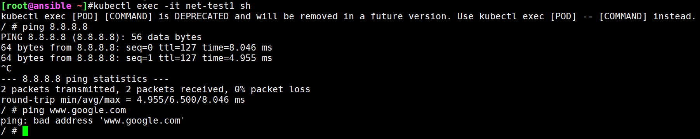

这是因为容器会使用10.100.0.2这个ip地址作为DNS服务器的地址. 而这个10.100.0.2这个地址是service网络的第二个地址. 一般集群service网络的第二个地址通常会被用作容器的DNS服务器地址. 所以我们要给集群配置一个DNS服务并且使用10.100.0.2这个地址.

```bash
/ # cat /etc/resolv.conf 
nameserver 10.100.0.2
search default.svc.david.local. svc.david.local. david.local. daveit.org
options ndots:5
```

解决方法就是在集群里安装DNS服务, 并且使用10.100.0.2作为DNS服务器的地址.

目前常用的dns组件有kube-dns和coredns两个. 目前常用的就是coredns. kube-dns和coredns用于解析k8s集群中service name所对应得到的ip地址.

**从k8s v1.8到v1.17可以用kube-dns, 而k8s v.1.18版本后将不再支持kube-dns.** 

## 3.1 kube-dns

kube-dns包含三个镜像:

```bash
1. kube-dns: 提供service name域名的解析. 这个镜像会被启动为一个容器.
2. dns-dnsmasq: 提供DNS缓存, 降低kubedns负载, 提高性能. 从etcd中查询到的记录, 会在dns-dnsmasq这个容器中缓存一段时间, 以提高DNS服务的响应性能. 第一个服务请求某个域名时, 因为dns-dnsmasq是没有缓存的, dnsmasq会把请求转发给kube-dns, kube-dns会去etcd中查询记录, 然后返回给请求者, 并且缓存到本地. 之后再有请求同一个域名的请求时, 会直接查询本地DNS缓存, 并且返回给请求者, 无需再去etcd请求.	
3. dns-sidecar: 定期检查kubedns和dnsmasq的健康状态. 如果kube-dns宕机或者dnsmasq出现故障, 那么dns-sidecar会实现报警信息. 不过由于dns-sidecar结构比较复杂, 已经不再经常使用了.
```

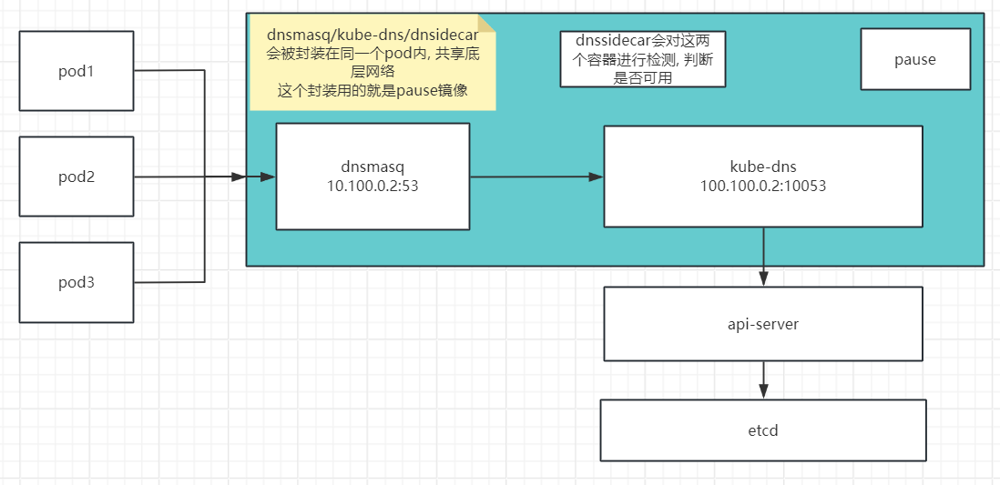

kube-dns镜像存放在谷歌, 下载地址: https://console.cloud.google.com/gcr/images/google-containers/GLOBAL

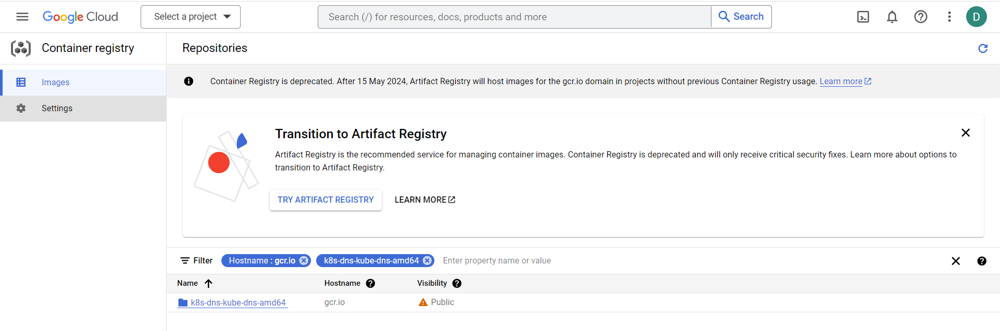

```bash
# 拉取1.15.13版本
[root@ansible ~]#docker pull gcr.io/google-containers/k8s-dns-kube-dns-amd64:1.15.13
1.15.13: Pulling from google-containers/k8s-dns-kube-dns-amd64
597de8ba0c30: Pull complete 
cee13e2c4df7: Pull complete 
Digest: sha256:aa806fb62da0318362fe5a8b110187cfc99f41c6c14261855fa10e1680f60d5b
Status: Downloaded newer image for gcr.io/google-containers/k8s-dns-kube-dns-amd64:1.15.13
gcr.io/google-containers/k8s-dns-kube-dns-amd64:1.15.13
```

查找部署kube-dns的yaml文件, 直接在kubenetes的github主页下载即可

https://github.com/kubernetes/kubernetes/blob/master/CHANGELOG/CHANGELOG-1.19.md#downloads-for-v11916

```bash
[root@ansible ~]#cd /data/scripts/
[root@ansible /data/scripts]#ll kubernetes*
-rw-r--r-- 1 root root  12583275 Sep 21  2022 kubernetes-1.19.6-client-linux-amd64.tar.gz
-rw-r--r-- 1 root root  95937405 Sep 21  2022 kubernetes-1.19.6-node-linux-amd64.tar.gz
-rw-r--r-- 1 root root 309808220 Sep 21  2022 kubernetes-v1.19.6-server-linux-amd64.tar.gz
-rw-r--r-- 1 root root    490582 Sep 21  2022 kubernetes-v1.19.6.tar.gz

[root@ansible /data/scripts]#tar xf kubernetes-1.19.6-client-linux-amd64.tar.gz
[root@ansible /data/scripts]#tar xf kubernetes-1.19.6-node-linux-amd64.tar.gz
[root@ansible /data/scripts]#tar xf kubernetes-v1.19.6-server-linux-amd64.tar.gz
[root@ansible /data/scripts]#tar xf kubernetes-v1.19.6.tar.gz

# 把这四个压缩包解压后, 会得到一个kubernetes目录

[root@ansible /data/scripts]#ll 
total 409048
drwxr-xr-x  3 root root      4096 Nov  6 00:17 ./
drwxr-xr-x  4 root root      4096 May 14 11:42 ../
-rwxr-xr-x  1 root root     13194 Nov  5 12:19 easzup*
-rw-r--r--  1 root root        94 Nov  5 12:13 hosts_ssh.list
drwxr-xr-x 10 root root      4096 Dec 18  2020 kubernetes/ # 解压后的内容都会存放到kubernetes目录中
-rw-r--r--  1 root root  12583275 Sep 21  2022 kubernetes-1.19.6-client-linux-amd64.tar.gz
-rw-r--r--  1 root root  95937405 Sep 21  2022 kubernetes-1.19.6-node-linux-amd64.tar.gz
-rw-r--r--  1 root root 309808220 Sep 21  2022 kubernetes-v1.19.6-server-linux-amd64.tar.gz
-rw-r--r--  1 root root    490582 Sep 21  2022 kubernetes-v1.19.6.tar.gz
-rw-r--r--  1 root root       538 Nov  5 12:13 ssh_hosts.sh

# 如果想要升级某个组件, 可以直接把二进制下载下来, 然后通过ansible管理节点推送给各个节点即可

[root@ansible /data/scripts]#cd kubernetes/
[root@ansible /data/scripts/kubernetes]#ll
total 32740
drwxr-xr-x 10 root root     4096 Dec 18  2020 ./
drwxr-xr-x  3 root root     4096 Nov  6 00:17 ../
drwxr-xr-x  2 root root     4096 Dec 18  2020 addons/
drwxr-xr-x  3 root root     4096 Dec 18  2020 client/
drwxr-xr-x  9 root root     4096 Dec 18  2020 cluster/
drwxr-xr-x  2 root root     4096 Dec 18  2020 docs/
drwxr-xr-x  3 root root     4096 Dec 18  2020 hack/
-rw-r--r--  1 root root 33474726 Dec 18  2020 kubernetes-src.tar.gz
drwxr-xr-x  3 root root     4096 Dec 18  2020 LICENSES/
drwxr-xr-x  3 root root     4096 Dec 18  2020 node/
-rw-r--r--  1 root root     3468 Dec 18  2020 README.md
drwxr-xr-x  3 root root     4096 Dec 18  2020 server/
-rw-r--r--  1 root root        8 Dec 18  2020 version
[root@ansible /data/scripts/kubernetes]#ll server/bin/
total 962544
drwxr-xr-x 2 root root      4096 Dec 18  2020 ./
drwxr-xr-x 3 root root      4096 Dec 18  2020 ../
-rwxr-xr-x 1 root root  46723072 Dec 18  2020 apiextensions-apiserver*
-rwxr-xr-x 1 root root  39059456 Dec 18  2020 kubeadm*
-rwxr-xr-x 1 root root  43782144 Dec 18  2020 kube-aggregator*
-rwxr-xr-x 1 root root 115142656 Dec 18  2020 kube-apiserver*
-rw-r--r-- 1 root root         8 Dec 18  2020 kube-apiserver.docker_tag
-rw------- 1 root root 119938560 Dec 18  2020 kube-apiserver.tar
-rwxr-xr-x 1 root root 107167744 Dec 18  2020 kube-controller-manager*
-rw-r--r-- 1 root root         8 Dec 18  2020 kube-controller-manager.docker_tag
-rw------- 1 root root 111963648 Dec 18  2020 kube-controller-manager.tar
-rwxr-xr-x 1 root root  42950656 Dec 18  2020 kubectl*
-rwxr-xr-x 1 root root 109909032 Dec 18  2020 kubelet*
-rwxr-xr-x 1 root root  38760448 Dec 18  2020 kube-proxy*
-rw-r--r-- 1 root root         8 Dec 18  2020 kube-proxy.docker_tag
-rw------- 1 root root 119650304 Dec 18  2020 kube-proxy.tar
-rwxr-xr-x 1 root root  42070016 Dec 18  2020 kube-scheduler*
-rw-r--r-- 1 root root         8 Dec 18  2020 kube-scheduler.docker_tag
-rw------- 1 root root  46865920 Dec 18  2020 kube-scheduler.tar
-rwxr-xr-x 1 root root   1630208 Dec 18  2020 mounter*
```

DNS插件存放在源码的`cluster/addons`目录.

```bash
[root@ansible /data/scripts/kubernetes]#ll cluster/addons/
total 92
drwxr-xr-x 20 root root 4096 Dec 18  2020 ./
drwxr-xr-x  9 root root 4096 Dec 18  2020 ../
drwxr-xr-x  2 root root 4096 Dec 18  2020 addon-manager/
-rw-r--r--  1 root root  765 Dec 18  2020 BUILD
drwxr-xr-x  3 root root 4096 Dec 18  2020 calico-policy-controller/
drwxr-xr-x  3 root root 4096 Dec 18  2020 cluster-loadbalancing/
drwxr-xr-x  2 root root 4096 Dec 18  2020 dashboard/
drwxr-xr-x  3 root root 4096 Dec 18  2020 device-plugins/
drwxr-xr-x  5 root root 4096 Dec 18  2020 dns/
drwxr-xr-x  2 root root 4096 Dec 18  2020 dns-horizontal-autoscaler/
drwxr-xr-x  5 root root 4096 Dec 18  2020 fluentd-elasticsearch/
drwxr-xr-x  4 root root 4096 Dec 18  2020 fluentd-gcp/
drwxr-xr-x  3 root root 4096 Dec 18  2020 ip-masq-agent/
drwxr-xr-x  2 root root 4096 Dec 18  2020 kube-proxy/
drwxr-xr-x  3 root root 4096 Dec 18  2020 metadata-agent/
drwxr-xr-x  3 root root 4096 Dec 18  2020 metadata-proxy/
drwxr-xr-x  2 root root 4096 Dec 18  2020 metrics-server/
drwxr-xr-x  5 root root 4096 Dec 18  2020 node-problem-detector/
-rw-r--r--  1 root root  100 Dec 18  2020 OWNERS
drwxr-xr-x  8 root root 4096 Dec 18  2020 rbac/
-rw-r--r--  1 root root 1763 Dec 18  2020 README.md
drwxr-xr-x  8 root root 4096 Dec 18  2020 storage-class/
drwxr-xr-x  4 root root 4096 Dec 18  2020 volumesnapshots/

[root@ansible /data/scripts/kubernetes]#ll cluster/addons/dns
total 24
drwxr-xr-x  5 root root 4096 Dec 18  2020 ./
drwxr-xr-x 20 root root 4096 Dec 18  2020 ../
drwxr-xr-x  2 root root 4096 Dec 18  2020 coredns/
drwxr-xr-x  2 root root 4096 Dec 18  2020 kube-dns/
drwxr-xr-x  2 root root 4096 Dec 18  2020 nodelocaldns/
-rw-r--r--  1 root root  107 Dec 18  2020 OWNERS

[root@ansible /data/scripts/kubernetes]#ll cluster/addons/dns/kube-dns/
total 48
drwxr-xr-x 2 root root 4096 Dec 18  2020 ./
drwxr-xr-x 5 root root 4096 Dec 18  2020 ../
-rw-r--r-- 1 root root 7272 Dec 18  2020 kube-dns.yaml.base # 如果需要使用kube-dns, 那么只需要编辑这个base模板即可
-rw-r--r-- 1 root root 7352 Dec 18  2020 kube-dns.yaml.in
-rw-r--r-- 1 root root 7265 Dec 18  2020 kube-dns.yaml.sed
-rw-r--r-- 1 root root 1077 Dec 18  2020 Makefile
-rw-r--r-- 1 root root 1954 Dec 18  2020 README.md
-rw-r--r-- 1 root root  376 Dec 18  2020 transforms2salt.sed
-rw-r--r-- 1 root root  319 Dec 18  2020 transforms2sed.sed

[root@ansible /data/scripts/kubernetes]#cd cluster/addons/dns/kube-dns/
# 要把这个base文件复制一份, 在新的文件上修改

[root@ansible /data/scripts/kubernetes/cluster/addons/dns/kube-dns]#cp kube-dns.yaml.base kube-dns.yaml.base.bak
[root@ansible /data/scripts/kubernetes/cluster/addons/dns/kube-dns]#mv kube-dns.yaml.base kube-dns.yaml
[root@ansible /data/scripts/kubernetes/cluster/addons/dns/kube-dns]#vim kube-dns.yaml

  clusterIP: __PILLAR__DNS__SERVER__  # 这个地址就是10.100.0.2这个地址
  - --domain=__PILLAR__DNS__DOMAIN__. # 这个要换成实际的域名, 也就是david.local. 让kubedns解析david.local这个域名内的记录
  - --server=/__PILLAR__DNS__DOMAIN__/127.0.0.1#10053     # 这个DOMAIN改为david.local, 当请求一个本地缓存不存在的域名时, 会请求本地的10053端口请求, 10053就是kube-dns的端口号
  - --dns-port=10053 
  - --server=/in-addr.arpa/127.0.0.1#10053
  - --server=/daveit.org/10.0.0.53#53  # 假设公司内网的DNS服务器为10.0.0.53:53, 那么当pod请求*.daveit.org这个公司内部的域名时, kubedns会把请求转发给公司内网的DNS服务器, 10.0.0.53:53
  - --server=/ip6.arpa/127.0.0.1#10053

# 所需镜像

      - name: dnsmasq
        image: k8s.gcr.io/k8s-dns-dnsmasq-nanny:1.15.10
      - name: sidecar
        image: k8s.gcr.io/k8s-dns-sidecar:1.15.10
      - name: kubedns
        image: k8s.gcr.io/k8s-dns-kube-dns:1.15.10
        
# 测试是否可以下载
[root@ansible /data/scripts/kubernetes/cluster/addons/dns/kube-dns]#cd
[root@ansible ~]#docker pull k8s.gcr.io/k8s-dns-dnsmasq-nanny:1.15.10
1.15.10: Pulling from k8s-dns-dnsmasq-nanny
39fafc05754f: Pull complete 
ae621079be45: Pull complete 
44ce79395947: Pull complete 
5b5a0cf630f7: Pull complete 
b777d23c0e0b: Pull complete 
Digest: sha256:d34ae632c8ce2d51aee6669d53bf4c418f5ff191a369f48374edc0323fd63dab
Status: Downloaded newer image for k8s.gcr.io/k8s-dns-dnsmasq-nanny:1.15.10
k8s.gcr.io/k8s-dns-dnsmasq-nanny:1.15.10
[root@ansible ~]#docker pull k8s.gcr.io/k8s-dns-sidecar:1.15.10
1.15.10: Pulling from k8s-dns-sidecar
39fafc05754f: Already exists 
708ee6a1d63a: Pull complete 
Digest: sha256:bb667bc31a4ef3e66165f42aa23f0f9b3610cb22de150cce5bedf4e85c5f822f
Status: Downloaded newer image for k8s.gcr.io/k8s-dns-sidecar:1.15.10
k8s.gcr.io/k8s-dns-sidecar:1.15.10
[root@ansible ~]#docker pull k8s.gcr.io/k8s-dns-kube-dns:1.15.10
1.15.10: Pulling from k8s-dns-kube-dns
39fafc05754f: Already exists 
2e6f1429f7ea: Pull complete 
Digest: sha256:7f1c5078c7efac7b18e90725136fca67c0eeb3e1b5fe5c9af200022758c8d443
Status: Downloaded newer image for k8s.gcr.io/k8s-dns-kube-dns:1.15.10
k8s.gcr.io/k8s-dns-kube-dns:1.15.10
```

```bash
# yaml文件修改好后, 直接kubectl apply -f 即可使用

kubectl apply -f kube-dns.yaml
```

##  3.2 CoreDNS

https://github.com/coredns/coredns

基于Go语言开发, 性能比kube-dns强很多, 程序结构也简单很多. 

### 3.2.1 yaml文件

```bash
[root@ansible ~]#cd /data/scripts/kubernetes/cluster/addons/dns
[root@ansible /data/scripts/kubernetes/cluster/addons/dns]#vim coredns/coredns.yaml.base

        ready
        kubernetes __PILLAR__DNS__DOMAIN__ in-addr.arpa ip6.arpa {  # 修改DOMAIN为david.local
            pods insecure
            fallthrough in-addr.arpa ip6.arpa
            ttl 30
        }
        
        
        prometheus :9153
        forward . /etc/resolv.conf {               # 这个forward类似于bind-dns的转发功能, 会把coredns无法解析的域名, 转发到指定的公司内网的dns或者公网dns. 因为coredns一般适用于解析k8s内部域名的, 而公司内部的域名会有专门的dns服务器, 比如Windows或者bind或者PowerDNS, 而公网也会有DNS.
            max_concurrent 1000
        }
```

### 3.2.2 部署CoreDNS

v1.7.0

```bash
[root@ansible /data/scripts/kubernetes/cluster/addons/dns]#cd coredns/
[root@ansible /data/scripts/kubernetes/cluster/addons/dns/coredns]#cp coredns.yaml.base coredns.yaml.base.bak
[root@ansible /data/scripts/kubernetes/cluster/addons/dns/coredns]#mv coredns.yaml.base coredns.yaml
[root@ansible /data/scripts/kubernetes/cluster/addons/dns/coredns]#vim coredns.yaml

#line 70        
kubernetes david.local in-addr.arpa ip6.arpa {  

#coredns就是用来替换kubedns的, label都没有换, 所以两者只能用一个, 不能同时使用

apiVersion: apps/v1
kind: Deployment
metadata:
  name: coredns
  namespace: kube-system
  labels:
    k8s-app: kube-dns # label还是kubedns
    
#line 138
memory: 512Mi   #设置内存限制, 要设定的高点, 这里因为我的宿主机本身就是1G内存, 所以这里只写512Mi. 一旦内存不够, 而大量的服务都在向这个DNS服务器发起请求, 那么就会出现域名无法解析, 访问慢, 卡等问题.
cpu: 100m       #cpu也要调大, 100m表示0.1核cpu, 1000m表示1核cpu. 公司内一般要分配起码2核cpu, 4g内存.
#coredns会监听udp和tcp的53
        ports:
        - containerPort: 53
          name: dns
          protocol: UDP
        - containerPort: 53
          name: dns-tcp
          
#line 204
clusterIP: 10.100.0.2


#line 134
        image: k8s.gcr.io/coredns:1.7.0  # 镜像下载地址, 需要提前测试拉取
```

```bash
[root@ansible /data/scripts/kubernetes/cluster/addons/dns/coredns]#docker pull k8s.gcr.io/coredns:1.7.0 
1.7.0: Pulling from coredns
c6568d217a00: Already exists 
6937ebe10f02: Pull complete 
Digest: sha256:73ca82b4ce829766d4f1f10947c3a338888f876fbed0540dc849c89ff256e90c
Status: Downloaded newer image for k8s.gcr.io/coredns:1.7.0
k8s.gcr.io/coredns:1.7.0
```

```bash
# 部署
[root@ansible /data/scripts/kubernetes/cluster/addons/dns/coredns]#kubectl apply -f coredns.yaml 
serviceaccount/coredns unchanged
clusterrole.rbac.authorization.k8s.io/system:coredns unchanged
clusterrolebinding.rbac.authorization.k8s.io/system:coredns unchanged
configmap/coredns unchanged
deployment.apps/coredns created
service/kube-dns unchanged

[root@ansible /data/scripts/kubernetes/cluster/addons/dns/coredns]#kubectl get pod -A
NAMESPACE     NAME                                       READY   STATUS    RESTARTS   AGE
default       net-test1                                  1/1     Running   2          10h
default       net-test2                                  1/1     Running   2          10h
default       net-test3                                  1/1     Running   2          10h
default       net-test4                                  1/1     Running   2          10h
kube-system   calico-kube-controllers-845ff68654-cnbkd   1/1     Running   2          12h
kube-system   calico-node-czqrs                          1/1     Running   3          11h
kube-system   calico-node-lj4gp                          1/1     Running   2          11h
kube-system   calico-node-pkrnn                          1/1     Running   3          11h
kube-system   calico-node-sz5tr                          1/1     Running   3          11h
kube-system   calico-node-w278g                          1/1     Running   1          11h
kube-system   coredns-67ccbccb59-zrbqp                   1/1     Running   0          9m57s # 验证coredns的pod是运行的
```

### 3.2.3 测试域名解析

```bash
# ping通后就说明coredns部署成功, 可以为集群内部的pod做域名解析, 而且不仅可以进行外网域名, 也可以解析集群内部的service地址

[root@ansible /data/scripts/kubernetes/cluster/addons/dns/coredns]#cd
[root@ansible ~]#kubectl exec -it net-test1 sh
/ # ping www.google.com
PING www.google.com (142.250.70.228): 56 data bytes
64 bytes from 142.250.70.228: seq=0 ttl=127 time=5.706 ms
64 bytes from 142.250.70.228: seq=1 ttl=127 time=5.484 ms
64 bytes from 142.250.70.228: seq=2 ttl=127 time=8.486 ms
64 bytes from 142.250.70.228: seq=3 ttl=127 time=5.069 ms
```

```bash
# kubernetes和kube-dns就是集群内部的service地址, 通过coredns可以完成解析
[root@ansible /data/scripts/kubernetes/cluster/addons/dns/coredns]#kubectl get service -A
NAMESPACE     NAME         TYPE        CLUSTER-IP   EXTERNAL-IP   PORT(S)                  AGE
default       kubernetes   ClusterIP   10.100.0.1   <none>        443/TCP                  12h
kube-system   kube-dns     ClusterIP   10.100.0.2   <none>        53/UDP,53/TCP,9153/TCP   15m

/ # ping kubernetes # net-test1和kubernetes运行在同一个name space(default)下
PING kubernetes (10.100.0.1): 56 data bytes  # kubernetes使用的就是service网络的第一个ip地址, 10.100.0.1. 这个地址的用途就是k8s的api地址
64 bytes from 10.100.0.1: seq=0 ttl=64 time=0.092 ms
64 bytes from 10.100.0.1: seq=1 ttl=64 time=0.053 ms
64 bytes from 10.100.0.1: seq=2 ttl=64 time=0.057 ms


# 同一个name space下, 可以直接通过NAME名称去访问, 而实际上一个service的全名是, kubernetes.default.svc.david.local
# 在开发代码中, 要写全名, 因为各个pod之间很有可能会是跨name space访问的

/ # ping kubernetes.default.svc.david.local
PING kubernetes.default.svc.david.local (10.100.0.1): 56 data bytes
64 bytes from 10.100.0.1: seq=0 ttl=64 time=0.026 ms
64 bytes from 10.100.0.1: seq=1 ttl=64 time=0.076 ms


# 举例
# kube-dns和net-test1处在不同的name space, 所以需要使用全称.

[root@ansible ~]#kubectl get pod -A 
NAMESPACE     NAME                                       READY   STATUS    RESTARTS   AGE
default       net-test1                                  1/1     Running   0          23m
default       net-test2                                  1/1     Running   0          22m
default       net-test3                                  1/1     Running   0          22m
default       net-test4                                  1/1     Running   0          22m
kube-system   calico-kube-controllers-845ff68654-spbvj   1/1     Running   0          40m
kube-system   calico-node-6bp8r                          1/1     Running   0          32m
kube-system   calico-node-b8dnw                          1/1     Running   0          26m
kube-system   calico-node-jqhxq                          1/1     Running   0          31m
kube-system   calico-node-lcmgd                          1/1     Running   0          31m
kube-system   calico-node-zg7l9                          1/1     Running   0          28m
kube-system   coredns-67ccbccb59-mhmsz                   1/1     Running   0          4m29s


[root@ansible ~]#kubectl get service -A
NAMESPACE     NAME         TYPE        CLUSTER-IP   EXTERNAL-IP   PORT(S)                  AGE
default       kubernetes   ClusterIP   10.100.0.1   <none>        443/TCP                  12h
kube-system   kube-dns     ClusterIP   10.100.0.2   <none>        53/UDP,53/TCP,9153/TCP   35m

/ # ping kube-dns
ping: bad address 'kube-dns' # 短域名访问失败


/ # ping kube-dns.kube-system.svc.david.local # 跨name space需要使用全域名

PING kube-dns.kube-system.svc.david.local (10.100.0.2): 56 data bytes
64 bytes from 10.100.0.2: seq=0 ttl=64 time=0.028 ms
64 bytes from 10.100.0.2: seq=1 ttl=64 time=0.055 ms
64 bytes from 10.100.0.2: seq=2 ttl=64 time=0.058 ms
```

### 3.2.4 通过官方的部署项目部署CoreDNS

https://github.com/coredns/deployment

这个项目可以用于生成部署CoreDNS所需的yaml文件. kubeasz项目没有提供CoreDNS的yaml文件, 所以还需要把这个官方的部署项目手动下载到kubeasz的`/etc/ansible/manifest`目录.

````bash
[root@ansible ~]#cd /etc/ansible
[root@ansible /etc/ansible]#cd manifests/
[root@ansible /etc/ansible/manifests]#ll
total 56
drwxrwxr-x 14 root root 4096 Dec 20  2020 ./
drwxrwxr-x 12 root root 4096 Nov  5 18:21 ../
drwxrwxr-x  4 root root 4096 Dec 20  2020 dashboard/
drwxrwxr-x  7 root root 4096 Dec 20  2020 efk/
drwxrwxr-x  3 root root 4096 Dec 20  2020 es-cluster/
drwxrwxr-x  5 root root 4096 Dec 20  2020 heapster/
drwxrwxr-x  4 root root 4096 Dec 20  2020 ingress/
drwxrwxr-x  3 root root 4096 Dec 20  2020 jenkins/
drwxrwxr-x  3 root root 4096 Dec 20  2020 mariadb-cluster/
drwxrwxr-x  2 root root 4096 Dec 20  2020 metrics-server/
drwxrwxr-x  2 root root 4096 Dec 20  2020 mysql-cluster/
drwxrwxr-x  4 root root 4096 Dec 20  2020 prometheus/
drwxrwxr-x  3 root root 4096 Dec 20  2020 redis-cluster/
drwxrwxr-x  2 root root 4096 Dec 20  2020 storage/
[root@ansible /etc/ansible/manifests]#mkdir dns
[root@ansible /etc/ansible/manifests]#cd dns/
[root@ansible /etc/ansible/manifests/dns]#git clone https://github.com/coredns/deployment.git
Cloning into 'deployment'...
remote: Enumerating objects: 988, done.
remote: Counting objects: 100% (129/129), done.
remote: Compressing objects: 100% (74/74), done.
remote: Total 988 (delta 70), reused 100 (delta 49), pack-reused 859
Receiving objects: 100% (988/988), 272.32 KiB | 4.13 MiB/s, done.
Resolving deltas: 100% (538/538), done.
[root@ansible /etc/ansible/manifests/dns]#cd deployment/
[root@ansible /etc/ansible/manifests/dns/deployment]#ll
total 60
drwxr-xr-x 10 root root  4096 Nov  6 02:32 ./
drwxr-xr-x  3 root root  4096 Nov  6 02:32 ../
drwxr-xr-x  3 root root  4096 Nov  6 02:32 charts/
drwxr-xr-x  2 root root  4096 Nov  6 02:32 .circleci/
drwxr-xr-x  2 root root  4096 Nov  6 02:32 debian/
drwxr-xr-x  2 root root  4096 Nov  6 02:32 docker/
drwxr-xr-x  8 root root  4096 Nov  6 02:32 .git/
drwxr-xr-x  4 root root  4096 Nov  6 02:32 kubernetes/
-rw-r--r--  1 root root 11357 Nov  6 02:32 LICENSE
-rw-r--r--  1 root root   792 Nov  6 02:32 Makefile
-rw-r--r--  1 root root   873 Nov  6 02:32 README.md
drwxr-xr-x  4 root root  4096 Nov  6 02:32 redhat/
drwxr-xr-x  2 root root  4096 Nov  6 02:32 systemd/
[root@ansible /etc/ansible/manifests/dns/deployment]#cd kubernetes/
[root@ansible /etc/ansible/manifests/dns/deployment/kubernetes]#ll deploy.sh  # 这个deploy脚本就是用来生成部署CoreDNS的yaml文件的
-rwxr-xr-x 1 root root 3399 Nov  6 02:32 deploy.sh*

# 这个脚本需要在CoreDNS已经运行的情况下, 才能执行, 因为其要求集群内的DNS服务是可用的, 然后该脚本会根据当前的DNS服务器设置, 输出一个yaml文件
# 不过如果已经知道如何修改yaml文件, 那么也可以不用这个脚本, 因为这个脚本输出yaml文件和官方提供的略有不同, 比如域名保留的还是cluster.local.
[root@ansible /etc/ansible/manifests/dns/deployment/kubernetes]#./deploy.sh 
./deploy.sh: line 61: jq: command not found
apiVersion: v1
kind: ServiceAccount
metadata:
  name: coredns
  namespace: kube-system
---
apiVersion: rbac.authorization.k8s.io/v1
kind: ClusterRole
metadata:
  labels:
    kubernetes.io/bootstrapping: rbac-defaults
  name: system:coredns
rules:
  - apiGroups:
    - ""
    resources:
    - endpoints
    - services
    - pods
    - namespaces
    verbs:
    - list
    - watch
  - apiGroups:
    - discovery.k8s.io
    resources:
    - endpointslices
    verbs:
    - list
    - watch
---
apiVersion: rbac.authorization.k8s.io/v1
kind: ClusterRoleBinding
metadata:
  annotations:
    rbac.authorization.kubernetes.io/autoupdate: "true"
  labels:
    kubernetes.io/bootstrapping: rbac-defaults
  name: system:coredns
roleRef:
  apiGroup: rbac.authorization.k8s.io
  kind: ClusterRole
  name: system:coredns
subjects:
- kind: ServiceAccount
  name: coredns
  namespace: kube-system
---
apiVersion: v1
kind: ConfigMap
metadata:
  name: coredns
  namespace: kube-system
data:
  Corefile: |
    .:53 {
        errors
        health {
          lameduck 5s
        }
        ready
        kubernetes cluster.local in-addr.arpa ip6.arpa {
          fallthrough in-addr.arpa ip6.arpa
        }
        prometheus :9153
        forward . /etc/resolv.conf {
          max_concurrent 1000
        }
        cache 30
        loop
        reload
        loadbalance
    }
---
apiVersion: apps/v1
kind: Deployment
metadata:
  name: coredns
  namespace: kube-system
  labels:
    k8s-app: kube-dns
    kubernetes.io/name: "CoreDNS"
    app.kubernetes.io/name: coredns
spec:
  # replicas: not specified here:
  # 1. Default is 1.
  # 2. Will be tuned in real time if DNS horizontal auto-scaling is turned on.
  strategy:
    type: RollingUpdate
    rollingUpdate:
      maxUnavailable: 1
  selector:
    matchLabels:
      k8s-app: kube-dns
      app.kubernetes.io/name: coredns
  template:
    metadata:
      labels:
        k8s-app: kube-dns
        app.kubernetes.io/name: coredns
    spec:
      priorityClassName: system-cluster-critical
      serviceAccountName: coredns
      tolerations:
        - key: "CriticalAddonsOnly"
          operator: "Exists"
      nodeSelector:
        kubernetes.io/os: linux
      affinity:
         podAntiAffinity:
           requiredDuringSchedulingIgnoredDuringExecution:
           - labelSelector:
               matchExpressions:
               - key: k8s-app
                 operator: In
                 values: ["kube-dns"]
             topologyKey: kubernetes.io/hostname
      containers:
      - name: coredns
        image: coredns/coredns:1.9.4
        imagePullPolicy: IfNotPresent
        resources:
          limits:
            memory: 170Mi
          requests:
            cpu: 100m
            memory: 70Mi
        args: [ "-conf", "/etc/coredns/Corefile" ]
        volumeMounts:
        - name: config-volume
          mountPath: /etc/coredns
          readOnly: true
        ports:
        - containerPort: 53
          name: dns
          protocol: UDP
        - containerPort: 53
          name: dns-tcp
          protocol: TCP
        - containerPort: 9153
          name: metrics
          protocol: TCP
        securityContext:
          allowPrivilegeEscalation: false
          capabilities:
            add:
            - NET_BIND_SERVICE
            drop:
            - all
          readOnlyRootFilesystem: true
        livenessProbe:
          httpGet:
            path: /health
            port: 8080
            scheme: HTTP
          initialDelaySeconds: 60
          timeoutSeconds: 5
          successThreshold: 1
          failureThreshold: 5
        readinessProbe:
          httpGet:
            path: /ready
            port: 8181
            scheme: HTTP
      dnsPolicy: Default
      volumes:
        - name: config-volume
          configMap:
            name: coredns
            items:
            - key: Corefile
              path: Corefile
---
apiVersion: v1
kind: Service
metadata:
  name: kube-dns
  namespace: kube-system
  annotations:
    prometheus.io/port: "9153"
    prometheus.io/scrape: "true"
  labels:
    k8s-app: kube-dns
    kubernetes.io/cluster-service: "true"
    kubernetes.io/name: "CoreDNS"
    app.kubernetes.io/name: coredns
spec:
  selector:
    k8s-app: kube-dns
    app.kubernetes.io/name: coredns
  clusterIP: 10.100.0.2
  ports:
  - name: dns
    port: 53
    protocol: UDP
  - name: dns-tcp
    port: 53
    protocol: TCP
  - name: metrics
    port: 9153
    protocol: TCP
````

# 4. Dashboard使用


# 5. 集群维护  

